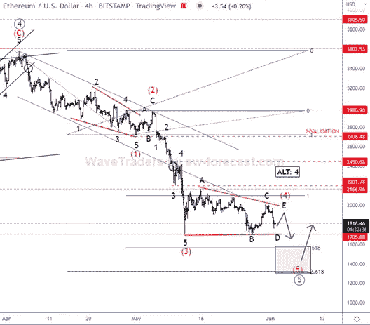
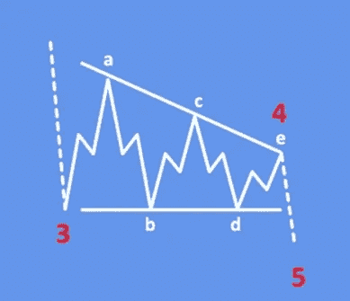

# 看起来以太坊正处于最后一段下坡路的边缘

> 原文：<https://medium.com/coinmonks/it-appears-as-if-ethereum-is-on-the-verge-of-a-final-leg-downward-3cb1ece77a04?source=collection_archive---------68----------------------->

看起来以太坊正处于最后一次下跌的边缘
请今天加入我们，讨论加密货币市场中以太坊的价格行为及其艾略特波浪结构。
仍然看跌，然而我们可以看到以太坊在一个更高程度的周期波 C 的第 5 波内接近其五波周期的结束，这表明支撑/底部并不遥远。

根据 4 小时图，ETHUSD 仍处于第五波的五波负周期中，正如预测的那样。这就是为什么在第四波的修正三角形整理完成后，关注第五波的熊市延续是很重要的，因为最后一个子浪 E 消失了。

当市场在横向盘整时，出现了被称为三角形的艾略特波浪形态，它由五个修正序列组成。由于买卖双方力量的平衡，三角形形态以其横向移动的趋势而闻名。该模式的结构 A、B、C、D、E 被细分为 3-3-3-3-3 结构。打破一个新方向的模式被称为延续模式。

> 加入 Coinmonks [电报集团](https://t.me/joinchat/Trz8jaxd6xEsBI4p)，了解加密交易和投资