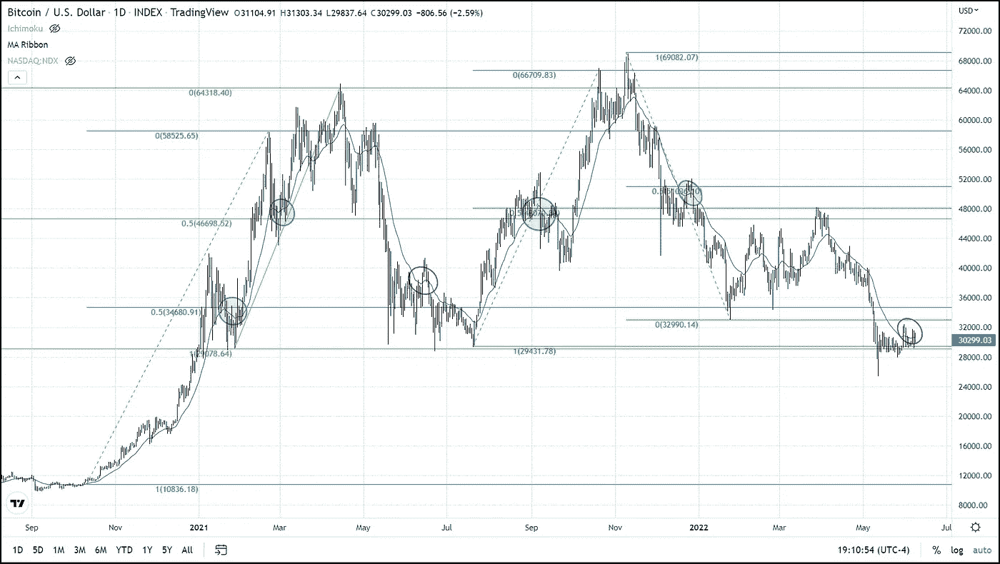

# 开始感觉很像夏天了

> 原文：<https://medium.com/coinmonks/its-beginning-to-feel-a-lot-like-summer-d1b82333db5f?source=collection_archive---------65----------------------->

随着我们进入夏季，比特币再次出现在南半球和美国和欧洲对面的隆冬季节。尽管加密领域的温度已经和预计将会变得严酷而寒冷，但比特币正通过在去年夏天的地方形成一个基础来显示其弹性。整整一年前的今天，比特币的交易价格比现在高出约 3000 美元。让一些人感到意外的一个方面是 BTC 目前的长期支持水平。

比特币在过去 18 个月中三次处于价格底部所代表的这个超级重要的支撑区域。BTC 的这个三重底部出现在 28，750 美元，这个价格是许多技术研究暗示的一个重要区域。这些研究中使用最多的是斐波那契比率，其中比特币从 Covid 崩盘的低点到历史高点的比率为 61.8%。

一个技术指标，21 天指数移动平均线，已经相当成功地指出了当前趋势的中点。例如，在 2021 年 2 月上涨到 58，000 美元的过程中，比特币在 21 天均线上方交易，从 13，000 美元到 34，000 美元，在中点时短暂跌破该移动平均线。这种低于 21 日均线的中点下跌可以在从 29，000 美元到 64，000 美元的反弹以及去年夏天盘整阶段结束的反弹中看到。

在去年夏天的安慰期，我们在均线上方也有过短暂的突破，唯一的不同是在安慰期，它没有显示价格运动的中点，而是在下一个趋势发生之前。

昨天，我们刚刚在 21 日均线上方进行了第二次微小而暂时的移动。因此，人们可以推断盘整阶段已经过半，我们应该会在一个月后看到下一个趋势。

> 加入 Coinmonks [Telegram group](https://t.me/joinchat/Trz8jaxd6xEsBI4p) 并了解加密交易和投资