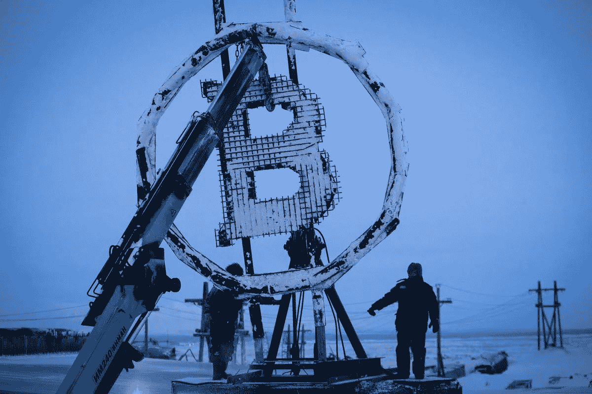
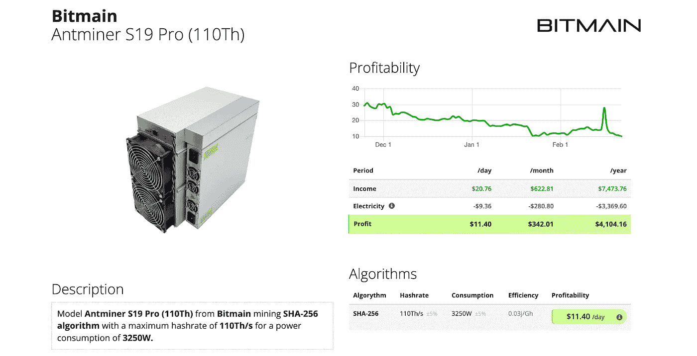
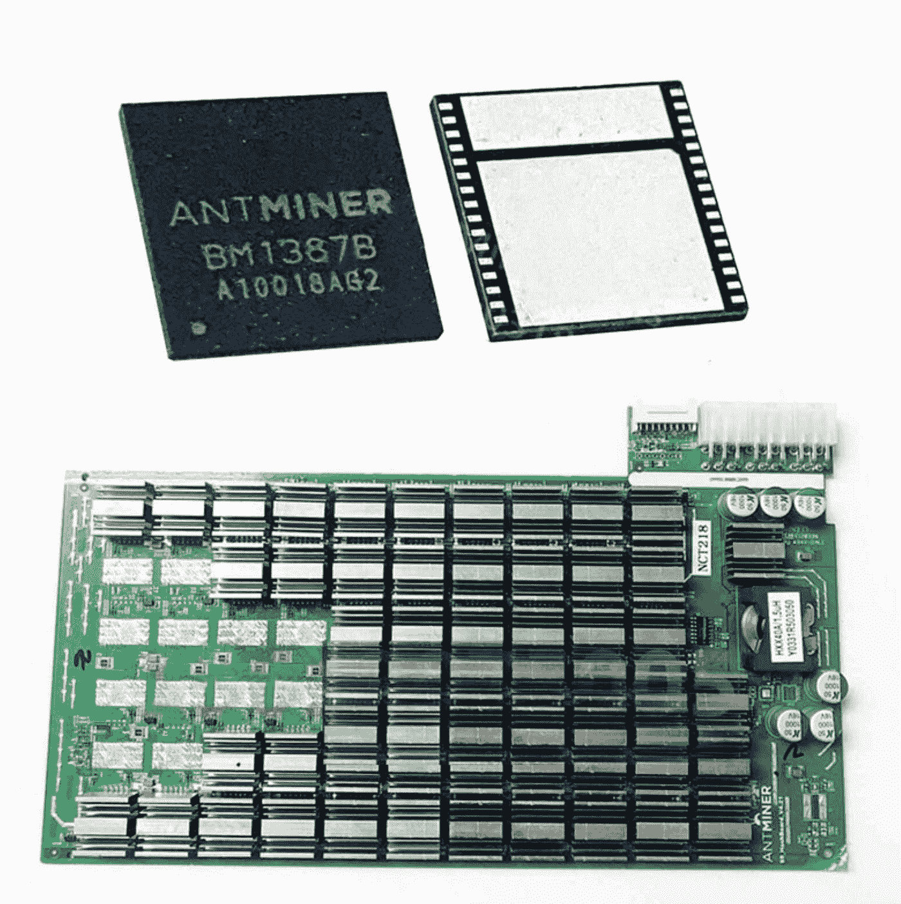
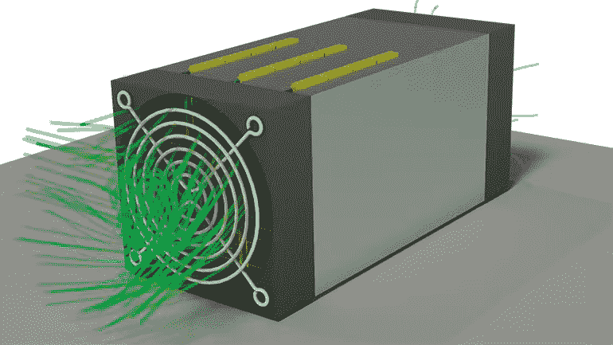
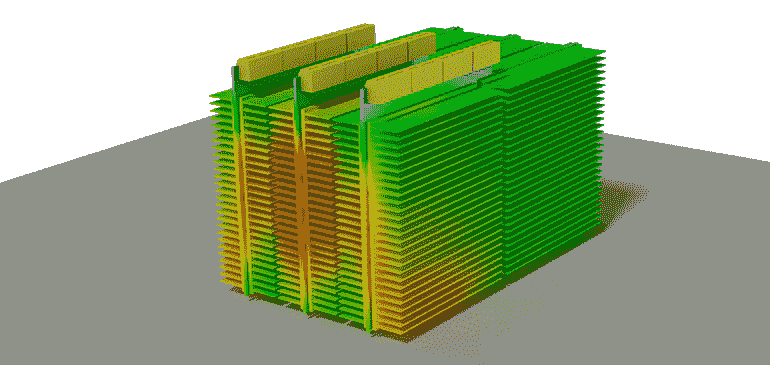
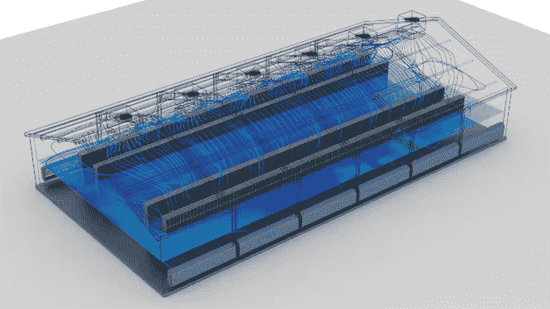
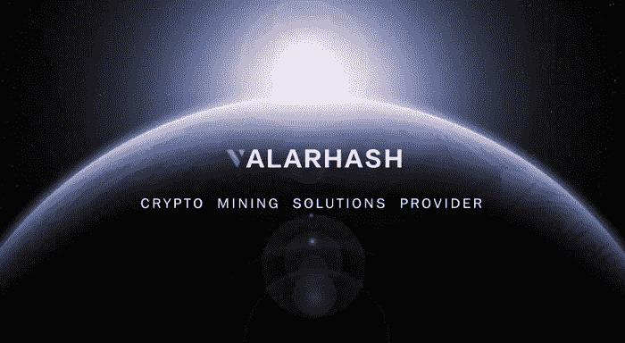

# 天热要冷。

> 原文：<https://medium.com/coinmonks/its-hot-to-be-cold-e09cc8b3abad?source=collection_archive---------39----------------------->

考察比特币挖矿的火爆趋势和低温之间的关系。

尽管我们在短期和长期看到比特币价格飙升，但比特币强大网络的主要贡献者是寒冷，或者说它与寒冷天气本身的独特关系。虽然 cold 这个词也可以代表一个人储存私人钥匙的方法，比如冷钱包，但是 cold 这个词也可以用在它的字面意思上。比特币的网络和安全依靠比特币矿机来保持凉爽。

让我们往回走一点。比特币挖矿是机器和专用特定计算机计算随机随机数的过程，这些随机数有资格赢得比特币奖励，因此能够在比特币的“区块链”网络中创建下一个区块。这些特定的比特币挖矿机也被称为 ASICs，或专用集成电路。他们实际上只做一件事，而且做得很有效率，那就是尽可能快地运行 SHA256 算法。新的现代 ASIC 机器可以计算超过 100 TH/S，也就是每秒 100 万亿次计算！

对于所有类型的机器和计算机，当它们以如此高容量的方式被使用时，它们会变热。我们来看看市面上比较流行的一款 ASIC:比特大陆的可以计算 110 TH/S 的 Antminer S19 Pro

[https://www.asicminervalue.com/miners/bitmain/antminer-s19-pro-110th](https://www.asicminervalue.com/miners/bitmain/antminer-s19-pro-110th)

这个 ASIC 需要大约 3250W 的能量，并且已经在外部安装了 4 个风扇来冷却它。建议将该机器保持在温度在 5–40°c 之间的受控环境中运行。这些风扇不仅仅是笔记本电脑或计算机上的普通风扇，它们的噪音水平可以达到 75db。在经历自动热关机之前，普通 ASIC 计算机芯片可以达到 100 摄氏度以上。

或者更糟，一些危险的事情，比如这些 ASICs 之间的熔毁或爆炸。令人欣慰的是，像这样的灾难性事件还没有在采矿领域发生，但以前有过孤立的小事件记录。

​​

有时当温度检测停止时，可能已经太晚了，ASIC 芯片可能已经损坏。

> 另外，矿工“过热”不是一个简单的事件。大多数热损伤矿工不会以与英特尔 CPU 相同的方式死亡。在大多数情况下，真正发生的是芯片和散热器之间的环氧树脂结合产生过度的热循环。当键断裂时，芯片就不能再冷却了。然后，它通常会融化，在局部形成“半短路”。大部分死板都有这个。

安装在 ASIC 上的风扇需要足够强劲，以使空气在机器中循环，从而使受热的 ASIC 芯片冷却下来。这些芯片的温度越低，它们通过 SHA256 算法运行的效率就越高，这反过来将有助于更快地计算哈希。在 ASIC 的一端，冷空气被吸入，而在另一端，热空气被吹出。这也是 ASICs 声音如此之大，不适合家庭居住场所的另一个原因。想象一下，当你的家人正试图吃一顿平静的晚餐时，这些 ASICs 正在你的厨房里运行！

但实际上，浸入式冷却等新技术和创新可以让您的 ASIC 继续运行，但没有声音。简而言之，它的工作方式是将你的 ASIC 浸入某种类型的浸液(电介质冷却剂)中，这样当液体消音时，机器仍能运行。

​​

采矿场实际上是在考虑温度流动的情况下建立的。除了能源使用是首要考虑因素，内部热循环是次要的，因为这些 ASIC 机器需要集中冷却。如果没有适当的空气流通，采矿场就会像温室一样，里面又热又干。

​​

这就是为什么采矿场和大规模采矿者寻求较冷的温度和位于寒冷气候的地理位置。这似乎是一种矛盾，但你的矿工越冷，你的比特币就越热。

有时，天气会达到被认为是寒冷的温度，以至于你的呼吸开始冻结。据报道，比特币矿工经历了自己的“冻伤”，芯片和风扇冻结，导致机器本身停止工作。还有其他寒冷天气的例子，实际上带来了积极的影响，而不是影响散列率。今年早些时候，德克萨斯州经历了另一场寒冷的暴风雪，去年整个州都受到了影响，超过 400 万人断电。估计有 700 人因德克萨斯州对极端寒冷天气的毫无准备而死亡。

但今年，在中国驱逐所有比特币矿工后，以德克萨斯州为家的比特币矿工群体提出关闭他们的采矿农场，以应对预期的紧急情况。德克萨斯州区块链委员会主席 Lee Bratcher 表示*“该州所有工业规模的比特币矿工都在这个项目中，并且已经关闭，这应该会将大量电力推回电网”*。

德克萨斯州矿工的这种友好姿态是向德克萨斯州电力可靠性委员会提供更多的电力容量，以满足德克萨斯州人的生活需求，如运行他们的家庭照明，为医院供电，保持食品商店营业等。Riot Blockchain、Rhodium Enterprises 等公司在其 hashrates 上参与了这一牺牲。

因此，尽管矿工可能会因“用电过多”而受到指责，但比特币采矿实际上是管理我们电网能量流的一种非常高效和有效的方式。

**来源**

[https://www . vice . com/en/article/qjbbwb 5/Texas-bit coin-miners-shutting-to-help-power-grid-survive-winter-storm](https://www.vice.com/en/article/qjbwb5/texas-bitcoin-miners-shutting-down-to-help-power-grid-survive-winter-storm)

[https://www . electronic design . com/industrial-automation/article/21806733/bit coin-mining-a-thermal-perspective](https://www.electronicdesign.com/industrial-automation/article/21806733/bitcoin-mining-a-thermal-perspective)

**关于 Valarhash**
总部位于美国的 Valarhash 集矿机销售、矿工托管、矿池、矿山建设服务于一体。在首席执行官 Fiona Lv 的领导下，Valarhash 旨在利用先进的技术，以较低的进入门槛，为用户提供透明和有益的采矿计划。业务运营涵盖硬件研发、数字资产交易和[1 mine](https://www.1tmine.com/)hash 电力合同共享。凭借在 hash power 市场的领先地位，Valarhash 整合了前沿资源和全球视野，提供加密计算服务(CCS)，并通过区块链技术连接物理和数字世界。

**欲了解更多信息，请访问:**

网址:[https://www.valarhash.com](https://www.valarhash.com/)

推特:[https://twitter.com/VaIarhash](https://twitter.com/VaIarhash)

https://www.facebook.com/Valarhash

领英:[https://www.linkedin.com/company/vhash/](https://www.linkedin.com/company/vhash/)

中:【https://medium.com/Valarhash 

电报:[https://t.me/valarhashx1tmine_bitcoin](https://t.me/valarhashx1tmine_bitcoin)

**媒体联系人
邮箱:BD@vhash.io**

> 加入 Coinmonks [电报频道](https://t.me/coincodecap)和 [Youtube 频道](https://www.youtube.com/c/coinmonks/videos)了解加密交易和投资

# 另外，阅读

*   [SmithBot 评论](https://coincodecap.com/smithbot-review) | [4 款最佳免费开源交易机器人](https://coincodecap.com/free-open-source-trading-bots)
*   [比特币基地僵尸程序](/coinmonks/coinbase-bots-ac6359e897f3) | [AscendEX 审查](/coinmonks/ascendex-review-53e829cf75fa) | [OKEx 交易僵尸程序](/coinmonks/okex-trading-bots-234920f61e60)
*   [如何在印度购买比特币？](/coinmonks/buy-bitcoin-in-india-feb50ddfef94) | [WazirX 审查](/coinmonks/wazirx-review-5c811b074f5b)
*   [CryptoHopper 替代品](/coinmonks/cryptohopper-alternatives-d67287b16d27) | [HitBTC 审查](/coinmonks/hitbtc-review-c5143c5d53c2)
*   [CBET 评论](https://coincodecap.com/cbet-casino-review) | [库科恩 vs 比特币基地](https://coincodecap.com/kucoin-vs-coinbase)
*   [折叠 App 审核](https://coincodecap.com/fold-app-review) | [Kucoin 交易机器人](/coinmonks/kucoin-trading-bot-automate-your-trades-8cf0ca2138e0) | [Probit 审核](https://coincodecap.com/probit-review)