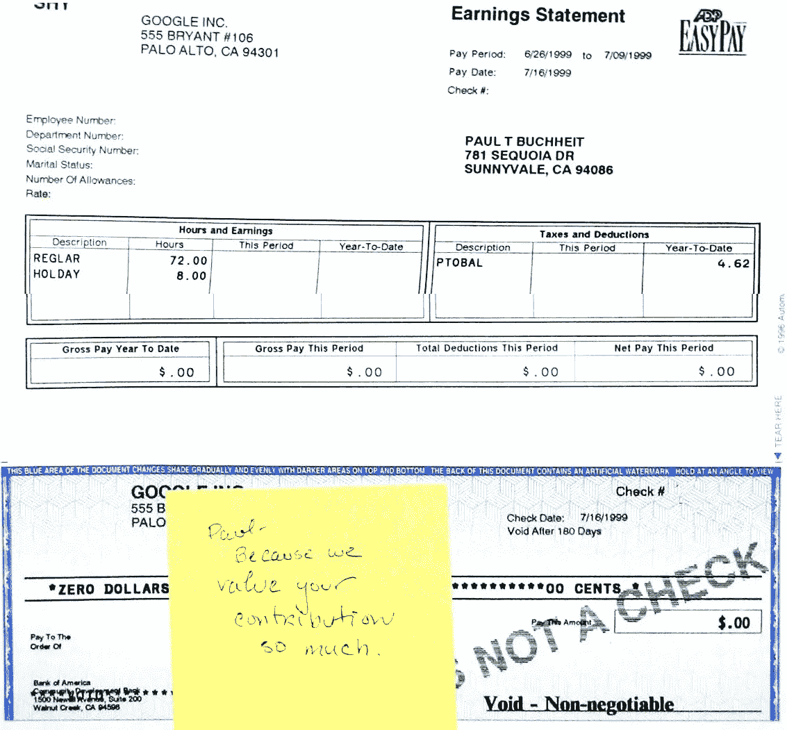

# 不是钱的问题，对吧？

> 原文：<https://medium.com/coinmonks/its-not-about-the-money-is-it-e39843c2f56?source=collection_archive---------31----------------------->

我的第一张 Google pay 存根(包括希瑟的一张纸条)。钱不是万能的，但是这张零美元的支票让我有点紧张。

([Paul buch heit](https://en.wikipedia.org/wiki/Paul_Buchheit)——23 岁谷歌员工，谷歌 AdSense 原型的开发者，GMail 的创造者，口号“不要作恶”的作者。)

一提到是加入一家创业公司还是找一份固定工作的问题，有人就会赞成 9 小时 5 天工作制，认为“钱不是一切。

当然，他们是对的。有大量证据表明，幸福只是与财富间接相关。更令人满意的是与爱人的良好关系、意义感和有目的的存在。当然，钱也很重要，但如果食物和住所不再是一个问题(就像大多数选择在初创公司或大公司工作的人一样)，那么钱可以退居其次。

此外，大多数选择在创业公司工作的人永远不会获得巨额薪酬。是的，谷歌向其数千名员工支付了数十亿美元，但这是一个罕见的例外。即使是相对成功的初创公司，最终以 5000 万美元的价格售出，也只能让一些人变得富有。

所以如果你在乎钱，我不建议你去创业。你可能会在股票上赚得更多，或者如果你成为一名律师或类似的人。

在你看来，我似乎在为一份沉闷的九小时五天工作辩护。正好相反。这八个小时占据了你生活的很大一部分。别忘了，你还应该加上你准备工作、谈论工作以及在一天工作后逐渐平静下来的时间。更糟糕的是，一部糟糕又无趣的作品会耗尽你的活力，以至于晚上你会觉得好像一整天都坐在电视机前。

如果有机会改变事情，这样活着真的值得吗？为什么要牺牲生命中的一大部分来赚钱呢？有些人没有其他选择，但那些幸运地拥有大脑和学历的人可以做得更好。

与其浪费“办公时间”，不如让工作的每一分钟都有意义。你能找到事情做，不是吗，你能找到既充实又有意义的工作？

当然，说起来容易做起来难，但还是可行的。

大公司的结构和系统化组织让工作变得毫无意义和无趣(至少对我来说)是有原因的(我改天再描述)。当然，小公司可能不会更好，但他们有更多的机会变得更好。

如果你不喜欢你的工作，如果它不能让你快乐，不能让你充满能量和热情，为什么你还在做它？我不能保证你会找到更好的，但至少值得尝试新的东西。你不必放弃自己的生活。

我真的很喜欢编程。我喜欢创造新产品，新功能。我喜欢得到用户的反馈，找出如何解决他们的问题。我喜欢商业游戏。我喜欢帮助别人。当然，任何工作都有其枯燥和不愉快的一面，但它的量应该是有限的(我的规则是:不超过 10%)。

这就是我工作(写代码到凌晨 4 点)的原因，尽管我没有经济上的需要。这就是我们创建 FriendFeed 的原因——有一个很好的工作场所，一个我们可以创造用户会喜欢的顶级产品的地方。当然，我不介意从中赚几十亿美元，当然我希望我们所有的员工都变得富有，但这仍然是一种奖金，一种额外的奖励。我不相信你可以快乐，做出伟大的产品，照顾用户，但仍然只想着钱。

说到底，让你快乐的不是钱。

原作者:[保罗·布赫海特](https://en.wikipedia.org/wiki/Paul_Buchheit)

📰 ***订阅*** [***斐波那契***](/@unclefibonacci) ***保持最新***

> 加入 Coinmonks [电报频道](https://t.me/coincodecap)和 [Youtube 频道](https://www.youtube.com/c/coinmonks/videos)了解加密交易和投资

# 另外，阅读

*   [南非的加密交易所](https://coincodecap.com/crypto-exchanges-in-south-africa) | [BitMEX 加密信号](https://coincodecap.com/bitmex-crypto-signals)
*   [MoonXBT 副本交易](https://coincodecap.com/moonxbt-copy-trading) | [阿联酋的加密钱包](https://coincodecap.com/crypto-wallets-in-uae)
*   [Remitano 审查](https://coincodecap.com/remitano-review)|[1 英寸协议指南](https://coincodecap.com/1inch)
*   [iTop VPN 审查](https://coincodecap.com/itop-vpn-review) | [曼陀罗交易所审查](https://coincodecap.com/mandala-exchange-review)
*   [40 个最佳电报频道](https://coincodecap.com/best-telegram-channels) | [喜美元评论](https://coincodecap.com/hi-dollar-review)
*   [折叠 App 审核](https://coincodecap.com/fold-app-review) | [StealthEX 审核](/coinmonks/stealthex-review-396c67309988) | [Stormgain 审核](https://coincodecap.com/stormgain-review)