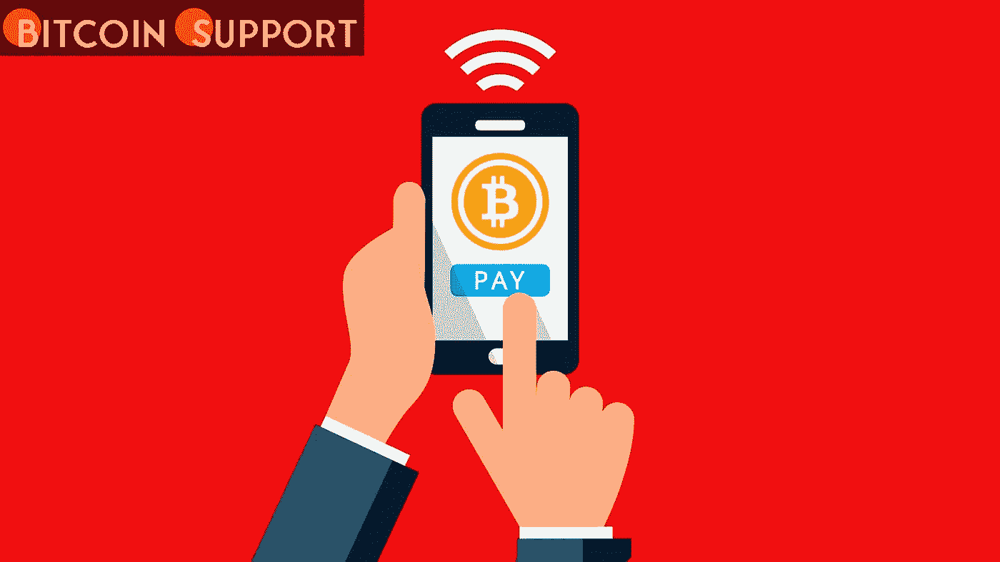

# 一个人说，“我从来没有用密码支付过。”这显示了数字资产如何在战斗中发挥作用

> 原文：<https://medium.com/coinmonks/ive-never-paid-with-crypto-before-says-one-user-illustrating-how-digital-assets-may-make-a-1ccaa769bbb6?source=collection_archive---------58----------------------->

**Visit our website for full blog:-** [**https://bitcoinsupports.com/ive-never-paid-with-crypto-before-says-one-user-illustrating-how-digital-assets-may-make-a-difference-in-a-battle/**](https://bitcoinsupports.com/ive-never-paid-with-crypto-before-says-one-user-illustrating-how-digital-assets-may-make-a-difference-in-a-battle/)

许多乌克兰人和俄罗斯人在危机中转向数字资产来支持自己和家人。

在许多方面，乌克兰的持续冲突已经变成了对加密货币的压力测试。数字资产已经成为直接支持人道主义努力的可行手段，密码行业在很大程度上证明了自己是一个成熟的社区，能够遵守国际政策，而不会危及去中心化的核心原则，尽管面临巨大的压力。但在这些可怕的事件中，加密发挥了另一个关键作用:对于那些被切断了以前看似可靠的支付方式的人来说，它变得越来越容易被认出来。

在武装冲突和人道主义灾难期间，传统的金融体系通常会崩溃。危机会削弱银行系统的运作能力，危及数百万普通人的货币供应，从恶性通货膨胀和现金短缺到自动取款机的损坏。

这些人有的来自乌克兰，亲身经历过战争，有的则来自俄国，他们的正常生活在一夜之间被摧毁，被迫逃离家园。他们的故事表明，当世界崩溃时，普通人，而不是腐败的精英，是加密的最后一道防线。

**“Crypto 的设计意图是防止任何政府或个人控制它。”**

维克多利亚·福克斯(Viktoria Fox)是加密货币开采公司北极星资本(Polaris Capital)的创始人兼 CEO。她是一名乌克兰裔美国企业家。在苏联解体后的 20 世纪 90 年代，她的父母从乌克兰搬到了美国。2 月 24 日战争爆发后，她的美国家人开始接到乌克兰亲戚打来的令人不安的电话。随着俄罗斯军队进入该国，乌克兰国家银行迅速停止了所有证券的流通，并限制了现金提取，引发了全国范围的恐慌。尽管中央银行宣称银行和金融系统在俄罗斯入侵后保持“弹性”，但福克斯在当地的亲戚却讲述了一个不同的故事:“据我所知，所有的银行都关门了，所有的 ATM 机都没有现金了。”和大多数家庭一样，经过两周的冲突，我的亲戚们完全破产了。从那以后，福克斯一直在向他们提供比特币(BTC)，比特币已经成为商贩和市民的一种替代货币，允许他们支付从吃饭到打车的几乎一切费用。维克多利亚的叔叔用比特币支付了一名司机的费用，这名司机从哈尔科夫开车送他到该国西部地区，耗时 6 个小时。据福克斯报道，大多数乌克兰人更喜欢通过比特币基地和币安等成熟的全球交易所进行交易，而一些人也使用乌克兰交易所。福克斯说:“关键是要记住，加密技术，尤其是比特币，是独立于任何一个政府或个人的虽然惩罚“邪恶的”俄罗斯人同时奖励无辜的乌克兰村民可能很有诱惑力，但这与分散资金或资产的本质相矛盾。她不相信政府加强对加密技术的控制会在这场战争或未来的任何战争中使普通人受益。“对我这个无政府主义者来说，这是一个意识形态选择的问题，而不是安慰的问题。

“安德烈”住在他出生的俄罗斯城市圣彼得堡，直到几周前。Andrey 是一名前端开发人员，过去曾与区块链系统公司合作过。”“我不确定我能写一份聪明的合同，”他承认，“但是我知道如何在日常金融交易中使用密码。”“这些年来，我在 USDT 提过几次款，但都不是用银行卡。"对我这个无政府主义者来说，这是一个意识形态选择的问题，而不是舒适的问题。"

**访问我们的网站获取完整的博客:-**[**https://bitcoinsupports . com/ive-never-pay-with-crypto-before-say-one-user-illustration-how-digital-assets-may-make-a-difference-a-a-a-battle/**](https://bitcoinsupports.com/ive-never-paid-with-crypto-before-says-one-user-illustrating-how-digital-assets-may-make-a-difference-in-a-battle/)

在冲突的第四天，安德烈的所有物品仅包括一台笔记本电脑、一件 t 恤衫和一个装有一些来之不易的军刀的硬件钱包:

**我用 Visa 卡做的最后一件事是在 Airbnb 上租了一间两周的公寓。我很幸运在欧洲有一群朋友，他们现在在必要时帮助我使用信用卡。“我只是把硬币寄给他们，”寄信人说。**

Andrey 表示，从长远来看，他仍然需要菲亚特来购买食品杂货和其他必需品。他仍然没有弄清楚如何使用在欧洲可用的对等取款设施。尽管如此，他认为得到一个加密硬件钱包是他做过的最好的决定之一。“我并没有计划这样的事情，但当你生活在威权主义之下时，你必须独立于当地银行。”Andrey 指出，在一个新的司法管辖区提取加密货币可能会很困难。他说，“

**”尽管我有整个行业的经验，但我现在的处境很困难。“在德国，提取现金受到非常严格的监管，我仍在寻找规避监管的方法。”**

这不仅仅是对个人的要求。安德烈是俄罗斯公民，他的父亲在乌克兰南部出生并长大。他没有合法途径为乌克兰公民的救援工作捐款，政府可能会将其视为刑事犯罪，甚至是叛国罪。安德烈评论道:

**“我在乌克兰有朋友，就像在俄罗斯的许多其他人一样。”他们中的一些人目前在基辅，在遭到炮击时睡在防空洞里。与他们的相比，我的问题微不足道。为了帮助他们，我需要找到一个能接受我的 USDT 来换取格里夫尼亚的人。在确保我朋友的银行卡正常工作后，我利用了这个机会。虽然数量不多，但我希望它能有所帮助。**

**“我们无法接收乌克兰银行账户的国际付款。因为在战争的前三周，菲亚特银行系统基本上处于瘫痪状态，沙科拉不得不快速学习:“我们无法接受外国向乌克兰账户的转账，国内的菲亚特转账也有一些困难。”在习惯了使用数字货币进行日常交易后，她了解到了由乌克兰区块链倡导者发起的非营利项目 Unchain。2 月 27 日，在当地一个秘密交易网络支持这一想法后，Unchain 开始向乌克兰居民提供捐款。在与基辅的 Unex 银行和 Weld Money 的合作中，下一步是创建被称为“帮助卡”的虚拟借记卡。“这些卡旨在帮助家庭，特别是妇女和儿童，他们在冲突中可能没有机会学习密码学。Unchain 接受加密货币捐赠，并在接收方将其转换为乌克兰格里夫尼亚。它打算资助总共 10，000 张帮助卡。这场战争显然破坏了全球经济秩序，也考验了加密业务。尽管有人担心数字资产可能危及国际制裁制度，但它们已被重新包装为一个可靠、灵活的支付系统，有能力在数百万人最糟糕的日子里为他们提供帮助。乌克兰政府一直在推动帮助该国数字行业在战后复苏的政策，这并非巧合。乌克兰总统弗拉基米尔·泽伦斯基(Volodymyr Zelenskyy)于 3 月 16 日签署了一项措施，为该国发展受监管的加密市场提供了法律框架。鉴于该国战后重建的需要，该国来之不易的加密专业知识可能对建设充满活力的数字经济至关重要。
读者应该自己做研究。**

> 加入 Coinmonks [电报频道](https://t.me/coincodecap)和 [Youtube 频道](https://www.youtube.com/c/coinmonks/videos)了解加密交易和投资

# 另外，阅读

*   [如何在 FTX 交易所交易期货](https://coincodecap.com/ftx-futures-trading) | [OKEx vs 币安](https://coincodecap.com/okex-vs-binance)
*   [OKEx vs KuCoin](https://coincodecap.com/okex-kucoin) | [摄氏替代品](https://coincodecap.com/celsius-alternatives) | [如何购买 VeChain](https://coincodecap.com/buy-vechain)
*   [ProfitFarmers 点评](https://coincodecap.com/profitfarmers-review) | [如何使用 Cornix Trading Bot](https://coincodecap.com/cornix-trading-bot)
*   [如何匿名购买比特币](https://coincodecap.com/buy-bitcoin-anonymously) | [比特币现金钱包](https://coincodecap.com/bitcoin-cash-wallets)
*   [瓦济里克斯 NFT 评论](https://coincodecap.com/wazirx-nft-review)|[Bitsgap vs Pionex](https://coincodecap.com/bitsgap-vs-pionex)|[坦吉姆评论](https://coincodecap.com/tangem-wallet-review)