# 杰克·多西、Web5 和互联网计算机协议:Web 平台的去中心化

> 原文：<https://medium.com/coinmonks/jack-dorsey-web5-and-the-internet-computer-protocol-the-decentralization-of-the-web-platforms-73b6bc1e5f75?source=collection_archive---------2----------------------->

## Twitter 的创始人最近宣布了 web5 概念，其支柱与互联网计算机协议相同。去中心化的网络平台会是互联网的未来吗？

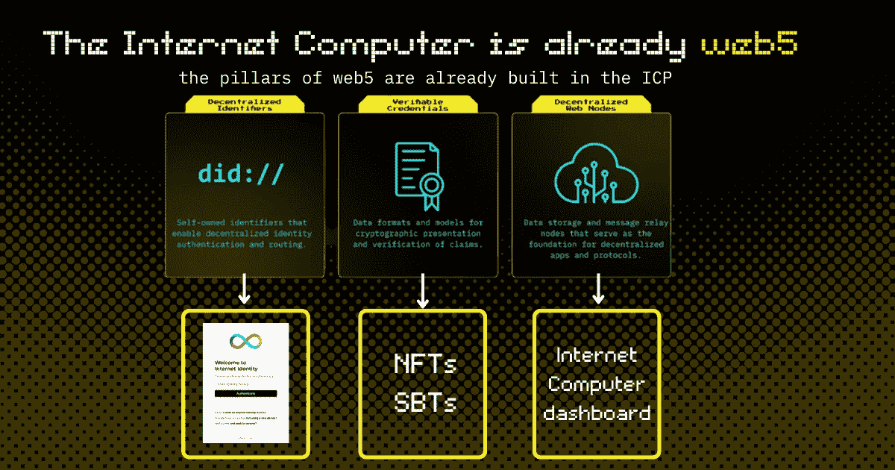

Twitter 创始人兼前首席执行官杰克·多西最近宣布了 web5:一个额外的去中心化网络平台。这就是他的新公司“Block”目前正在打造的东西。

经过一段时间的沉默后，Block 现在想与放弃 web5 的 web3 风投竞争。

基于他们在网上发表的演讲，**他们想要建立一个分散的网络平台，这在当前的 web3 基础设施中是不可能的。**

***两者皆非一。互联网计算机协议。这已经是一个分散的网络平台。***

*事实上，ICP 已经准备好通过其技术和基础设施托管 web5 所承诺的一切。*

区块链网络会取代基于云的网络吗？有必要吗？

早知道，这是互联网的新创新，我们应该深入挖掘和理解它。

> *在本文中，我们将深入探讨 Block 的 web5 有望实现的功能，以及作为分散式 web 平台的 ICP 基础架构。*

# 什么是 web5？

“web5 是一个分散的 Web 平台，使开发人员能够利用分散的标识符、可验证的凭据和分散的 Web 节点来编写分散的 Web 应用程序，将身份和数据的所有权和控制权归还给个人。”

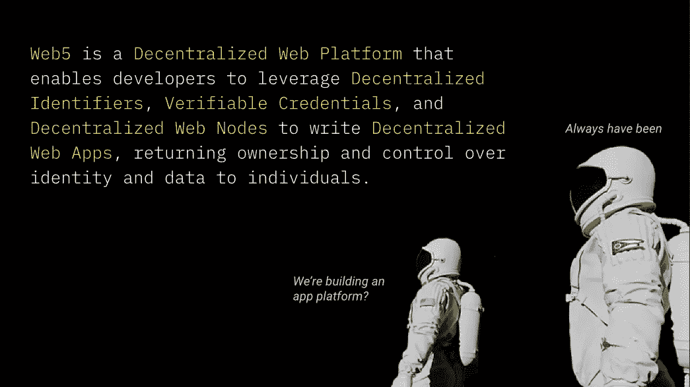

from the official web5 presentation

## web5 的发展愿景:

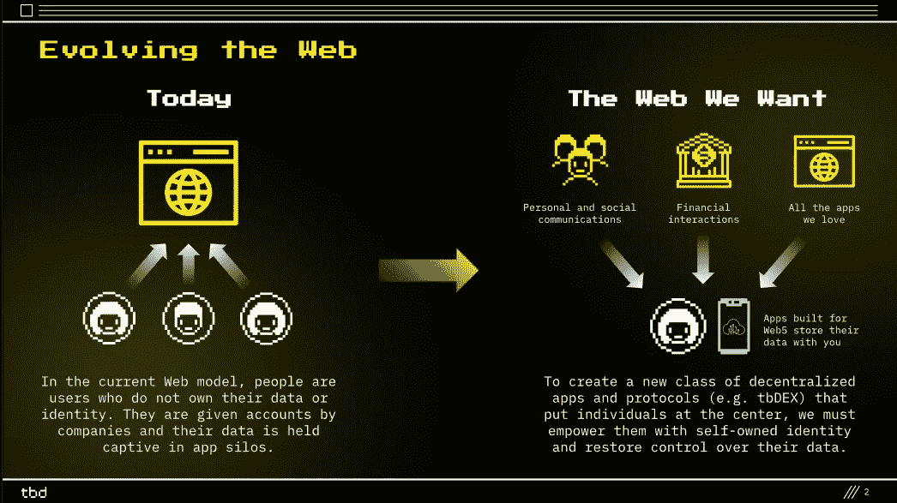

official web5 presentation

在这张幻灯片中，Block 展示了左边的 web2 现状与他们对互联网发展的看法之间的差异。

# 互联网计算机协议是一个分散的网络平台，如杰克·多西的 web5

互联网计算机协议通过创建基于区块链技术的公共互联网层解决了同样的问题。

互联网计算机协议已经建立的、使命和愿景是创建 ***一个具有高性能和无限容量的去中心化云计算的公共资源。***

怎么会？

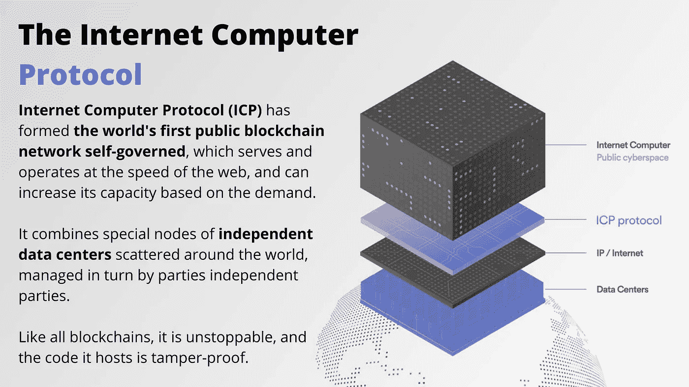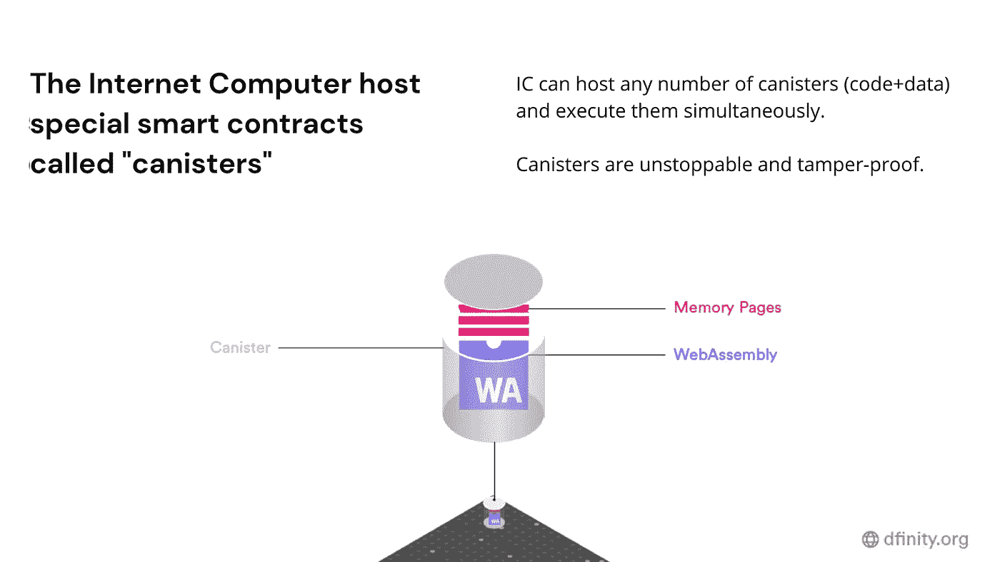

你可以在罐子上建造任何东西。您的 dapp 将 100%托管在区块链上，由分散的数据中心和节点组成。

ICP 中建立的 Dapps 是 100%分散的，100%在区块链上。

这是杰克·多西/布洛克公司想要做的，但他们为什么要在 web5 上重新命名呢？

# 为什么杰克·多西和布洛克在谈论 web5？

Web5 概念希望将今天被称为 web3 和 web2 的东西结合起来。

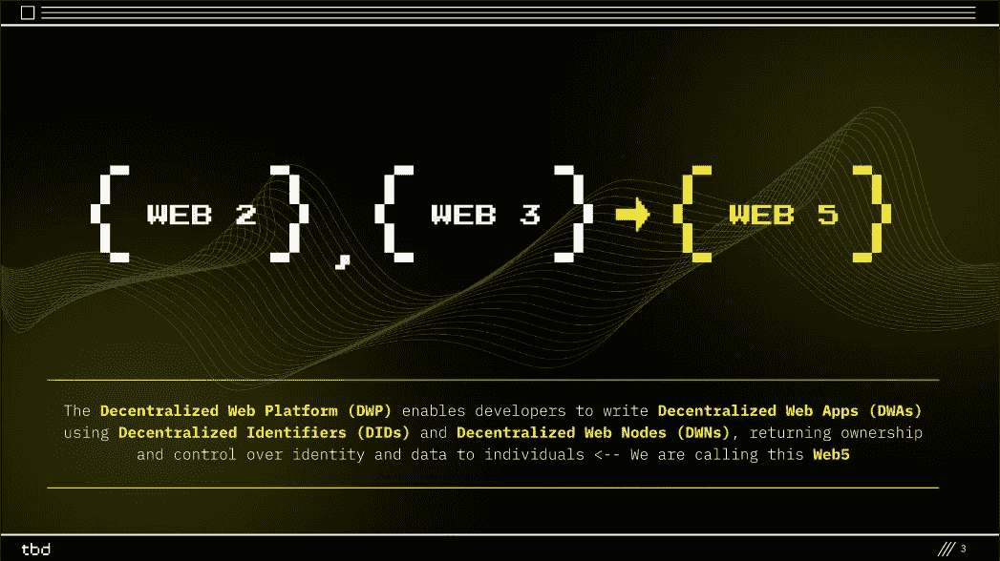

official web5 presentation

我们在图中看到的定义是试图与目前在 web3 社区流行的基于云的应用拉开距离。

作为 Block web5，**互联网计算机做同样的事情**提供一个由 NNS 管理的**去中心化的区块链 web 层**，你可以 100%在链上构建一切。

# 将 it 更名为“web5 ”,让基于云的 web3 dapps 与众不同。

今天，每个使用区块链技术进行建设的人都声称要建设 web3。但也不是 100%真实。

**事实上，大多数“web 3”dapp 使用区块链只是为了最少的逻辑和数据。***dapp 的其余部分是基于云的*，云是每个人在 web2 中使用的技术，云是基于公司的:由私人公司构建和管理。

云服务是个问题吗？一般不会。我们都在用。但是对于创建 web3 的愿景和真正的去中心化程度是很重要的。

dapps 目前的工作方式:

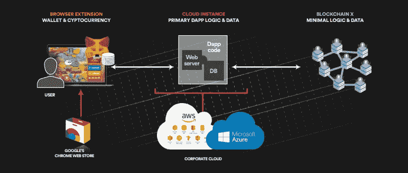

from the Internet Computer Infographics

它们如何在互联网计算机中工作:

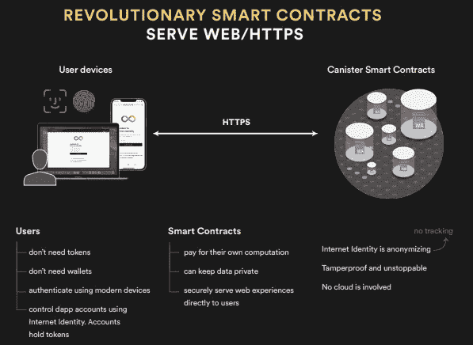

extract from the Internet Computer Infographic

他们如何在网络中工作 5:

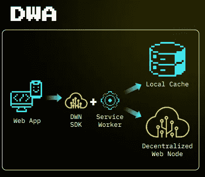

from web5 presentation

# web5 的支柱以及它们是如何建立在互联网计算机中的

在 Block 的 web5 演示的下一张幻灯片中，他们展示了 web5 的支柱。

在这一段中，我们将从 web5 的支柱和 ICP 的基础设施来看看相似之处。

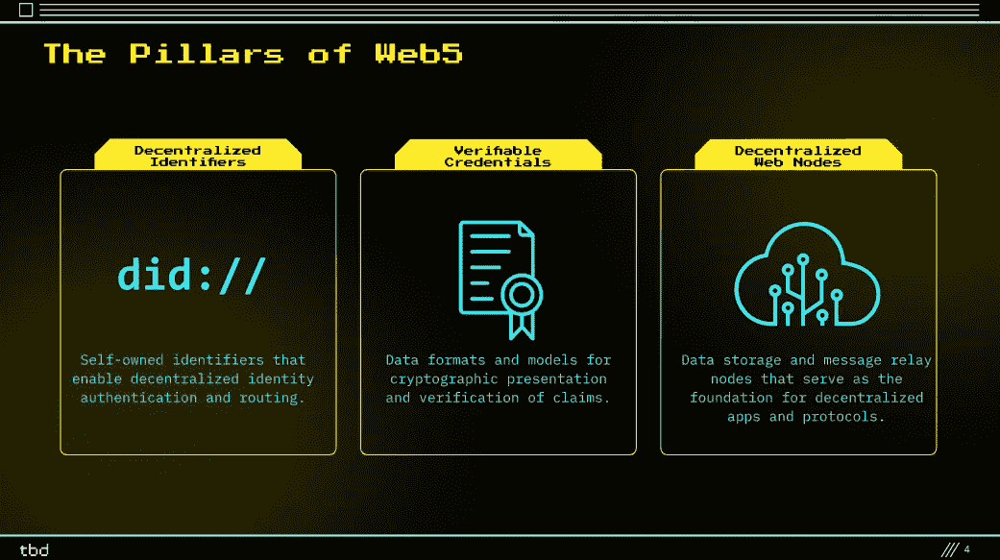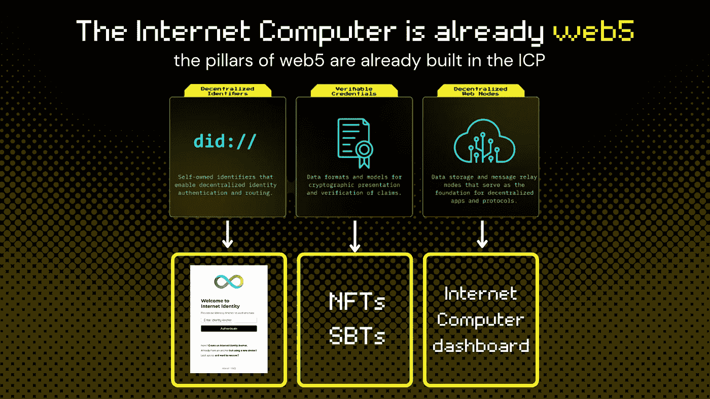

# 分散的标识符，如互联网身份

*互联网身份区块链认证系统使您能够在互联网计算机上安全、匿名地登录 dapps。*

互联网身份建立在 [WebAuthn 协议](/dfinity/web-authentication-and-identity-on-the-internet-computer-a9bd5754c547?source=friends_link&sk=211f6274de5b4841c72532666e21ae0e)的基础上，并使用安全加密认证，为用户提供三种自我认证选项:

1.  智能手机或笔记本电脑中内置的生物认证方法(例如，Face ID、触控 ID 或指纹扫描仪)。
2.  用户通常用来解锁其计算机或移动电话的密码或 pin。
3.  插入电脑 USB 端口的安全密钥(如 YubiKey)。

 [## 互联网身份:用户名和密码的终结

### 互联网身份区块链认证系统使您能够安全、匿名地登录到…

medium.com](/dfinity/internet-identity-the-end-of-usernames-and-passwords-ff45e4861bf7) 

# 作为 NFTs 和 SBT 的可验证凭证

通过 NFTs 和灵魂绑定令牌(SBT)，拥有可验证的凭证是可能的。

## 什么是 NFT？

> 不可替换令牌(NFT)是一个[区块链](https://www.investopedia.com/terms/b/blockchain.asp)上的加密资产，具有唯一的标识码和元数据，可将它们相互区分开来。与[加密货币](https://www.investopedia.com/terms/c/cryptocurrency.asp)不同，它们不能等价交易或交换。这与加密货币等可替代代币不同，加密货币彼此相同，因此可以作为商业交易的媒介。
> 
> *福布斯。* [*什么是 NFT？不可替换令牌解释*](https://www.forbes.com/advisor/investing/nft-non-fungible-token/) *。”访问时间是 2022 年 2 月 18 日。*

## 什么是灵魂绑定令牌？

> SBT 或灵魂绑定令牌**是与灵魂地址**关联的不可转让且公开可见的令牌。它有助于通过令牌创建社会身份，以实现 Web 3.0 和 DeFi 生态系统中目前缺乏的服务，如抵押不足的贷款或简单合同，如公寓租赁。
> 
> *密码时代。* [*“什么是灵魂绑定令牌(SBT)&它们是如何工作的？”*](https://www.cryptotimes.io/what-are-soulbound-tokens-sbts/#:~:text=SBTs%20or%20Soulbound%20tokens%20are,contracts%2C%20like%20an%20apartment%20lease.)

NFT 是可交易的，而 SBT 是不可交易的。根据不同的用例，这两种技术中的一种将能够创造拥有可验证凭证的可能性。

# 分散的 web 节点作为独立于 ICA 的数据中心

> 互联网计算机区块链不是存在于任何物理位置的物理硬件。相反，互联网计算机区块链结合了世界各地独立运营的数据中心提供的计算资源。

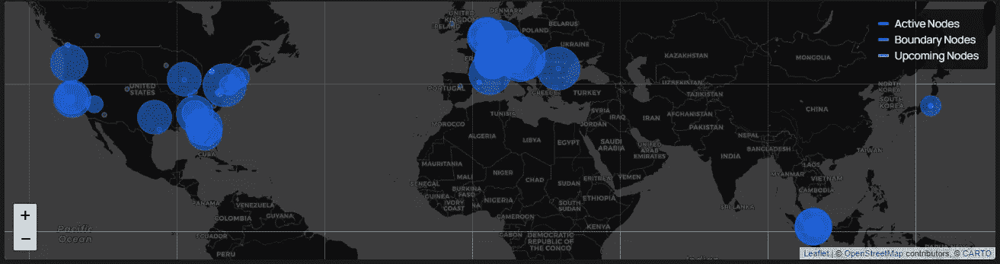

from the intenetcomputer.org dashboard

> 与公共云或私有云不同，互联网计算机区块链不是由一家私人公司拥有和运营的。相反，互联网计算机区块链是一个公共设施，其更新和操作通过协议中定义的算法、分散的治理系统来管理。它的架构使多台计算机能够像一台非常强大的虚拟机一样运行。
> 
> 组成互联网计算机的位于全球数据中心的节点被组织成子网区块链，这些子网依次使用链密钥加密技术相互连接。分布式体系结构支持安全通信，无需易受攻击的防火墙或技术。独立节点运营商向数据中心支付托管其节点的费用，并因贡献计算能力和托管服务以支持在互联网计算机区块链上运行的 dapps 而获得报酬。

了解更多[观看节点的状态](https://dashboard.internetcomputer.org/)并了解[互联网计算机上节点的分散状态和方向](https://forum.dfinity.org/t/the-state-and-direction-of-decentralization-nodes-on-the-internet-computer/9170)

> 说互联网计算机协议已经是 web5 是正确的吗？大概是的。

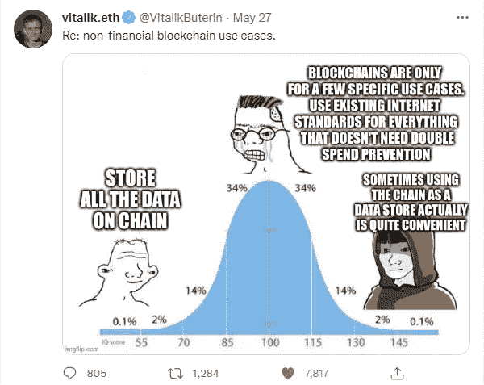

even Vitalik knows building full on the blockchain can be useful

# 互联网计算机、web5 和分散式网络平台会是下一个互联网创新吗？

T4 的概念是一个分散的网络，让你控制你的数据和身份。

它把权力还给人民。
它帮助创新呼吸。
它限制了权力的停滞。

减少巨头们给创新设置的障碍意味着给人们创造、组织和领导新项目的可能性。

如果有竞争，推广关心用户的新系统会更容易。这是区块链已经做的，也是未来将要做的。

互操作性和可扩展性是构建新互联网的两个主要特征，称之为 web3 或 web5。

**区块链和 web3 直到现在仍然是一个利基**并没有准备好大规模采用，直到人们在不知不觉中使用它们。
*你以为你妈知道互联网是怎么运作的吗？没有，但她还在用手机给你发短信。*

从基础开始可能会有用。中本聪的愿景是关于互联网的去中心化，而现在 web3 dapps 仍然不像我们以前看到的那样。

*(分权≠共产主义)*

为了实现去中心化，我们需要从互联网的基础结构开始，新的网络不应该依赖于 web2 基础设施。

一个独立的分散式网络平台，拥有分散的数据中心、数字身份和可验证的凭证，可以成为新互联网的支柱。

这就是区块链故事的发展方向。

a random nyan cat

我希望你喜欢阅读。如果你看到这封信，我想感谢你！写这篇文章花了我一段时间。我总是乐于联系。你可以在 Twitter @pinoweb3 上找到我

主要来源:
[https://developer.tbd.website/projects/web5/](https://developer.tbd.website/projects/web5/)
[https://dfinity.org/icig.pdf](https://dfinity.org/icig.pdf)
[https://internetcomputer.org/](https://internetcomputer.org/)
[https://dashboard.internetcomputer.org/](https://dashboard.internetcomputer.org/)

> 加入 Coinmonks [电报频道](https://t.me/coincodecap)和 [Youtube 频道](https://www.youtube.com/c/coinmonks/videos)了解加密交易和投资

# 另外，阅读

*   [印度最佳 P2P 加密交易所](https://coincodecap.com/p2p-crypto-exchanges-in-india) | [柴犬钱包](https://coincodecap.com/baby-shiba-inu-wallets)
*   [八大加密附属计划](https://coincodecap.com/crypto-affiliate-programs) | [eToro vs 比特币基地](https://coincodecap.com/etoro-vs-coinbase)
*   [最佳以太坊钱包](https://coincodecap.com/best-ethereum-wallets) | [电报上的加密货币机器人](https://coincodecap.com/telegram-crypto-bots)
*   [交易杠杆代币的最佳交易所](https://coincodecap.com/leveraged-token-exchanges) | [购买 Floki](https://coincodecap.com/buy-floki-inu-token)
*   [3Commas 对 Pionex 对 Cryptohopper](https://coincodecap.com/3commas-vs-pionex-vs-cryptohopper) | [Bingbon 评论](https://coincodecap.com/bingbon-review)