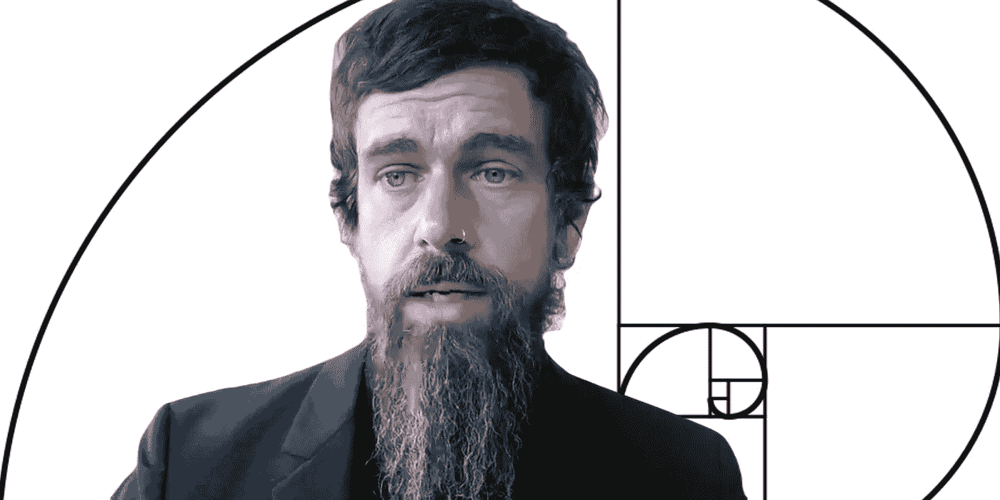
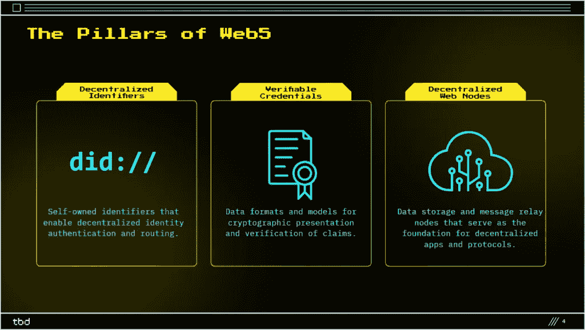

# 杰克·多西的公司引入了 Web5 网络平台的概念

> 原文：<https://medium.com/coinmonks/jack-dorseys-company-introduced-the-concept-of-the-web5-web-platform-b6aa6858be4f?source=collection_archive---------3----------------------->

杰克·多西 Block 公司的结构部门——TBD——引入了去中心化开源平台 Web5 的概念。据开发商称，该项目将让用户完全控制自己的个人数据和数字身份。

This preview will be included in the NFT collection called “[Uncle Fibonacci News](https://opensea.io/collection/uncle-fibonacci-news)”

> “这可能是我们对互联网最重要的贡献。我为这支球队感到骄傲，”多尔西在声明中评论道。

根据 TBD 的说法，用户的身份和个人数据目前不属于他们，因为他们已经“成为第三方的财产”对于后者，开发者意味着公司和集中式平台。

该团队推出的 Web5 愿景将改变这一点。

> “Web5 为您的应用程序带来了分散的身份和数据。这使得开发人员可以专注于创建令人惊叹的用户体验，同时将数据和身份的所有权归还给个人。

根据 TBD 发表的演讲，Web5 的概念基于三个支柱:

◼️分散标识符(分散标识符，did)——提供认证和数据路由；◼️验证证书(verified credentials，VC)——用于断言的加密表示和验证的特殊格式和数据模型；
◼️分散式网络节点(dwn)——存储数据并中继应用程序和协议之间交换的消息。

开发人员解释说，did 是由用户生成的，不是由集中的提供商或其他第三方存储的。第 2 层网络可以用作虚电路的协议。

DWNs 将允许生态系统参与者存储和传输加密或明文消息和数据。TBD 认为，这将提供一个机会，创造许多分散的应用程序和协议的基础上。

> “DID 和 DWN 的结合创造了一个安全的消息传递网络，可以用所有类型的语义数据交换的通用标准来取代单一目的的协议(加密消息传递、照片共享等)，”开发人员强调说。

假设 Web5 金融层将提供比特币网络。

此前，杰克·多西批评了 Web 3.0 的互联网概念。根据他的说法，网络的分散化受到对分布式管理和数据存储不感兴趣的风险投资者的强大影响的阻碍。

在宣布了 Web5 的概念后，Block 的负责人重复了他的论点。他指出，现代的去中心化互联网是基于像以太坊和索拉纳这样的“单点故障系统”,也没有给用户提供对其数据的控制权。

📰 ***订阅*** [***斐波那契***](/@unclefibonacci) ***我来保持最新***

☕️eth 0x40a 8443813 e 8 fa 4a 9 f 88 f 18 b 77442 aa 4ed 91 fd4c

> 加入 Coinmonks [电报频道](https://t.me/coincodecap)和 [Youtube 频道](https://www.youtube.com/c/coinmonks/videos)了解加密交易和投资

# 另外，阅读

*   [Coldcard 评论](https://coincodecap.com/coldcard-review) | [BOXtradEX 评论](https://coincodecap.com/boxtradex-review)|[uni swap 指南](https://coincodecap.com/uniswap)
*   [比特币基地评论](/coinmonks/coinbase-review-6ef4e0f56064) | [德里比特评论](/coinmonks/deribit-review-options-fees-apis-and-testnet-2ca16c4bbdb2) | [FTX 评论](/coinmonks/ftx-crypto-exchange-review-53664ac1198f)
*   [Coinmetro 评论](https://coincodecap.com/coinmetro-review) | [VirgoCX 评论](https://coincodecap.com/virgocx-review)
*   [法国四大最佳加密副本交易平台](https://coincodecap.com/copy-trading-platforms-france)
*   [从 WazirX 切换到 CoinDCX 的 5 个理由](https://coincodecap.com/reasons-to-switch-from-wazirx-to-coindcx)
*   [联合国硬币评论](https://coincodecap.com/unocoin-review) | [最佳加密赌注硬币](https://coincodecap.com/best-crypto-staking-coins)