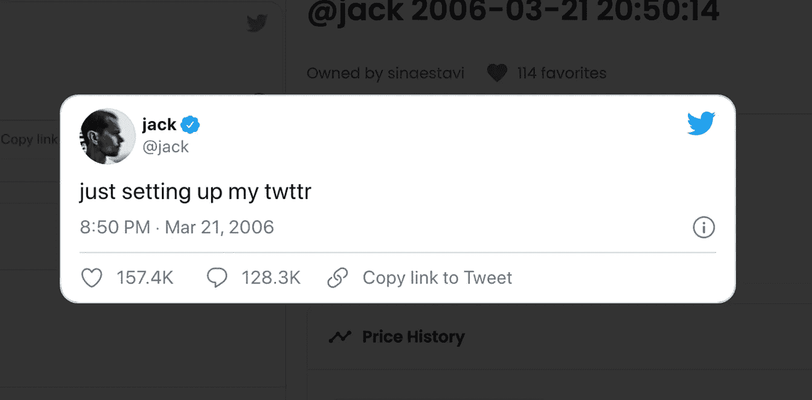

# 杰克·多尔西的推文卖了 290 万美元，现在只卖了 280 美元。NFT 是一种时尚吗？

> 原文：<https://medium.com/coinmonks/jack-dorseys-tweet-sold-for-2-9-million-now-sold-for-only-280-are-nfts-a-fad-ef0d58665b5?source=collection_archive---------17----------------------->

[杰克·多尔西发推特给 NFT](https://www.artnews.com/wp-content/uploads/2022/04/Screen-Shot-2022-04-15-at-3.43.40-PM.png?w=1600)

就在人们开始对 NFTs(由艺术家制作并存储在网上的数字艺术)感兴趣的时候，Twitter 创始人杰克·多西成为头条新闻，并通过出售他作为 NFT 的第一条推文赚了 290 万美元。2006 年 5 月 21 日的推特上写道，“正在设置我的推特”。NFT 拍卖会的所有收益将捐赠给新冠肺炎在非洲的救援工作。

2021 年 3 月，加密企业家 Sina Estavi 以 290 万美元的天价收购了 NFT。上周四，他[宣布](https://twitter.com/sinaEstavi/status/1511832413973983239?s=20&t=c7eABThl1zSvbrBynKGehw)他希望出售 NFT，并承诺将 50%的销售收入捐给[give direct](https://www.givedirectly.org/)，这是一家慈善机构，允许捐赠者将钱直接捐给生活贫困的人。他上周以 4800 万美元的价格将 NFT 挂牌出售。这是他所付价格的 16 倍多。拍卖于周三结束，总共只有七个出价，价格从 0.09 ETH(277 美元)到 0.0019 ETH(6 美元)不等，远低于所有者超过 15,987 ETH 的出价评估。GiveDirectly 慈善机构现在预计只能收到 140 美元——是 Estavi 先生获得 NFT 的一半。

NFT 是一种时尚吗？

正如出售杰克·多西的推特“NFT”一样，在确定非功能性交易价格方面存在不确定性。有时，价格是由投机而不是价值驱动的。由此，有人可能会说非功能性测试只是一种时尚，但事实并非如此。

与加密货币不同，NFT 是独一无二的，不可互换。简而言之，它们是代表区块链上独特资产的加密令牌。随着许多世界领先的名人和品牌进入热潮，NFT 最近抓住了广大公众的想象力。名人如[马克·库班](https://twitter.com/FrancisSuarez/status/1483469230448070658?s=20&t=dEHc9v8l9_iJf6HzuYpXYA)、[帕丽斯希尔顿](https://nft.parishilton.com/#/)、[杰·鲁](https://twitter.com/FrancisSuarez/status/1483469230448070658?s=20&t=dEHc9v8l9_iJf6HzuYpXYA)，以及品牌，包括 [NBA](https://twitter.com/NBAxNFT?s=20&t=MfSpVAjx-6KYe6NpnTTyIw) 、[阿迪达斯](https://twitter.com/adidasoriginals/status/1472888099994841090?s=20)和[一级方程式赛车](https://www.formulaxnft.com/)，都进入了 NFTs。

其中一些令人吃惊，尤其是在它们的价格估值上，所以许多人把非功能性技术称为时尚也就不足为奇了。

尽管仍处于早期开发阶段，但将现实世界的资产与 NFTs 联系起来是一件很快就会流行起来的事情。这可以通过创建令牌化的契约资产来数字化我们证明资产所有权的方式，并可以将房屋和土地等非流动性项目转移到区块链。随着世界拥抱元宇宙，非专利技术将成为人们拥有的东西。因为这会让人们接触到元宇宙的某些专有事物。

**最后的想法。**

NFT 正慢慢成为我们日常生活中不可或缺的一部分。它很好地迎合了人类对所有权和真实性的需求——这也是许多项目投入其中的主要原因。NFT 对艺术家、音乐家和企业来说是巨大的商机，因为它们是赚钱的好方法。这种新的互联网狂热吸引了艺术家、名人和顶级运动员，他们向这个行业注入了数以百万计的资金，这可能是为什么 NFT 会留在这里而不是成为时尚的原因。

那么，NFTs 是一种时尚吗？也许是，也许不是。但是 NFT 是互联网的未来。除了“跟随聪明的钱”，我真的找不到更好的投资 NFTs 的理由。有没有想过为什么这个星球上一些最聪明的投资者在这个领域下注数十亿美元？

> 加入 Coinmonks [电报频道](https://t.me/coincodecap)和 [Youtube 频道](https://www.youtube.com/c/coinmonks/videos)了解加密交易和投资

# 另外，阅读

*   [最佳期货交易信号](https://coincodecap.com/futures-trading-signals) | [流动性交易回顾](https://coincodecap.com/liquid-exchange-review)
*   【Huobi 的加密交易信号 | [Swapzone 审查](/coinmonks/swapzone-review-crypto-exchange-data-aggregator-e0ad78e55ed7)
*   最佳[密码交易机器人](https://coincodecap.com/best-crypto-trading-bots) | [购买索拉纳](https://coincodecap.com/buy-solana) | [矩阵导出评论](https://coincodecap.com/matrixport-review)
*   [Coldcard 评论](https://coincodecap.com/coldcard-review) | [BOXtradEX 评论](https://coincodecap.com/boxtradex-review)|[uni swap 指南](https://coincodecap.com/uniswap)
*   [比特币基地评论](/coinmonks/coinbase-review-6ef4e0f56064) | [德里比特评论](/coinmonks/deribit-review-options-fees-apis-and-testnet-2ca16c4bbdb2) | [FTX 评论](/coinmonks/ftx-crypto-exchange-review-53664ac1198f)