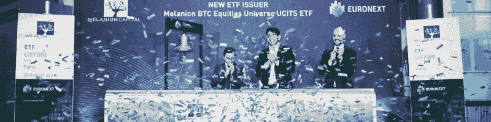

# Jad Comair 的比特币故事，欧洲第一个比特币 ETF 背后的人

> 原文：<https://medium.com/coinmonks/jad-comairs-bitcoin-story-the-man-behind-the-first-bitcoin-etf-in-europe-d281535242e6?source=collection_archive---------11----------------------->

在本文中，我们深入探讨了 Jad Comair 的观点，这位对冲基金经理创造了欧洲第一只比特币交易所交易基金。我们发现了他的动机、兴趣以及他对全球金融体系未来的预测。

Photo by [Bermix Studio](https://unsplash.com/@bermixstudio?utm_source=medium&utm_medium=referral) on [Unsplash](https://unsplash.com?utm_source=medium&utm_medium=referral)

欧洲几乎禁止了“工作证明”，这是中本聪共识机制背后的主要支柱，是比特币跳动的心脏。该算法因其高能耗要求而受到批评，这使得比特币在未来不可持续。以太坊目前也在使用工作证明，但后者一直在计划迁移到另一个能耗较低的协议，名为“利益证明”。

幸运的是，这项禁令没有通过欧洲立法机构的投票。最初，它是欧洲监管加密货币的更大框架的一部分。这项禁令肯定会对密码世界造成沉重打击，迫使创新者离开欧洲大陆。

投票前我和杰德·科姆尔谈过了。科姆是欧洲比特币革命的先驱之一。他的基金 Melanion Capital 主要专注于股息衍生品，于 2021 年推出了首只完全合规的比特币主题 ETF，该基金获得 AMF 批准，并在泛欧交易所上市。他来自机构世界的核心，与我们分享了他对比特币感兴趣的原因，当前金融系统的不便之处，比特币如何改善它，以及他为推动更大规模的加密采用所做的工作。

Photo by [Charbel Karam](https://unsplash.com/@charbelkaram?utm_source=medium&utm_medium=referral) on [Unsplash](https://unsplash.com?utm_source=medium&utm_medium=referral)

**对比特币的强制入会**

Comair 最初对比特币的兴趣是非常务实的。他在不同国家的旅行中发现了这一点，尤其是在往返于贝鲁特和巴黎之间，并试图避免将欧元兑换成美元和黎巴嫩英镑时的高额汇率费用和利差。他喜欢拥有全球货币的想法。根据他的说法，人们正在被大型外汇交易所和交易台敲竹杠，这些交易所和交易台建立了一个帝国，满足人们在跨国旅行时轻松交易的需求。

加强 Comair 立场的是 2019 年开始的黎巴嫩经济崩溃。简而言之，多年来糟糕的货币和经济政策扼杀了“实体”或生产性经济，并累积了外币公共债务。2019 年 10 月，全国各地爆发抗议活动，人们争相提取存款。人们对这个体系失去了信心，货币开始贬值。为了避免破产，黎巴嫩银行非法接管了人们的储蓄，禁止他们自由公开地取款。

Comair 不顾一切地试图帮助他的父亲，将他的钱转到另一个国际银行账户。然而，这是不可能的，因为他不是任何其他国家的合法居民。

Photo by [Sean Pollock](https://unsplash.com/@seanpollock?utm_source=medium&utm_medium=referral) on [Unsplash](https://unsplash.com?utm_source=medium&utm_medium=referral)

**如果发生在别人身上，也可能发生在你身上**

Comair 强调了金融机构如何成功地促进了一个健康的门面，而后面的一切都摇摇欲坠。

从不同的金融指标来看，很明显，黎巴嫩经济注定会崩溃。30 年来，黎巴嫩经济的“金融化”扼杀了该国几乎所有的生产性企业。利率定得太高，无法吸引外国和本地储户，而不是推动他们投资于真正创造价值的经济。然而，没有政府官员或当地银行机构对即将发生的事情发出警告。

像所有其他商人一样，银行家倾向于推销他们所推销的东西:信心。他们总是在漂亮的酒店和办公室里闲逛，穿着他们最好的制服来增强对金融系统的信心。即使他们身后的房子着火了，他们仍然做得很好，让群众相信局势已经得到控制。直到它不再是，做好准备。

Photo by [Christopher Alvarenga](https://unsplash.com/@kriztheman?utm_source=medium&utm_medium=referral) on [Unsplash](https://unsplash.com?utm_source=medium&utm_medium=referral)

**医生不会开飞机**

政府官员不是因为他们的金融知识或商业技能而当选的。他们的当选基于他们的言论，偶尔也基于他们对社会的计划。他们的背景是政治、游说和竞选。因此，将货币决策权交给他们是非常鲁莽的。

在当前的金融体系中，政府官员利用税收和通货膨胀来分配资源。他们有许多金融工具来实现他们的战略，经常给经济带来毁灭性的影响。

Comair 用一个有趣的例子来说明这个观察:黎巴嫩和它的邻国之间关于鹰嘴豆泥起源的斗争。具有讽刺意味的是，黎巴嫩人强烈声称鹰嘴豆泥起源于黎巴嫩。然而，鹰嘴豆农业现在已经从该国消失了，因为黎巴嫩农民决定关闭他们的企业，把钱存入银行以获得更高的投资回报率。这个问题在世界各地都存在，只是没有黎巴嫩那么严重。

比特币把钱从政府手中拿走，允许更好、更自然地分配资源。

Photo by [Kanchanara](https://unsplash.com/@kanchanara?utm_source=medium&utm_medium=referral) on [Unsplash](https://unsplash.com?utm_source=medium&utm_medium=referral)

**比特币最有可能在发达国家蓬勃发展**

有人可能认为比特币将出现在乌克兰、俄罗斯、土耳其或黎巴嫩等急需比特币的国家。然而，Comair 坚信它将首先在发达国家被广泛采用。他将此与互联网的早期进行了比较:尽管贫穷国家拥有最糟糕的通信系统，但却是美国引领了网络革命。领养也很有文化。从本质上来说，一些文明是创新者，而另一些则更喜欢采用经过预先测试和验证的技术。

分散化将带来巨大的机会，早期采用者可以见证巨大的回报，这推动了加密技术在世界范围内的采用。比特币是价值全面数字化的第一步。在互联网的早期，Comair 是一名数字顾问，他非常努力地说服高层管理人员为他们的企业建立一个网站。该网站的好处还不清楚。同样，我们在加密生态系统中听到的所有疯狂的想法都很可能在未来几年成为现实。

**Melanion Capital 的比特币 ETF**

Melanion Capital 是欧洲首家也是唯一一家比特币主题 ETF 发行商。对于科姆来说，朝这个方向前进并不是一个容易的决定，因为许多备受尊敬的欧洲人仍然在说加密货币领域的坏话。

Melanion 比特币交易所交易基金是一种投资工具，旨在投资比特币生态系统。ETF 由与比特币高度相关的股票构成，如大股东、比特币矿业公司甚至 ASIC 制造商。在这个篮子里，股票的权重基于它们对比特币价格的贝塔值。由于 ETF 只包含股票，它在本质上是符合法规的。

Comair 的动力来自制造这种产品的技术挑战。他正在与许多急于提供同样投资机会的国际公司竞争。在目睹了一切之后，他也有道德义务推动比特币的采用。

挑战还处于早期阶段:比特币对大多数机构客户仍没有吸引力，也不是一种被广泛接受的支付方式。因此，Melanion 有一项重要的工作，那就是向机构世界宣传比特币，并揭穿关于该技术的错误说法。Comair 激动人心的项目远未结束，敬请关注。

请随时联系我，就以下方面进行合作:

*   电子邮件:simonsaliba96@gmail.com
*   领英:[西蒙·萨利巴](https://www.linkedin.com/in/simon-saliba/)

在 LinkedIn 上关注 [Jad Comair](https://www.linkedin.com/in/jad-comair/) ，获取更多关于金融、比特币和加密生态系统的常规内容。

> 加入 Coinmonks [电报频道](https://t.me/coincodecap)和 [Youtube 频道](https://www.youtube.com/c/coinmonks/videos)了解加密交易和投资

# 另外，阅读

*   [比特币基地僵尸工具](/coinmonks/coinbase-bots-ac6359e897f3) | [AscendEX 审查](/coinmonks/ascendex-review-53e829cf75fa) | [OKEx 交易僵尸工具](/coinmonks/okex-trading-bots-234920f61e60)
*   [如何在印度购买比特币？](/coinmonks/buy-bitcoin-in-india-feb50ddfef94) | [瓦济克斯评论](/coinmonks/wazirx-review-5c811b074f5b)
*   [隐翅虫替代品](/coinmonks/cryptohopper-alternatives-d67287b16d27) | [HitBTC 审查](/coinmonks/hitbtc-review-c5143c5d53c2)
*   [CBET 评论](https://coincodecap.com/cbet-casino-review) | [库科恩 vs 比特币基地](https://coincodecap.com/kucoin-vs-coinbase)
*   [Fold App 审核](https://coincodecap.com/fold-app-review) | [Kucoin 交易机器人](/coinmonks/kucoin-trading-bot-automate-your-trades-8cf0ca2138e0) | [Probit 审核](https://coincodecap.com/probit-review)
*   [如何匿名购买比特币](https://coincodecap.com/buy-bitcoin-anonymously) | [比特币现金钱包](https://coincodecap.com/bitcoin-cash-wallets)