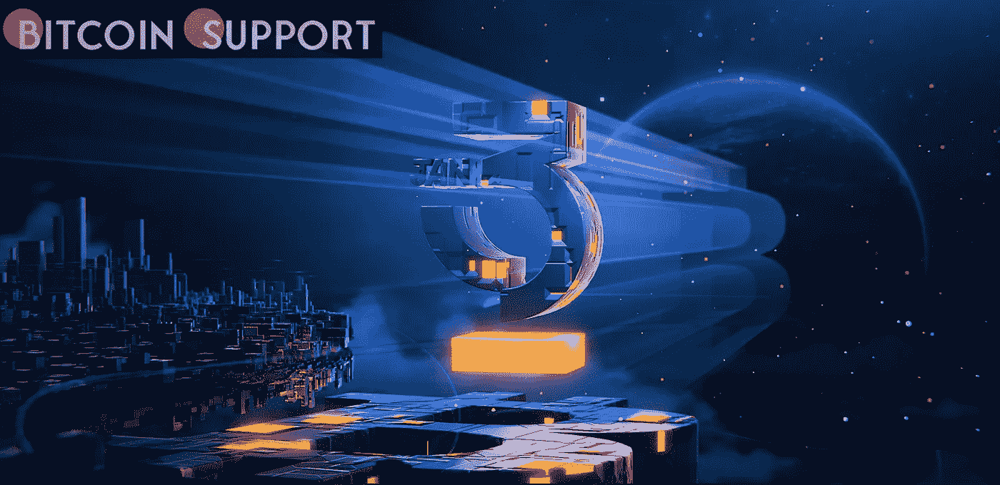

# Samson Mow 成立的新公司 JAN3 正在协助萨尔瓦多比特币城市的发展

> 原文：<https://medium.com/coinmonks/jan3-a-new-company-founded-by-samson-mow-is-assisting-in-the-construction-of-bitcoin-city-in-el-cebd47fe2e1d?source=collection_archive---------29----------------------->

**Visit our website:-** [**https://bitcoinsupports.com/**](https://bitcoinsupports.com/)

比特币企业家 Samson Mow 创办了一家名为 JAN3 的新公司，据称该公司以 1 亿美元的价值筹集了 2100 万美元的资金。周四，Blockstream 的前首席战略官、Pixelmatic 的创始人 Samson Mow 宣布推出 JAN3，这是一家致力于增加比特币采用率的新公司。据这位华裔加拿大比特币企业家称，JAN3 已经签署了一份谅解备忘录，以帮助萨尔瓦多发展数字基础设施。

**“这是一份广泛的谅解备忘录，声明“我们将合作为国家和比特币城市建设数字基础设施。据 Mow 称，JAN3 做出与萨尔瓦多合作的决定很容易“我刚刚成立了自己的公司，问他们是否愿意合作，他们说愿意。Mow 和他的新公司将与萨尔瓦多总统 Nayib Bukele 以及该国政府合作，帮助建设比特币城市，该项目据称将利用邻近火山的地热能为比特币采矿和城市基础设施提供动力。根据 JAN3 新推出的 Twitter 账户，该账户拥有 3300 名粉丝，并且正在迅速增加，该公司以 1 亿美元的估值筹集了 2100 万美元的资本。亚特兰大数字货币基金(Atlanta Digital Currency Fund)首席信息官阿利斯泰尔·米尔恩(Alistair Milne)、加密采矿业务 F2Pool 的联合创始人王春以及由著名比特币大牛马克斯·凯瑟(Max Keiser)和他的妻子斯泰西·赫伯特(Stacy Herbert)创建的新投资基金 El Zonte Capital 领投了这轮融资。

此前，Mow 在比特币 2022 大会上宣布，另外两个司法管辖区——加勒比海 Roatán 岛和葡萄牙自治省马德拉岛——将接受比特币作为合法现金。Mow 也推荐了墨西哥，尽管这个国家还在讨论这个提议。

“Jan 3”这个名字是向比特币的假名创始人中本聪致敬，他于 2009 年 1 月 3 日开采了第一个区块——俗称“创世纪区块”。该公司的第一条推文毫不隐晦地引用了《纽约时报》的今日头条，用了这个名字。

**访问我们的网站:-**[**https://bitcoinsupports.com/**](https://bitcoinsupports.com/)

**免责声明:以上为作者观点，不应视为投资建议。读者应该自己做研究。****

> 加入 Coinmonks [电报频道](https://t.me/coincodecap)和 [Youtube 频道](https://www.youtube.com/c/coinmonks/videos)了解加密交易和投资

# 另外，阅读

*   [隐翅虫替代品](/coinmonks/cryptohopper-alternatives-d67287b16d27) | [HitBTC 审查](/coinmonks/hitbtc-review-c5143c5d53c2)
*   [CBET 评论](https://coincodecap.com/cbet-casino-review) | [库科恩 vs 比特币基地](https://coincodecap.com/kucoin-vs-coinbase)
*   [Fold App 审核](https://coincodecap.com/fold-app-review) | [Kucoin 交易机器人](/coinmonks/kucoin-trading-bot-automate-your-trades-8cf0ca2138e0) | [Probit 审核](https://coincodecap.com/probit-review)
*   [如何匿名购买比特币](https://coincodecap.com/buy-bitcoin-anonymously) | [比特币现金钱包](https://coincodecap.com/bitcoin-cash-wallets)
*   [币安 vs FTX](https://coincodecap.com/binance-vs-ftx) | [最佳(SOL)索拉纳钱包](https://coincodecap.com/solana-wallets)
*   [比诺莫评论](https://coincodecap.com/binomo-review) | [斯多葛派 vs 3Commas vs TradeSanta](https://coincodecap.com/stoic-vs-3commas-vs-tradesanta)