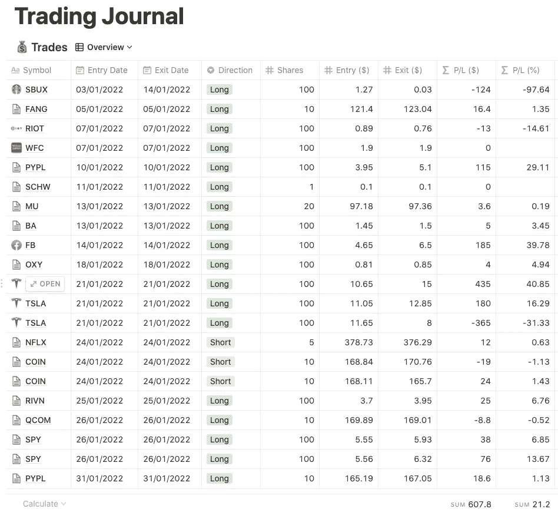
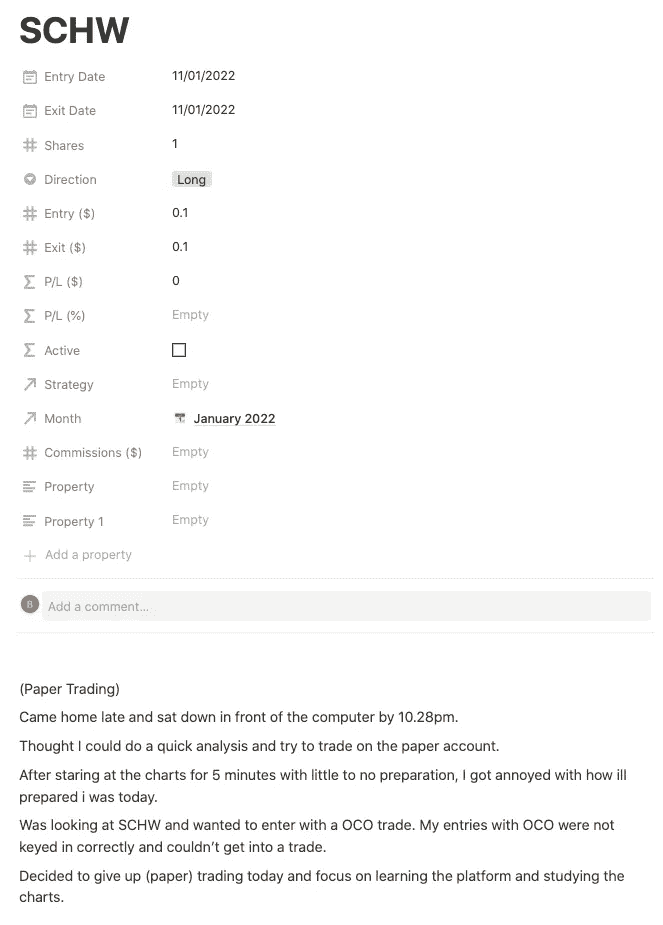

# 2022 年 1 月初学日交易者最好的老师:盘前准备

> 原文：<https://medium.com/coinmonks/january-2022-beginner-day-traders-best-teacher-pre-market-preparation-7083684e8d9f?source=collection_archive---------39----------------------->

我作为新手日交易者积极交易已经超过五周了。我在这里分享一份关于我在过去一个月遇到的活动和经历的报告。

**了解自己的熟练程度** 作为一名*初学日内交易者*的意思是我最近比以前更积极地开始交易。

我接触投资领域始于三年前。我的交易经验很快就来了，在过去的两年里，我成了一个不太活跃的交易者。更准确地说，我们可以称之为“摇摆交易者”——在卖出头寸获利或亏损之前，在 1 到 12 个月内持有每个头寸。这些经历给了我足够的交易知识，也让我学会了日内交易。

如果你读过我的第一篇[文章](/@bethmusings/learning-to-trade-stocks-for-a-second-income-as-a-beginner-606a8738eb68)，我 2022 年的计划是学习如何做好交易，这是我一月份的反思。

**根据我的风险水平确定我的头寸规模** 我所有的头寸规模都基于 2500 美元的账户规模。

这意味着，如果我进行股票交易，我会调整我的头寸，使我每次交易的资金不超过 2500 澳元。如果股票在接下来的几分钟内下跌几美元，我对损失的金额感到满意。

另一方面，如果我是**交易期权**，这是一种高杠杆产品，因此风险更大，我的规则是每个头寸规模不超过我账户 2500 美元的 15%。每笔交易的价格从 100 美元到 300 美元不等，这取决于我对交易的信心。每笔期权交易的最大损失是合约价格，也就是我建仓时花的 100 到 300 美元。

我通常一次只做一笔交易，这意味着我会在开始新的交易前平仓。

**2022 年 1 月报告单** 我在 1 月份总共 20 个交易日中活跃了 13 天。一些缺席的日子是盯着图表度过的，没有进行任何交易，因为我找不到好的设置进入。其他的只是因为我不在座位上。

Overview of my trading journal in January

在这 13 天里，我总共做了 21 笔交易。其中两个是现金交易，其余的是票据交易。仅在一月份，我的总损益就为 607 美元。

然而，这些利润并不真实。

事实是，我的两笔现金交易中有两笔亏损了 489 美元。你可以在[这里](/@bethmusings/my-first-trade-of-the-year-failed-terribly-even-with-a-plan-and-this-is-why-72720bc47e42)和[这里](/@bethmusings/making-money-on-paper-made-me-confident-so-much-that-i-lost-real-cash-ffc4bde3dc78)详细阅读这两笔交易。

**我对 1 月份表现的反思** 我明白了，做好准备在很多层面上对日内交易有着巨大的影响。

*   帮助建立对你的贸易计划的信心
*   让你在开市前有正确的交易心态
*   总的来说让你脚踏实地

事实上，我清楚地记得我的详细交易日志，我在开市后五分钟内就很恼火，因为我没有准备好。

下班回家晚(生活在 GMT+8；交易时间从晚上 10.30 开始)，在晚上 10.28 到达我的办公桌，认为我可以在我的纸上账户交易之前做一个快速分析。我不耐烦了，想交易。我找到了一个很好的设置，并试图插入一个条件条目，但我非常慌张，把它搞砸了。

最后，我承认我今天不会用这种心态学习任何东西，尽管这只是纸上交易。

当我思考这个问题时，我相信我已经理解了成为一个好的交易者需要充分的准备和坚定的信念，知道你的技术分析支持你的交易计划。[拍拍自己的背]

Journal of the day where I wasn’t prepared for day trading

**我该如何改进？了解我现在所知道的，我的目标是为我未来的交易日做好准备。**

也就是说，如果我不准时，没有时间做准备分析，我会把一天换成对我的交易教育更有意义的事情。比如盯着图表，阅读新闻，学习交易的不同方面，而不是试图进入交易。