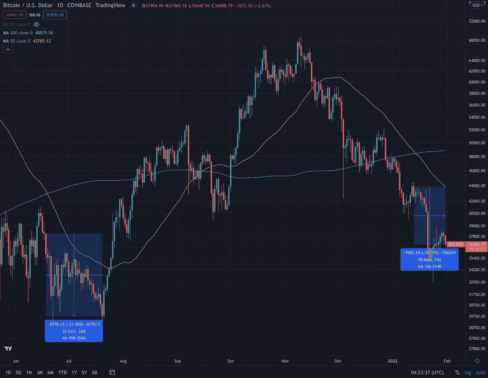
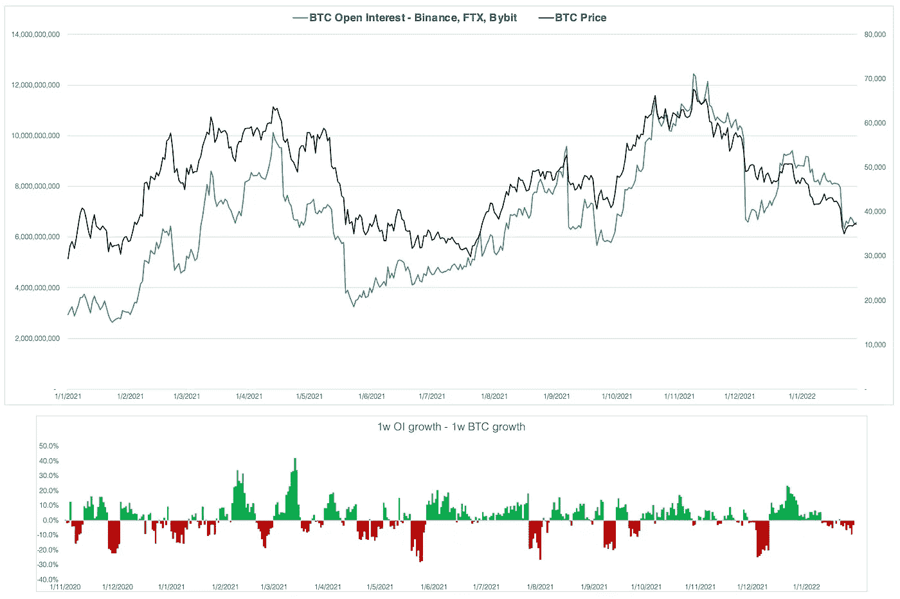
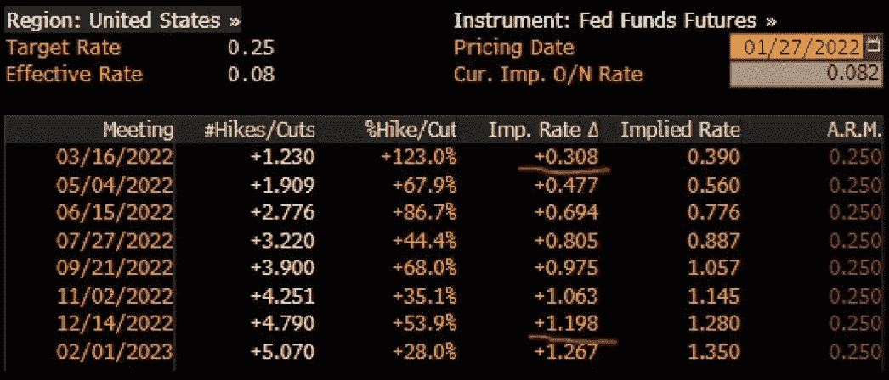
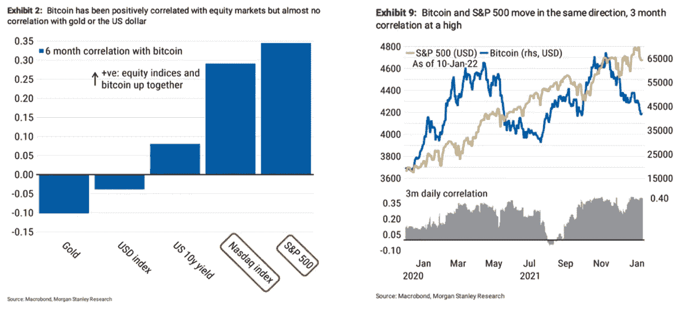

# 一月概览

> 原文：<https://medium.com/coinmonks/january-overview-93142b067074?source=collection_archive---------16----------------------->

## *数字资产世界每月简报*

*   **一月回顾**
*   **宏观观点:美联储通胀策略**
*   **监管机构** *-哈萨克斯坦比特币采矿停工
    -监管机构更多消息*
*   **企业** *——贝宝证实其计划推出稳定币
    ——Animoca Brands 目前估值 55 亿美元
    ——谷歌正在扩大其对加密的曝光
    ——进一步阅读*
*   **金融机构** *——比特币基地在美国推出加密衍生品
    ——进一步阅读*

# 一月回顾

比特币连续第三个月收于红色区域。本月，最大的加密货币下跌了 20%，其价格从 1 月 2 日的 47.9 千美元到 1 月 24 日的 32.9 千美元不等。总体而言，比特币较去年 11 月创下的 69，000 美元的历史高点下跌了 45%以上。

这个月，我们目睹了 BTC 价格图表上的死亡交叉形成，加上宏观经济的逆风，为一月份的大抛售埋下了伏笔。上一次我们目睹死亡交叉模式是在 2021 年 6 月。当时，抛售和随后的整合持续了 32 天，市场才转向。今天，我们进入了死亡交叉的第 18 天，至今没有趋势反转的迹象。

Source: Tradingview

今年 1 月，瑞士联邦理工学院的股价与 BTC 持平，当月下跌 30%，较 11 月的 ATH 下跌近 50%。1 月份，以太坊的价格从 1 月 2 日的 3.9K 美元到 1 月 24 日的 2.2K 美元不等。

在长时间的未平仓累积后(12 月 11 日-1 月 9 日)，杠杆交易者现在逐渐平仓(见左图)。基差和融资利率处于去年以来的最低水平，为加密领域的套利提供了很小的空间。

继传统市场的抛售之后，1 月 21 日至 22 日期间，超过 5 亿美元的比特币多头头寸被清算，拖累 BTC 在两天内下跌近 15%。

*Source: JKL Research | app.intotheblock.com*

# 宏观观点:美联储的通胀策略

在将其资产负债表增加到 9 万亿美元以刺激大流行后的经济复苏后，美联储最终决定减少金融资产的购买和积累。1 月 5 日公布的美联储 FOMC 会议记录显示，成员们一致同意缩减资产负债表，提高利率以减缓通货膨胀。从历史上看，比特币一直被投资者视为对冲价格上涨的特权，特别是自美联储开始印刷数万亿美元以拯救经济以来。美联储抗击通胀的努力给比特币带来了抛售压力，1 月 24 日比特币一度跌至 32.9 美元的低点。

导致股票市场和加密市场加速抛售的原因是，美联储 3 月份会议的定价超过 25 个基点。这意味着美联储可能提前启动加息周期，并加快资产负债表缩减:这是市场风险情绪的负面消息，并对货币供应产生了实质性影响。

1 月 26 日(美国东部时间)所有人都在再次关注美联储，等待鲍威尔关于加息的消息。继 FOMC 之后，德意志银行预计今年将加息 5 次:在 3 月、5 月和 6 月的会议上加息 3 次，在 2022 年下半年加息 2 次。他们对 2023 年三次加息的预期保持不变，最终利率略高于 2%。

Source: Bloomber

总的来说，市场似乎已经进入了一个完整的加息周期，这将推高实际利率。假设通胀在中期降至 1.75%(美联储的目标区间是通胀低于 2%)，如果 2%是最终利率，这将意味着 25 个基点的正政策实际收益率。

传统金融也受到了这一消息的打击，标准普尔 500(越来越依赖美联储的 QE 政策)在 1 月份下跌了 7%，其 ATH 下跌了近 10%。鉴于比特币和股票市场之间的相关性日益增强，这是比特币 1 月份令人生畏的表现背后的另一个原因。

Source: Morgan Stanley Research

# 监管者

## 哈萨克斯坦比特币采矿因抗议而关闭

燃料价格的飙升引发了哈萨克斯坦的大规模抗议。政府不得不关闭互联网连接，从而完全停止了采矿作业。哈萨克斯坦是世界第二大矿业国家，控制着 20%的比特币矿业网络散列率。此次事件后，比特币杂凑率下降了 13.4%，这意味着所有外国矿工都有更多机会赢得区块并获得奖励。然而，它引起了对网络散列率集中化的关注，并提醒采矿界注意东道国政治稳定的重要性。

## 有关监管机构的更多信息:

> 据报道，在过去的三年里，禁止加密的国家翻了一番
> 
> 证人在国会环境听证会上辩论秘密采矿的效率([阅读更多](https://www.coindesk.com/policy/2022/01/21/witnesses-debate-crypto-minings-efficiency-in-congressional-hearing-on-environment/)
> 
> 英国政府将加强对误导性加密货币广告的监管([阅读更多](https://www.gov.uk/government/news/government-to-strengthen-rules-on-misleading-cryptocurrency-adverts))
> 
> 欧盟市场监管机构呼吁禁止工作证明加密挖掘([阅读更多](https://www.coindesk.com/policy/2022/01/19/eu-markets-regulator-calls-for-ban-on-proof-of-work-crypto-mining-report/))
> 
> 俄罗斯提议禁止使用和开采加密货币([阅读更多](https://www.reuters.com/business/finance/russian-cbank-proposes-banning-cryptocurrencies-crypto-mining-2022-01-20/?utm_medium=email&_hsmi=201561785&_hsenc=p2ANqtz-9aUVIgbAbb9ubXlYKU8HG-HpP0-qxM2UGBegUdl0FT7nsWufbWvY4ngNnG-Xcv6MwNazUL4cWYE98eJtJXtK8CDgpYtla1sCR2p7T1CXLMw24aGXU&utm_content=201561785&utm_source=hs_email)
> 
> 印度尼西亚伊斯兰组织发布反对使用密码的新法令([阅读更多](https://cointelegraph.com/news/indonesian-islamic-organization-issues-new-fatwa-against-crypto-use?utm_medium=email&_hsmi=201561785&_hsenc=p2ANqtz-89p1_poYJPaCLK8G4i3zHdyy9sTDFn5unmN5qHTmHu326qgOcxaKbhTWJgdVMJxF2RqOdvlO38nW47wFnVn4l_ipfj6ZNq-5yWw2zFj1hWafFizFA&utm_content=201561785&utm_source=hs_email)
> 
> Gensler 说，加密交易所将面临 SEC 的更多审查
> 
> 国际货币基金组织的研究证实，积极的监管采纳将极大地改善生态系统([阅读更多](https://www.imf.org/en/Publications/global-financial-stability-notes/Issues/2022/01/10/Cryptic-Connections-511776?utm_source=Zerocap+Newsletter&utm_campaign=4b7b3ca8be-EMAIL_CAMPAIGN_2021_12_06_09_03_COPY_01&utm_medium=email&utm_term=0_ed73fcb77b-4b7b3ca8be-364707970))
> 
> Tether (USDT)冻结了来自三个地址的 1 . 5 亿美元，据称是为了遵守美国执法要求([阅读更多](https://cointelegraph.com/news/tether-freezes-150-million-in-usdt?utm_source=Telegram&utm_source=Zerocap%20Newsletter&utm_medium=social&utm_medium=email&utm_campaign=4b7b3ca8be-EMAIL_CAMPAIGN_2021_12_06_09_03_COPY_01&utm_term=0_ed73fcb77b-4b7b3ca8be-364707970))
> 
> 巴基斯坦计划禁止加密；业内玩家称之为大错([阅读更多](https://economictimes.indiatimes.com/markets/cryptocurrency/pakistan-plans-crypto-ban-industry-players-call-it-big-mistake/articleshow/88893721.cms?utm_source=Zerocap+Newsletter&utm_campaign=4b7b3ca8be-EMAIL_CAMPAIGN_2021_12_06_09_03_COPY_01&utm_medium=email&utm_term=0_ed73fcb77b-4b7b3ca8be-364707970))
> 
> 杰克·多西宣布成立比特币法律辩护基金([阅读更多](https://cointelegraph.com/news/jack-dorsey-announces-bitcoin-legal-defense-fund?utm_source=Telegram&utm_medium=social))
> 
> 美联储的莱尔·布雷纳德邀请国会选择是否与中国的数字人民币竞争([阅读更多](https://cointelegraph.com/news/fed-s-lael-brainard-invites-congress-to-choose-whether-to-compete-with-china-s-digital-yuan?utm_source=Telegram&utm_source=Zerocap%20Newsletter&utm_medium=social&utm_medium=email&utm_campaign=4b7b3ca8be-EMAIL_CAMPAIGN_2021_12_06_09_03_COPY_01&utm_term=0_ed73fcb77b-4b7b3ca8be-364707970)
> 
> CBDC 钱包荣登中国移动应用商店排行榜榜首([阅读更多](https://cointelegraph.com/news/cbdc-wallet-tops-mobile-app-store-charts-in-china?utm_source=Telegram&utm_medium=social))
> 
> 据报道，巴西市长将把 1%的城市储备投资于比特币

# 企业

## PayPal 证实，它正计划推出稳定币

PayPal 与加密和区块链生态系统的整合正在缓慢但稳步地发展。

首先，9 月 PayPal 宣布发布一款专门用于数字支付服务的应用。然后，在 11 月的一次采访中，PayPal SVP 公司和区块链的总经理提到了 PayPal 对 stablecoins 的兴趣。他表示，在密码领域需要一种能够处理大量小额交易的稳定密码。他提出了许多关于这种稳定货币的问题，包括担心如果它得到央行的支持，政府会进行监控，或者与实物现金相比，需要互联网连接才能进行交易。他总结说，我们仍然处于发展和政策辩论过程的早期。然而，1 月初，他证实 PayPal 正在评估推出稳定币的可能性。他坚持认为，贝宝热衷于与监管机构密切合作。按收入计算，这家全球第三大数字支付公司肯定在等待一个更受监管的 stablecoin 生态系统，我们可能只会在更长的时间内见证 PayPal stable coin 的推出。

## Animoca Brands 现在的估值为 55 亿美元

香港风投在 10 月份融资 6500 万美元，本月融资 3.6 亿美元。在不到 3 个月的时间里，Animoca 的估值翻了 2.5 倍，从 22 亿美元增至 55 亿美元。最近几个月，Animoca 通过开发沙盒并投资 Axie Infinity 和 OpenSea，确立了自己在区块链数字娱乐领域的领导者地位。筹集的资金将用于促进新的投资，开发新产品和获得流行的知识产权。Animoca 最新的重大投资是与 BSC 合作开发的 2 亿美元区块链游戏项目。Animoca 最近还为“球迷控制的足球联盟”筹集了 4，000 万美元，并为建立在 Solana 基础上的 NFT 平台筹集了 800 万美元。Animoca 似乎没有放慢扩张的步伐，它正在成为游戏和 NFT 领域未来的巨头之一。

## 谷歌正在扩大其对加密的曝光

首先在 2021 年 4 月，谷歌支付部门“Google Pay”与加密交易所 Gemini 合作，允许使用菲亚特在 Google Pay 上购买加密货币。6 月晚些时候，该公司宣布了与比特币基地的新合作关系，允许用户使用比特币基地卡在 Google Pay 中进行支付。同样，谷歌在 10 月份与加密交易所 Bakkt 合作，允许他们的投资者通过 Google Pay 用加密货币支付商品和服务。最后，在 1 月 20 日，谷歌宣布聘请贝宝前 SVP 阿诺德·戈德堡(Arnold Goldberg)负责包括加密货币在内的谷歌支付解决方案的开发。根据谷歌商务总裁的说法:“加密是我们非常关注的东西[……]随着用户需求和商家需求的发展，我们将与它一起发展。”

我们目前正在见证加密领域的机构采用，谷歌并不是唯一加入这一运动的科技巨头。从长期来看，提供加密货币支付服务可能会推动谷歌和贝宝等公司将比特币加入其资产负债表，即使只是出于流动性目的。

## 更多关于企业的信息

> 英特尔将在即将到来的会议上推出比特币挖掘“Bonanza Mine”芯片([阅读更多信息](https://www.tomshardware.com/news/intel-to-unveil-bitcoin-mining-bonanza-mine-asic-at-chip-conference)
> 
> 埃隆·马斯克称特斯拉将接受 dogecoin 商品([阅读更多](https://www.reuters.com/technology/tesla-merchandise-buyable-using-dogecoin-musk-says-tweet-2022-01-14/?utm_source=Zerocap+Newsletter&utm_campaign=4b7b3ca8be-EMAIL_CAMPAIGN_2021_12_06_09_03_COPY_01&utm_medium=email&utm_term=0_ed73fcb77b-4b7b3ca8be-364707970)
> 
> 迪士尼为元宇宙主题公园申请专利([阅读更多](https://cointelegraph.com/news/disney-patents-technology-for-a-theme-park-metaverse?utm_source=Telegram&utm_medium=social))
> 
> Meta 为元宇宙计划从微软和苹果挖走员工
> 
> 根据 Visa 的调查，超过 24%的中小型企业计划接受加密支付([阅读更多](https://usa.visa.com/about-visa/newsroom/press-releases.releaseId.18711.html?utm_source=Zerocap+Newsletter&utm_campaign=4b7b3ca8be-EMAIL_CAMPAIGN_2021_12_06_09_03_COPY_01&utm_medium=email&utm_term=0_ed73fcb77b-4b7b3ca8be-364707970))
> 
> 苹果在元宇宙:我们看到了很大的潜力，正在投资

# 金融机构

## 比特币基地在美国推出加密衍生品

在 Crypto.com 和 FTX 分别收购衍生品平台 LedgerX 和 Nadex 之后，比特币基地收购了 FairX，为美国客户提供衍生品。FairX 是一个完全受美国监管的衍生品平台，在商品期货交易委员会注册。与此同时，比特币基地目前也在等待批准加入全国期货协会，以提高衍生品市场的安全性，保护投资者免受内在风险。尽管 FairX 还很年轻，但它与 TD Ameritrade 和 E*Trade 等顶级在线经纪商关系密切。

作为总部位于美国的公司，比特币基地正遭受着比其外国竞争对手更严格的限制和更高的税收。收购 FairX 是一项战略举措，旨在成为美国零售衍生品交易的主要人物，并扩大其客户群。

## 更多关于金融机构的信息

> 灰度比特币信托折扣创历史新低。密码交易公司坦陀罗(80 美元 AUM)进入清算阶段
> 
> Crypto.com 在遭受 3300 万美元黑客攻击后停止提款([阅读更多](http://link.com/)
> 
> 双子座收购交易技术平台 Omniex，推出双子座 Prime ( [阅读更多](https://www.gemini.com/blog/gemini-acquires-trading-technology-platform-omniex-launches-gemini-prime?utm_medium=email&_hsmi=201561785&_hsenc=p2ANqtz-9lwmRLLvO_ALz9vdmzf6CD76MtOumSC6yROyZVWPxGsN6RhGEBG911aTdiZHAOpns59vfm5gusD6ZuVSAxyGHaTlxApOgJeOu11znIGiQLsW-y3wo&utm_content=201561785&utm_source=hs_email))
> 
> 加密热情促使菲律宾银行推出交易([阅读更多](https://www.bloomberg.com/news/articles/2022-01-20/crypto-enthusiasm-prompts-philippine-bank-to-launch-trading?utm_medium=email&_hsmi=201561785&_hsenc=p2ANqtz-_CM1YVvMcc55ZqUehxGq9IzGr_bnPTr1GcnY1xzSWsdcHenrGzyh9-jlR2O4GqE5ZZMbaYIxGBiL7sI0ZEvEHlKg4we9pfJE2Y-XzpCV7u_hWb908&utm_content=201561785&utm_source=hs_email))
> 
> 加密基金的表现优于传统对冲基金和数字资产基准([阅读更多](https://www.theblockcrypto.com/post/129806/crypto-funds-outperformed-traditional-hedge-funds-and-digital-asset-benchmarks?utm_source=Zerocap%20Newsletter&utm_campaign=4b7b3ca8be-EMAIL_CAMPAIGN_2021_12_06_09_03_COPY_01&utm_medium=email&utm_term=0_ed73fcb77b-4b7b3ca8be-364707970))
> 
> 根据调查，79%的机构(108 美元。b . AUM)将值得信赖的数字资产托管人视为进入市场的最重要参数([阅读更多](https://www.bloomberg.com/opinion/articles/2022-01-06/nobody-wants-to-misplace-their-crypto))
> 
> Block 的现金应用程序终于集成了闪电网络([阅读更多](https://www.coindesk.com/business/2022/01/18/blocks-cash-app-is-finally-integrating-the-lightning-network/))

## **免责声明**

本材料的内容未经任何监管机构审查。建议您对本材料的内容保持谨慎。虽然本材料中包含的信息是从据信可靠的来源汇编的，但 JKL 不代表或保证本材料中包含的信息的准确性、完整性或可靠性。如果您对本材料的任何内容有任何疑问，您应该获得独立的专业意见。JKL 或其任何关联公司，或其任何或其各自的董事、高级职员、员工和代表都不会对因使用或依赖本材料中包含的任何信息而导致的任何直接、间接或后果性损失承担任何责任或义务。本材料不构成认购或购买任何金融产品的要约或邀请。其目的不是提供任何信贷或其他评估的基础，也不应被视为购买任何金融产品的建议。

> 加入 Coinmonks [电报频道](https://t.me/coincodecap)和 [Youtube 频道](https://www.youtube.com/c/coinmonks/videos)了解加密交易和投资

## 也阅读

 [## 杠杆代币[多头代币]终极指南

### 杠杆化令牌是具有杠杆化风险敞口的 ERC20 令牌，不考虑保证金、要求、管理…

medium.com](/coinmonks/leveraged-token-3f5257808b22)  [## 最佳加密交易所| 2022 年十大加密货币交易所| CoinCodeCap

### 哪一个是最好的加密交换？在本文中，我们将根据多种加密货币列出 10 大加密货币交易所

coincodecap.com](https://coincodecap.com/crypto-exchange)  [## 2022 年最佳加密交换平台| CoinCodeCap

### 随着时间的推移，我们大多数人将转向 dex 以获得更好的安全性和隐私。因此。在这里，我们将讨论…

coincodecap.com](https://coincodecap.com/best-swap-platforms)  [## 10 大最佳在线赌场|赢得并赢取免费 BTC 2022 | CoinCodeCap

### 接收、支付和赚取加密货币| |有各种各样的最佳在线赌场可供选择，有可能…

coincodecap.com](https://coincodecap.com/best-online-casinos)  [## 2021 年最佳加密借贷平台| 6 大比特币借贷平台

### 获得比特币和其他加密货币的最佳贷款利率

medium.com](/coinmonks/top-5-crypto-lending-platforms-in-2020-that-you-need-to-know-a1b675cec3fa)  [## 2021 年 6 大最佳硬件钱包|顶级加密硬件钱包[更新]

### 最好的加密货币硬件钱包是绝对必要的。我们将在 NGRAVE、Ledger Nano X 和…

medium.com](/coinmonks/the-best-cryptocurrency-hardware-wallets-of-2020-e28b1c124069)  [## 加密交易机器人——19 款最佳免费加密交易机器人

### 2022 年币安、比特币基地、库币和其他密码交易所的最佳密码交易机器人。四进制，位间隙…

medium.com](/coinmonks/crypto-trading-bot-c2ffce8acb2a)  [## 最佳 4 个加密交易信号电报通道

### 这是乏味的找到正确的加密交易信号提供商。因此，在本文中，我们将讨论最好的…

medium.com](/coinmonks/best-crypto-signals-telegram-5785cdbc4b2b)