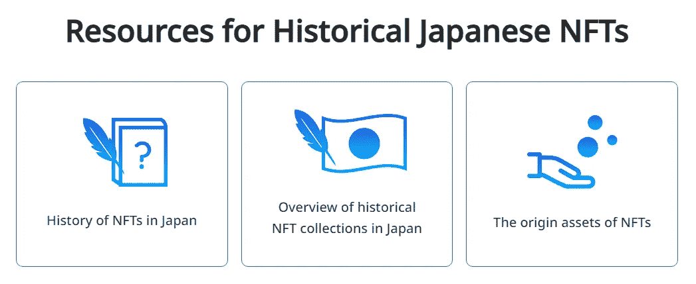

# 日本政府首相宣布对 WEB3、NFT 和元宇宙 UI 进行大规模投资——VR、AR、XR 世界，日本领先！

> 原文：<https://medium.com/coinmonks/japan-fsa-whitelisting-20-virtual-currencies-legalizing-trading-buy-and-sell-in-jpy-fiat-67050b9a959c?source=collection_archive---------15----------------------->

PM MAKES DEFINITIVE DIRECTION ON PATH TO ADOPTION AND PLAN TO LEAD META, WEB3 VERSE

*先前发布于 2022 年 3 月 5 日，更新于 2022 年 10 月 16 日*

*但是首先，一些关于日本区块链加密历史的背景故事*:

# 2017 年秋季，日本金融服务机构将 20 种虚拟货币列入“白名单”，这在无人察觉的情况下改变了整个世界

当监管由一个拥有最多美国国债、70%现金交易经济的国家批准时，波动性和机会是全球性的。

让我先说我的职责是推广 Devcoin 项目。然而，我觉得因为 Devcoin 是吸引我的东西，因为许多项目的生命轨迹甚至诞生都是从 Devcoin 的存在开始的，所以我必须写一些在 cryptoverse 中没有人真正说过的东西——至少用英语。

这篇文章与日本银行有关，日本金融服务机构批准了 20 种加密货币的“白名单”(由谷歌翻译成英语的 PDF 机器正式发布的文件——不客气)，以及迷因经济如何始于交易对手和令牌化的激励经济，让我们谈谈比特币激发了第一个将交易对手协议和创建令牌带到日本的人， 在 Mt. Gox 垮台后的几个月内，通过交易对手在东京正式成立了第一家比特币相关公司，由 Tibanne 运营，该公司 99%的股份由该交易所的所有者马克·卡佩斯(Mark Karpeles)持有，他是一名法国籍的日本居民。 但在此之前，了解一下日本独特的公开交易，比利时模式的日本银行刚刚宣布负利率，这是有史以来的第一次。这意味着什么，以及它是如何叠加的:

Japan’s central bank [interest rates](https://www.global-rates.com/en/interest-rates/central-banks/central-banks.aspx) now negative put it in line with the wealthiest countries in the world.

他们通常会说，负利率和较低利率是通胀的迹象，或者利率过高会让人们转向黄金等安全港，并抛售美国股票。但日本似乎不在乎，70%的现金经济和刚刚完成 32 年多的从股票交易所指数下跌中复苏，日经指数已经从他们所谓的 80 年代视频游戏泡沫破裂中一路攀升。从比特币的角度来看，这对我意味着什么？好吧，我宁愿让我在这篇文章的下一部分整理的 Koji Higashi 的文章帮助你了解一点我们需要如何看待美国以外的情况，更多地了解谁持有美国国债，以了解我们如何能够互惠互利。就像比特币与互联网向全数字和电子连接的网状网络的演变一样，货币与传统银行业提供的规避令牌密切相关。数学系统中的延迟减少和带宽加上干净高效的代码可以防止盗窃、欺诈或更糟的情况——世界金融系统的崩溃。也就是说，我们和日本之间唯一的事情是我们的国际日期变更线，以及当极移发生时，我们对那里发生了多少事情的无知。那会是什么转变呢？让我们说一个世界范围的教训和对过去的价值和事件后果的看法的改变，这将使未来少很多困惑，多很多真实。

另外*如果微软*的任何人正在阅读这篇文章，我要向我发现的第一家注册域名并为一个网站颁发证书的公司致敬，该网站为某个混合了“ICO”和 burned 的 meme-currency 层运行网络钱包，至少是从 Counterparty.io 的网络钱包扩展而来。微软公司是我见到的第一家拥有网络钱包证书的公司。请记住，雷德蒙华盛顿离西雅图很近，西雅图有一个巨大的日本社区和日本公司办公室。看到他们加入“党”而不在这里宣布并不令人震惊，他们为什么要这样做？DYOR。

Google PDF Machine Translation from translate.google.com from Japanese to English, source here: [https://web.archive.org/web/20171010194912/http://www.fsa.go.jp/menkyo/menkyoj/kasoutuka.pdf](https://web.archive.org/web/20171010194912/http://www.fsa.go.jp/menkyo/menkyoj/kasoutuka.pdf)

PEPECASH 和 XCP 被日本金融服务管理局视为一流的虚拟货币——为了找出这一点都不荒谬的原因，希望我的介绍和我链接的文章是由 [Koji Higashi](https://medium.com/u/6dbf5c7f63f3?source=post_page-----67050b9a959c--------------------------------) 完成的，他的创作经历了这一旅程并延伸到其他创作——难怪 4 年后“西方”世界的人们正在“重新发现”这些创作的价值。一个更大的意外是，$MONA 也在这个列表中，还有许多其他日本本地加密资产，通过扩展，MONAPARTY 资产都符合这里的要求，因为它们是基于交易对手和 MonaCoin 的 Monaparty 资产协议创建的。

## 日本在自己的日本本土连锁店 Mona coin(2014 年 1 月 1 日)上做得比 EVM IPFS 的 WEB3 更好

[Awesome IPFS](https://awesome.ipfs.io/)

最令人兴奋的部分是最近发生的，今年 3 月，他的政府民选官员向总理推荐了一份 30 页的 pro NFT、pro Web3 和元宇宙投资文件(Monaparty 已经在 Web3 上使用 IPFS，其特色服务是在 awesome.ipfs.io 的首页使用 IPFS，并在本地客户端浏览器上使用数字签名来签署 Web 3 的 Dapps 上的社交媒体登录交易，如讨论板，登录内置社区市场和应用程序的艺术和收藏家社交团体。现在整个首相的行政部门已经宣布日本正在购买 Web3，等等。事实是他们已经在 Web3 级别上有了社区运行的日本本地项目…)

> 该国一直在稳步推动对数字技术的投资，包括通过[对拥抱数字未来的公司实施税收激励](https://www2.deloitte.com/jp/en/pages/risk/solutions/srr/dx-investment-promotion-taxsystem.html)。岸田文雄在对日本国会的演讲中表示，日本将继续专注于“支持数字技术的社会实施”，并将“推动扩大利用元宇宙和 NFTs 的 Web3 服务的使用”

Many Japanese NFT artists made duplicate works on EN Counterparty and JP Monaparty which drew big attention to both chains and played into the factor that led PM to laud plan Oct 4

> 日本联邦政府进军网络 3 是顺应了一种趋势，即官员们正大步在日本实施[网络 3 相关服务](https://www.coindesk.com/policy/2022/09/19/politicians-not-the-usual-bureaucrats-take-the-reins-on-web3-in-japan/)——而不是遵循政策必须经常经过的典型官僚路线。岸田文雄政府最近在 METI 经济产业省下设立了一个 Web3 政策办公室，致力于为该国在区块链的逐步扩张制定政策。

更新:2022 年 10 月 4 日文章你可以发现，首相正式同意日本成为 Web3、元宇宙和 NFTs 的中心和投资者……本文还提供了日本政治代表支持的 3 月份“NFT 白皮书”的英文链接:

[日本投资 msn.com 元宇宙和 NFT 扩张](https://www.msn.com/en-us/money/other/japan-to-invest-in-metaverse-and-nft-expansion/ar-AA12BhkZ)

> 4 月，由岸田文雄的自民党发起并由政治家盐崎昭久领导的一个工作组发布了一份“ [NFT 白皮书](https://www.taira-m.jp/Japan%27s%20NFT%20Whitepaper_E_050122.pdf)，称 Web3 为“数字经济的新前沿”，并概述了推进 Web3 国家战略的计划。

[日本 NFT 白皮书 _E_050122.pdf (taira-m.jp)](https://www.taira-m.jp/Japan%27s%20NFT%20Whitepaper_E_050122.pdf)

日本在文化和政治上是这种新的西方英语世界热潮的源头。它也远未发挥出最大的经济潜力。这就是用每个人都可以创造价值和地方经济的东西来扩展比特币的美妙之处。钱就应该这样。创新就是这样包容的。这就是整个世界如何从其全部可用的人才库中获得最好的。

现在你知道了。第一届政府批准了虚拟货币的交换，贸易，购买，出售，与菲亚特(日元)和菲亚特(日元)。Tech Bureau，Co. Ltd .是 Zaif.jp 交易所“Zaif”的母公司，该交易所为其白名单交易所创建了自己的交易对手令牌。关于历史，我推荐阅读 IndieSquare Ltd .(东京日本公司)联合创始人的文章:

 [## IndieSquare 与技术局合作，推出“Zaif”移动钱包

### IndieSquare 宣布与 Tech Bureau 建立新的合作关系，Tech Bureau 是日本流行的加密货币背后的公司…

blog.indiesquare.me](https://blog.indiesquare.me/indiesquare-partners-with-tech-bureau-delivers-zaif-mobile-wallet-5c3a21dba185)  [## 我对日本的加密货币监管大错特错

### 加密货币社区中的许多人可能已经注意到许多积极的消息来自…

medium.com](/@coin_and_peace/i-was-so-wrong-about-the-cryptocurrency-regulation-in-japan-66ab17671095)  [## Rarepepe 是加密领域最具创新性的项目…说真的

### 如果你在加密领域，你一定听说过这个“可交易的稀有佩佩”的东西。用户生成了“佩佩…

medium.com](/@coin_and_peace/rarepepe-is-the-most-innovative-project-in-the-crypto-space-seriously-6d6b74749687)  [## 日本老式比特币 NFT 的历史:NFT 历史中几乎被遗忘的部分

### 创世咒语(SoG)和稀有佩佩最近被 NFT 社区“重新发现”,并且复活了…

medium.com](/@coin_and_peace/history-of-vintage-nfts-in-japan-the-almost-forgotten-part-of-nft-history-5f15ce50a828) 

在这种情况下，一点关于日本的西方金融和政府体系的背景是值得注意的。首先，日本在政府机构加密监管方面处于领先地位，2017 年被“日本金融服务监管局”列入第一份白名单，美国肯定会紧随其后，如果不是私下已经准备好发布官方文件，如 2017 年日本政府关于比特币相关“虚拟货币”的标志性法规 1 号翻译的 PDF I machine。自明治时代以来，美国和日本一直在金融上联系在一起，当时美国人进来训练日本军队，或者欧洲人在 1882 年模仿比利时中央银行(Belgian Central Bank)建立日本银行(Bank of Japan ),但那是另一回事了。尤其是在北美说英语的人，因为距离和语言障碍，对日本文化一无所知。日本人可能无意中意识不到美国文化的价值观，因为只有 2%的日本人能说并理解英语。他们对自己的文化很满意，有时我们的文化似乎在某种程度上交叉，对我们两人来说都是一种狂热。对于日本来说，他们对棒球的接受可能是文化接受另一种创造的最好例子，即使在今天也没有太多的世界影响力。在美国，我们都经历过口袋妖怪、龙珠 Z 和其他跨越太平洋的日本文化现象，这些文化现象在消费方式上有着疯狂的高采纳率，无论是收集还是在中学后观看卡通网络。在此之前，任天堂。你明白了。

这里有一些事关整个经济学，我不可能连贯地写出并解释。因此，我展示的这张图表可能会让你有理由开始访问更多的日本加密网站:

日本在美国投资很大，我们也在美国投资很大。日本是“远东”通往西方的最大门户——他们的文化在科技方面非常宽容和现代化。由于 FSA 虚拟货币白名单通常会警告加密货币不稳定，并且不是任何政府资产的法定货币，因此它通过以下声明将列表中的 20 种加密货币分类为:

电子货币在互联网上交易。

电具有真实的世界价值。我们不必走得更远。

我想解释这一点，因为 [IndieSquare](https://medium.com/u/9129b94fe4ef?source=post_page-----67050b9a959c--------------------------------) 是一个移动应用程序和网站，也是一家总部位于日本的公司， [Koji Higashi](https://medium.com/u/6dbf5c7f63f3?source=post_page-----67050b9a959c--------------------------------) 与交易对手共同创建了运行应用程序所需的令牌，通过应用程序本身交换和创建令牌(一些罕见的 Pepe 的 json 文件仍然在我的 FreeWallet 桌面应用程序中显示 indiesquare URL，然后显示元数据的附加信息，这些信息将艺术和描述链接到当前 xchain.com 资产页面，以获得交易对手令牌)。一位非常富有的交易对手和稀有的 Pepe collection 投资者和交易员在 twitter 上提到，IndieSquare.me 应用程序是他成为交易对手财富千万富翁的起点:

Screen grab March 5, 2022 by @murstrato (me)

机遇并不总是表面的，或者用英语来说。我的建议？像我在这里做的那样，用工具找到你的路。如果你相信像 buddhaAF 在 2016 年所做的那样，通过使用 [IndieSquare](https://medium.com/u/9129b94fe4ef?source=post_page-----67050b9a959c--------------------------------) 来尝试冒险——当时 myrarepepe.com 推荐购买 XCP，这是第一个由 WordPress 支持的博客网站，并将向公众宣布将稀有的佩佩加入收藏。该网站已将其菜单扩展到 1774 张卡片和教程/历史目录，以及什么是 PepeCash？在[rarepepedirectory.com](https://rarepepedirectory.com)的页面。

如果你想阅读关于日本银行的推文，以及为什么它会模仿贝利根中央银行，结果使日本银行成为四个公开交易股票的中央银行之一。雅虎上的 T 金融，通过东京证券交易所进行场外交易)——其他三个比利时(欧盟，欧洲央行的所在地)，瑞士(以太坊基金会的所在地)，和希腊(2008 年世界金融危机/希腊债务危机的所在地——被欧元拯救)。

还是认为我的日本央行兴趣无关紧要？我如何能够通过使用页面翻译工具收集 Monaparty 资产的信息，甚至 Twitter 可以选择翻译我在 card.mona.jp 购买的卡的 Monacard twitter 集成帐户的推文，并在我的 MonaCoin 钱包地址中收集作为令牌化资产的信息，并可以在我的 MPurse MONA/XMP + Monaparty 令牌 chrome 扩展钱包中查看，甚至可以通过徽章 Vault 经由徽章. finance 发送到 OpenSea.io？

我的意思是他们的央行有一个 [**英文 twitter 账户**](https://twitter.com/Bank_of_Japan_e) (是的，他们也有一个日本账户，很明显)。你知道我们正通过更好、更准确的交流，在与金钱和技术同样有价值的事物上建立联系吗？

 [## JavaScript 不可用。

### 编辑描述

twitter.com](https://twitter.com/Bank_of_Japan_e) 

[注意:Twitter 链接不会呈现，这是可疑的，因为几乎所有其他链接都会在媒体上呈现——欢迎来到分裂网，我的名字是墨菲斯]

2008 年 10 月 31 日，当 Satoshi 向邮件列表上的特定群体发布白皮书时，他使用了一个以前发布的参考资料系统，以一种前所未有的方式将这些参考资料捆绑到一个系统中。他与 Hal Finney(从列表中)一起完成了第一个众所周知的实现，然后在他 2009 年 2 月 11 日在 P2Pfoundation.net 上的帖子中发布了第一个公共软件客户端。在两件事上，我们必须开诚布公。时间带来了我们从未想过的进步，通过使用那些先进的技术工具来解决某人或某个团体创造的系统中的问题，以一种人们可以获得权力和保护的方式——就像比特币解决拜占庭将军的问题一样。第二件也是最后一件事是，我们必须接受这样一个事实，即比特币最初是一个没有价值、未经测试的信息软件，它保存分布式记录，以验证发送的信息。我们需要认识到扩展比特币，而不仅仅是采用集体奖励创造的比特币或 BTC 作为货币才是最终的解决方案和用例。在这方面，对应方的采用产生了受益效果。随着技术的发展，协议也会发展。由比特币担保。

## 如果你喜欢这份看涨报告，我恳求你捐款！

交易对手(XCP)**1 fmqgvthcqsdrrqpfn 2 xtbmtuvxzn 4 scps<<<**

**莫纳科因**(莫娜)>>>mnozz 13 ejtgoz 7 Sr 6 mem 5 q 5 ynpgg 7 GW IAA

*感谢 Mona 社区允许像我这样的美国人进入你们令人惊叹的社区，收集令人惊叹的艺术作品、应用程序、技术、商业和社交媒体！！！*

> 交易新手？试试[加密交易机器人](/coinmonks/crypto-trading-bot-c2ffce8acb2a)或者[复制交易](/coinmonks/top-10-crypto-copy-trading-platforms-for-beginners-d0c37c7d698c)