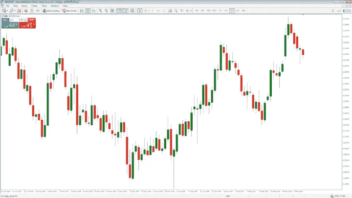
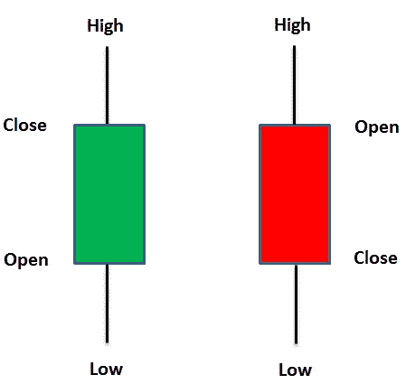
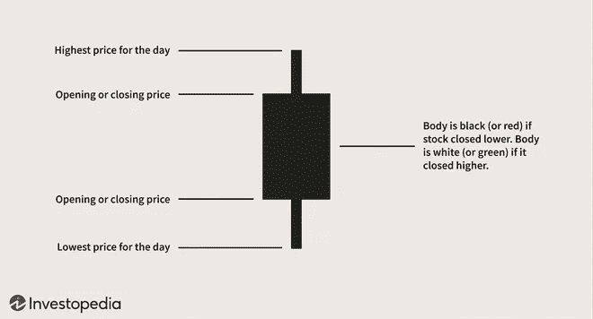
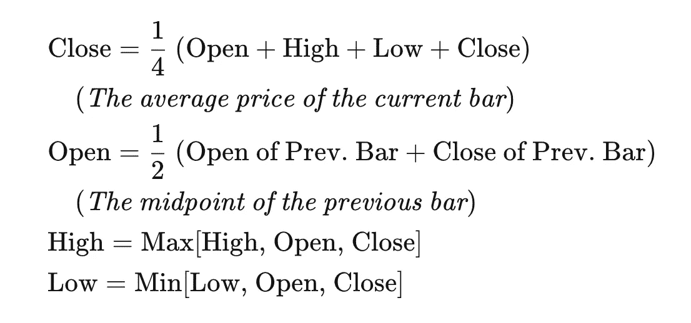
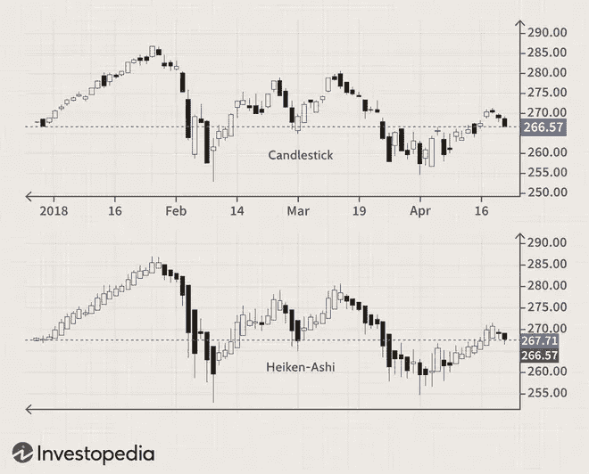
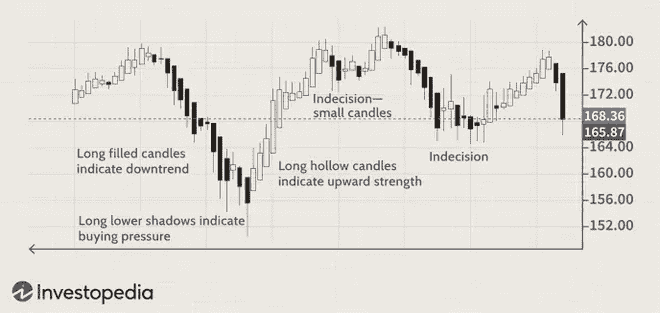

# 加密的日本烛台

> 原文：<https://medium.com/coinmonks/japanese-candlesticks-in-crypto-a1ae70333e8b?source=collection_archive---------57----------------------->

在我们的 YouTube 上观看视频的同时，享受这个流的资源！

YouTube:[https://youtu.be/59Qvki_c8fc](https://youtu.be/59Qvki_c8fc)

不和:【https://discord.gg/J73qhkj7kr】T2

推特:【https://twitter.com/CryptoverseDAO】

linktree:[https://linktr.ee/cryptoversedao](https://linktr.ee/cryptoversedao)

-

18 世纪，日本大米交易商首次使用蜡烛图。它们类似于 OHLC 棒线，事实上它们也给出特定时间段的开盘价、最高价、最低价和收盘价。然而，蜡烛图在开盘价和收盘价之间有一个方框。这也被称为烛台的“主体”。

许多交易者发现烛台图表在观看实时外汇图表时最具视觉吸引力。它们也很受欢迎，因为它们提供了世界各地的交易者使用的各种价格行为模式。

没有什么比演示交易更能让你做好准备了，演示交易是一种无风险的实时交易模式，可以让你对市场有更好的感觉。强烈建议你先潜入演示交易，然后才进入现场交易。结果会说明一切。

阅读本 OG 书:[http://dlinvt.com/pdf/01ucb/ultimatecandlestickbible.pdf](http://dlinvt.com/pdf/01ucb/ultimatecandlestickbible.pdf)

蜡烛图的开盘价-最低价-收盘价(OHLC)显示给定时期的开盘价、最高价、最低价和收盘价。它可以应用于任何时间范围。开盘价代表特定时间段蜡烛线的开盘价，而收盘价代表特定时间段蜡烛线的收盘价。

Heikin-Ashi:更好的烛台:

Heikin-Ashi，有时也拼写为 Heiken-Ashi，在日语中是“平均水平”的意思。在交易证券时，Heikin-Ashi 技术可以与蜡烛图结合使用，以预测现货市场趋势和未来价格。这有助于使蜡烛图更易读，趋势更容易分析。例如，交易者可以使用 Heikin-Ashi 图表来知道当趋势持续时什么时候留在交易中，但当趋势暂停或反转时退出。大多数利润都是在市场有趋势时产生的，所以正确预测趋势是必要的。

Heikin-Ashi 公式:

普通蜡烛图由一系列按时间序列分开的开盘-盘高-盘低-收盘(OHLC)蜡烛线组成。Heikin-Ashi 技术和标准的蜡烛图有一些共同的特征，但是使用了一个修正的收盘-开盘-盘高-盘低(COHL)公式:

这两种类型的图表之间有一些需要注意的差异，上面的图表展示了这些差异。Heikin-Ashi 有一个更平滑的外观，因为它本质上是一个运动的平均值。Heikin-Ashi 的蜡烛有一种趋势，在下跌趋势中保持红色，在上涨趋势中保持绿色，而普通的烛台会变换颜色，即使价格主要朝着一个方向移动。

价格尺度也值得注意。普通蜡烛图显示的当前价格也将是资产的当前价格，并且与蜡烛图的收盘价相匹配(如果棒线没有收盘，则为当前价格)。因为 Heikin-Ashi 采用的是平均值，蜡烛的当前价格可能与市场交易价格不符。因此，许多图表平台在 Y 轴上显示两个价格:一个用于计算 Heiken-Ashi，另一个用于资产的当前价格。

构造图表:

Heikin-Ashi 图的构造类似于常规的蜡烛图，只是计算每根棒线的公式不同，如上图所示。时间序列由用户定义，取决于所需的图表类型，如每天、每小时或五分钟间隔。向下的日子用实心蜡烛表示，而向上的日子用空心蜡烛表示。这些也可以通过图表平台着色，例如，上升的日子是白色或绿色，下降的日子是红色或黑色。

投入使用:

这些图表适用于任何市场。大多数图表平台都有 Heikin-Ashi 图表作为选项。

五个主要信号识别趋势和购买机会:

没有较低“阴影”的空心或绿色蜡烛表示强劲的上升趋势:让你的利润驰骋吧！
空心或绿色蜡烛表示上升趋势:你可能想增加多头仓位，退出空头仓位。
上下阴影包围的小蜡烛线表明趋势发生了变化:喜欢冒险的交易者可能会在这里买入或卖出，而其他人会在做多或做空之前等待确认。
实心或红色蜡烛线表示下跌趋势:你可能想增加你的空头头寸，退出多头头寸。没有更高阴影的实心或红色蜡烛线表示强烈的下跌趋势:保持做空，直到趋势发生变化。与传统烛台相比，这些信号可以更容易地定位趋势或交易机会。这些趋势不会经常被虚假信号打断，因此更容易被发现。

上面的图表例子显示了如何使用 Heikin-Ashi 图进行分析和交易决策。左边是长长的红色蜡烛，在下降的开始，下面的灯芯相当小。随着价格继续下跌，较低的灯芯变长，表明价格下跌，但随后又被推高。购买压力开始积聚。随后是强劲的上行走势。上涨势头强劲，除非有几根小蜡烛排成一排，两边都有阴影，否则不会给出反转的主要迹象。这说明优柔寡断。交易者可以着眼于大局，以帮助决定他们应该做多还是做空。

图表也可以用来在趋势开始后让交易者继续交易。通常最好是留在交易中，直到 Heikin-Ashi 蜡烛变色。颜色的变化并不总是意味着一个趋势的结束——它可能只是一个暂停。

> 加入 Coinmonks [电报频道](https://t.me/coincodecap)和 [Youtube 频道](https://www.youtube.com/c/coinmonks/videos)了解加密交易和投资

# 另外，阅读

*   [印度最佳 P2P 加密交易所](https://coincodecap.com/p2p-crypto-exchanges-in-india) | [柴犬钱包](https://coincodecap.com/baby-shiba-inu-wallets)
*   [八大加密附属计划](https://coincodecap.com/crypto-affiliate-programs) | [eToro vs 比特币基地](https://coincodecap.com/etoro-vs-coinbase)
*   [最佳以太坊钱包](https://coincodecap.com/best-ethereum-wallets) | [电报上的加密货币机器人](https://coincodecap.com/telegram-crypto-bots)
*   [交易杠杆代币的最佳交易所](https://coincodecap.com/leveraged-token-exchanges)
*   [最佳加密分析或链上数据](https://coincodecap.com/blockchain-analytics) | [Bexplus 评论](https://coincodecap.com/bexplus-review)