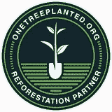

# 杰佛里·杜德·NFT 与一棵树合作种植，以恢复西非的竹林

> 原文：<https://medium.com/coinmonks/jeffrey-the-dude-nft-partners-with-one-tree-planted-to-restore-bamboo-forest-in-west-africa-a023aabeb34a?source=collection_archive---------48----------------------->

我们很高兴地宣布，我们与**one treeped**成功合作，将在未来几个月内种植 5000 多棵树(即每铸造一棵杰弗里·NFT，就会在加纳的某个地方种植一棵树)。这得益于品牌对可持续发展的承诺，减轻气候变化造成的环境影响，回报环境，为更绿色的明天做出贡献。

除了减少气候变化的有害影响，树木对我们地球的健康也至关重要，因为它们有助于清洁我们呼吸的空气，过滤我们饮用的水，并为世界上 80%以上的生物多样性提供栖息地。重新造林一直被科学家认为是解决气候危机的最佳方法之一。

树木还提供巨大的社会影响，为超过 16 亿人提供就业机会，增强不发达国家妇女的权能，支持受到环境破坏的社区。

我们的合作伙伴关系也将解决一些对 NFTs 的主要批评，因为尽管区块链公司已经提出了侧链和其他减少或抵消能源使用的方法，但仍有许多关于能源消耗的猜测。

**关于杰弗瑞这个纨绔子弟**

杰弗里是一个**去中心化品牌**，其所有权由以太坊区块链上的 5432 个杰弗里 NFT 中的每一个来代表。杰佛里·NFT 的每位车主也是整个品牌的一部分。

我们的使命是创建一个由社会和商业革命的愿望所激励的社区。我们希望成为第一批去中心化的公司之一，成为一个全球品牌，让人们认识到包容、公平、尊重和社会责任等价值观。

**关于一棵树的种植**

种植的一棵树是一个 501(c)(3)非盈利组织，成立于佛蒙特州的谢尔本。自成立以来，他们已经在世界各地种植了超过 4000 万棵树，他们与世界各地令人惊叹的重新造林组织合作，这些组织需要财政支持来帮助他们在地下种植更多的树。

请访问[www.onetreeplanted.org](https://onetreeplanted.org/)了解他们组织正在做的惊人工作的更多信息，以及如何进一步参与。

> 加入 Coinmonks [电报频道](https://t.me/coincodecap)和 [Youtube 频道](https://www.youtube.com/c/coinmonks/videos)了解加密交易和投资

# 另外，阅读

*   [从 WazirX 切换到 CoinDCX 的 5 个理由](https://coincodecap.com/reasons-to-switch-from-wazirx-to-coindcx)
*   [Unocoin 评论](https://coincodecap.com/unocoin-review) | [最佳加密赌注硬币](https://coincodecap.com/best-crypto-staking-coins)
*   [如何使用 MetaMask Wallet 获取 KCC 地址？](https://coincodecap.com/kcc-address-metamask)
*   [如何获得自己的。XYZ 领域？](https://coincodecap.com/xyz-domain)
*   [最佳加密交换平台](https://coincodecap.com/best-crypto-swap-platforms) | [最佳加密交易所](https://coincodecap.com/crypto-exchange)
*   [购买比特币印度](/coinmonks/buy-bitcoin-in-india-feb50ddfef94) | [Pionex 评论](/coinmonks/pionex-review-exchange-with-crypto-trading-bot-1e459d0191ea) | [加密交易机器人](/coinmonks/crypto-trading-bot-c2ffce8acb2a)