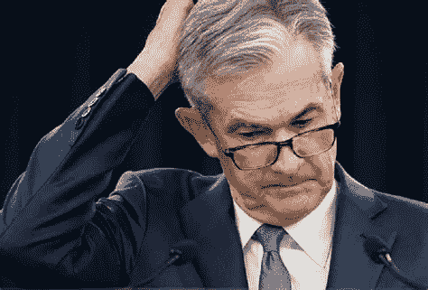

# 杰罗姆·鲍威尔的麻烦及其对加密的影响:通胀对冲还是“风险”资产？

> 原文：<https://medium.com/coinmonks/jerome-powells-troubles-and-what-it-spells-for-crypto-inflation-hedge-or-risk-on-asset-46f78e2b0405?source=collection_archive---------10----------------------->

## 加密市场更新 2.11

## 通货膨胀的困扰|市场更新|主要的加密新闻

# 杰罗姆·鲍威尔的烦恼

2 月 9 日星期三，通货膨胀率同比达到 7.5%，高于预期。