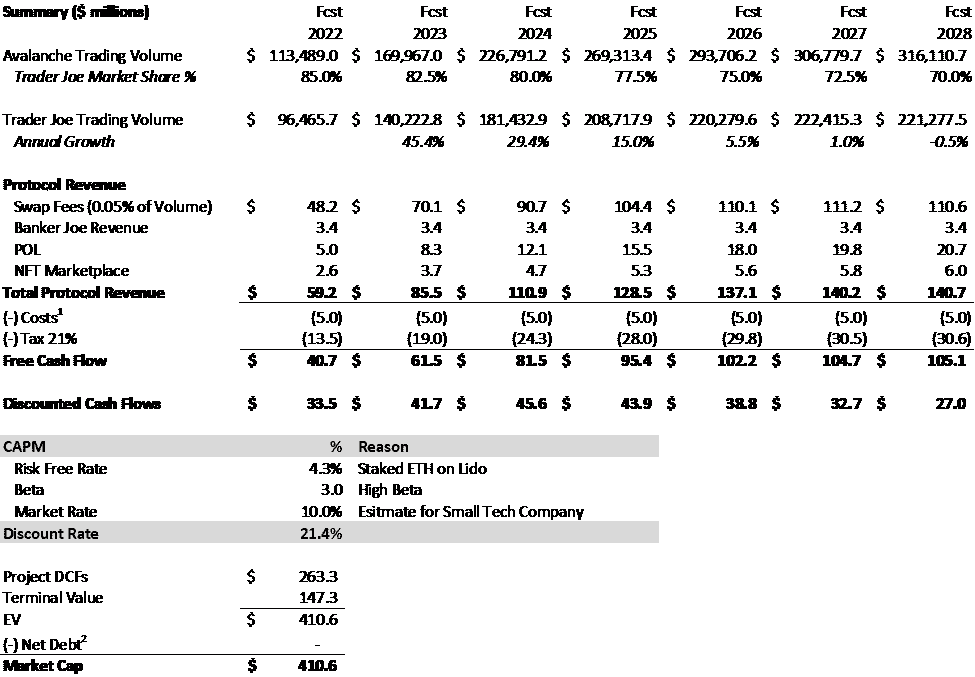
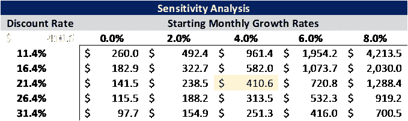
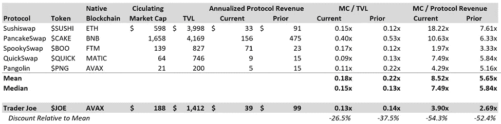
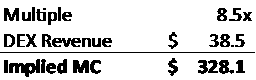
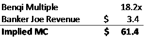
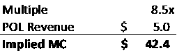
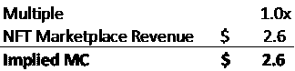
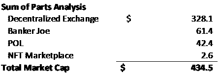
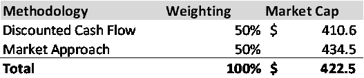

# $乔研究报告

> 原文：<https://medium.com/coinmonks/joe-research-report-d20c1feac6b0?source=collection_archive---------4----------------------->

## 2022 年 3 月 10 日

不是财务建议。
[https://twitter.com/MBApesNFT](https://twitter.com/MBApesNFT)

# 第一部分:总结

**执行摘要:** $JOE 是雪崩区块链上的乔氏去中心化金融平台的代币。该平台提供分散交易、借贷、赌注、收益农业，不久还将推出 NFT 市场。我认为$JOE 作为市场被低估了 **1。)没有充分认识到雪崩区块链的潜力；2.)低估了项目强大的护城河和创新团队；3.)高估了奖励排放下降时客户离开的风险。**通过我的分析，利用 DCF 和市场法的平均值，我得出市值为 4.225 亿美元，比当前价格上涨了 124.3%。

# 第 2 部分:概述

**公司概述:** Trader Joe 是雪崩区块链上的一站式 defi 平台。该公司通过三个不同的收入来源赚取协议收入。)掉期费用——每笔掉期的 0.05%转换为 USDC，并分配给利益相关者；2.)通过庄家乔平台放贷；3.)协议拥有的流动性——交易员 Joe 拥有其 JOE-AVAX 流动性池的 27.5%，并从其持有的股票中收取 0.25%的掉期费用。此外，该协议计划于 2022 年在 Q1 推出一个 NFT 市场，预计将获得该平台所有销售额的 3.0%。该项目由 Cryptofish 和 0xMurloc 创建，他们都是全栈和智能合同工程师，拥有在大型技术领域工作和在加密领域运营初创公司的经验。

**Tokenomics:** Trader Joe 通过提供模块化赌注(多种赌注选项)激励用户持有其 token $JOE。这意味着您可以在下面列出的三个池中的任何一个中下注$JOE 来赢取奖励:

1.Rocket Joe —促进公平市场价格发现的创新发射台。持有人可以下注$JOE 来赚取 rJoe。用户需要 rJoe 参与发布活动，并且 rJOE 不可转让。简而言之，如果你想在平台上投资新的、令人兴奋的项目(我听说$YETI 即将推出…)，那么你需要购买并持有$JOE。

2.sJOE——所有掉期费用收入都转换为稳定收益，然后分配给 sJOE 持有人。

3.veJOE —用户下注$JOE 以累积 veJOE 加班时间。你积累的 veJOE 越多，你在所选农场的$JOE 产量就越高。veJOE 还将提供未来的治理权力。

查看乔氏公司的网站了解更多信息—[https://docs.traderjoexyz.com/main/trader-joe/staking](https://docs.traderjoexyz.com/main/trader-joe/staking)

**分析:** Trader Joe 的模块化跑马圈地结构为其持有者提供了难以置信的长期价值和效用。

首先，Rocket Joe 是一个独特的发射台，通过其公平的市场价格发现机制来降低初始波动性。Avalanche 上的每个新项目都希望与 Trader Joe 合作，巩固 Trader Joe 作为 Avalanche 宇宙中心的地位。此外，您需要拥有并持有$JOE 来累积 rJOE。因此，要参与新的发布，用户必须获得并持有$JOE。

其次，sJOE 允许用户利用平台的收入。该协议的每一美元掉期费用都以稳定红利的形式直接支付给 sJOE 持有者——用户现在可以每天获得美元红利！这将消除$JOE rewards 的向下销售压力，并鼓励用户对雪崩生态系统进行再投资(促进更多的交换、活动等)。).事实上，大约 50%每天获得$USDC 奖励的用户通过购买更多的$JOE 将这些奖励返还给 sJOE。

最后，veJOE(将于本周推出)奖励最看涨的$JOE 主张长期持有。赌注选项允许用户提高选定农场的产量，并将对未来的治理提案提供投票权。此外，它提供了独特的经济效益，这将使整个社区受益——ve JOE 随着时间的推移而累积，不可转让，并且在基础$JOE 解散时会丢失。因此，veJOE 激励用户长期持有(钻石手)，并可能导致大包持有者之间的积累战争(即$JOE 战争)。类似的锁定结构包括 Curve / veCurve 和最近的 PTP / vePTP(鸭嘴兽金融公司)，随着用户争夺更多奖励和投票权，基础令牌的价格大幅上涨。事实上，新的企业已经开始利用创新的 tokenomic 设计。鼹鼠和 Vector 就是两个这样的例子(都是通过 Rocket Joe 发射的)，这两个协议都专注于收购和锁定 PTP / vePTP，以创建利润丰厚的 stablecoin 产量农场。在推出的第一周，鼹鼠和 Vector 联合收购并持有(forever！)超过流通 PTP 供应量的 15%。Trader Joe 拥有比 Platypus 更大的社区，是 Avalanche 社区的基石，并且完全能够利用 veJOE 的新 tokenomics 设计。已经有几个企业从 Trader Joe yield farming 中获利，准备在未来的$JOE Wars 中竞争，包括雪崩主食，如 Yield Yak 和 Penguin Finance。其他公司如鼹鼠和 Vector 也很可能会争夺$JOE，并在 Trader Joe 的平台上建立有利可图的业务。商业模式很简单，1。积累 veJOE 提高产量，2。为用户提供比他们目前赚取的更高的收益，以及 3 .从每个奖励中抽取一定比例。用户将获得更高的收益(甚至扣除费用)，协议将获得稳定的收入。双赢三赢！新的赌注选项将使整个社区受益，并为$JOE 带来新一轮的增长。

总体而言，Trader Joe 的创新模块化赌注方法通过 Rocket Joe launchpad 和投票权提供效用，通过 sJOE 提供直接收入分成，并通过 veJOE 激励长期持有人。

# 第三部分:投资研究

# 雪崩区块链的潜力

雪崩是一个分散的，可扩展的区块链解决方案，侧重于低成本，快速交易和环保。高效的区块链目前在总价值锁定(TVL)排名第四，在过去一个月增长的前 8 名中，仅是 2 个区块链中的 1 个，这是由本齐流动性投资和鸭嘴兽金融创新的稳定收益农场推动的。在接下来的几周，雪人金融也将推出它的平台。Yeti 将允许用户对他们的整个投资组合杠杆高达 11 倍，并将在区块链释放数十亿的额外资本。此外，雪崩也实现了创纪录的用户增长，从 2021 年 7 月的 20，194 个月活跃用户增长到 2022 年 1 月的 800，614 个月。随着区块链继续增加功能，用户将继续涌向雪崩，以获得更低的费用和更快的交易速度。最后，下一个增长阶段到了，子网季节终于到了！随着子网的集成，雪崩可以横向扩展，并允许协议创建特定于应用的区块链(定制天然气费、分散管理、完成时间等)。).2022 年 3 月，雪崩基金会宣布了一项 2.9 亿美元的激励计划，以加速子网的增长。几个激动人心的项目已经签约，包括 DeFi 王国(游戏赚钱的世界探索)和弹片(AAA 第一人称射击游戏)，以及已建立的机构资本，包括金树资产，跳跃资本和瓦尔基里基金，它们将建设具有 KYC 本土功能的机构 DeFi 的未来。这将迎来下一波增长，因为用户蜂拥玩最激动人心的游戏，金融机构开始将资金转移到区块链。最终，随着雪崩继续增加用户和机构资本，交易员乔将受益于作为链上突出的 defi 平台。

在这里了解更多关于子网计划

# 交易员乔的主导地位

就交易量和锁定快速增长的区块链(雪崩)的总价值而言，Trader Joe 是领先的分散式交易所(DEX)。该协议目前的平均日交易量是最接近的竞争对手穿山甲的 8 倍，过去 30 天的用户数是其 5 倍。在 8 月份推出后，Trader Joe 已经在一天内超过了 1B 的交易量，在 TVL 的交易量暂时超过了 20 亿美元。该项目受到 Avalanche 社区的欢迎，其品牌成为未来竞争对手的强大壁垒。此外，Trader Joe 的前瞻性团队将继续适应不断变化的环境，并实施新的项目，为其令牌增加实用性，带来新的收入流并吸引其社区。Trader Joe 团队有着成功的记录。在推出后的短短六个月内，该团队已经增加了一套产品，包括 Banker Joe(一种借贷协议)，与区块链的其他主要参与者建立了有利可图的合作伙伴关系，并开始使用收入收购协议拥有的流动性，以提高价格稳定性并开辟额外的收入流。此外，该团队已经用模块化的赌注修改了其令牌组学(为$JOE 战争做好准备)，并将在 2022 年 Q1 奥运会结束前推出 NFT 市场。领导层和工程团队对市场有着深刻的理解，并不断寻求创新，这在一个瞬息万变的行业中至关重要。总体而言，在区块链的增长、乔氏的主导地位、机构资本的潜力和新收入流的推出之间，乔氏有多种途径在未来保持其高增长。

# 市场高估了离场风险

在 defi 社区中有一种流行的说法(考虑到 Sushiswap 的迅速衰落),即用户不知道交易所的存在，他们只会追随最高的回报；因此，随着奖励排放量的下降，像 Trader Joe 这样的项目将失去其客户群。然而，由于协议中的几个项目特定的问题，将 Sushiswap 与其他交换进行比较是不公平的。首先，Sushiswap 失去了领导层和工程团队的关键成员，他们选择了追求其他利益。Trader Joe 的团队渴望创新，创始人致力于社区发展，眼光长远。其次，就交易量而言，Sushiswap 落后于 Uniswap，也落后于其本土区块链的 TVL，无法提供一流的产品。另一方面，Trader Joe 在这两个类别中都占据主导地位，因此可以提供比竞争对手更优质的服务和更优惠的价格。随着更多的资源，包括机构资金，进入雪崩，他们将涌向乔交易员作为最安全，最可靠的 DEX 链。最后，Trader Joe 明白了只做 DEX 的局限性，并开始增加额外的收入来源。通过收购协议自有流动性(POL)，Trader Joe 掌握了自己的命运。该议定书可以自我维持，并将宝贵的资源分配给其他领域。此外，银行家乔和 NFT 市场将提供额外的收入来维持运营和资助进一步的增长项目。总的来说，Cryptofish 和 0xMurloc 正在采取一种长期的方法，增加功能、收入和流动性，最终建立一个持久的公司。

# 第 4 部分:主要风险和评估

# 竞争格局

Trader Joe 平台是 Sushiswap 的一个分支，因此很容易被竞争对手复制。此外，分散融资鼓励 dapps 之间的开放性和互操作性，使转换成本可以忽略不计。因此，竞争对手(即穿山甲和飓风互换)可以提供更好的奖励激励，并在雪崩区块链上夺取 Trader Joe 的市场份额。

# 数字资产行业长期表现不佳

总体而言，Trader Joe 和任何 DeFi 平台都依赖于加密货币行业的增长。费用是按总使用量的百分比确定的，因此，其增长将与整个生态系统的健康和雪崩区块链的发展直接相关。

# 加密货币监管

加密货币行业的监管存在许多不确定性。与税收和分散自治组织(Dao)结构相关的规则变化将对未来的盈利产生重大影响。

# 第五节:估价

# 现金流量折现分析法

我通过预测未来 7 年来得出我的基本情况估值。我利用了一个台阶，从 2022 年 Avalanche 总交易量的 4.0%月增长率降至 2027 年的 0.25%(3.0%年增长率)，这也是永久增长率(符合通胀预期——在此插入通胀笑话)。此外，考虑到新竞争的潜力，我将乔氏交易的市场份额从 2022 年的 85%下调至 2027 年的 70%。鉴于过去一个月的有限增长，我在整个预测期间维持银行家乔收入不变。每项数字资产的银行家乔收入计算方法为(借款总额 x 借款 APY)——(存款总额 x 存款 APY)。奖励不包括在内，因为它们是作为排放计划的一部分发布的。协议自有流动性将流动性池的当前 30 天平均交易量视为总交易量的百分比(7.5%)，此外还有协议的所有权百分比(27.5%)和掉期费用(0.25%)。鉴于该项目致力于建立自己的流动性池，Protocol 对池的所有权从 2022 年的 27.5%增加到预测结束时的 50.0%。最后，鉴于 Trader Joe 的主导品牌和强大的用户体验以及行业标准的 3.0%销售交易费，NFT 市场利用了 Avalanche 上的 NFT 总销售额和 50.0%的市场份额。(注意:非功能性测试仍处于雪崩区块链的早期，并有很大的潜力超越未来的预测)…。另外，我听说很快会有一个很酷的 NFT 发布，在 http://mbapesacademy.com/了解更多

贴现率:3.0x 的 beta 考虑了此时加密货币市场的内在波动性。对一家小型科技公司的市场价估计认为 Trader Joe 已经盈利，并且逐月增长。

Note: Token inflation related to emissions won’t impact market cap, just price per coin. 1\. Most costs are considered in token emission schedule (i.e. pay engineers, incentivize leadership); utilized $5.0m to consider additional costs that might arise related to hiring / marketing. 2\. No information available; Protocol currently has at least $5.0 million in assets based on normal course of business

Note: DCF for early-stage businesses (especially in crypto) are very difficult. A Sensitivity Analysis provides more insight into the wide range of potential outcomes.

最终市值为 4.106 亿美元，比当前市值 1.884 亿美元增长了 117.9%。

# 市场分析

在本节中，我利用了部分分析的总和来考虑 Trader Joe 的多重收入流——分散的交易所(掉期费用)、银行家 Joe(借贷)、协议拥有的流动性和 NFT 市场。

# 分散交换

Note: Trader Joe Protocol Revenue above does not include Banker Joe, NFT Marketplace or POL revenue streams. Data via Token Terminal as of March 8, 2022\. Annualized Protocol Revenue based on most recent 30-day period. Prior period reflects valuation as of December 7, 2021.

自 2021 年第四季度估值以来，加密货币的总市值下降了 18.7%，导致全面降低了年化协议收入。具体来说，Avalanche 的交易量进一步下降，Trader Joe 的协议收入下降了 61.1%，穿山甲下降了 66.9%。SpookySwap 是一个例外，由于其本土区块链(Fantom)的总价值增长了 86.8%，自上次估值以来，其协议收入增长了 208.5%。

尽管 Trader Joe 提供了更好的产品和更强的品牌，但在 MC / TVL 和 MC /收入方面，trader Joe 的交易价格明显低于其同行(包括穿山甲)。鉴于该行业的快速增长以及在前景看好的区块链的主导地位，Trader Joe 的交易价格应该高于该行业的其他参与者。

Trader Joe 使用的 MC / Protocol 收入等于可比公司集的平均值，这意味着市值为 3.281 亿美元。

# 银行家乔

为了简化这一部分，我使用了最接近的可比公司——本齐——作为我分析的焦点。本齐是雪崩区块链上的一个流动性市场，向银行家乔提供类似的产品。用户可以利用该平台提供、借用他们的数字资产并赚取利息。根据 Token Terminal 的数据，本齐目前的市盈率为 18.21 倍(不包括来自流动赌注的收入)。银行家 Joe 使用的 MC / Protocol 收入等于最接近的可比公司，这意味着市值为 6140 万美元。

Note: Banker Joe Revenue calculated (Borrowed Total x Borrowing APY) — (Deposited Total x Deposit APY) for each digital asset. Rewards are not included given they are released as part of the emissions schedule.

# 协议自有流动性

没有专门提供 POL 的项目。最相似的概念是分散化交易所，因为其收入仍来自互换费用。这里的主要区别是，POL 赚取每笔掉期费用的 0.25%，而 DEX 赚取 0.05%。因此，我将简单地使用我用来评估分散式交易所收入流的相同 MC /协议收入倍数。Trader Joe 的 POL 收入作为一个独立实体，利用与可比公司集的平均值相等的 MC / Protocol 收入，意味着市值为 4240 万美元。

# NFT 市场

最后，NFT 市场将于 2022 年 Q1 奥运会结束时推出，因此应包含在分析中。没有卡劳或 NFT 交易(Avalanche 上的两个当前 NFT 市场)的可用数据，因此，我使用了 LooksRare 进行分析。同样值得注意的是，Opensea 没有令牌或协议收入。LooksRare 在以太坊区块链运营，提供类似的服务。据 Token Terminal 称，LOOKS 目前的交易价格为 1.0 倍 MC /协议收入。NFT 市场的 MC / Protocol 收入等于最接近的可比公司，这意味着市值为 260 万美元。

# 零件总数分析

上述零件分析得出的总市值为 4.345 亿美元，比目前的 1.884 亿美元市值增长了 130.6%。

# 第 6 节:结论

总体而言，通过上述分析，我得出 Trader Joe ($JOE)的市值为 4.225 亿美元，比当前价格上涨了 124.3%。Trader Joe 的新 tokenomics 将作为一种催化剂，释放基础令牌的下一阶段价值，并推动$JOE 与同行更加一致地进行交易。鉴于乔氏稳健的产品组合、强大的品牌和创新的团队，乔氏有着光明的未来。

# 第 7 节:来源

[https://stats . avax . network/dashboard/c-chain-activity/](https://stats.avax.network/dashboard/c-chain-activity/)

www.dappradar.com/rankings/protocol/avalanche

【www.defillama.com 

[www.tokenterminal.com](http://www.tokenterminal.com/)

[www.coinmarketcap.com/](http://www.coinmarketcap.com/)

[https://medium.com/@traderjoe-xyz](/@traderjoe-xyz)

 [## 介绍

### 欢迎来到乔交易员

docs.traderjoexyz.com](https://docs.traderjoexyz.com/main/welcome/master) 

> *加入 Coinmonks* [*电报频道*](https://t.me/coincodecap) *和* [*Youtube 频道*](https://www.youtube.com/c/coinmonks/videos) *了解加密交易和投资*

# 另外，阅读

*   [3 商业评论](/coinmonks/3commas-review-an-excellent-crypto-trading-bot-2020-1313a58bec92) | [Pionex 评论](https://coincodecap.com/pionex-review-exchange-with-crypto-trading-bot) | [Coinrule 评论](/coinmonks/coinrule-review-2021-a-beginner-friendly-crypto-trading-bot-daf0504848ba)
*   [莱杰 vs n rave](/coinmonks/ledger-vs-ngrave-zero-7e40f0c1d694)|[莱杰 nano s vs x](/coinmonks/ledger-nano-s-vs-x-battery-hardware-price-storage-59a6663fe3b0) | [币安评论](/coinmonks/binance-review-ee10d3bf3b6e)
*   [Bybit Exchange 评论](/coinmonks/bybit-exchange-review-dbd570019b71) | [Bityard 评论](https://coincodecap.com/bityard-reivew) | [Jet-Bot 评论](https://coincodecap.com/jet-bot-review)
*   [3 commas vs crypto hopper](/coinmonks/3commas-vs-pionex-vs-cryptohopper-best-crypto-bot-6a98d2baa203)|[赚取加密利息](/coinmonks/earn-crypto-interest-b10b810fdda3)
*   最好的比特币[硬件钱包](/coinmonks/hardware-wallets-dfa1211730c6) | [BitBox02 回顾](/coinmonks/bitbox02-review-your-swiss-bitcoin-hardware-wallet-c36c88fff29)
*   [BlockFi vs Celsius](/coinmonks/blockfi-vs-celsius-vs-hodlnaut-8a1cc8c26630)|[Hodlnaut 点评](/coinmonks/hodlnaut-review-best-way-to-hodl-is-to-earn-interest-on-your-bitcoin-6658a8c19edf) | [KuCoin 点评](https://coincodecap.com/kucoin-review)