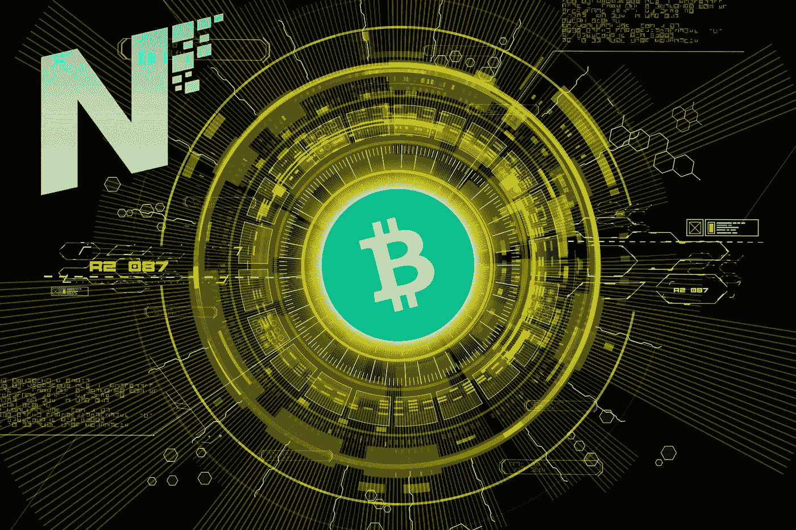
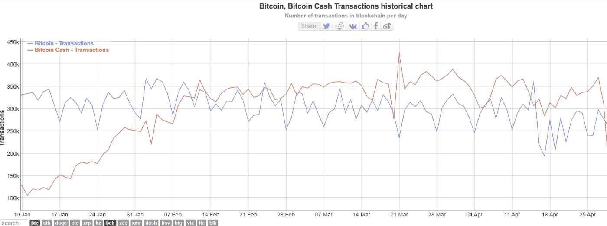
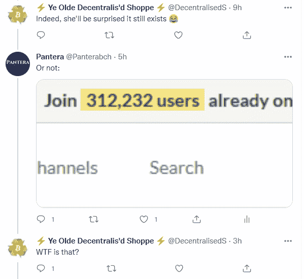

# 加入已经在 Noise 上的 312，251 个比特币现金用户！

> 原文：<https://medium.com/coinmonks/join-312-251-bitcoin-cash-users-already-on-noise-3a9910688ba?source=collection_archive---------4----------------------->

noise.cash 网络效应是任何其他加密货币都绝对想拥有的。

如果其他任何一个区块链拥有如此庞大的社交媒体网站，在成立后的短短一年内拥有超过 30 万用户，这将成为头条新闻。

不仅仅是在像 Cointelegraph 这样与密码相关的新闻网站上，而是所有主流媒体的头条新闻。

Noise.cash 不只是为比特币现金做了很多，它是加密货币新人的一个起点。

成为 noise.cash 社交媒体革命的一部分，立即开始您的加密冒险，并通过关注用户来了解加密，这些用户有助于用可信的方法解释事实。

最棒的是。您每天可以赚取高达 5 美元甚至 10 美元的小额小费！没错，有很多例子表明**用户从他们的 noise.cash 体验中每月收到 100-200 美元的小费。**

它是纯粹的社交媒体，没有主流社交媒体所遭受的隐私滥用问题。Noise.cash 只要求一个简单的注册过程，没有 KYC，也不需要电话验证。

# noise.cash 如何颠覆加密“产业”

noise.cash 最好的部分，你不用写加密货币。不仅仅是这个领域，这是革命性的社交媒体，对用户提供的内容没有限制。

大多数用户只是写下他们的生活，他们看到的事情，他们去过的假期，上传有趣的照片，艺术家们预览他们的作品，Youtubers 链接到他们的视频。

(*我以前写过 noise.cash 的评论，更多信息请阅读: [**噪音终极指南。现金！—比特币现金社交媒体革命**](https://read.cash/@Pantera/the-ultimate-guide-to-noisecash-the-bitcoin-cash-social-media-revolution-cd33ecea) **)**

## 为什么密码社区不提倡 noise.cash？

当然，noise.cash(与比特币现金相关的一切)受到了仔细的审查，因为这是其他加密货币无法达到的积极发展，并且为比特币现金提供了竞争优势。

在区块链行业，并非一切都是理想的。我们有主流，往往是集中的测试网络，我们有敌对的既定的区块链正在努力采用。

比特币现金不是主流，因为当权者(Blockstream 合作公司，即 iFinex)决定不支持比特币现金，而是推动压制、审查和价格操纵的 Blockstream 议程。

noise.cash 没有风投参与，所以它一直隐藏在公众视野之外。你不会在 DCG 所有的加密媒体中找到任何关于 noise.cash 的报道。

Coindesk、Cointelegraph、Decrypt、Newsbtc 和其他网站，都在追随反 BCH 的立场。BTC 马克思主义者发动的反 BCH 宣传的一部分。一个庞大的机器人和受薪骗子网络，倡导反对比特币现金，并扩大整体反 BCH 宣传。

这就是为什么你还没有听说过 noise.cash，这就是为什么你还没有听说过 smartBCH，这就是为什么你是暴徒的一部分，像 sockpuppets 一样指责比特币现金，而你甚至从来没有实际使用过它。

## 没有网络效应吗麦科马克先生？

BTC 有没有想过类似噪音的东西。现金是可能的？

所有这一切甚至没有一个单一的营销活动。

不，因为你支持那些削弱了区块链的人。BTC 不能使用，液体易于集中。

BTC 无法取得任何接近 noise.cash 的成就，因为规模战争的结果是一家盈利性私营公司控制了比特币品牌和叙事，旨在促进联合侧链。

## 虚假交易格雷戈里·麦克斯韦？

主要 Blockstream Core dev 的不光彩评论，诉诸**明目张胆的谎言**进一步增强反 BCH 情绪。

*Bitinfocharts*

当格雷格·马克斯韦尔毫无羞耻地指责 noise.cash 制造虚假交易时！当然，这是一个错误的说法。这些区块链交易帮助比特币现金再次解释了比特币是有规模的。这损害了竞争。

然而，这就是现实。2021 年 2 月至 5 月间(约 3 个月)，比特币现金交易量超过 BTC。

这主要是因为噪音。然而，重要的是 BCH 发出的信息。

2021 年期间，比特币现金交易平均不超过 0.01 美元。

比特币正在扩大，是区块流开发者的不作为和错误决定导致了它的停滞和过时。

BTC 高收费和网络堵塞的原因之一正是 BTC·德夫提到的。Gregory Maxwell 是集中的比特币(BTC)开发小组(比特币核心)中最强大的人物之一，与 Blockstream 有着密切的联系。

# 用户群会取消宣传

我不知道 BTC 最大化主义者使用的信息来源，但我完全理解为什么他们中的大部分人完全被误导了。

对比特币现金的审查经常让这种反 BCH 做法的追随者感到惊讶，因为他们对比特币现金的发展、使用案例和快速增长的用户群有错误的信息:

这是比特币现金，那些支持反 BCH 宣传的人也许应该把比特币现金看作是对整个密码行业的服务，而不是盲目地追随最大化主义者的号召。

没有什么能与 noise.cash 相提并论，它背后的人(马克·德·梅塞尔(Marc De Mesel)和西蒙(Simon)值得他们获得的赞誉，但这一切都是因为比特币现金才成为可能。你不能制造噪音。现金与 BTC 合作，不能与 LN 合作，当然更不能与以太坊合作。

Writing at the following websites: ● [ReadCash](https://read.cash/@Pantera) ● [NoiseCash](https://noise.cash/u/Pantera99) ● [Medium](/@panterabch) ● [Hive](https://hive.blog/@pantera1) ● [Steemit](https://steemit.com/@pantera1) ●[Vocal](https://vocal.media/authors/pantera) ● [Minds](https://www.minds.com/pantera99/) ● [Twitter](https://twitter.com/Panterabch) ● [LinkedIn](https://www.linkedin.com/in/panterabch/) ● [Reddit](https://www.reddit.com/user/coinflip1211) ● [email](https://read.cash/@Pantera/localcryptos-p2p-exchange-is-now-offering-bitcoin-cash-trading-06637230#bad-link)

**相关资料:**

*   [***噪音的终极指南。现金！——比特币现金社交媒体革命***](https://read.cash/@Pantera/the-ultimate-guide-to-noisecash-the-bitcoin-cash-social-media-revolution-cd33ecea)

> **免责声明**:本内容中发布的所有材料均用于娱乐和教育目的，并符合**合理使用准则**。无意侵犯版权。如果您是或代表本文所用材料的版权所有者，并且对所述材料的使用有疑问，请发送[电子邮件](https://read.cash/@Pantera/cryptouknowns-battlegrounds-the-crypto-battle-royal-part-i-0ca762da#bad-link)。

如果你喜欢这篇文章，别忘了订阅并点赞！

*原载于*[*https://read . cash*](https://read.cash/@Pantera/join-312251-bitcoin-cash-users-already-on-noise-adb99e99)*。*

