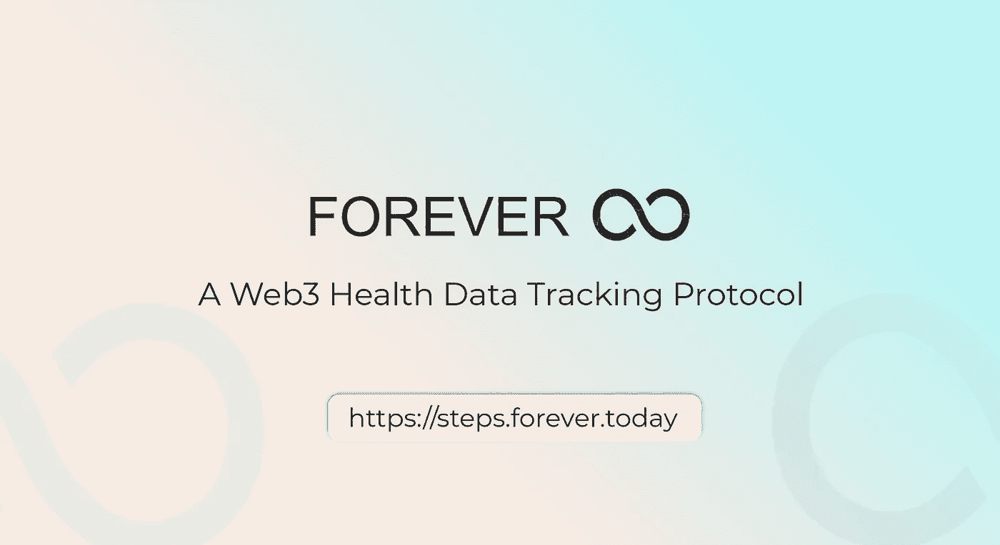

# 加入永久激励测试版应用测试

> 原文：<https://medium.com/coinmonks/join-forever-incentivized-beta-app-testing-4c1a4d026fce?source=collection_archive---------27----------------------->

Forever Beta App Testing

*永久测试版应用测试正在进行。*

Forever 的首次 beta 移动应用测试今天开始，为即将到来的 steps 竞赛做准备。虽然团队已经对应用程序进行了广泛的测试，但他们希望对他们正在构建的东西有新的看法。

只是快速了解一下 Forever 正在构建的东西——Forever 正在 Web 3 上构建一个跟踪健康数据的平台——称之为健康数据的谷歌搜索引擎；同时鼓励人们过更健康的生活。它是围绕 [Move2Earn 模型](/forever-today/understanding-move2earn-the-emerging-web3-gaming-model-and-how-it-incentivizes-a-healthier-a5660f69b50d)构建的。点击阅读更多关于《永远的 T4》的内容。

# 测试的合格标准

Beta 版应用程序测试是面向所有社区成员的免费测试，包括新成员。社区成员自动获得 Beta 测试的资格。但是，要使新用户有资格参与，他们必须:

1.  去 Forever 的网站注册:[https://steps . Forever . today](https://steps.forever.today)
2.  加入他们的不和频道:[https://discord.gg/Jnbfrqn94Q](https://discord.gg/Jnbfrqn94Q)
3.  在步骤仪表板中提供他们的不一致用户名。
4.  最后，前往他们的 Twitter 页面:[https://twitter.com/ForeveToday](https://twitter.com/ForeveToday)，关注并转发标签为# move 2 earn # web 3 # forever today # Nfts 的帖子。

一旦你完成了所有这些，你就有资格参加测试版应用测试。

# 如何参与测试版应用程序测试

1.  从你的[Google Playstore](https://play.google.com/store/apps/details?id=today.forever.steps)(Android 用户)或 [Apple Store](https://apps.apple.com/us/app/forever-steps/id1616422453) (IOS 用户)下载 Forever 应用并设置它。
2.  该应用程序的登录代码在您的永久仪表板上。
3.  登录后，在你散步、跑步、开车或滑雪时保持应用程序运行。
4.  每天打开一次应用程序，将您的步骤上传到他们的服务器，并查看当前的团队排名！
5.  只有前 500 下载，登录并开始收集步骤将获得奖励。
6.  正式的舞步比赛将于 5 月 15 日开始。当正式比赛于 5 月 15 日开始时，你在测试阶段的步数数据将被清零。

# 测试的持续时间

永久应用测试将持续 3 周。

# 活动奖励:

1.  测试的奖励是为下载/安装 Forever 应用程序的前 500 名用户提供 500 [ALEX](https://app.alexlab.co/swap) 代币。
2.  只有下载/安装移动应用程序并完成所有任务的前 500 名用户才有资格获得 beta 测试奖励。

网址:[https://steps . forever . today](https://steps.forever.today/i/INaAis)

推特:【https://twitter.com/ForeveToday 

加入他们的不和频道:[https://discord.gg/Jnbfrqn94Q](https://discord.gg/Jnbfrqn94Q)

> 加入 Coinmonks [电报频道](https://t.me/coincodecap)和 [Youtube 频道](https://www.youtube.com/c/coinmonks/videos)了解加密交易和投资

# 另外，阅读

*   [霍比审核](https://coincodecap.com/huobi-review) | [OKEx 保证金交易](https://coincodecap.com/okex-margin-trading) | [期货交易](https://coincodecap.com/futures-trading)
*   [网格交易机器人](https://coincodecap.com/grid-trading) | [Cryptohopper 审查](/coinmonks/cryptohopper-review-a388ff5bae88) | [Bexplus 审查](https://coincodecap.com/bexplus-review)
*   [7 个最佳零费用加密交易平台](https://coincodecap.com/zero-fee-crypto-exchanges)
*   [氹欞侊贸易评论](https://coincodecap.com/anny-trade-review) | [霍比保证金交易](/coinmonks/huobi-margin-trading-b3b06cdc1519)
*   [分散交易所](https://coincodecap.com/what-are-decentralized-exchanges) | [比特 FIP](https://coincodecap.com/bitbns-fip) | [Pionex 审查](https://coincodecap.com/pionex-review-exchange-with-crypto-trading-bot)