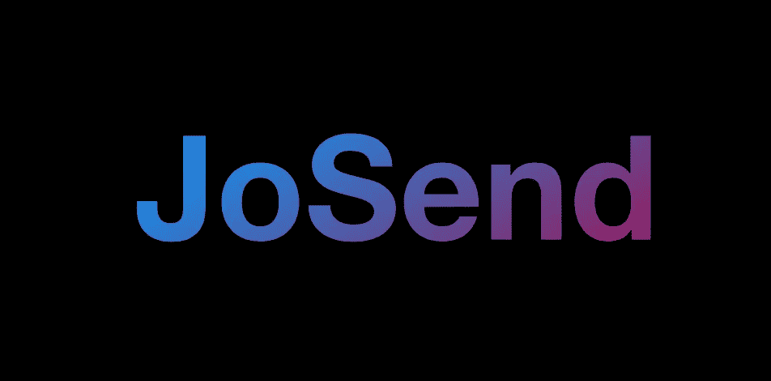
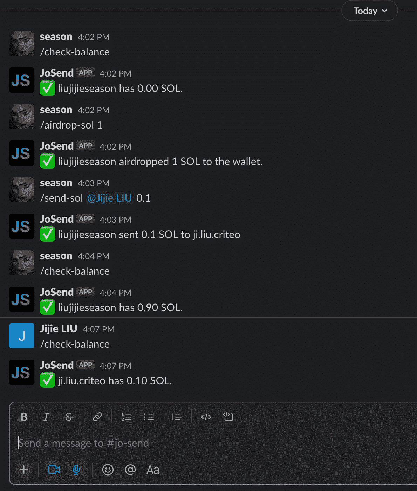
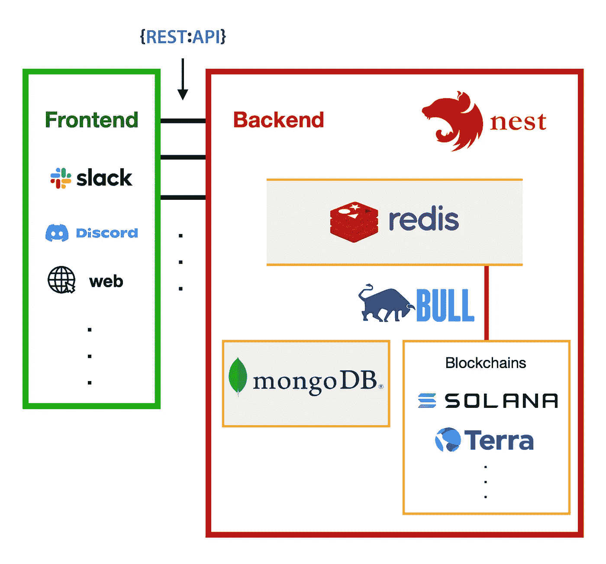
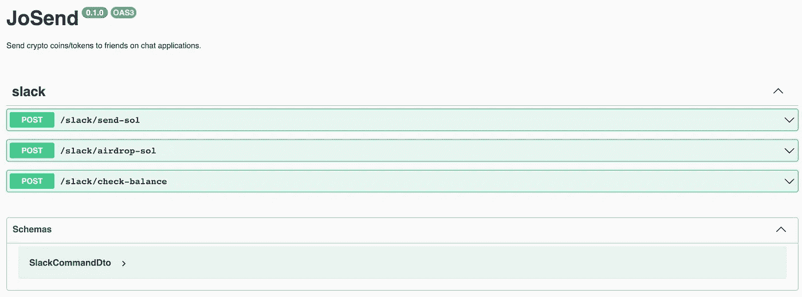
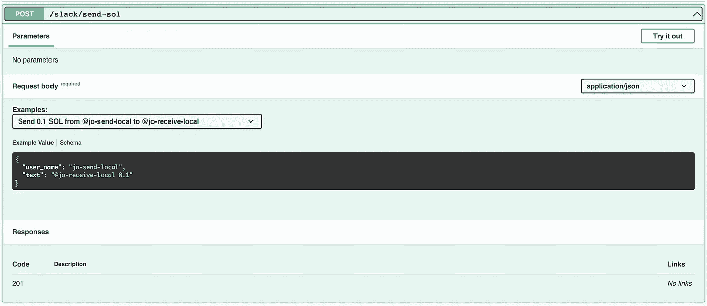

# 乔森:发送加密就像发送信息一样简单

> 原文：<https://medium.com/coinmonks/josend-sending-crypto-as-easy-as-sending-messages-3155769da052?source=collection_archive---------28----------------------->

# 介绍

想象一下，你欠你朋友一顿饭钱，你通过给他/她发信息来支付。听起来像是生活在未来，不是吗？乔森今天就能实现！

乔森德让**发送密码** **和发送信息**一样简单。

sending crypto just as sending messages

目前，这款应用仍在开发中**，并且是开源的**。本文将呈现这款 app 的**系统设计**。请随意探索并为之做出贡献。项目如下:****

*   ****[**JoSend on Github**](https://github.com/jolana-lab/jo-send)****

# ****系统设计****

****JoSend 实现了上图所示的 3 种功能。****

*   ******检查余额**:检查用户钱包里有多少密码****
*   ******空投 sol** :空投 sol 到用户的钱包****
*   ******send-sol** :用户间发送 sol****

****溶胶是一种密码。它是由索拉纳区块链发行的。****

****基于这些需求，我设计了如下的应用程序。我将逐一解释每一部分。****

********

****JoSend System Design****

## ****前端****

****前端**与用户**交互。就是我们每天使用的**聊天应用**。目前，JoSend 只支持 Slack。以后会支持不和谐，会有自己的网站。****

****在 Slack 中，我们创建了一个乔森德机器人。它使用 [***斜线命令***](https://api.slack.com/interactivity/slash-commands) 提供的松弛度。在它的帮助下，我们可以用命令实现 3 个功能。Slack 会将命令作为 POST 请求发送到我们的后端。该请求包含发出命令的**用户**和**命令内容**。****

****前端设计成**轻**以便**可以快速展开或更换**。大部分工作由后端完成。****

## ****后端****

****我选择[***nest . js***](https://nestjs.com/)作为后端框架。**对于每个前端平台，我创建一个控制器模块**。控制器模块是公开端点的模块。例如，JoSend 只有一个控制器模块，即 Slack 模块。端点以[***RESTful***](https://en.wikipedia.org/wiki/Representational_state_transfer)风格管理。****

****我使用 RESTful APIs 的原因是**很容易编码和记录**。我用 [*OpenAPI 规范*](https://docs.nestjs.com/openapi/introduction) 来描述所有的公共端点。****

********

****JoSend OpenAPI specification****

****每个端点负责一项功能。我为每个端点提供了一个示例，以便开发人员可以使用它。****

********

****JoSend send-sol endpoint****

****虽然现在很方便，但是端点越来越多的时候会很繁琐。以后我会在上面应用[***graph QL***](https://graphql.org/)。****

## ****长队****

****除了控制器，松弛模块还有一个**处理器**。它**将重计算任务放入队列**。****

****繁重的计算工作是发送 SOL 和空投 SOL。它们需要区块链来进行计算，以便可以验证交易。这些过程需要时间，而大多数前端，如 Slack，需要即时响应。这就是为什么我把它们放入队列中，以便以后计算。我用的队列是 [***公牛***](https://github.com/OptimalBits/bull) ，公牛基于[***Redis***](https://redis.io/)。****

## ****区块链****

****目前来看， [***索拉纳***](https://solana.com/) 是乔森德唯一支持的区块链。我选择索拉纳是因为速度快，费用便宜。以后，乔森德会支持 [***特拉***](https://www.terra.money/)*因为它有稳定的币，UST。*****

*****乔森德的目标是让交易更容易，所以****区块链****选择**应该快速、便宜，**和 **crypto 应该稳定**。*********

## *****数据库ˌ资料库*****

*****交易是在钱包之间进行的。但是谁拥有这个钱包呢？我们需要一个数据库来保存钱包和用户之间的映射。*****

*****钱包包含公钥和私钥。公钥就是地址。就像你信用卡的账号。私钥就是秘密。这就像用信用卡支付的密码。因此，我在数据库中创建的类有 3 个重要字段:*****

*   *******地址**:钱包的公钥*****
*   *******secret** :钱包的散列私钥*****
*   *******用户名**:乔森德的用户。也是聊天平台里的用户名，比如 Slack。*****

*****如你所见，JoSend 是一个集中式的应用程序。您的钱包秘密存储在我们的数据库中，尽管它是散列的。所以，不要把太多的密码放在网上。**保管你的密码的最好地方是冷冻钱包。*******

# *****结论*****

*****我们已经讨论了 JoSend 的系统设计。我们知道乔森德让交易变得更容易。我们也知道有很多特性需要实现。*****

*****请随意投稿，感谢您的阅读。下次见。*****

> *****加入 Coinmonks [电报频道](https://t.me/coincodecap)和 [Youtube 频道](https://www.youtube.com/c/coinmonks/videos)了解加密交易和投资*****

# *****另外，阅读*****

*   *****最佳[区块链分析](https://bitquery.io/blog/best-blockchain-analysis-tools-and-software)工具| [赚比特币](/coinmonks/earn-bitcoin-6e8bd3c592d9)*****
*   *****[Cloudbet 赌场评论](https://coincodecap.com/cloudbet-casino-review) | [点火赌场评论](https://coincodecap.com/ignition-casino-review)*****
*   *****[加密套利](/coinmonks/crypto-arbitrage-guide-how-to-make-money-as-a-beginner-62bfe5c868f6)指南| [如何做空比特币](/coinmonks/how-to-short-bitcoin-568a2d0b4ae5)*****
*   *****[如何在加拿大购买加密货币？](https://coincodecap.com/how-to-buy-cryptocurrency-in-canada)*****
*   *****[无聊猿游艇俱乐部(BAYC)回顾](https://coincodecap.com/bored-ape-yacht-club-bayc-review) | [拜比特 vs 比特币基地](https://coincodecap.com/bybit-vs-coinbase)*****
*   *****[5 款最佳加密交易终端](https://coincodecap.com/crypto-trading-terminals) | [最佳 DeFi 应用](https://coincodecap.com/best-defi-apps)*****