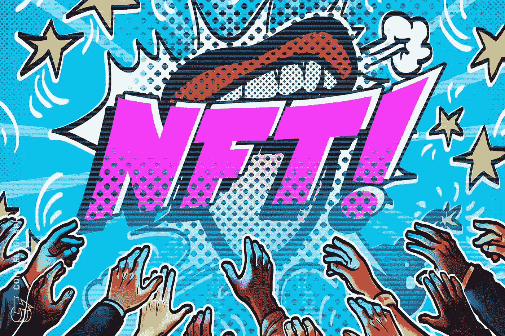

# 【JTeam 冠军 NFT】一个头像卖了 6500 万，互联网巨头入局:NFT 会是下一个比特币吗？

> 原文：<https://medium.com/coinmonks/jteam-champion-nft-an-avatar-sold-for-65-million-and-internet-giants-entered-the-game-will-nft-20ae6aa04a4?source=collection_archive---------79----------------------->

最近，NFT 已经成为 NBA 和奢侈品的代名词。前段时间，一个 NFT 头像卖了 6500 万，红了一阵子。就连马斯克也在 Twitter 上出售 NFT 的歌曲，谷歌对 NFT 的搜索量也创下了历史新高。显然，NFT 已经成为密码世界的新宠。互联网巨头也纷纷入局。

但许多投资者对非功能性交易只是非常笼统。他们只知道 NFT 头像被炒作了，但不知道它是什么。

事实上，NFT 是非 FungibleToken 的缩写。它是唯一用于表示数字资产(包括 jpg 和视频剪辑形式)的加密货币令牌，可以买卖。而且 NFT 也不像 BTC 和 ETC 那样可以分，比如分 0.001 或者 0.01，NFT 的单位永远是 1，NFT 最典型的特点就是唯一性和稀缺性。

什么是不可替代的代币，简单来说，就是不能互换。像 BTC 和瑞士联邦理工学院，这些都是同质的令牌，你的 BTC 和我的 BTC 可以互相互换，并具有相同的属性。不可替代的代币就像真正的艺术品，独一无二，不可替代。

正是 NFT 的独特特性使得 NFT 非常适用于游戏、票务、艺术品、知识产权、房地产、订单、保险等等。所以我觉得 NFT 很有前景，甚至超过比特币。

想投资顶级 NFT？您可以了解更多关于 JTeam NFT 项目的信息:

JTeam 是周杰伦在台北创办的电子竞技团队。旗下拥有英雄联盟:荒野大镖客赛区、PUBG 赛区、NARAKA: BLADEPOINT 赛区等职业战队，在该领域成绩斐然。首销 1000 台 NFT 及赠送粉丝奖牌详情请参考:

1.关于 JTeamNFT: [点击此处进入官网](http://www.jfans.space?utm_source=blog&utm_medium=blog&utm_campaign=medium)

2.[如何参与 JTeamNFT 项目？](https://blog.jfans.space/%E6%80%8E%E9%BA%BD%E5%8F%83%E8%88%87jteam-nft%E9%A0%85%E7%9B%AE-7bca58380e94)

3.[关于 JFans 粉丝奖牌和冠军 J 社 NFT 的发布](https://blog.jfans.space/%E9%97%9C%E6%96%BCj-fans%E7%B2%89%E7%B5%B2%E5%8B%9B%E7%AB%A0%E4%BB%A5%E5%8F%8A%E5%86%A0%E8%BB%8D%E9%99%90%E9%87%8F%E6%8B%96%E9%9E%8Bnft%E7%9A%84%E7%99%BC%E5%94%AE-f5539b216464)

4.https://twitter.com/jfans_space:[Tw](https://twitter.com/jfans_space)