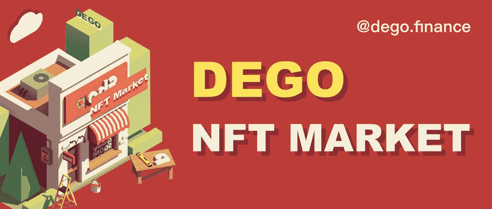

# 【JTeam 冠军 NFT】NFT 市场上市，OpenSea 即将革新？

> 原文：<https://medium.com/coinmonks/jteam-champion-nft-nft-market-is-listed-and-opensea-is-about-to-be-revolutionized-19aa26c77426?source=collection_archive---------77----------------------->

如今，德菲和 NFT 这两个主要市场已经在区块链行业广受欢迎。前者近期有降温趋势，后者仍处于蓄势阶段。

这主要受限于应用场景狭窄和 NFT 受众范围。如果 NFT 能像 FT 一样有相对丰富的应用场景和玩法，交易能简单、易操作、易盈利，那么 NFT 市场很快就会火爆起来。DEGO 最近推出的 NFTMarket 就是为了解决这两个问题。

DEGO 目前是 NFT 市场的明星项目。DEGONFT 板块(GEGO)上线后，通过空投、拍卖等创意玩法炮轰市场，使其牢牢占据 NFT 市场交易量第一的位置。每天都有大量的 GEGOs 被铸造和出售。

NFTMarket 支持的 NFT 类型不仅限于平台内打造的 GEGO，还支持第三方 NFT 交易。另外，NFTMarket 目前只支持单价交易。未来将推出英国拍卖、荷兰拍卖等主流拍卖方式，以及最近让 DEGO 走红的 FOMO 拍卖方式。上线几个小时后，NFTMarket 上已经有几十个 NFT 上市出售。

DEGONFT Market

**德贡特市场的特点**

DEGO 项目一直以创新著称，在 DEGONFTMarket 中也可以看到一些亮点，与传统的 NFT 交易平台相比具有差异化的竞争优势:

**1。便捷的交易体验**

目前 DEGONFTMarket 的交易逻辑非常简单。在实际体验中，交易过程非常流畅，绑定钱包后就会收到付款，基本不需要付出太多的学习成本。对于 NFT 市场的新用户来说，这是非常友好的。遇到心仪的 NFT 可以直接买买买。没有繁琐的流程，比 OpenSea 等交易平台更方便。

**2。无假货**

OpenSea 里有很多假的 NFT。比如 9 月底 DEGO 的 NFT 拍卖开始前，OpenSea 就出现了一个假的“中本聪”，是不明真相的玩家为 3ETH 买的。另一方面，DEGONFTMarket 可以避免这个问题。DEGO 自己的交易平台绝对真实，相当于电商中的“自营”，避免了玩家不必要的损失。

**3。游戏性的优势**

这段时间，德贡夫特的拍卖受到广泛关注，屡屡拍出高价。这有赖于 FOMO 玩法带来的利益诱惑，所有参与者都能从中受益，让拍卖不再是资本家和艺术爱好者的专利，你我这样的“投机者”也能从中获利。DEGONFTMarket 未来将使这种拍卖方式成为通用规则，适用于包括第三方 NFT 在内的所有 NFT，让 NFT 交易不再受限于传统的枯燥方式。同时，根据 DEGONFT 的拍卖方式，NFTMarket 中参与拍卖的 NFT 作品越多，就会给 DEGO 的分红池带来越多的收入，让 DEGO 的用户获得更多的分红，这对 DEGO 的币价和项目开发非常重要。是有益的。

综上所述，DEGONFTMarket 是在传统 NFT 交易平台的基础上进行改进，使其更适合玩家的需求，并以其独特的玩法吸引更多的受众，打造了 FOMO、DeFi、拍卖等集合。以综合 NFT 交易所为特色。可见，OpenSea 即将迎来一场革命。

J team

**想投资顶尖 NFT？可以了解更多关于 JTeam NFT 项目:**

JTeam 是周杰伦在台北创办的电子竞技团队。旗下拥有英雄联盟:荒野大镖客赛区、PUBG 赛区、NARAKA: BLADEPOINT 赛区等职业战队，在该领域成绩斐然。首销 1000 台 NFT 及赠送粉丝奖牌详情请参考:

1.关于 JTeamNFT:查看官网: [jfans.space](http://www.jfans.space?utm_source=blog&utm_medium=blog&utm_campaign=medium)

2.[如何参与 JTeamNFT 项目？](https://blog.jfans.space/%E6%80%8E%E9%BA%BD%E5%8F%83%E8%88%87jteam-nft%E9%A0%85%E7%9B%AE-7bca58380e94)

3.[关于 JFans 粉丝奖牌和冠军 J 社 NFT 的发布](https://blog.jfans.space/%E9%97%9C%E6%96%BCj-fans%E7%B2%89%E7%B5%B2%E5%8B%9B%E7%AB%A0%E4%BB%A5%E5%8F%8A%E5%86%A0%E8%BB%8D%E9%99%90%E9%87%8F%E6%8B%96%E9%9E%8Bnft%E7%9A%84%E7%99%BC%E5%94%AE-f5539b216464)

4.https://twitter.com/jfans_space Tw