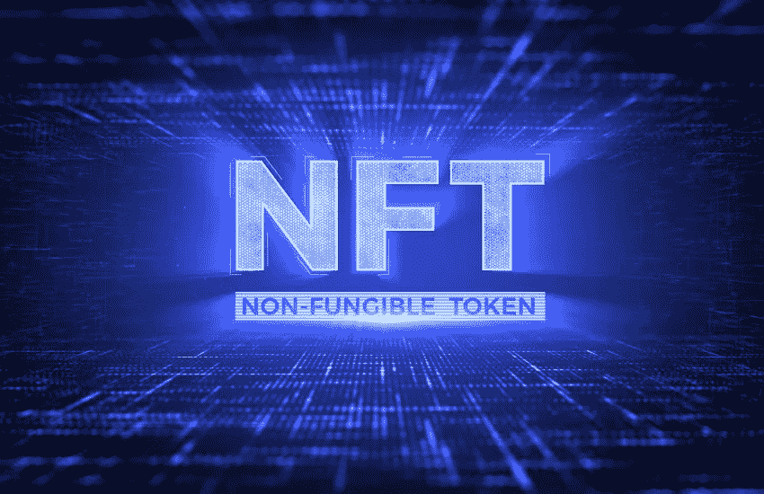

# 【JTeam 冠军 NFT】NFT 区块链为什么这么精彩？

> 原文：<https://medium.com/coinmonks/jteam-champion-nft-why-is-nft-blockchain-so-exciting-199c0242f350?source=collection_archive---------57----------------------->

NFT 非常强大，因为结合以太坊上的其他金融工具，任何人都可以发行、拥有和交易它们。因此，用户与 NFTs 的交互效率明显高于传统平台。

就像加密货币的支付效率高于传统支付一样，交易的无国界性和转账的便捷性使得 NFT 的流通效率高于传统方式。

例如，如果你是一个游戏开发者，想要制作可交易的游戏道具，你可以借助去中心化 NFT 交易所的协议，立即赋予道具交易属性。你不需要创建一个市场，也不需要通过一个集中的平台来流通物品。

NFT 不仅支持交易，还可以用于贷款，支持部分所有权(如 NIFEX)，或作为贷款的抵押品(如 NFTfi)。

NFT 和德菲的结合可以创造无限的可能性。例如，Aavegotchi 是一款结合了 DeFi 和 NFTs 的游戏，其中每个角色都代表用户在借贷平台 Aave 上缴纳的押金，游戏角色可以战斗、升级和配置装备。

非功能性测试的使用可能会大幅增加。股权等传统资产的令牌化是未来的明显趋势，因为这将大大提高其交易效率。

正如我们将看到的，标记化为传统世界增加了新的可能性，例如使用 NFTs 来表示广告空间，您可以将广告空间的使用权出售给一个网站，广告空间的使用权可以自由交易。这实际上是一种数字房地产。有了 NFTs，我敢打赌网站会得到很多关注，广告空间会变得更有价值。

接下来，我们会看到更多种类的新概念代币，而最让我兴奋的是，这些代币的提出和实现，正是因为有了区块链技术。

为了让 NFTs 更容易使用，有几个方面的用户体验需要改进。首先，我们需要衡量区块链的交易处理量，否则高昂的交易费用将使一些交易非常昂贵，甚至无法进行。

缩放研究正在进行中，以太坊社区中的几个不同的团队正在研究缩放选项，我们看到其他一些区块链项目也在做相关的工作。NFT 的另一个问题是持有者需要保留自己的 NFT 代币。

然而，我们可以开发用户友好的钱包，以支持 PIN、生物识别和社交账户恢复等功能，将用户从保管钱包的复杂工作中解放出来。

我乐观地认为，随着时间的推移，这些改进将会建立起来，我们将在 NFT 领域看到一个巨大的创新和实验浪潮。

**想投资顶尖 NFT？可以了解更多关于 JTeam NFT 项目:**

JTeam 是周杰伦在台北创办的电子竞技团队。旗下拥有英雄联盟:荒野大镖客赛区、PUBG 赛区、NARAKA: BLADEPOINT 赛区等职业战队，在该领域成绩斐然。首销 1000 台 NFT 及赠送粉丝奖牌详情请参考:

1.关于 JTeamNFT:查看官网: [jfans.space](http://www.jfans.space?utm_source=blog&utm_medium=blog&utm_campaign=medium)

2.[如何参与 JTeamNFT 项目？](https://blog.jfans.space/%E6%80%8E%E9%BA%BD%E5%8F%83%E8%88%87jteam-nft%E9%A0%85%E7%9B%AE-7bca58380e94)

3.[关于 JFans 粉丝奖牌和冠军 J 社 NFT 的发布](https://blog.jfans.space/%E9%97%9C%E6%96%BCj-fans%E7%B2%89%E7%B5%B2%E5%8B%9B%E7%AB%A0%E4%BB%A5%E5%8F%8A%E5%86%A0%E8%BB%8D%E9%99%90%E9%87%8F%E6%8B%96%E9%9E%8Bnft%E7%9A%84%E7%99%BC%E5%94%AE-f5539b216464)

4.https://twitter.com/jfans_space Tw