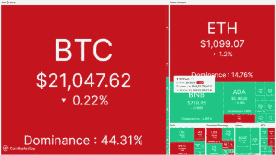
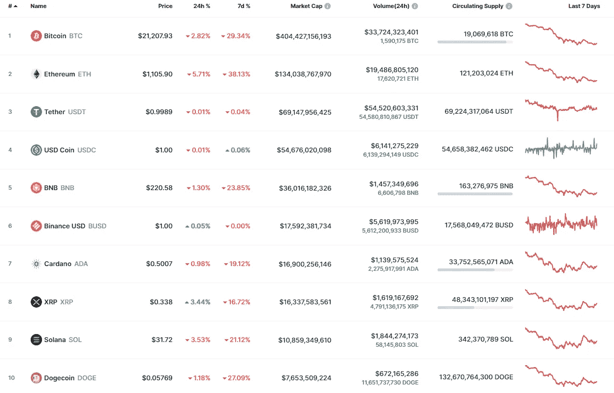
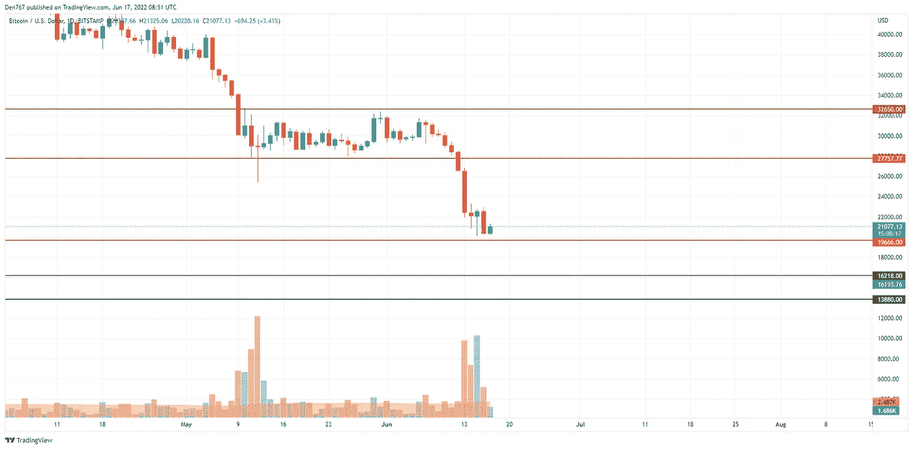
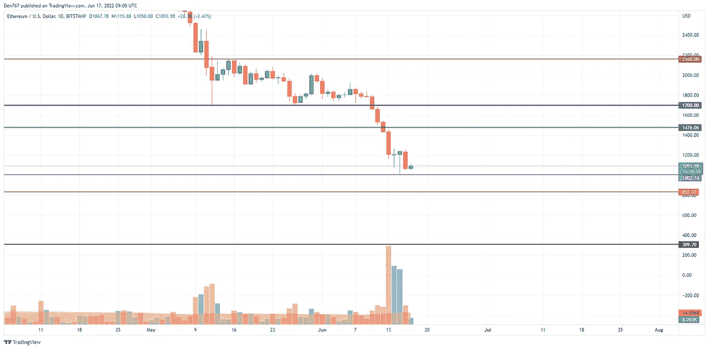
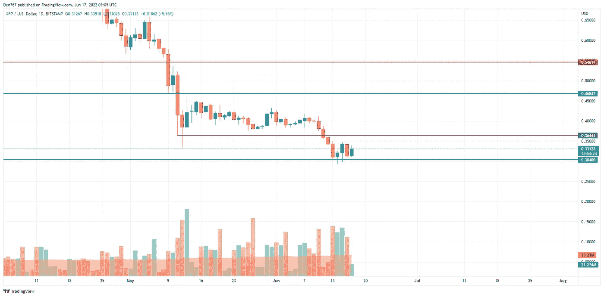

# 6 月 17 日 BTC、瑞士联邦理工学院和 XRP 的价格分析

> 原文：<https://medium.com/coinmonks/june-17-price-analysis-for-btc-eth-and-xrp-3666d80d5052?source=collection_archive---------66----------------------->

根据 CoinMarketCap 的排名，大多数硬币都在红色区域交易。

# BTC/美元

比特币(BTC)的价格在过去 24 小时内下跌了 3%。

在日线图上，比特币(BTC)的价格已经从 20，000 美元的区域反弹，这证实了多头的力量。从另一个角度来看，价格已经接近支撑，意味着现在考虑反转还为时过早。

# 瑞士法郎/美元

以太坊(ETH)是今天名单中最大的输家，因为主要的 altcoin 下跌了 6%。

以太坊(ETH)的交易与 BTC 类似，因为价格也位于 1000 美元的支撑位附近。交易量仍然很低，因为交易者不准备从当前水平购买硬币。如果空头的压力继续，汇率跌破 1000 美元，很快就有机会测试下一个水平 832 美元。

截至发稿时，以太坊的交易价格为 1090 美元。

# XRP/美元

今天，XRP 是一个例外，因为它的价格在过去 24 小时内上涨了 3.44%。

尽管有所增长，XRP 仍处于 0.3040 美元支撑位和 0.3644 美元阻力位之间的狭窄通道的中间。如果多头可以在当天收盘时将汇率保持在 0.33 美元以上，那么可以预计很快将测试 0.35 美元区域。

截至发稿时，XRP 的交易价格为 0.33160 美元。

#bitcoinpriceprediction

#Ripplepriceprediction

#以太价格预测

关注我们了解更多故事[点击这里](http://t.me/etellworld)

> 加入 Coinmonks [电报频道](https://t.me/coincodecap)和 [Youtube 频道](https://www.youtube.com/c/coinmonks/videos)了解加密交易和投资

# 另外，阅读

*   [Bookmap 评论](https://coincodecap.com/bookmap-review-2021-best-trading-software) | [美国 5 大最佳加密交易所](https://coincodecap.com/crypto-exchange-usa)
*   最佳加密[硬件钱包](/coinmonks/hardware-wallets-dfa1211730c6) | [Bitbns 评论](/coinmonks/bitbns-review-38256a07e161)
*   [新加坡十大最佳加密交易所](https://coincodecap.com/crypto-exchange-in-singapore) | [购买 AXS](https://coincodecap.com/buy-axs-token)
*   [红狗赌场评论](https://coincodecap.com/red-dog-casino-review) | [Swyftx 评论](https://coincodecap.com/swyftx-review) | [CoinGate 评论](https://coincodecap.com/coingate-review)
*   [投资印度的最佳密码](https://coincodecap.com/best-crypto-to-invest-in-india-in-2021)|[WazirX P2P](https://coincodecap.com/wazirx-p2p)|[Hi Dollar Review](https://coincodecap.com/hi-dollar-review)