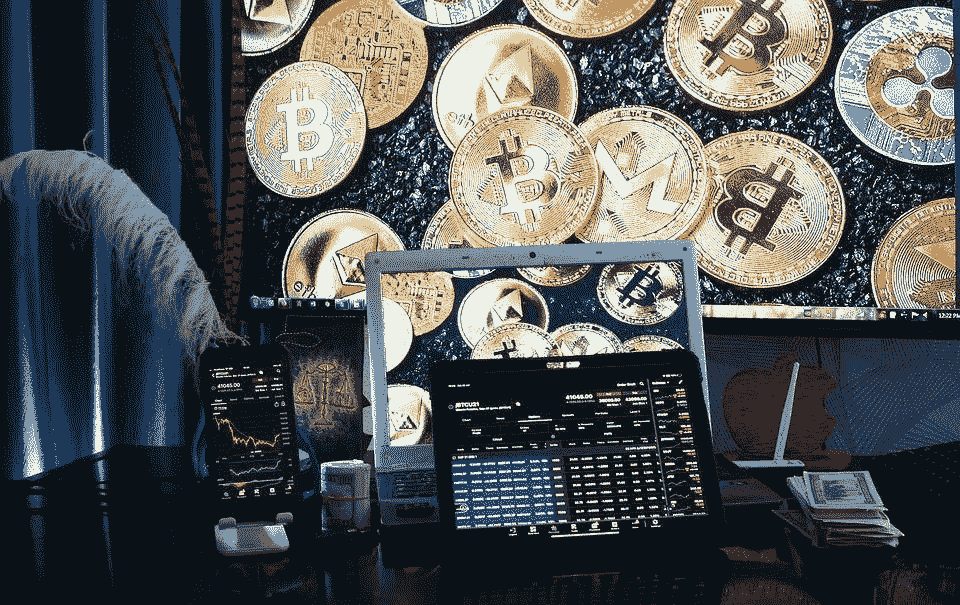

# 就这样我们又回到了 2018 年！

> 原文：<https://medium.com/coinmonks/just-like-that-we-are-back-in-2018-126b6f3ade73?source=collection_archive---------19----------------------->

*Photo by “ sergeitokmakov” on* [*Pixabay*](https://pixabay.com/photos/trading-blockchain-cryptocurrency-6531134/)

随着价格自今年年初以来严重下跌，加密市场再次陷入低迷。

比特币 BTC 在跌至 2017 年至 2018 年区域后，呈现了一个不令人信服的案例，尽管我们可能都已经忘记了 2018 年，但这是有充分理由的。

对于加密货币的投资者来说，只有痛苦的时刻，尽管一些网络没有受到影响…