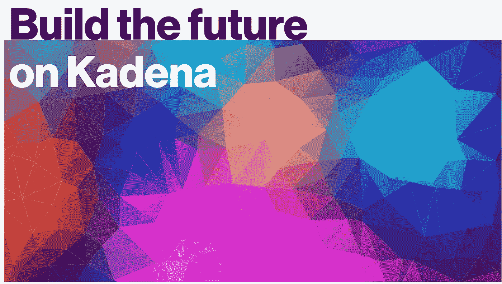
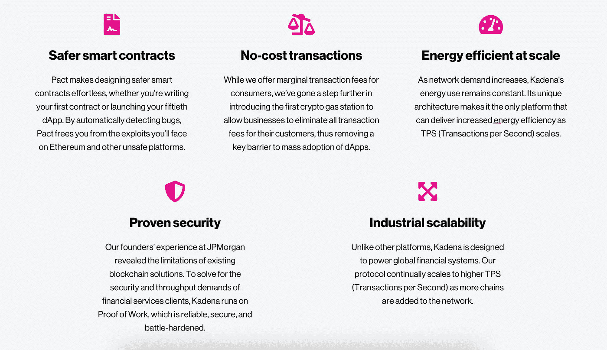
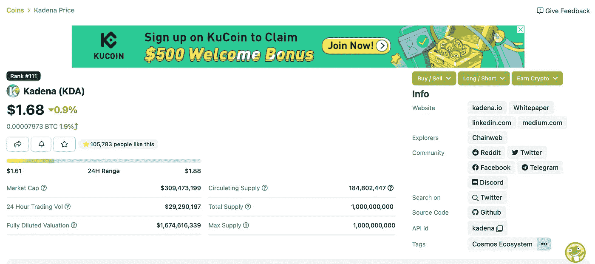
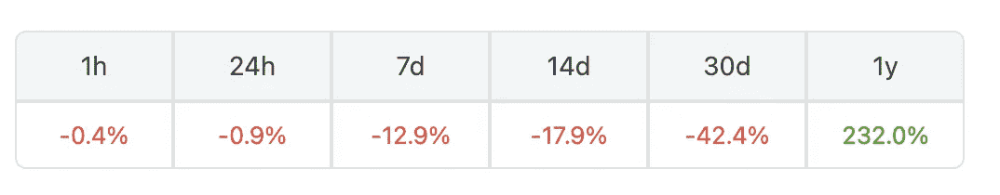

# 嘉手纳(KDA):值得投资吗？

> 原文：<https://medium.com/coinmonks/kadena-kda-worth-the-investment-e6a40a7d288e?source=collection_archive---------26----------------------->

# **Kadena 是一个第一层智能合同平台，具有独特的工作证明共识机制，允许高交易速度和低费用**。

> 嘉手纳团队即将迎来这样一个时刻:整个世界都将觉醒，并意识到像嘉手纳这样的区块链所拥有的潜力，因为它是由这个星球上一些最聪明的人创造的。Will Martino 和 Stuart Popejoy 在摩根大通区块链卓越中心负责管理摩根大通首款区块链 Juno 的开发工作，他们亲身感受到了该行业的局限性。
> 
> 利用他们在摩根大通的经验作为框架，Martino 和 Popejoy 在 2016 年离开了摩根大通团队，创办了区块链混合平台公司 Kadena。他们还创造了 Juno，该公司最初的区块链，后来被用作 jpm 货币的蓝图和一月份的福布斯文章**。**马蒂诺被美国证券交易委员会从常春藤联盟的耶鲁大学研究生院招聘。

# **嘉手纳展示了从合格投资者那里筹集资金的公平启动，表明他们相信每个人都有在 KDA 投资的公平权利。**

> 该团队不相信在风投资本已经是 30-40 倍的情况下，推出数十亿美元市值的股权或网络。他们不相信这是健康的。Kadena 的团队采取了一种非常不同的方法，以非常低的市值启动，以便尽早聚集尽可能多的对该平台感兴趣的人，帮助我们将这个东西打造成为伟大的东西。密码行业的其他人主要关注的是赚钱:我们可以预先筹集多少资金，以非常高的市值上市，这样我们的早期投资者或风险资本家就可以获利。嘉手纳于 2016 年首次发布。**直到 2019 年，任何地方都没有出售过硬币。**

*就这样，两年了，硬币都没卖出去，他们就这么坐在那里，而团队在造嘉手纳。然后，在 2020 年，他们开始向合格的美国投资者出售。Kadena 的创始人 Martino 和 Popejoy 描述了 Kadena 如何成为一个网络，以避免未能通过 Howey 测试，并且不被认为是安全的。对于任何一家区块链加密公司来说，这都将被视为一大进步，尤其是因为创始人与美国证券交易委员会(SEC)有关系。*

# 嘉手纳目前正在宇宙生态系统上建造，据说它也将与波尔卡多特集成在一起。

> Kadena 独一无二的无限可扩展架构和突破性的智能合约语言 Pact 提供了关键特性，这些特性使建筑商能够在保持 Web2 可用性的同时提供 Web3 创新和基础。由于基础设施、公用事业和吞吐量是一枚硬币的必需品，创始人认为这将是一种智能合同语言，该协议似乎引起了许多人的共鸣。开发智能合同语言需要数年时间。Kadena 的团队首先将它放在他们的私人区块链 Kadena curl 上，然后是 chain web，然后是 tender mint，以测试多互操作性网络。希望他们能够在 2022 年底或 2023 年的未来路线图中找出如何将它放在波尔卡圆点上。

Kadena’s Featurability — Homepage

> Kadena 独一无二的无限可扩展架构和创新的智能合约语言 Pact 提供了关键功能，使构建者能够提供 Web3 创新和基础，同时保持 Web2 可用性。只有 Kadena 解决了区块链在安全性、分散性和可扩展性方面的三难问题。该团队将这种独一无二的编程语言描述为第一种真正人类可读的智能契约语言。这种编程语言是专门为使智能合约更容易使用而创建的。
> 
> 首先，嘉手纳的可扩展性和速度已经达到了区块链游戏所要求的水平。根据 Kadena 团队的说法，这个网络每秒可以处理 48 万笔交易，比 2000 年快了近十倍。目前的设计包括 20 个编织链，这有助于增加网络的吞吐量，预计这一数字将随着时间的推移而增长。

***嘉手纳的独特架构允许更流畅、更时尚的用户友好型应用程序和钱包集成，这有助于开发者设计用户无需复杂的私钥即可登录的应用程序，他们表示这是将这项技术带给主流游戏玩家的必要条件。我相信它对于 NF T 也有一些独特的功能，比如让开发者能够直接编码到 NFT 的后端，这扩展了 NFT 在游戏中的潜在用例。***

# 外卖食品

[Overview of Kadena’s Market Cap](https://www.coingecko.com/en/coins/kadena) — [Coin Gecko](https://www.coingecko.com/)

> 总的来说，在银行开展业务所需的基础设施的安全性方面，嘉手纳的创始人是最有头脑的。Kadena 是由摩根大通的两名前雇员 Stewart Popejoy 和 Martino 组建的，他们在摩根大通的区块链卓越中心工作时负责管理该中心。

目前，嘉手纳的股价为 1.68 美元。市值为 309，473，199 美元，完全稀释后的估值为 1，674，616，339 美元。流通供应量为 184802447/10 亿。

尽管包括股票、债券、密码、石油等在内的整个世界市场，KDA 还是在今年上涨了 232%。自 2 月 1 日(大约是俄乌战争开始的时间)以来，KDA 的交易价格为 6.09 美元，2021 年 11 月 11 日达到 27.64 美元的历史高点。从 2020 年 3 月 13 日创下的历史低点 0.065811 美元；如果一个人在低点买入，在高点卖出，他们将有 2432.7%的投资回报率！

我肯定会密切关注 Kadena，因为这种硬币非常有前途，因为它具有可靠的安全性、低交易费用和可扩展性，能够为最终用户提供流畅的体验。人们以 1.68 美元的现价购买股票，认为它将超过并打破 27.64 美元的历史最高价，投资回报率为 16.45 倍。如果你喜欢这些内容，请关注并喜欢更多与密码相关的文章。

> 加入 Coinmonks [电报频道](https://t.me/coincodecap)和 [Youtube 频道](https://www.youtube.com/c/coinmonks/videos)了解加密交易和投资

# 另外，阅读

*   [MXC 交易所评论](/coinmonks/mxc-exchange-review-3af0ec1cba8c) | [Pionex vs 币安](https://coincodecap.com/pionex-vs-binance) | [Pionex 套利机器人](https://coincodecap.com/pionex-arbitrage-bot)
*   [我的加密副本交易经历](/coinmonks/my-experience-with-crypto-copy-trading-d6feb2ce3ac5) | [比特币基地评论](/coinmonks/coinbase-review-6ef4e0f56064)
*   [CoinFLEX 评论](https://coincodecap.com/coinflex-review) | [AEX 交易所评论](https://coincodecap.com/aex-exchange-review) | [UPbit 评论](https://coincodecap.com/upbit-review)
*   [AscendEx 保证金交易](https://coincodecap.com/ascendex-margin-trading) | [Bitfinex 赌注](https://coincodecap.com/bitfinex-staking) | [bitFlyer 审核](https://coincodecap.com/bitflyer-review)
*   [麻雀交换评论](https://coincodecap.com/sparrow-exchange-review) | [纳什交换评论](https://coincodecap.com/nash-exchange-review)