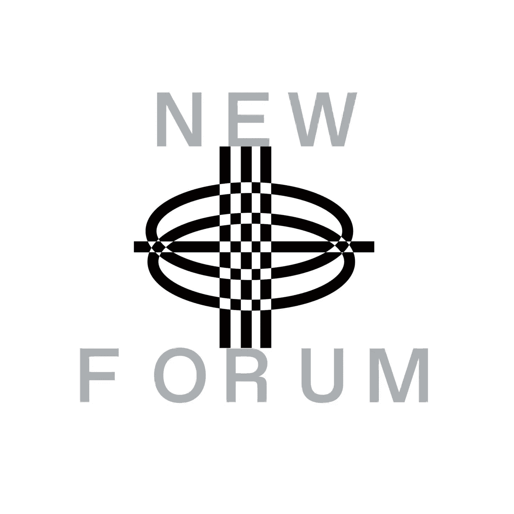

# Karsen Daily 在 Web3 中谈论传统营销和品牌发展背景

> 原文：<https://medium.com/coinmonks/karsen-daily-talks-about-traditional-marketing-brand-development-backgrounds-in-web3-76611135500a?source=collection_archive---------46----------------------->

Karsen Daily | Founder of MintCandy Productions

我们总是很荣幸在我们的播客中为你带来鼓舞人心的嘉宾，在这一集的 NEWFORUM 中我们就有这样一位嘉宾。MintCandy Productions 的创始人 Karsen Daily。Karsen 高度参与了 Web3 领域。我们在 Web3 进行了一次关于传统营销和品牌发展背景的激动人心的对话，主题是收集心理学:链上和链下；私营部门筹资和伙伴关系司筋疲力尽，迎合所有人却不迎合任何人，缺乏品牌凝聚力和认同感。我们还聊到了创作者经济的演变，以及她在哪里看到了创作者和艺术家的绝佳机会。Karsen 目前正在为艺术家 KidEight 和依维沃组合宇宙建立一个市场和平台，并告诉了我们这一切！

# Karsen 的 Crypto 和 Web3 之旅是如何开始的，她的经历是怎样的？

卡尔森曾在一家名为 Superplastics 的公司、一家初创动画工作室和一家设计玩具公司工作。她分享说，她在那里担任过许多职位，但她的最后一个角色是品牌发展总监。

卡尔森一直在寻找品牌认知和扩张的新途径和新机会。她表示，他们已经建立了一个成功的动画角色世界，甚至创建了内容并发布了它。

根据卡森的说法，这基本上是没有加密的加密媒体，他们使用 Instagram 和抖音作为他们的主要分发平台。

> “2020 年 8 月，我接到 Nifty Gateway 的一个电话，一切都超出了我的想象，但我明白了以一种分散化和民主化的方式从传统途径中赚钱的概念……”—卡森

Karsen 补充说，这不同于他们利用超级塑料的数字内容来赚钱的途径。

> “我只是对 NFT 空间和 NFT 社区周围的哲学和文化着迷，那时候是一个社区。有点不一样。我现在有点厌倦了，但我真的爱上了，我只是继续追求它……”——卡森

卡森继续追求 NFT 空间，辞去了工作，掉进了元宇宙和 Web3 的兔子洞。

卡森听说过比特币，但从未听说过以太坊。直到 2021 年 6 月，她才开始有钱包——那是在她有了第一份 NFT 工作并辞职后很久，之后她终于有了一个 MetaMask 钱包。

卡森的 Web3 和加密体验是另一个独特的故事。

卡尔森正在写一篇名为《将区块链人格化》的论文，她打算在《创世纪·NFT》的“27 次”中讨论这个问题。我们请她告诉我们关于这件事的一切。

> “我想这将是我永远的主题，是我宣言的一部分，有时我会开玩笑，这是一种自恋的说法，但我说我就像 Web3 的苏格拉底。我认为我的大部分作品和哲学将会在十年或几十年后被发现，它们会走到一起……”——卡森

她在这个领域的工作主要是注入人类的情感和同情心。

> “我总是回到哲学上来，因为对我来说，这就是创造性的主权，这就是艺术，这是自我的表达，也是身份的表达；区块链正是这种新的平台，我认为它能够创建一个永久的文件线索和记录系统，记录你的个人信仰和你的身份……”——卡森

Karsen 告诉我们，许多人了解数字身份和 PFP 以及他们在该领域所属的社区。

但从她的角度来看，区块链的人格化意味着是一种无信任的技术，它是一个无信任的生态系统，但这并不一定意味着它有信任——它只是为了消除中介而建立的。

> “通过用程序和协议取代人，我们不再需要担心或害怕被系统出卖，但使用技术的仍然是人。我们必须值得信赖，当我们使用这些东西时，这一切都归结于我们的动机和我们自己的意图……”——卡森

在这一集《新论坛》中，她深入剖析了自己论文背后的哲学。

# **Karsen 对传统 Web2 和 Web3 品牌或创业公司的区别有什么看法？**

> “因为有了 Web2，我们处于这个即时满足的镀金时代。Web3 创造了这种速度，在这种速度下，企业或品牌可以更快地起飞，这是因为在 Web2 中，我们了解了互联网和病毒式传播……”——卡森

她解释说，影响者市场正在发生变化。

实时的消费者趋势、模式和行为；我们开始利用互联网来提高产品认知度和生存能力——我们能够实时获得反馈。

请听她深入的回答，她讨论了传统的 Web2 和 Web3 品牌之间的差异，以及她在完整的采访中所说的“实时反馈”是什么意思。

# **卡森指出，艺术家不是初创公司。她这么说是什么意思？**

> “我认为，Web2 和 Web3 创意之间的另一个显著区别是，初创公司使用的是一种商业模式。我认为不可思议的是，现在——艺术家可以创造收入和机会，并真正以他们在艺术和商业史上从未有过的速度和数量将他们的作品传播出去……”——卡森

然而，卡尔森指出，我们正在失去赞助生态系统，这在历史上赋予了传统艺术家继续推动艺术创作的权力，因为他们有这种赞助。

他们有一个重要的收藏家或一小群核心收藏家，除了在情感上支持他们之外，他们还资助他们——与他们建立情感关系，以推动艺术创作。

在这一集的 NewForum 中，你可以听到更多关于卡尔森在这个问题上的观点。

不讨论创作者经济的现状，怎么谈艺术家？

# Karsen 分享了她对创作者经济的未来的看法，以及她在哪里看到了突出的机会。

> “我认为创造者经济在许多方面都有所发展，因为人们认为影响者营销和影响者时代的兴起是一种创造者经济，人们可以通过他们的利基和身份动员观众和社区来付费广告，创建媒体，建立业务和公司……”—卡森

卡森分享说，她 19 岁的妹妹从有影响力的人那里购买 90-300 美元的衣服，就像她在抖音追随的人一样，而卡森更喜欢从她喜欢的时装屋和品牌的设计师那里购买衣服。

她解释说，她会花同样的钱购买她认为有历史价值的品牌。

根据卡尔森的说法，不同的一代人正在购买衣服，因为他们的朋友有这些衣服，或者这是一个可识别的品牌身份，而这个品牌植根于一个人。

那个人成为了将社区联系在一起的核心组织。Karsen 将此视为创造者经济的第一个版本或第一代，第二个版本以区块链为动力，拥有你的收入和金融平台。以及将你的艺术、品牌等货币化的能力。

> “我认为第三版正在弄清楚如何利用这项技术。利用那些“不一定购买任何东西”的在线观众和社区……——卡森

Karsen 分享了她对传统 Web2 和 Web3 品牌或创业公司之间的差异的看法，并谈到了创作者经济的演变以及她认为创作者和艺术家的突出机会。

她还解释了她为艺术家 KidEight 和依维沃组合宇宙建立的市场和平台背后的愿景和使命。

卡森解释了链上收集和链下收集的区别，结束了这场富有哲理的对话。

✨Enjoy 这一有趣和有见地的卡森每日插曲！✨

[加入社区](https://twitter.com/newforum_nco)了解 [@karsendaily](http://www.twitter.com/karsendaily) 并在 web3 社区中发现其他创始人和远见者！

✨follow·卡尔森日报！推特: [@](https://twitter.com/alankingny) [卡尔森德利](http://www.twitter.com/karsendaily)insta gram:[@卡尔森德利](http://www.instagram.com/karsendaily)|[@ 27 times by 卡尔森德利](http://www.instagram.com/27timesbykarsendaily) LinkedIn: [卡尔森德利](https://www.linkedin.com/in/karsen-woods-557509ab)网站:[www . 27 times . XYZ](http://www.27times.xyz/)|[karsendaily.com](https://www.karsendaily.com/)

#新论坛# web 3 # creatoreconomy # NFT # communities # NFT market place #区块链

Love x NEWFORUM

# Twitter @newforum_nco

不和[@加入](https://discord.gg/DHepA4WTkN)

# NEWFORUM

[NEWFORUM](https://newforum.notion.site/newforum/Welcome-to-NEWFORUM-48f9661398ec4ec6a1af37fcc96dc926) 由 [Newcoin Foundation](https://newcoin.org/) 提供动力，专注于促进分散式社会应用(也称为 Social 3.0)的扩展，形成一个生态系统和一个由远见者、创造者和投资者组成的社区。它为思考者提供了一个交流、告知和分享想法的安全空间，以确保一个新网络的有意识和合乎道德的发展，嵌入关怀、自由和创造力的价值观。✨每周新剧集！在 [Twitter](https://twitter.com/newforum_nco) 、 [Newlife](https://newlife.io/) 、 [Youtube](https://www.youtube.com/channel/UCWvHyau1nIJBffmaaj6FmbQ) 和 [LinkedIn](https://www.linkedin.com/showcase/newforum/) 上关注我们，了解更多关于 web3 的信息，了解生态系统！加入生态系统[不和](https://discord.gg/DHepA4WTkN)！

> 交易新手？试试[密码交易机器人](/coinmonks/crypto-trading-bot-c2ffce8acb2a)或者[拷贝交易](/coinmonks/top-10-crypto-copy-trading-platforms-for-beginners-d0c37c7d698c)