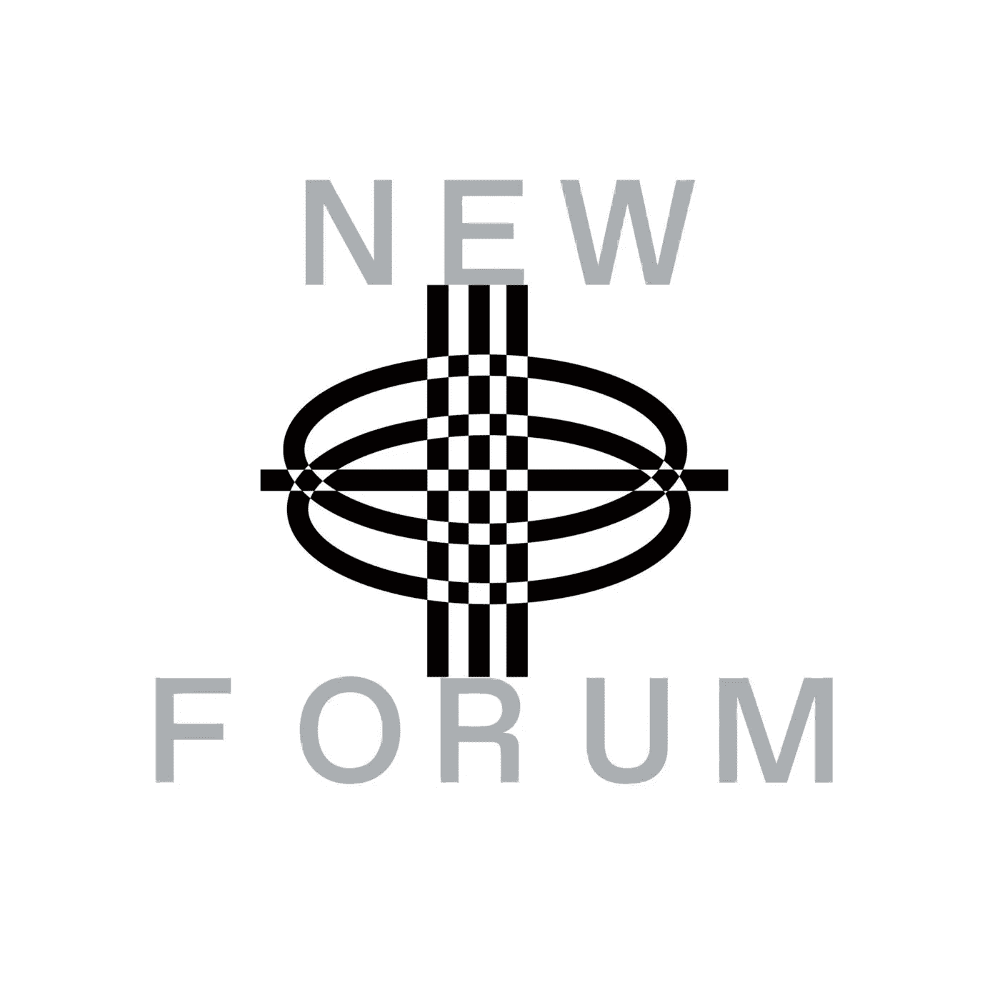

# 来自红岛的 Katia 剖析了数字时尚生态系统，并解释了作为投资工具的红岛

> 原文：<https://medium.com/coinmonks/katia-from-red-dao-dissects-digital-fashion-ecosystems-explains-daos-as-an-investing-tool-eb9ac968cda6?source=collection_archive---------27----------------------->

Katia | P2P Capital, Digital Fashion & Biotech Enthusiast

在这一集的 NewForum 中，我们请到了红岛的创始人卡蒂亚。除了红刀，卡蒂亚还参与了噪音刀和火烈鸟刀。我们与 Katia 讨论了数字时尚生态系统、传统品牌与 Web3 本土品牌的对比，以及传统品牌进军 Web3 如何取得成功。此外，她还谈到了 DAOs 作为一种投资工具和集体(例如红岛)以及投资数字时尚。

# Katia 是谁，她为什么会涉足 Web3/Crypto 领域？

2015 年，当以太坊准备好正式的公共主网发布时，卡蒂亚开始对这个空间感兴趣；当以太坊的创世街区被开采出来时，这个社区开始成长。

她回忆了自己目睹这一过程的经历，并表示这非常令人兴奋。同年，她也试图购买她的第一枚比特币——但用她自己的话说，她只是在触摸和感受空间，还没有潜得足够深。

Katia 分享说，一年后，在 2016 年，有一个名为 Steemit 的独特平台——第一个基于区块链的社交媒体，她认为这是一个令人着迷的用例。

她变得更加活跃，并努力理解社区是如何围绕共同价值观形成的。她补充说，无形和有形的价值，如 tokennomics。

> “我开始和我的合作伙伴一起投资第一层区块链和更多的基础设施投资，这是我与 P2P capital 合作的一部分，这是一家私人投资公司……”—Katia

卡蒂亚解释说，她主要做的是从以太坊到其他层的区块链连接平台(如 Polkadot 和 Cosmos)的基础设施区块链。

她在完整的采访中分享了更多关于她围绕区块链技术的工作。

同年，大约一年半前，卡蒂亚意识到自己是这个领域为数不多的女性之一。这种认识激发了人们对更有创造力的领域的兴趣。

Katia 开始更多地关注 NFTs 和 NFT 标准。她解释说这在当时并不太流行，但她认为这是一个创新的用例。

> “2019 年，除了早期最大的失败之外，还有两个第一次投资 DAO。另外两个 Dao 是 Metacartel Ventures 和 LAO 我决定加入这两个 Dao，尝试这种集体投资的运作方式，并看看这个空间将向何处发展……”——Katia

卡蒂亚解释说，这是她投资经历的另一面——所以她是 DAO 的成员，然后用 DAO 投资，探索不同的项目。

她也是火烈鸟道、噪音道、红道的成员。

RED DAO 是 DAO for Digital Fashion，旨在将对支持不断增长的数字时尚生态系统感兴趣的成员聚集在一起。

Flamingo DAO 是一家专注于 NFT 的 DAO，旨在为区块链的自有资产探索新兴投资机会。

Noise DAO 是一个音乐-NFT DAO，旨在汇集对支持跨领域音乐和技术感兴趣的成员，并支持音乐人、购买 NFT、存档、收集和投资数字音乐生态系统。

卡蒂亚有一个独特的 Web3 故事。她从一开始就在场。在她的采访中了解更多关于她如何以及为什么参与 Web3 和道投资的信息！。

# NewForum 社区对她投资数码时尚产品的经历感到好奇。在投资数码时尚或她追求的其他产品时，她到底在寻找什么？

根据卡蒂亚的说法，空间仍在形成，因此没有完美的答案。她解释说，当她看一个典型的创业公司时，有一个标准的推介平台和几个她认为有助于评估它的特征。她补充说，当看着像数字时尚这样的新领域时，有几件事情混合在一起，所以对她来说首先是审美部分，这就是她喜欢数字时尚的原因。

# 作为一名投资者，凯塔为什么会被数码时尚的美学部分所吸引？

> “作为收藏品的 NFT 运动；我们看到了许多社区建筑和文化，但至少在我看来，并不是所有的 NFT 收藏品都具有美感或美感，这正是我喜欢的数字时尚——它提升了 NFT 的空间，所以我在其中寻找创造力……”——卡蒂亚

对卡蒂亚来说，数字时尚不仅仅是拥有 3D 服装。这是一个很好的用例，例如，考虑缩放呼叫，但她感兴趣的是数字时尚何时超越了纺织品、空间和物理的界限。

> “纯粹从收藏家的角度来看，这是你在现实生活中永远无法佩戴的东西，此外还有它的投资方面；无论何时你在收集，无论是数字时尚还是普通时尚或艺术，都没有关系。我认为你应该总是考虑为什么它应该保留价值，当想到这一点时，我首先会考虑出处，那么谁是设计师，这个设计师的历史是什么。”—卡蒂亚

Katia 表示，一些传统品牌正在获得 Web3 空间并在那里建立社区，而其他品牌，她可能只是试图跳上 NFT 的列车，赚取快速收入。

卡蒂亚认为，这是你了解设计师意图的地方，这位设计师是在试图打造一些独特的东西，还是只是试图制作一件 3D 服装，卖给 NFT 的秘密人群。

卡蒂亚承认，她的方法可能不是一种技术措施，但可以帮助导航真正的社区建设，时尚背后的愿景，以及潜在的未来利益。

> “第二件事是数码时尚的可穿戴性。它与其他非传统艺术和艺术略有不同——它必须是可穿戴的，但目前，它仍是一项正在进行中的工作，因为大多数数字时尚只是收藏品。你买了它，把它放在你的钱包里，你喜欢它，但是，理想情况下，集成需要变成可穿戴的……”—卡蒂亚

这些是卡蒂亚试图回答的一些问题，当她看着设计师们销售数字时装的项目时。你的整合是什么？

*   你打算和谁一起工作？
*   我可以在哪里穿它或者炫耀它？
*   你在为分散的土地工作吗？
*   你在和 Ready Player Me 头像一起工作吗？

除了审美之外，Katia 还在考虑未来可用性和社区建设的集成，这是她个人的偏好。

在她的一条推特上，她写道-

> “仍然想知道为什么最有价值的 NFT 收藏往往是最没有审美吸引力的——至少这种趋势没有在数字时尚中持续下去。”

我们发现这个声明非常有说服力，并请 Katia 告诉我们更多关于她在帖子后面的想法。卡蒂亚认为数字时尚是创新的，超越世界的创意，但美学上更复杂，更悦目。观看她的完整采访，听听对许多人来说可能有争议的东西，但她解释说这纯粹是主观观察和偏好。

> “我个人不喜欢绿色大脑喷涌而出的猿猴。还有很多其他的项目。对我来说，秘密朋克更中性，但这也是一种文化现象。你觉得几个像素就很有审美价值吗？不，密码朋克不一样。我可以说它们并不丑，它们有点酷，但有些项目真的有点勉强合格……”——卡蒂亚

# 我们想知道为什么 Katia 喜欢 Dao，成为几个 Dao 中的一员是什么样的体验？*还有，Dao 如何赋能创作者集体投资产品和项目？*

她的主要道投资是那些在 NFT 不同地区运作。

卡蒂亚表示，你必须全职分析 NFT，才能看到趋势，并有数百万美元来操作和下注。

> “如果我喜欢某样东西，而且它很有美感。我想拥有它，但是如果你也想做投资人，要么你可以通过传统的结构做基金——有投资 NFT 空间的基金，要么你可以通过 a 道做，a 道是 Web3 原生的那种基金；这就是我接触我热爱的领域的方式，最重要的是接触这些了不起的人的智慧，他们也是道的成员……”——卡蒂亚

卡蒂亚就她接触音乐、艺术和时尚的方法给出了更多的提示和建议，即使从投资者和收藏家的角度来看，你不可能全部购买。

# **当谈到 DAOs 作为一种投资工具时，Katia 看什么？**

> “首先，我把 Dao 视为新的公司，就像哦，Dao 将取代现有的公司，Dao 将取代大公司。我的意思是，在一定程度上这仍有可能发生，但现在我认为元宇宙越来越近了。我开始看到道是通向元经文的第一扇门；就像 Dao 实际上将成为元诗一样……”——Katia

在这一集的 NewForum 中，卡蒂亚解释道是通往元宇宙的第一扇门。

# **尽管如此，在对话的 DAO 一方，我们请 Katia 告诉我们数字时尚在元宇宙是否有未来？**

卡蒂亚解释说，在她看来，数字时尚在元宇宙是有前途的。她补充说，这还需要进一步努力，因为设计师、创作者和数字时尚服装远远领先于今天的 Metaverses。

> “你可以购买它们，如果你看看纺织品和机芯，就会发现它们的质量非常好。有时我不得不放大屏幕，因为我无法相信数码时尚服装上的纺织品渲染质量，但这在基础设施方面遥遥领先；现在，除了把 web3 放在 web2 上之外，你能把它放在上面的地方真的很少了……”——卡蒂亚

卡蒂亚说放 Web2-Web3 是什么意思？她在完整的采访中不紧不慢地解释了这句话。

# 卡蒂亚是红岛的创始成员。自然，我们渴望听到她对元宇宙将如何影响整个时尚产业的看法？以及传统品牌如何进军 Web3 并取得成功

> “对此有不同的看法——甚至在红岛内部，对传统时尚品牌及其定位也是如此。那些现在正在建立社区并进入 Web3 的公司了解 Web3 文化，而不仅仅是试图向那些有很多秘密的人销售，这是我有时感觉到的，但一些品牌真的试图让 web3 文化也朝着那个方向发展。我认为它们会成为元宇宙成功的传统品牌……”——Katia

卡蒂亚补充说，她相信我们将会看到更多的 Web3 本土设计师，她对此非常感兴趣。

她描述了为什么她对本土设计师最感兴趣的兴奋，以及她所拥有的期待；在她的完整采访中，他们将在美学、工具等方面带来创新！

在我们与凯塔愉快的交谈结束时，她提到了虚拟现实、增强现实和游戏改变时尚产业的潜力。

错过这个有见地的，翔实的，道和数码时尚为中心的插曲与卡蒂亚！✨

[加入社区](https://twitter.com/newforum_nco)了解 [@katiaandme](https://twitter.com/katiaandme) 并在 web3 社区中发现其他创始人和远见者！

✨Follow 卡蒂亚&红岛！推特:[@ katiaandme](https://twitter.com/katiaandme)|[@ RED _ _ _ DAO](https://twitter.com/RED___DAO)

# newforum # web3 # daos # nft #区块链#社区#数字时尚#web3 投资#加密

爱 x 新论坛

# Twitter @newforum_nco

不和谐[@加入](https://discord.gg/DHepA4WTkN)

# 新论坛

[NewForum](https://newforum.notion.site/newforum/Welcome-to-NewForum-48f9661398ec4ec6a1af37fcc96dc926) 由 [Newcoin Foundation](https://newcoin.org/) 提供支持，专注于促进去中心化社交应用的扩展，也被称为 Social 3.0，形成一个生态系统和一个由远见者、创造者和投资者组成的社区。它为思想者提供了一个安全的交流、传播和分享思想的空间，以确保一个新网络的自觉和道德发展，嵌入关怀、自由和创造力的价值观。✨每周新集！在 [Twitter](https://twitter.com/newforum_nco) 、 [Newlife](https://newlife.io/) 、 [Youtube](https://www.youtube.com/channel/UCWvHyau1nIJBffmaaj6FmbQ) 和 [LinkedIn](https://www.linkedin.com/showcase/newforum/) 上关注我们，了解 web3 的更多信息，认识生态系统！加入生态系统[不和](https://discord.gg/DHepA4WTkN)！

> 交易新手？在[最佳加密交易](/coinmonks/crypto-exchange-dd2f9d6f3769)上尝试[加密交易机器人](/coinmonks/crypto-trading-bot-c2ffce8acb2a)或[复制交易](/coinmonks/top-10-crypto-copy-trading-platforms-for-beginners-d0c37c7d698c)