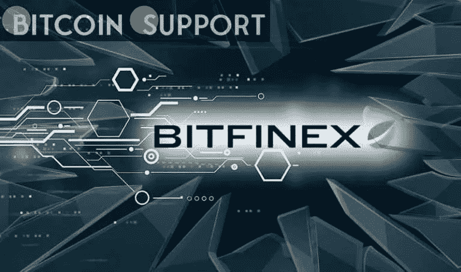

# 哈萨克斯坦推出了 Bitfinex 安全令牌平台

> 原文：<https://medium.com/coinmonks/kazakhstan-has-launched-the-bitfinex-security-token-platform-c934c216b89d?source=collection_archive---------74----------------------->

**Visit our website:-** [**https://bitcoinsupports.com/**](https://bitcoinsupports.com/)

Bitfinex 推出其 STO 平台，带有与 BTC 矿业相关的令牌，而比特币矿业交易正在哈萨克斯坦减少。全球主要加密货币交易所 Bitfinex 在哈萨克斯坦推出了其安全令牌平台(STO)，并开始了第一天的交易。

周二，Bitfinex 位于区块链的投资平台 Bitfinex Securities 将上线。

2021 年 9 月宣布成立的新 STO 平台由哈国家金融中心阿斯塔纳国际金融中心(AIFC)控制。Bitfinex Securities 首席技术官 Paolo Ardoino 表示，Bitfinex Securities 位于哈萨克斯坦的一个经济特区，拥有独立的法院系统。加拿大和美国等国家的公民和居民无法使用该平台。根据新闻稿，Bitfinex Securities 正在推出 Blockstream Mining Note (BMN)交易，这是一种安全令牌，允许合格的非美国投资者使用 BMN 哈希利率开采比特币或投资 BTC 矿业股票。该代币将在比特币的流动性侧链上与 BTC 和美元交易，允许合格投资者参与比特币挖矿。Ardoino 说:“这表明了合格投资者对比特币挖矿的潜在需求，这是由 BMN 的企业级基础设施促成的。”。他接着表示，该公司将继续与当地监管机构以及希望利用 STO 平台筹集资金的公司保持密切接触。

比特币采矿业务在哈萨克斯坦似乎正在衰落，因为当地政府最近宣布关闭许多采矿设施，并提议提高能源价格以及征收新的加密采矿税。

根据剑桥比特币电力消费指数，截至去年 8 月，哈萨克斯坦是世界上最大的 BTC 矿业国家之一，其散列率超过全球 BTC 散列率的 18%，仅次于美国。

**访问我们的网站:-**[**https://bitcoinsupports.com/**](https://bitcoinsupports.com/)

**免责声明:以上为作者观点，不应视为投资建议。读者应该自己做研究。**

> 加入 Coinmonks [电报频道](https://t.me/coincodecap)和 [Youtube 频道](https://www.youtube.com/c/coinmonks/videos)了解加密交易和投资

# 另外，阅读

*   [氹欞侊贸易评论](https://coincodecap.com/anny-trade-review) | [Paybis 评论](https://coincodecap.com/paybis-review) | [Keevo 钱包评论](https://coincodecap.com/keevo-wallet-review)
*   [印度最佳 P2P 加密交易所](https://coincodecap.com/p2p-crypto-exchanges-in-india) | [柴犬钱包](https://coincodecap.com/baby-shiba-inu-wallets)
*   [八大加密附属计划](https://coincodecap.com/crypto-affiliate-programs) | [eToro vs 比特币基地](https://coincodecap.com/etoro-vs-coinbase)
*   [最佳以太坊钱包](https://coincodecap.com/best-ethereum-wallets) | [电报上的加密货币机器人](https://coincodecap.com/telegram-crypto-bots)
*   [交易杠杆代币的最佳交易所](https://coincodecap.com/leveraged-token-exchanges) | [购买 HTZ 代币](https://coincodecap.com/how-to-buy-htz-token)
*   [5 大最佳社交交易平台](https://coincodecap.com/best-social-trading-platforms) | [瓦济克斯 NFT 印度](https://coincodecap.com/wazirx-nft-india)
*   [10 本关于加密的最佳书籍](https://coincodecap.com/best-crypto-books) | [英国 5 个最佳加密机器人](https://coincodecap.com/uk-trading-bots)
*   [ko only 回顾](https://coincodecap.com/koinly-review) | [Binaryx 回顾](https://coincodecap.com/binaryx-review)|[Hodlnaut vs CakeDefi](https://coincodecap.com/hodlnaut-vs-cakedefi-vs-celsius)
*   [比斯勒评论](https://coincodecap.com/bitsler-review)|[WazirX vs coin switch vs coin dcx](https://coincodecap.com/wazirx-vs-coinswitch-vs-coindcx)
*   [赢取注册奖金——10 大最佳加密平台](https://coincodecap.com/earn-sign-up-bonus)
*   [最佳加密交易信号电报](/coinmonks/best-crypto-signals-telegram-5785cdbc4b2b) | [MoonXBT 评论](/coinmonks/moonxbt-review-6e4ab26d037)