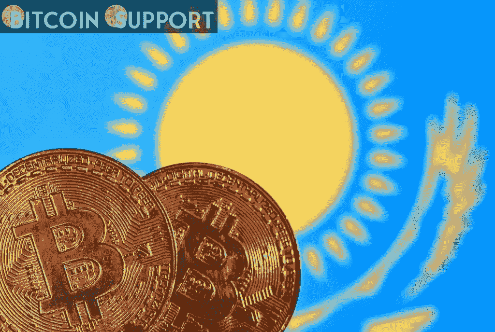

# 在下一次指数更新中，哈萨克斯坦将失去其在比特币散列率方面的领先地位

> 原文：<https://medium.com/coinmonks/kazakhstan-is-set-to-lose-its-lead-in-bitcoin-hash-rate-in-the-next-index-update-73568243cee3?source=collection_archive---------56----------------------->

[https://bitcoinsupports.com/](https://bitcoinsupports.com/)

中国加密矿业巨头比特矿业已经放弃了在哈萨克斯坦的一些扩张计划。

据业内专家预测，在即将到来的散列率分布更新中，世界顶级比特币(BTC)开采地区之一的哈萨克斯坦预计将失去其 BTC 散列率份额领先地位。

根据剑桥比特币电力消耗指数(CBECI)，2021 年 8 月，哈萨克斯坦的比特币杂凑率几乎占全球的 18%，仅次于美国。

中国打击加密货币引发的大规模中国矿工外逃，促成了哈 BTC 矿业力量的增长。在 2021 年 8 月降至零之前，中国的 BTC 哈希率在 2019 年的贡献率超过 75%。然而，尽管迦南和 BTC.com 等中国主要 BTC 矿业公司将在 2021 年将业务转移到哈萨克斯坦，但许多行业高管认为，由于各种因素，哈萨克斯坦最终将失去其散列率份额。因此，在定于 3 月份发布的下一份 CBECI 报告中，哈萨克斯坦很可能会跌出 BTC 三大矿业国家之外。

[https://bitcoinsupports.com/](https://bitcoinsupports.com/)

据数据中心初创公司 Soluna Computing 的企业发展副总裁 Phillip Ng 称，由于不可持续的电力补贴，哈萨克斯坦的比特币开采最终将会下降。

“我们预计哈萨克斯坦将继续进行一些开采，但我们预计未来它在全球哈希率中的占比不会超过 10%至 15%。”原因是哈萨克斯坦的电力补贴是不可持续的，”Ng 告诉记者。他强调了 1 月份的指控，即哈萨克斯坦官员正考虑减少电力补贴，以平衡该国经济。

根据 Origin Protocol 联合创始人 Josh Fraser 的说法，哈萨克斯坦对石油和天然气行业的依赖是该国失去 BTC 矿业领导地位的另一个原因。

“由于价格上涨或国家干预，严重依赖这些能源进行秘密开采的国家可能会见证哈希费率的下降，”弗雷泽表示，他强调了持续的地缘政治紧张局势对石油和天然气价格的影响。

“鉴于丰富的可再生能源和最近的散列率增长，我预测美国、加拿大和德国在全球散列率中的份额将略有上升。弗雷泽预测说:“我认为俄罗斯、哈萨克斯坦和伊朗将会受到冲击。据此前报道，由于政治动荡，哈萨克斯坦在 1 月初遭受了巨大的哈希费率波动，该国执政内阁辞职，政府关闭互联网数日。根据 Lesperance Associates 的管理合伙人兼税务顾问 David Lesperance 的说法，政治动荡、能源价格可能上涨以及对地下采矿征税的增加都将使哈萨克斯坦对矿工的吸引力下降。莱斯佩兰斯说:“随着哈萨克斯坦考虑提高加密采矿者的税收，我相信那些之前没有被最近的互联网中断所震惊的采矿者将会有另一个动力来寻找一个更好的长期运营网站。”他继续说道，地下采矿者必须选择一个符合长期成功的诸多要求的管辖区，包括长期价格可预测的可靠绿色能源供应、保护运营的法治、政治稳定的国家等等。一些中国地下采矿巨头已经发出信号，可能会停止在哈萨克斯坦的扩张。根据 2 月 17 日提交给美国证券交易委员会的文件，2021 年将业务从中国转移到哈萨克斯坦的 BTC 顶级矿业公司之一比特矿业(BIT Mining)正在放弃其在哈萨克斯坦的一些加密采矿雄心。比特矿业在文件中声称:“由于当地电力供应不确定，该公司已经取消了 2021 年 5 月宣布的哈萨克斯坦数据中心发展计划。“该公司还表示，它继续在该国经营 BTC 采矿钻机，总哈希速率能力为 292.7 PH/s。

**免责声明:这些是作者的意见，不应被视为投资建议。读者应该自己做研究。**

> 加入 Coinmonks [电报频道](https://t.me/coincodecap)和 [Youtube 频道](https://www.youtube.com/c/coinmonks/videos)了解加密交易和投资

# 另外，阅读

*   [最佳以太坊钱包](https://coincodecap.com/best-ethereum-wallets) | [电报上的加密货币机器人](https://coincodecap.com/telegram-crypto-bots)
*   [交易杠杆代币的最佳交易所](https://coincodecap.com/leveraged-token-exchanges) | [购买 Floki](https://coincodecap.com/buy-floki-inu-token)
*   [3 commas vs . Pionex vs . crypto hopper](https://coincodecap.com/3commas-vs-pionex-vs-cryptohopper)|[Bingbon Review](https://coincodecap.com/bingbon-review)
*   [加密复制交易平台](/coinmonks/top-10-crypto-copy-trading-platforms-for-beginners-d0c37c7d698c) | [如何在 WazirX 上购买比特币](/coinmonks/buy-bitcoin-on-wazirx-2d12b7989af1)
*   [CoinLoan 评论【Crypto.com】|](https://coincodecap.com/coinloan-review)[评论](/coinmonks/crypto-com-review-f143dca1f74c)
*   [如何在加拿大购买加密货币？](https://coincodecap.com/how-to-buy-cryptocurrency-in-canada)
*   [无聊猿游艇俱乐部(BAYC)评论](https://coincodecap.com/bored-ape-yacht-club-bayc-review)
*   [5 款最佳加密交易终端](https://coincodecap.com/crypto-trading-terminals) | [最佳 DeFi 应用](https://coincodecap.com/best-defi-apps)
*   [最佳网上赌场](https://coincodecap.com/best-online-casinos) | [币安评论](/coinmonks/binance-review-ee10d3bf3b6e) | [BitMEX 评论](https://coincodecap.com/bitmex-review)
*   [麻雀交换评论](https://coincodecap.com/sparrow-exchange-review) | [纳什交换评论](https://coincodecap.com/nash-exchange-review)