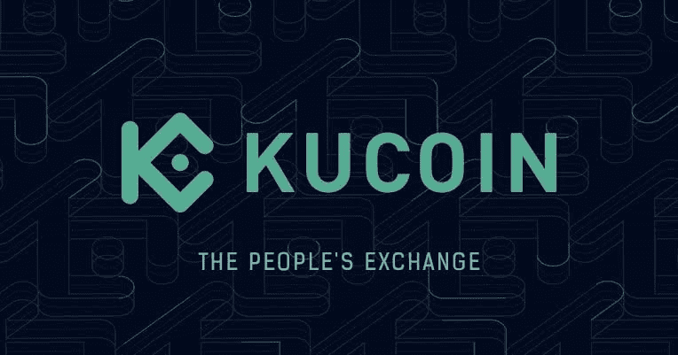
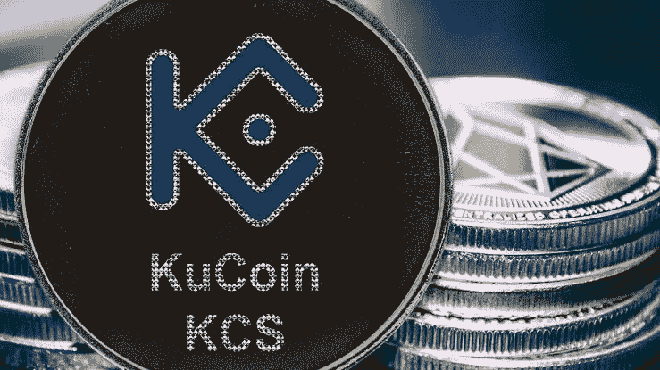
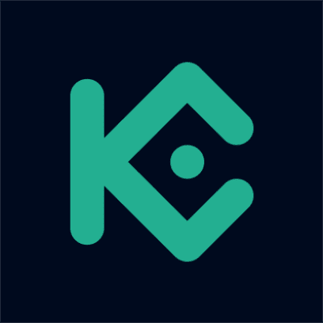

# KCS 硬币价格预测:KCS 硬币是一个好的投资吗？

> 原文：<https://medium.com/coinmonks/kcs-coin-price-prediction-is-kcs-coin-a-good-investment-3a6c66b7de0a?source=collection_archive---------47----------------------->

2017 年库币交易所推出 Kcs 以来，kcs 币暴涨 3000%，推出后；许多用户看到了投资项目的潜力，因为它的用例以及项目的一些巨大的特性。

然而，由于它的一些声明和向执行一些小任务的用户运行 Airdrop，它最近获得了很多关注。

库币交易所被贴上了“人民交易所”的标签。与此同时，该交易所推出了自己的代币，让用户受益，并拥有 kcs 库币交易所的用户可以用 KCS 来支付交易费用。

然而，这篇文章需要详细介绍 Kcs，其价格预测，以及 Kcs 是否是一个好的投资。当你仔细阅读时，请拿一杯酒坐下

# 什么是 KCS 硬币？

KCS 是 KuCoin 的原生代币，该代币于 2017 年推出，作为一种利润分享代币，允许交易者从交易所中提取价值。它是作为运行在以太坊网络上的 ERC-20 令牌发行的，并得到大多数以太坊钱包的支持。KCS 的总供应量设定为 2 亿，并计划回购和焚烧，直到只剩下 1 亿 KCS。随着库币去中心化交易解决方案的上线，KCS 迟早会成为库币去中心化金融服务的本地资产，也是库币社区未来的治理标志。

KuCoin 还宣布,“赋予 KCS 权力”将是 KuCoin 的一个关键优先事项，并将把 KCS 打造成一个杀手级产品，而不是一个简单的象征，这必将进一步丰富 KCS 持有者可以获得的利益。从长远来看，KCS 是整个库币生态系统的关键。随着 DEX 和 KuChain 的开发，KCS 也将成为未来 KuCoin 分散式产品的基础燃料和通用令牌。

# KCS 硬币价格预测 2022-2031

目前，KuCoin Token (KCS)以 19.91 美元的价格在整个加密市场排名第 67 位，其中包括 8012 万美元(80，118，638 KCS)的流通供应量和 1.7012 亿美元(170，118，638 KCS)的总供应量。

截至撰写本文时，其最大供应量为 1.7012 亿美元(170，118，638 KCS)，其市值为 16 亿美元(1，595，483，948.98 美元)，其完全稀释后的市值为 33.9 亿美元(3，387，745，512.48 美元)。

[**了解更多价格预测**](https://bulliscoming.com/kcs-coin-price-prediction/)

# KCS 硬币是一个好的投资吗？

KCS 有许多巨大的特点将使价格在不久的将来更加飙升，KCS 奖金被视为获得被动收入的最佳途径之一。持有 6 个以上 KCS 的用户可以获得每日分红；这笔收入来自 KuCoin 每日交易费收入的 50%。

KCS 奖金是针对 KCS 持有者和库币生态系统建设者的独特激励机制。用户可以获得的奖励金额取决于持有 KCS 的数量和库币交易所的交易量。

KCS 是 kucoin 交易所的公用令牌，用户可以用它来支付交易费用，凭借所有这些功能，价格将飙升，并为其投资者/持有人带来良好的投资回报

**也可阅读:**[Stepn(GMT)Crypto 2022 年价格预测 Stepn Crypto 是个好投资吗？](https://bulliscoming.com/stepngmt-crypto-price-prediction-2022/)

# 结论

KuCoin 采用标准加密协议，确保系统内的用户数据和数据传输对其他用户隐藏。

它使用多集群和多层架构系统，可以同时容纳多个事务，确保每个事务的系统稳定性。

然而，这篇文章不是金融建议，而只是一篇传递信息的教育性文章。

> 加入 Coinmonks [电报频道](https://t.me/coincodecap)和 [Youtube 频道](https://www.youtube.com/c/coinmonks/videos)了解加密交易和投资

# 另外，阅读

*   [Remitano 审查](https://coincodecap.com/remitano-review)|[1 英寸协议指南](https://coincodecap.com/1inch) | [购买 Floki](https://coincodecap.com/buy-floki-inu-token)
*   [MoonXBT vs Bybit vs 币安](https://coincodecap.com/bybit-binance-moonxbt) | [Arbitrum:第二层解决方案](https://coincodecap.com/arbitrum)
*   [买 PancakeSwap(蛋糕)](https://coincodecap.com/buy-pancakeswap)|[matrix export Review](https://coincodecap.com/matrixport-review)
*   [最佳免费加密信号](https://coincodecap.com/free-crypto-signals) | [YoBit 评论](/coinmonks/yobit-review-175464162c62) | [Bitbns 评论](/coinmonks/bitbns-review-38256a07e161)
*   [OKEx 回顾](/coinmonks/okex-review-6b369304110f) | [Kucoin 交易机器人](/coinmonks/kucoin-trading-bot-automate-your-trades-8cf0ca2138e0) | [期货交易机器人](/coinmonks/futures-trading-bots-5a282ccee3f5)