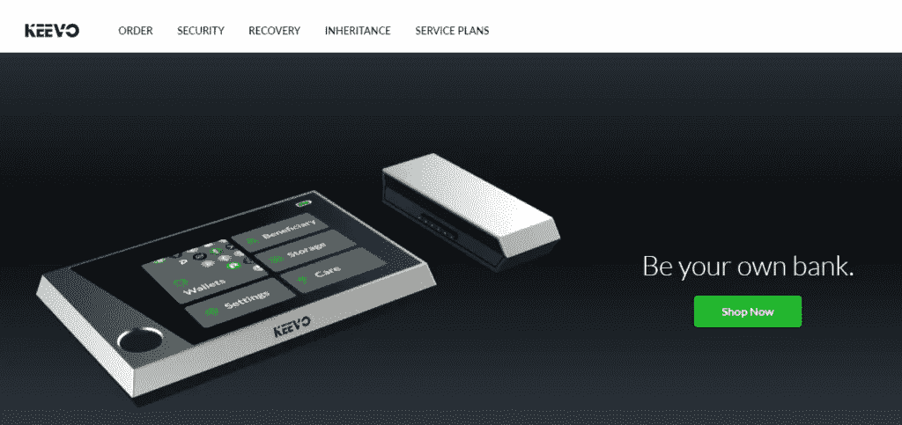
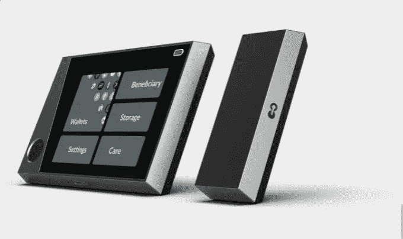
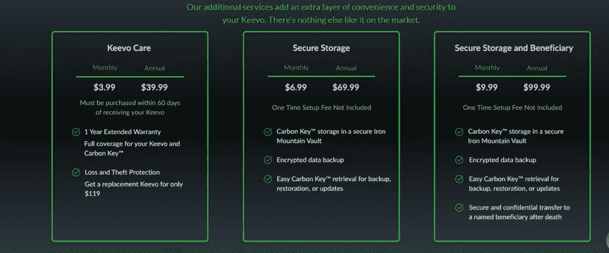
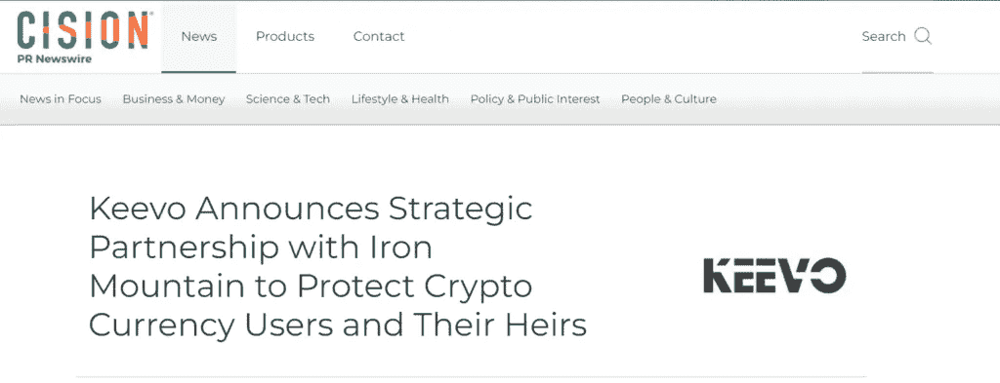
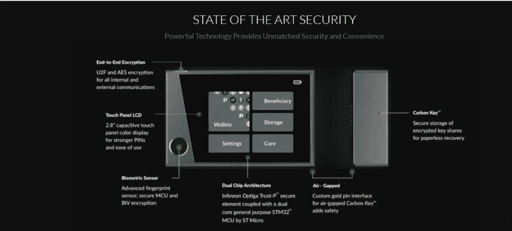
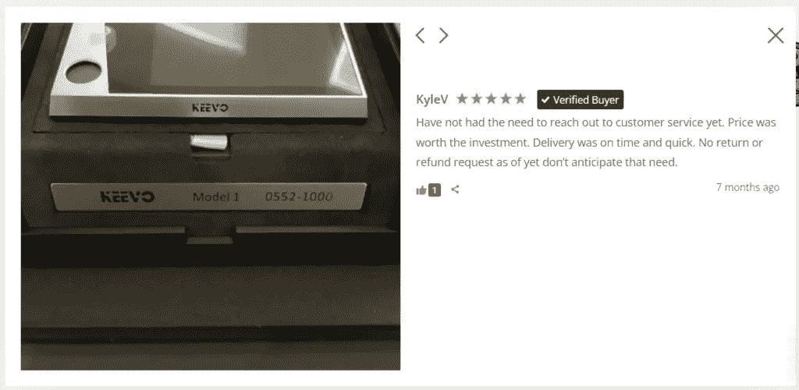
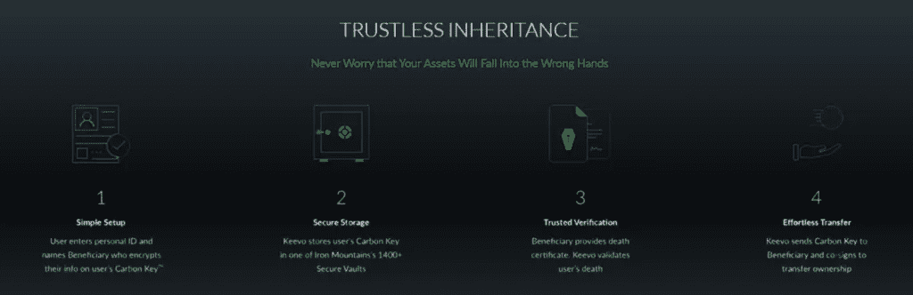
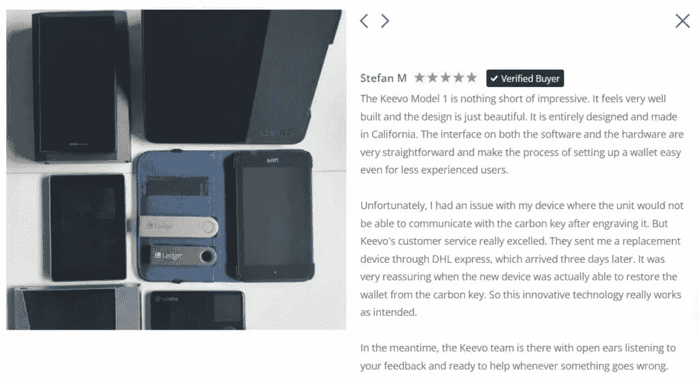
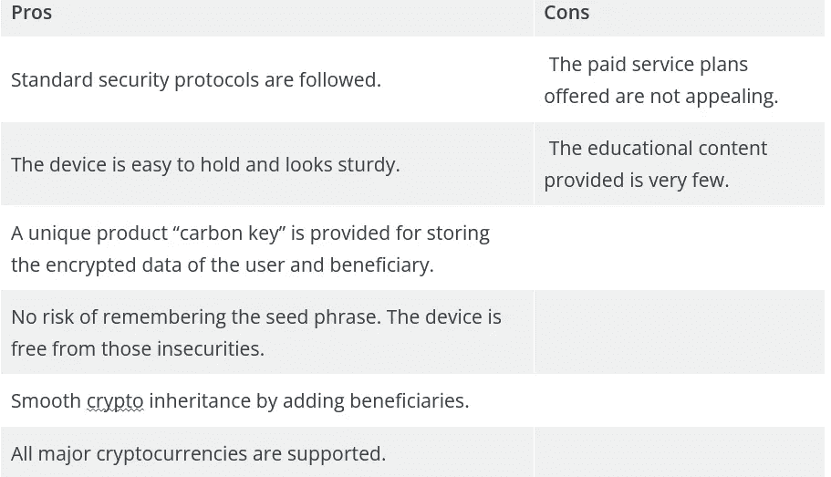
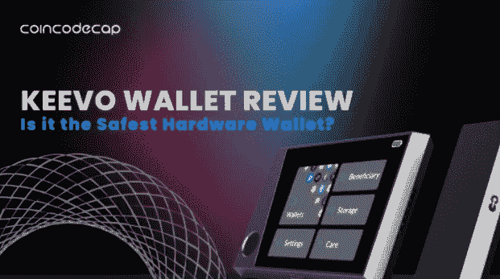

# Keevo 钱包点评:是最安全的硬件钱包吗？

> 原文：<https://medium.com/coinmonks/keevo-wallet-d61b26dca3c?source=collection_archive---------6----------------------->

让我先问一个问题:失去硬件钱包的种子短语让你害怕吗？我们都知道硬件钱包比软件钱包安全。但作为初学者，很难找到合适的加密硬件钱包。成功使用硬件钱包的基本标准是安全地保存“种子短语”。这让我感到害怕。如果我丢失了种子短语怎么办？

因此，在这篇 Keevo Wallet 评论中，我们将讨论他们如何改变我们看待硬件钱包的方式。Keevo 提出了一项正在申请专利的四因素认证系统和安全 MCU。

要了解更多信息，请阅读我们关于存储比特币的最佳加密硬件钱包的指南。

## 摘要

*   **Keevo 钱包**是一个硬件设备。
*   您可以通过 USB 将设备与 PC 或笔记本电脑连接。
*   该设备外观时尚，易于握持。
*   他们提供多种免费服务和付费节目。
*   所提供的安全性是市场上最高标准的多因素身份认证。
*   keevo 钱包配有独特的 Carbon 密钥，可帮助设备在没有种子短语的情况下进行恢复
*   你可以通过电子邮件和在线聊天服务与他们联系。

## 什么是 Keevo 钱包？

Keevo 钱包是一款硬件钱包，具有多因子/多签名认证系统。这款硬件钱包旨在为您提供安全性，同时也为您提供了避免丢失种子短语的解决方案。有了这个钱包，你可以在区块链上管理你的数字资产，而无需中介介入。就像他们说的，“做自己的银行”。钱包为您所有的加密交易提供了一个安全、方便、灵活的解决方案。

## 多重签名认证系统

*   Keevo 钱包是首款提供 4FA(四因素认证)的硬件钱包。
*   实体钱包是你需要输入密码或 PIN 的地方。除此之外，您还可以获得生物指纹来加密和解密私钥。
*   钱包的核心创新在于，它不需要种子短语来恢复丢失的设备。
*   MF/MSA 还使用户能够以最安全和分散的方式拥有其虚拟资产的受益人。

## Keevo 钱包评论:关键组件

Keevo 钱包由以下四个主要部分组成:

*   Keevo 五金钱包
*   碳钥匙
*   桌面应用程序
*   Keevo 高级附加服务

## Keevo 硬件钱包有什么值得期待的？

钱包将用户的私钥安全地存储在一个“气隙”设备中。此外，您还将获得一个 2.8 英寸的 TCP LCD 显示屏，用于设置您的数字身份。有了这个，你可以注册自己，设置你的私人密钥，注册与 keevo 服务，并管理你的区块链上的数字资产。您可以获得指纹传感器，以实现更快、更安全的交易。此外，还提供了一个 USB 端口来连接您的钱包和 PC。钱包也连接碳钥匙。

## 从 Keevo Carbon Key 可以期待什么？

Keevo 碳质钥匙是钱包的独特组成部分。它有一个独立的安全存储元件。此元素用于接收钱包的备份。此外，存储器保存加密信息及其保管人，也称为受益人。

当钱包丢失、被盗或无法使用时，此元素很有用。此外，如果您忘记了密码或无法使用指纹传感器，它也很方便。

## Keevo 钱包评论:桌面应用

Keevo 桌面应用程序是一个可下载的软件应用程序。该应用程序有助于管理公钥、数字资产和其他功能，包括检查余额、基于第三方交换读取资产值、将加密货币转移到其他用户的公共地址等。虽然应用程序在互联网上运行，但 Keevo 硬件设备和桌面应用程序之间的通信协议使其保持安全，不会让任何威胁篡改设备。最后，该应用程序有助于轻松方便地管理用户的操作。

## Keevo 高级附加服务

Keevo Premium Plus 服务的优势包括更高的安全性、更高的便利性以及管理您的数字资产的许多其他优势。

向 Keevo 用户提供的服务如下:

*   首先，他们让用户安全地转移到 keevo，并依靠 keevo 将他们的 carbon key 存储在一个安全的 Iron Mountain 保险库中。这保护了他们的数据，因此即使是 Keevo 也无法访问用户的加密数据。
*   该服务还包括如果由于不幸而丢失数据或者如果设备不可操作，则检索和恢复数据。
*   最后，它们使用户能够指定和初始化受益人。

## Keevo 护理服务付费计划

提供了以下三种计划:

*   Keevo Care:月费 3.99 美元，年费 39.99 美元
*   安全存储:月费 6.99 美元，年费 69.99 美元
*   安全存储和受益人:月费 9.99 美元，年费 99.9 美元

***也读:*** [***SecuX STONE 五金钱包点评|八五折优惠券***](https://blog.coincodecap.com/secux-stone-hardware-wallet-review)

## Keevo 钱包有什么独特之处？

Keevo 钱包的独特之处在于它的“回收”功能。Keevo 是第一个推出硬件钱包的平台，可以在没有种子短语的情况下执行恢复。

该钱包旨在存储您的资产和加密数据和指纹记录与独特的碳关键。碳素钥匙随设备附送，更容易保存。

Keevo 和 Iron Mountain 是这项单一服务的战略合作伙伴。Iron Mountain 在 50 个国家拥有 1480 个设施和 120 的数据。此外，Keevo 和 Iron Mountain 还提供以下优势:

*   用户碳钥匙(数据)储存在铁山温控安全金库里。
*   备份安全地存储在一个有空隙的数据库中。
*   全天候安全和监管链控制。
*   方便的重新存储和检索选项。

对于一些用户来说，保存加密数据的 carbon key 是一个很好的选择，可以帮助他们摆脱不安全感和焦虑感。然而，一些用户可能不喜欢将他们的私钥给任何人，而不考虑安全性。这个决定可能因人而异。因此，在购买产品之前，一定要做好调查。

其他独特之处包括它的设计和外观。首先，它采用时尚的设计，配有 2.8 英寸触摸显示屏。显示屏便于握持，外观美观。该结构由锌合金制成，玻璃纤维增强 ABS 车身，内部钢筋提供耐用性和保护。

***也读:*** [***Prokey 点评——该不该买这款硬件钱包？***](https://blog.coincodecap.com/prokey-review)

## Keevo 钱包用起来安全吗？

Keevo 钱包遵循的安全协议如下:

*   **端到端加密:**它们提供通用的双因素身份验证，并遵循高级标准对所有内部和外部通信进行加密。
*   **触摸面板 LCD:** 彩色触摸面板显示屏创建密码和 pin。LCD 使操作变得简单。
*   **生物传感器:**高级指纹传感器，安全多点控制单元等。
*   **双芯片架构:**英飞凌 Optiga Trust-P 安全元件与 ST Micro 的双核通用 STM32 MCU 相耦合。
*   **气隙:**该设备带有一个用于气隙碳键的定制金销接口。独特的产品进一步增加了设备的安全性。
*   对于 Keevo，在生成您的私有主密钥后，他们不会将其存储在内存中的任何位置；取而代之的是，该平台将其分割成所谓的密钥共享——一个存储在 Keevo 钱包本身的安全芯片上，另一个用您的强密码加密，第三个用您的指纹加密，第四个用连接到 Keevo 的独立设备 Carbon Key 加密。此外，您可以用这些密钥份额或因素中的任何 3 个来恢复您的私人主密钥。

最后，该设备的冷藏资产设施可保护其免受网络攻击。

***另请阅读:*** [***加密钱包最佳实践——如何保护您的硬币？***](https://blog.coincodecap.com/how-to-secure-your-crypto-wallet)

## 如何设置和初始化 Keevo 钱包？

当您收到钱包时，您必须进行注册。除登记外，您还可以登记受益人。设备和其他因素也将在设置设备时初始化。

在初始化设备时，用户将了解创建的因素及其功能。

## Keevo 钱包回顾:初始化硬件

*   将 Keevo 钱包连接到您的笔记本电脑或电脑上。
*   然后，设备将生成主密钥，一个随机生成的数字。
*   一旦生成了主密钥，您就必须设置其余的因素。有四个因素:钱包设备因素、个人识别码、用户指纹因素和 Keevo Carbon 密钥因素。
*   跟随屏幕，然后输入他们的个人识别码和指纹。该指纹将解锁拥有加密指纹的商店。
*   然后，您将获得所提供的用户福利和服务，并有机会注册该付费服务。
*   如果您不选择付费服务，屏幕将遵循以下指南。
*   系统会要求您连接碳键，当您需要断开设备与电脑或笔记本电脑的连接时，设备会告诉您时间。

对于选择**有偿服务的用户，应遵循**附加步骤:

*   一旦您选择了该服务，请按照屏幕上的说明进行注册。接下来，您将被要求下载 Keevo 的应用程序。当应用程序打开时，用您的详细信息登录。
*   然后，申请将开始 KYC 进程。在 KYC 流程中，您必须提供您的姓名、地址、电话号码、设置密码等。
*   验证过程完成后，您将收到关于订阅的通知。此外，在进行 KYC 操作时生成的公钥也将被发送到该设备。
*   然后，界面会询问受益人，如果您愿意，可以填写详细信息。您将再次需要浏览屏幕说明，并提供您的指纹和 PIN。然后，该设备将创建受益人商店。

## 对硬件付费服务计划有什么期待？

通过付费服务计划，您将有机会建立他们的受益人账户。该设备将为您的受益人创建商店，并为其生成因子。加密完成后，该设备会将受益人的数据存储到 carbon key 中。受益人的设置是加密继承的一大优势。

***也读:*** [***最佳卡达诺钱包:软件 vs 硬件***](https://blog.coincodecap.com/best-cardano-wallets)

## Keevo 钱包评论:模型

该平台目前正在接受其模型一的订单。请注意，国际递送会有关税。该设备目前支持以下操作系统:Windows 10 和 MacOS Catalina 或更新版本。官方网站的评分为 4.74，并附有多张图片作为评论。

## 支持硬币

该钱包支持所有主要的加密货币，如比特币、以太坊、XRP、Dogecoin、比特币现金、比特币 SV、戴等。要查看完整列表，请点击此处的。

## Keevo 钱包评论:联系和支持

用户可以从平台上的新闻编辑室和常见问题中受益。如需进一步帮助和查询，您可以通过[contact@keevowallet.com](mailto:contact@keevowallet.com)联系他们。你也可以在实时聊天中提出你的问题，因为这个平台反应很快。

## 利弊

Keevo wallet Pros and Cons

## Keevo 钱包评论:结论

总的来说，硬件设备是好的。该设备的价格是可以负担得起的，并且这笔钱是值得花的，因为该设备是有用的，设计是伟大的。

提供的大多数服务都是免费的。然而，付费计划更有吸引力，因为你可以把碳钥匙存放在有空隙的地下室里。此外，Keevo 提出了一种多因素认证系统和一种新的密码继承方法。我们相信 Keevo 可能是你能找到的最好的选择之一。然而，每当购买硬件钱包总是做你的研究。

## 常见问题

W **如果 Keevo Carbon Key 在与注册 Keevo 服务的用户之间的运输过程中丢失，该怎么办？**

如果用户在往返 Keevo 的运输过程中丢失了碳密钥，只要他们有硬件设备，就可以要求使用加密的新密码生成新的碳密钥。丢失的碳钥匙将失效和无用。

**Keevo 是否可以凭借 Keevo 存储用户的 Carbon Key 黑进注册用户的账号？**

Keevo 无法侵入用户的设备。要做到这一点，Keevo 至少需要三个因素来解密设备。他们只有一个因素，那就是碳关键因素。不可能安排三个因素，因此 Keevo 无法侵入注册用户的帐户。

**受益人能否在用户去世前恢复 Keevo 硬件钱包设备？**

只有当注册用户的死亡得到确认时，受益人才能使用万能钥匙。即使受益人获得了硬件和碳密钥，他们也不能单独用碳密钥解密设备。

**Keevo HW Wallet 或 Carbon Key 在运输过程中会被拦截，从而导致用户收到被入侵的设备吗？**

Keevo 用一种安全的方法来运输设备。然而，一旦设备在用户手中，就没有保证了。Keevo 可以通过绊网、缓解和补救方法检测设备是否被篡改。

**我何时/如何续订，如果我决定不续订 Keevo 服务，会发生什么情况？**

Keevo 服务将在每年的周年纪念日自动更新。如果您决定取消续订，他们可以在续订前三十天取消续订。在取消服务的情况下，Keevo 将发送存放在保险库的碳钥匙。

**同样，阅读**

*   [7 个最佳零费用加密交易平台](https://coincodecap.com/zero-fee-crypto-exchanges)
*   [最佳网上赌场](https://coincodecap.com/best-online-casinos) | [期货交易机器人](/coinmonks/futures-trading-bots-5a282ccee3f5)
*   [阿联酋 5 大最佳加密交易所](https://coincodecap.com/best-crypto-exchanges-in-uae) | [SimpleSwap 评论](https://coincodecap.com/simpleswap-review)
*   购买 Dogecoin 的 7 种最佳方式 | [ZebPay 评论](https://coincodecap.com/zebpay-review)
*   [最佳期货交易信号](https://coincodecap.com/futures-trading-signals) | [期交所评论](https://coincodecap.com/liquid-exchange-review)
*   [用于 Huobi 的加密交易信号](https://coincodecap.com/huobi-crypto-trading-signals) | [Swapzone 审查](/coinmonks/swapzone-review-crypto-exchange-data-aggregator-e0ad78e55ed7)

Keevo wallet review