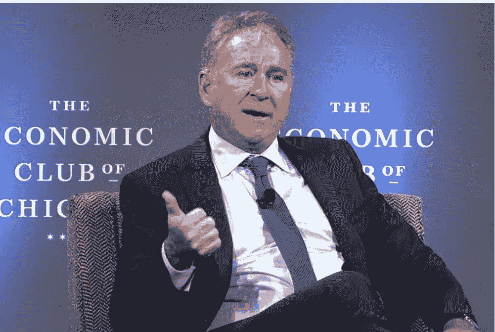

# 肯·格里芬对美元的终结发出警告

> 原文：<https://medium.com/coinmonks/ken-griffin-warns-about-the-end-of-the-us-dollar-e2c6501cfa77?source=collection_archive---------21----------------------->

Image Courtesy: Chicago Sun Times

哇哦。肯·格里芬一直在看我的博客！？！芝加哥的亿万富翁对冲基金经理肯·格里芬改变了对加密的看法。此人曾称比特币为“终结美元全球储备货币地位的圣战号召”。现在格里芬改变了主意。格里芬称 crypto 是过去 15 年来金融领域最伟大的故事之一。密码市场现在有一个市场…