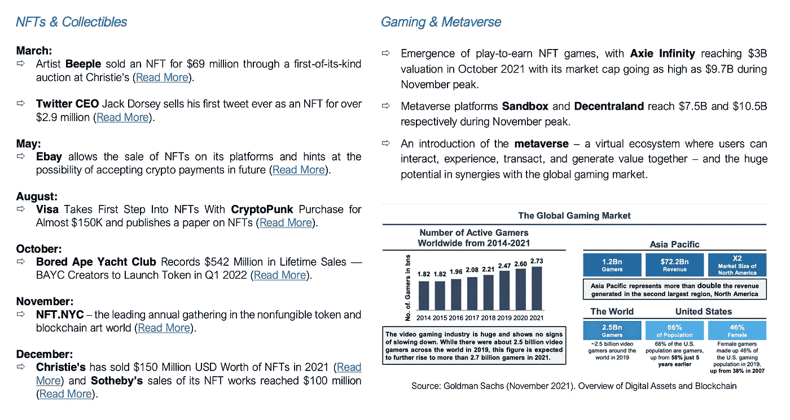
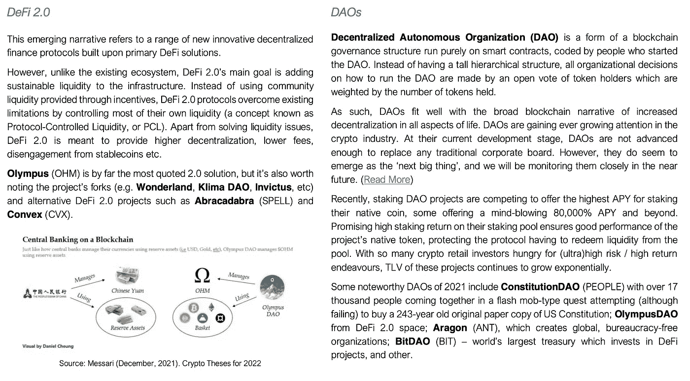
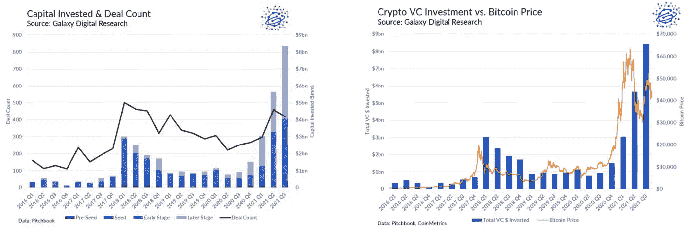

# 2021 年的关键时刻和教训

> 原文：<https://medium.com/coinmonks/key-moments-lessons-from-2021-dd0aac094af4?source=collection_archive---------10----------------------->

## 加密货币和区块链

> 文章作者 [Lesia M.](https://twitter.com/LesiaMrch)

*   **热门趋势 2021** *- NFTs
    -游戏
    - DeFi 2.0
    - DAOs*
*   **2022 年展望&超越**
*   **2021 年的大升级**
*   **机构收养**
*   **比特币 ETF——预期与现实**
*   **政府采用&第一种法定货币**

# 2021 年流行趋势

2021 年在加密领域带来了许多重大创新，将它从定义主导的叙事转变为一个尚未看到的文化驱动的统一(/元)领域&用户拥有的 Web 3。观察这种转变(和空间一起转变)是一种丰富的学习经历。

记住这一点，让我们回顾一下 2021 年一些最重要趋势的发展。

JKL Capital Research

# 2022 年展望及以后

想想 2017 年的 ICO 热潮。拿出一份白皮书，把 soma charisma 带到投资者会议上，通常是最初筹资的良好开端。白皮书被复制和外包(价格低至 100 美元)——并带来了数百万资金。如今，自由职业者可以以低至 300 美元的价格创造一个独特的 NFT 艺术收藏，包括 1000 件作品。持续的 NFT 热与 2017 年的 ICO 繁荣惊人地接近，那么我们可以从过去吸取什么教训呢？

虽然在 2017 年拿出一份白皮书通常足以获得种子资金，但旨在扩展到 A 轮或更高轮次的项目必须提供一个基于区块链的产品，无论是新硬币、加密平台还是 dApp。

我们相信，在 2022 年，元宇宙和 Web 3 的下一步将是与区块链技术的全面集成。如果没有实际的数字空间进行互动，拥有数字财产的新鲜感很快就会消失。这种整合远远超出了构建单独的元规则:广泛的新兴项目将必须建立在为 DeFi 优化的可扩展区块链上；跨越它们所基于的第 1 层区块链；必须引入软硬件来增强用户体验，同时保证高度的权力下放和所有权。

在密码开发的下一个阶段，以元宇宙为重点的项目将加快建立在由智能合同支持的可扩展区块链上(第 1 层，如**索拉纳**、**特拉**、**雪崩**和第 2 层扩展，如**多边形**)，从而随着用户和开发者的流入增加网络价值。

加密发展的一个重要里程碑是提高区块链的互操作性。一些多链解决方案(如 **Polkadot** 、 **Cosmos** )以及跨链甲骨文(如 **Chainlink** )将是这一阶段必不可少的。

缩放区块链技术伴随着大量链外计算的需求(例如基于 GPU 的渲染**渲染网络**)；可靠的安全&缩放协议(例如零知识证明 **zkSynch** 、**StarkEx**)；数据索引和查询(例如**图**)。

# 2021 年的重大升级

## EIP-1559 年

伦敦升级终于推出了期待已久的**以太坊**改进协议 1559。EIP-1559 确保了以太坊的一部分燃气费被烧掉，剩下的部分归矿工所有。从用户的角度来看，EIP 1559 应该提供一种可预测的费用支付体验，一方面减少网络连接，另一方面强制降低 ETH 发行(通货膨胀率)。尽管 ETH 用户也没有真正感受到，但这一举措是以太坊从工作证明模式转向利益证明模式的更大计划的一部分，我们尚未看到真正的影响。

自从伦敦硬分叉实施以来，以太坊网络已经烧掉了超过 130 万 ETH，价值约 49 亿美元。

## 主根

比特币期待已久的升级版本 taproot 终于在 11 月 14 日在第 709632 区块被激活。比特币 4 年来最大的升级旨在使交易更便宜、更私密、更灵活和更具扩展性。在分散网络的最佳传统中，Taproot 升级被 90%的比特币矿工锁定，他们在 6 月的一个困难时期内达成共识。比特币协议的三个不同升级是 Schnorr 签名、Taproot 和 Tapscript。

## 卡尔达诺的智能合约

**Cardano** 于 2017 年推出，是目前第四大支持智能合约功能的区块链，为加密项目和分散化应用提供平台。尽管智能合同自项目启动以来一直在开发中，但其最终部署是在 2021 年 9 月左右。

随着智能合约的推出，Cardano 预计将超越以太坊，因为后者只是过渡到股权证明协议。卡尔达诺最明显的优势之一是项目的高度分散化。卡尔达诺的 3000 个股份池运营商负责 100%的区块生产。网络上块生产者的数量越多，他们提供的安全性就越高，使得 51%攻击的可能性极小。ADA 的令牌组学是该项目的分散化偏好的又一证据，只有 16%的加密资产属于团队&创始人，84%掌握在投资者手中。

尽管如此，Cardano 的实际应用还需要一段时间，因为该平台的可用性和可扩展性还有待提高。在撰写本文时，开发人员更喜欢在其他链上构建他们的项目:Solana、BSC、Polygon 或 Avalanche。

## 波尔卡多特的副链

Polkadot 是一个更年轻的项目(于 2020 年启动)，为跨链互操作性提供了一个区块链平台。其创始人加文·伍德博士也是以太坊的早期创始人之一。

Polkadot 的主要特性是它的副链——在 Polkadot 生态系统中并行运行的定制的、特定于应用程序的区块链。它旨在连接 100 条副链，前 5 条副链在赢得拍卖后于 12 月 17 日成功上船: **Acala、Moonbeam、Astar、Parallel Finance 和 Clover** 。今年早些时候，在 Palcadot 的金丝雀网络 Kusama 上运行了测试 parachain 拍卖。

Polkadot 计划从现在起到 3 月 10 日再进行五次 Parachain 老虎机拍卖。

# 机构收养

今年，金融和企业机构不断涌入加密领域。我们提议回顾一下 2021 年采用加密货币区块链的一些最重要的步骤。

今年 3 月， **Visa Inc** 发表声明称，它将允许在 USDC 进行交易，并在 2021 年全年从与加密货币交易所合作提供获得加密奖励的 Visa 借记卡，到直接接受美元硬币支付，到提供加密咨询服务以促进主流采用，再到为其公司收藏购买 15 万美元的加密朋克。**万事达卡**也采取措施进一步采用加密货币作为支付方式和投资手段，现在允许其网络上的所有银行和商户提供加密服务。

2021 年 4 月感觉像是所有美国大型银行决定进入加密市场的月份。高盛开始向其财富管理客户提供广泛的比特币投资和其他数字资产。投资选项包括实物比特币、衍生品和其他传统投资工具。**摩根士丹利**允许合格投资者进入三个外部加密基金，其中两个由银河数码运营，第三个由 IS Investments 和 NYDIG 共同运营。摩根大通宣布成立一只由 NYDIG 提供的比特币基金，该基金最终于 8 月份推出。**摩根大通**接受比特币投资是语气上的一个显著变化，因为首席执行官杰米·戴蒙过去一直严厉批评比特币。另一方面，大型银行的加密产品仍然仅限于财富管理客户。**美国银行**也对该领域表现出兴趣，但目前只通过其全球研究部门从事加密业务(该部门在 11 月发布了一份关于加密的高级报告)。

在过去 20 年里，银行和传统金融机构对金融科技的崛起反应迟缓，更不用说围绕区块链和加密解决方案的零售热潮了。人们期待已久的银行和科技之间的“竞合”比以往任何时候都更加及时，目前约有 60 家金融科技公司的市值达到 10 亿美元。 **Circle、Square、Revolut、Wirex、Zeux** 和许多其他“挑战者银行”都提供*零售*加密货币产品以及支付和转账解决方案。这些平台上加密货币产品的可用性是由高客户需求驱动的，因为他们的客户通常会跟随新的技术发展，并愿意接受创新。

Source: Galaxy Digital Research

根据 Galaxy 2021 年 11 月 23 日的研究报告，2021 年第三季度，加密领域的风险投资达到历史最高水平。与此同时，秘密风险投资的估值与更广泛的风险市场之间的差距继续扩大，引发了这种积累从长期来看是否可持续的问题。然而，加密领域如此有意义的机构流入符合我们的观点，即持续的修正不是加密冬天的迹象，而是年末获利回吐，等待市场反弹后部署新资本。

在金融和支付行业之外，2021 年是奢侈品拍卖行开始接受加密货币的一年。现在可以用加密货币在**苏富比、佳士得**和**菲利普斯**买到有形的八位数物品。

S & P 道琼斯指数推出了几个加密指数，包括新的 S & P 加密货币广义数字市场(BDM)指数，该指数在推出时包含 240 多个硬币。**彭博**银河加密指数(BGCI)由彭博指数服务有限公司和**银河数字资本管理**推出。该指数是一个上限市值加权指数，旨在衡量以美元交易的最大数字资产的表现。随着对数字资产的看法不断变化，知名机构都在推出加密货币指数，以应对该领域日益增长的透明度和标准化需求。

**特斯拉** /crypto 关系经历了一个过山车 2021 年，该公司将比特币添加到其资产负债表中，并在今年早些时候接受它作为支付方式，只是马斯克改变了他对加密货币的乐观看法，并因环境问题暂停了比特币支付。最后，在 7 月的“B 字”会议上，马斯克软化了他对比特币的语气，并确认一旦“有可靠的证据证实矿工合理(50%)使用清洁能源”，特斯拉将重新引入 BTC 支付。

**Microstrategy** 在 2021 年不断买入高点和低点，使总持有量达到约 122，478 个比特币，到 2021 年底以每比特币 29，861 美元的平均价格购买。

多亏了闪电网络，BTC 的小费功能在推特上成为可能，让有影响力的人不受地域限制地赚钱。目前，这一提示功能仅支持 Strike 应用程序，但提供了一个将 BTC 地址添加到个人资料的选项，以便从其他应用程序接收 BTC。Strike 首席执行官声称，将比特币全球货币网络与 Twitter 上最大的互联网网络之一结合起来，将是“一场由来已久的绝对支付中断”。

当然，**脸书**更名为**梅塔**(无论好坏)。

# 比特币 ETF:预期与现实

今年年初，对 SEC 批准的比特币 ETF 的希望很高，然后很低，然后当美国 SEC 主席 Gary Gensler 暗示比特币和以太坊期货 ETF 的可能性时，希望又很高。立即，市场充满了对此事的猜测和意见。

终于，在 10 月中旬，这些希望变成了现实。或者尽可能的接近。10 月 15 日，彭博发表了一篇关于即将批准 BTC 期货交易所交易基金的文章。BTC 价格一天之内飙升了 10%。

$**BITO**——pro shares 推出的首只比特币期货交易所交易基金——显示价格走势符合最乐观的预期。它享有先发优势，首日交易超过 10 亿美元，交易量超过 2440 万笔，收盘价为 41.94 美元。这使得 ProShares 比特币期货交易所交易基金成为首日交易量第二大的交易所交易基金。瓦尔基里的$ **BTF** 位居第二，首日交易量达到 7760 万美元，而第三只 ETF，瓦内克的$ **XBTF** ，首日交易量仅为其前身的一小部分，交易量仅为 480 万美元。

围绕比特币期货交易所交易基金，最常被引用的担忧之一是跟踪误差。跟踪问题意味着 ETF 期货合约不会很好地跟踪基础比特币，因为远月合约与期货价格的升水冲突。

由于跟踪误差，ETF 发行者更喜欢近月合约，这种合约比长期合约更好地跟踪基础 BTC:例如，12 月期货比 1 月或 2 月合约更接近跟踪 BTC。那么，为什么 ETF 不直接累积 12 月合约呢？CME 将每个 ETF 发行者的期货合约数量限制在 4000 份，在到期前三天降至 2000 份。如果一只 ETF 的需求超过了这一限制，它们就不得不买入远月合约。随着新 ETF 进入市场，它们打开了更多近月 CME 期货的通道。与此同时，如果需求继续增长，现有 ETF 发行者将被迫将资产转移到更远期的合约中，从而放大对 BTC 的跟踪误差。发行人如何构建他们的 eft 将直接反映机构投资者的流动。

回到比特币现货 ETF，就目前情况来看，概率仍然相当低。即使比特币期货交易所交易基金成功上市，分析师们也不看好比特币现货交易所交易基金会很快获批。直到我们看到监管加密现货市场的新监管制度出台。直到 Fidelity 不得不离开美国证券交易委员会，在加拿大推出现货比特币交易所交易基金。

# 监管采用&第一种法定货币

随着主流和机构采用的增长，监管机构继续对加密空间表现出兴趣。2021 年是监管采纳和硬禁令的重要一年。

首先，2021 年将永远铭刻在密码史上，因为这一年**萨尔瓦多成为第一个采用比特币作为法定货币的国家**。虽然此举受到了世界银行和国际货币管理局的严厉批评，但萨尔瓦多继续采用加密货币，推出了国营的 Chivo 钱包，并购买了比特币 dips。根据官方声明，截至 2021 年 11 月底，萨尔瓦多财政部共持有 1220 枚比特币，在撰写本文时，这相当于超过 5700 万美元。

一些 G7 国家也不甘落后。**德国**在 2021 年确立了自己作为加密支持者的地位，德国的“基金定位法案”允许 4000 家私募基金，管理着 1.8 万亿美元，将高达 20%的资本投资于比特币。此外，德国在全球比特币节点分销(bitnodes.io)中排名第二，并有许多比特币交易所交易基金在德意志交易所交易。

Source: bitnodes.io

**美国监管机构**已经尝试在 2021 年监管 crypto，但目前仍落后于加拿大、德国或阿联酋的同行。最大的头条新闻之一是 11 月 15 日由乔·拜登签署的 1.2 万亿美元的两党基础设施法案，该法案缩小了加密货币税务申报条款，将在 10 年内筹集 280 亿美元。该法案对“经纪人”的定义相当宽泛和不明确:它可以包括任何促进加密交易的实体(包括矿商、硬件和软件开发商)，并将强制这些“加密经纪人”进行财务报告和披露。提出了两项修正案，以缩小规定的范围，豁免采矿者、验证者和不提供托管和交易服务的实体。有趣的是，其中一个修正案试图只豁免工作证明验证器，这可以被解释为比特币的隐含支持，而不是以太坊。最终，参议院未能修改法案中的加密措辞，使得新的加密货币税收要求备受争议。

美国参议院 12 月 8 日举行秘密听证会，试图加快立法。稳定的信贷、它们的支持以及对更广泛经济的潜在影响是听证会的主要议题。Circle 首席执行官杰瑞米·阿莱尔(USDC·斯塔布尔科恩)公开宣称

> 支持 USDC 的储备由美国监管的银行系统托管和控制，严格以现金和短期政府债券形式持有，并由世界领先的公司定期进行第三方审计。

Paxos 公司的首席执行官(USDP·斯塔布莱科恩)大体上同意这种说法。值得注意的是，泰瑟公司的高管没有出席听证会，这让我们想起了彭博 10 月份的文章《有人看到泰瑟公司的数十亿美元吗？。

参议院关注的另一点是对加密交易和投资者保护的监管。FTX 首席执行官 Sam-Bankman Fried 在证词中强调，与传统交易所不同，

> *FTX 向所有用户提供开放和免费的市场数据，用户可以像机构一样充分利用该平台和同一套工具，并由风险引擎全天候监控非法活动交易*。

比特币基地首席财务官进一步阐述了安全的话题，声称所有客户资产中只有 2%持有在热钱包中，比特币基地保护客户免受所有对热钱包的攻击，并在平台发生损失时提供保险。

最后，过渡到 2022 年的一个大问题是，SEC 是否将**加密货币视为证券**。从上面可以明显看出，试图将数字资产纳入现有的监管框架是一个相当大的挑战。去年这个时候，SEC 对 Ripple Labs 提起诉讼，宣布当时第三大加密货币是一种证券。诉讼结束后，比特币基地宣布暂停 XRP 的交易。今天，比特币基地声称

> 法律清楚地表明，区块链资产不是证券，它要么是一种新形式的数字财产，要么是一种记录所有权的新方式。

然而，并非所有国家都希望监管加密货币和数字资产。有些人更喜欢对所有与密码相关的活动严加禁止。Q2 2021 后，中国的加密禁令是我们从客户那里收到的首要问题之一。交易所停止了在 mainland China 的在岸新客户，并宣布了到 2021 年底取消所有中国客户的计划。在这些声明之后，市场在 9 月底修正了大约 15%,只是在 10 月份出现了强劲的反弹。

对于行业参与者来说，中国禁止所有加密活动并不意外。事实上，该国多年来一直对加密货币进行严格的监管和限制。沃顿商学院(Wharton School)进行的定量分析显示，总体而言，监管公告不会影响加密货币网络的交易量。此外，专家毫不怀疑，无论有没有中国的参与，加密货币市场都将达到顶峰，脸书(不在中国运营)就是一个很好的例子。

在接受 Forkast 采访时，前香港证监会(Hong Kong SFC)监管者关颖珊(Angelina Kwan)表示:“我们的观点是，展望未来，香港将继续保持其在管理财务和行政事务方面的自主权……随着数字资产行业受到越来越多的监管，香港作为一个法治金融中心变得更具吸引力，而不是更弱。”

## 放弃

本材料的内容未经任何监管机构审查。建议您对本材料的内容保持谨慎。虽然本材料中包含的信息是从据信可靠的来源汇编的，但 JKL 不代表或保证本材料中包含的信息的准确性、完整性或可靠性。如果您对本材料的任何内容有任何疑问，您应该获得独立的专业意见。JKL 或其任何关联公司，或其任何或其各自的董事、高级职员、员工和代表都不会对因使用或依赖本材料中包含的任何信息而导致的任何直接、间接或后果性损失承担任何责任或义务。本材料不构成认购或购买任何金融产品的要约或邀请。其目的不是提供任何信贷或其他评估的基础，也不应被视为购买任何金融产品的建议。

> 加入 Coinmonks [电报频道](https://t.me/coincodecap)和 [Youtube 频道](https://www.youtube.com/c/coinmonks/videos)了解加密交易和投资

## 也阅读

 [## 杠杆代币[多头代币]终极指南

### 杠杆化令牌是具有杠杆化风险敞口的 ERC20 令牌，不考虑保证金、要求、管理…

medium.com](/coinmonks/leveraged-token-3f5257808b22)  [## 最佳加密交易所| 2021 年十大加密货币交易所

### 编辑描述

blog.coincodecap.com](https://blog.coincodecap.com/crypto-exchange)  [## 2021 年最佳加密交换平台| CoinCodeCap

### 编辑描述

blog.coincodecap.com](https://blog.coincodecap.com/best-swap-platforms)  [## 10 大最佳网上赌场[2021] |赢取免费 BTC | CoinCodeCap

### 编辑描述

blog.coincodecap.com](https://blog.coincodecap.com/best-online-casinos)  [## 2021 年最佳加密借贷平台| 6 大比特币借贷平台

### 获得比特币和其他加密货币的最佳贷款利率

medium.com](/coinmonks/top-5-crypto-lending-platforms-in-2020-that-you-need-to-know-a1b675cec3fa)  [## 2021 年 6 大最佳硬件钱包|顶级加密硬件钱包[更新]

### 最好的加密货币硬件钱包是绝对必要的。我们将在 NGRAVE、Ledger Nano X 和…

medium.com](/coinmonks/the-best-cryptocurrency-hardware-wallets-of-2020-e28b1c124069)  [## 2021 年最佳免费加密交易机器人

### 2021 年币安、比特币基地、库币和其他密码交易所的最佳密码交易机器人。四进制，位间隙…

medium.com](/coinmonks/crypto-trading-bot-c2ffce8acb2a)  [## 最佳 4 个加密交易信号电报通道

### 这是乏味的找到正确的加密交易信号提供商。因此，在本文中，我们将讨论最好的…

medium.com](/coinmonks/best-crypto-signals-telegram-5785cdbc4b2b)