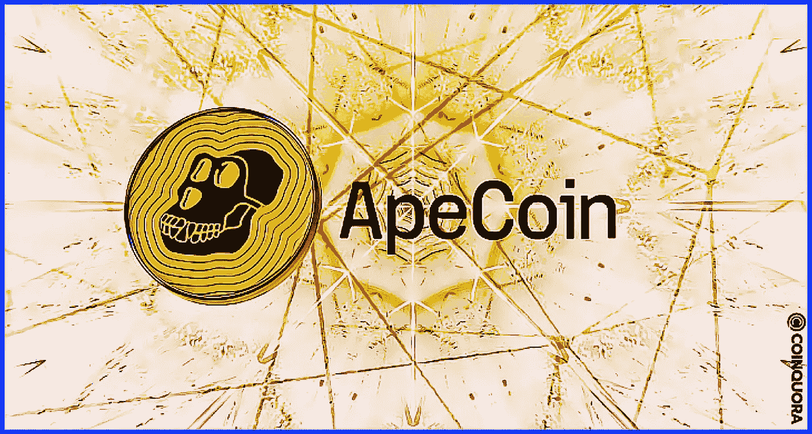
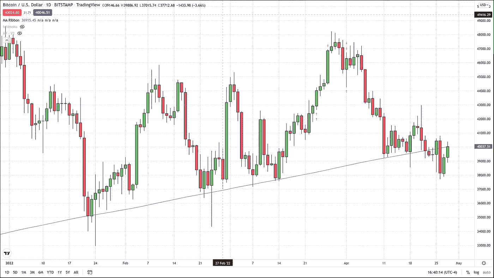
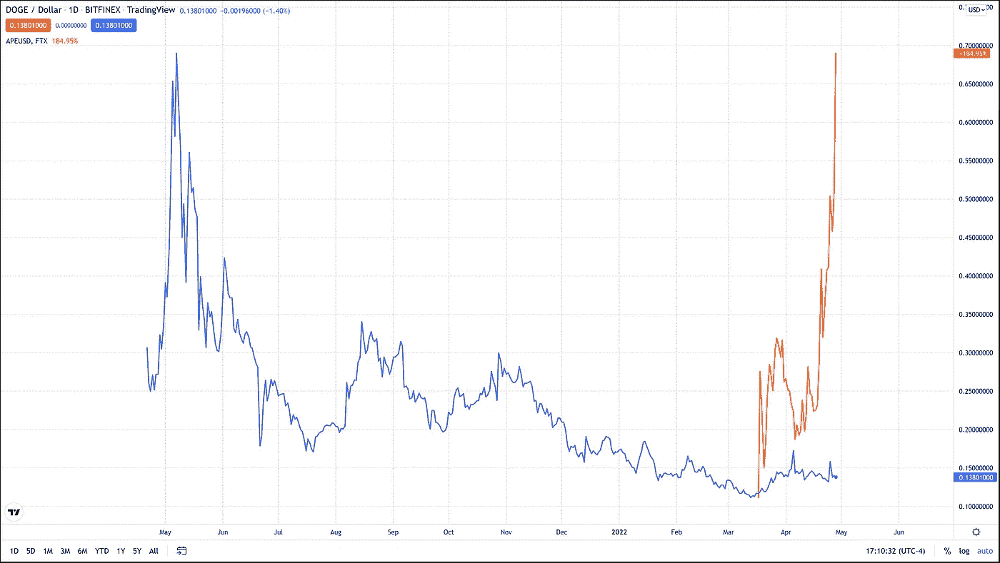
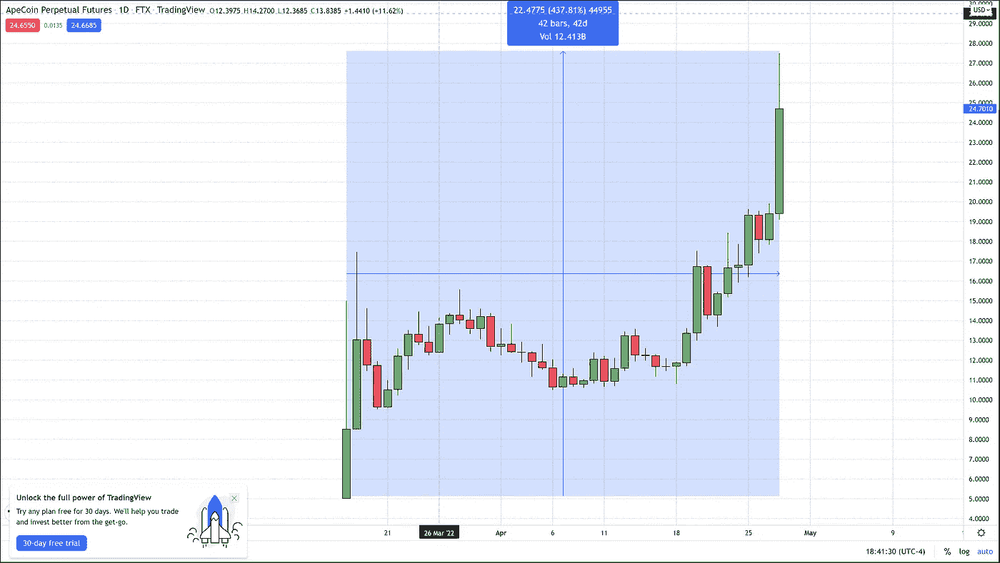

# 关键支撑位转向阻力位/ERC 20 硬币让区块链变得疯狂

> 原文：<https://medium.com/coinmonks/key-support-level-flipped-to-resistance-the-erc-20coin-that-has-the-blockchain-thats-going-35f646515ea2?source=collection_archive---------50----------------------->

600 天简单移动平均线已经支撑了比特币大约 100 天，如果我们今天在日线图上收盘低于 600 天简单移动平均线，它可能会变成阻力。

在撰写本文时(美国东部时间下午 4:35)，空头和多头正在积极防守和攻击 600 天 SMA 的价格区域 40，019 美元。比特币基地目前的定价为 40，018 美元，每 10 到 15 秒钟就向 600 天的上方和下方移动几美元，这表明市场行情非常快。

**ERC 20 元硬币上的区块链快疯了**

与此同时，硬币继续以远高于其他硬币的速度增值。这种指数增长当然会在某个时候结束，但是考虑到非常年轻的加密技术昨晚刚刚创造了新的历史新高，我们可能会看到更迅速的价格上涨，并可能在修正之前达到每枚硬币 30 美元的状态。

在撰写本文时，Apecoin 的市值约为每枚硬币 24 美元，尽管我过去和现在都怀疑它能否持久存在，但自 3 月底推出以来，我一直密切关注着它的价格。基于其以远高于所有其他硬币的速度持续增值的能力，以及将损失限制在最小的下跌日，这种势头让人想起马斯克加入 SNL 前一周的道奇，它从 2021 年 4 月底的 0.24 美元上涨到 2021 年 5 月 7 日的 0.69 美元左右。

即使是这篇文章的作者也对道奇和 Apecoin 之间的额外相似之处感到惊讶，一旦他(我)制作一个重叠的线图进行比较，他就会发现这些相似之处。两种硬币似乎上升的斜率相同，但它们都在完全相同的时间上涨，仅相差一年。

假设 Ape Coin 完成了一半已宣布的项目，包括一系列由未知“好莱坞”导演拍摄的完整长度电影，推出期待已久的元宇宙，以及其他尚未完全详细说明的 web 功能和产品。在这种情况下，Apecoin 有可能赶上道奇去年同期的增长。

从 3 月 17 日到 4 月 28 日，道奇增长了 5 倍。这是 Apecoin 存在的时间框架，到目前为止，它的价值增长了近 4 倍。截至 5 月初，道奇股价已上涨逾 10 倍，因此，如果 Ape 确实遵循同样的趋势，它将在未来几周内达到 100 美元。我不是在打这个电话，但当我看到那些没有多少希望的硬币一旦获得狂热的追随者，就会变成抛物线时，我不会感到惊讶。Ape coin 和 the Bored Ape Yacht Club (BAYC)肯定有一大批忠实的追随者，所以我认为下周 30 美元是一个非常保守的估计。

我们大多数人都知道，在 SNL 播出的同一个晚上，道奇的硬币暴跌。道奇尚未回到那些历史高点，甚至接近让它成为家喻户晓的英雄地位，但它仍是市值第 11 大的硬币，目前交易价格约为 0.13 美元。

对于任何有兴趣查看更多关于比特币的文章的人，只需点击这个[链接](https://www.thegoldforecast.com/bitcoin)。

> 加入 Coinmonks [电报频道](https://t.me/coincodecap)和 [Youtube 频道](https://www.youtube.com/c/coinmonks/videos)了解加密交易和投资

# 另外，阅读

*   [有哪些交易信号？](https://coincodecap.com/trading-signal) | [Bitstamp vs 比特币基地](https://coincodecap.com/bitstamp-coinbase)
*   [ProfitFarmers 回顾](https://coincodecap.com/profitfarmers-review) | [如何使用 Cornix Trading Bot](https://coincodecap.com/cornix-trading-bot)
*   [如何在势不可挡的域名上购买域名？](https://coincodecap.com/buy-domain-on-unstoppable-domains)
*   [印度的秘密税](https://coincodecap.com/crypto-tax-india) | [altFINS 审查](https://coincodecap.com/altfins-review) | [Prokey 审查](/coinmonks/prokey-review-26611173c13c)
*   [赢取注册奖金——10 大最佳加密平台](https://coincodecap.com/earn-sign-up-bonus)
*   [Blockfi vs 比特币基地](https://coincodecap.com/blockfi-vs-coinbase) | [BitKan 评论](https://coincodecap.com/bitkan-review) | [Bexplus 评论](https://coincodecap.com/bexplus-review)