# 年度 Cosmos Gateway 会议的主要收获

> 原文：<https://medium.com/coinmonks/key-takeaways-from-cosmos-gateway-d5bdbbb9a8c1?source=collection_archive---------15----------------------->

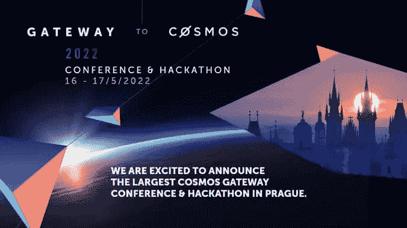

布拉格刚刚成为“宇航员”的首都，这些“宇航员”是对宇宙生态系统着迷的区块链/dApp 开发者、利益相关者和有影响力的人，他们聚集在东欧参加年度社区会议。尽管最近最大的宇宙链——地球坠落了，宇航员们证明了他们是坚强的，并且从过去的经历中学习。

## TLTR

*   从特拉/UST 吸取的教训——为最坏情况而建在设计新协议时，必须考虑经济因素。
*   新宇宙稳定币的竞赛开始了！
    [$CMST](https://blog.comdex.one/introducing-composite-a-collateralized-stablecoin-for-ibc-bc76e15fa2ec) 或 [$IST](https://01node.com/ist-the-new-cosmos-stablecoin-built-on-agoric/) —加密支持的硬币——伪装者之一
*   液态打桩:吃一块蛋糕，吃一块蛋糕
*   即使在熊市也能从 NFT 获得价值。
*   从德根到再生——再生金融和区块链应对气候变化

# 为什么是宇宙？

Cosmos tech stack 允许轻松开发新区块链 *L1 链*以及这些链之间轻松交换令牌和信息*区块链互操作性*。

这些都是大话题，因为自有链的发展是一个历史上复杂的过程(看看比特币的分叉):你不仅需要关注你的共识机制，还需要关注基础设施。此外，每个区块链都被设计成一个独立的王国。Cosmos 及其底层技术 [Cosmos SDK](https://docs.cosmos.network/) 和 [Tendermint](https://tendermint.com/) 解决了这些挑战。

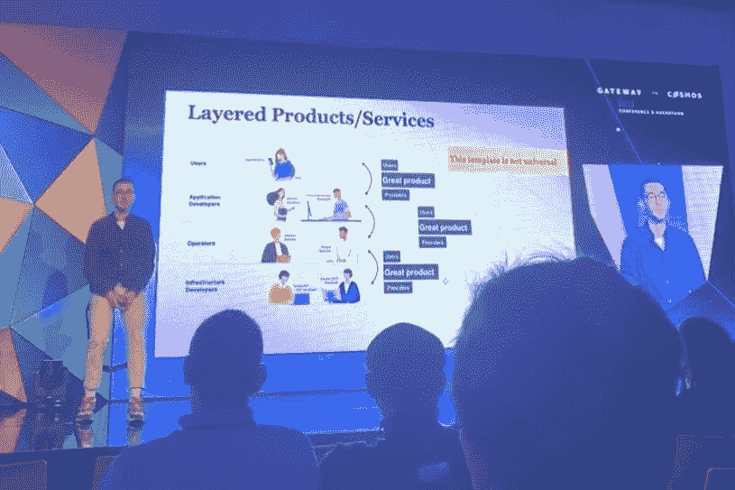

智能合同——由机器执行的一套自动化规则可能不是一个新想法(想想停车计时器或饮料自动售货机)，但区块链将智能合同提升到了一个新的水平:*智能合同在不同的管理机构和管辖区的多台独立计算机上同时运行*。

因此，在区块链上运行的智能合约是分布式的、无许可的应用程序——dApp——它允许消除中间人，甚至在最复杂的金融交易中也是如此。

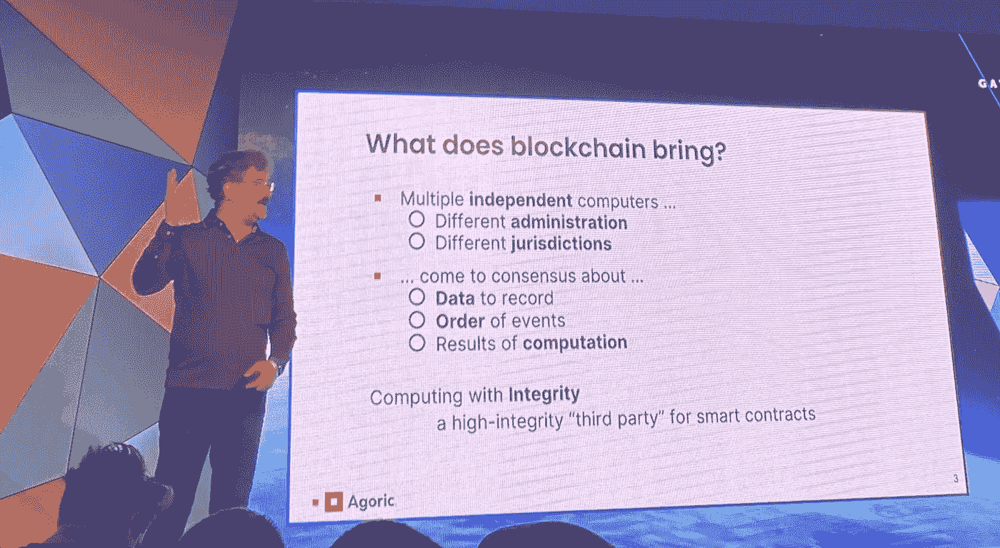

[@DeanTribbl](http://twitter.com/DeanTribble)e, co-founder of⁩ [@agoric](http://twitter.com/agoric)

⁩Blockchains 针对各种目的优化智能合同执行——defi、NFT、游戏、元宇宙……这就是为什么我们有/需要这么多区块链，我们生活在区块链的互联网中

> 我们生活在区块链的互联网时代。 [@dogemos](http://twitter.com/dogemos) ，[@ Kepler wallet](http://twitter.com/keplrwallet)联合创始人

[Juno](https://www.junonetwork.io/) 是一款基于智能合同的区块链，由 Cosmos 提供支持，能够在使用 Cosmos SDK 开发特定于应用的区块链之前，找到适合您应用的产品市场。值得考虑！

[Agoric](https://agoric.com/) ，想出了用世界上最流行的编程语言——javaScript 来开发 DeFi 协议的主意。

# 从特拉/UST 吸取的教训

宇宙 SDK 允许容易地建立新的区块链和 Terra，在 Top10 最大的区块链，直到最近是宇宙王冠上的宝石。不过，随着背包中新体验的出现，宇宙社区似乎变得更加强大:

*   **正确执行有缺陷的算法** 在 Terra/Luna 危机期间，超过 8000 笔交易被正确处理。底层技术——执行层——工作得很好:没有错误。问题出在 UST 稳定货币协议的经济设计上。
*   **做最坏的打算** 设计新协议时必须考虑经济因素。可能会有针对令牌、验证器等的大规模攻击。你需要有坚实的架构。这些经济攻击可能发生在链或协议的任何部分。
*   **警惕甲骨文** 总的来说，甲骨文和甲骨文经济仍然存在一些问题。有各种类型的 stablecoins，但所有的 stablecoins 都严重依赖于神谕。跨链协议需要被安全特性所包围。
*   **呼唤 Terra 协议** Terra 上有很多成功的协议正在为 DAO、treasury 和智能合约寻找新家。幸运的是，来自宇宙生态系统的区块链邀请了我们。由于 Terra 支持 Rust 作为编程语言，我认为最好的链是——Secret Network、Juno 或 Terra 2.0
*   **最后，但同样重要的是，多样化你的加密组合** 你可以从经验丰富的*德根斯*那里找到专业的战略/建议[侍酒师](https://www.sommelier.finance/)或[亚努斯](https://www.yanus.tech/)。

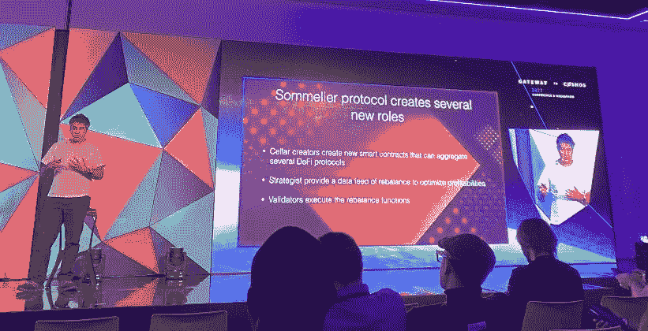

# 宇宙币的竞赛开始了！

争夺宇宙新稳定核心的竞赛已经开始，有许多觊觎者。大型经济体拥有稳定的收入至关重要。

> 大型经济体拥有稳定的收入至关重要——扎基·马年

以太坊有戴，近 USN(算法币)，bUSD，Polkadot aUSD——Acala(与兼容的 Polkadot 链)上的加密支持和过度抵押的 stablecoin。宇宙稳定币的主要伪装者是有密码支持和过度抵押的

*   [$IST](https://01node.com/ist-the-new-cosmos-stablecoin-built-on-agoric/) ，由$蝙蝠统治的[广场](https://medium.com/u/b20a178c216d?source=post_page-----d5bdbbb9a8c1--------------------------------)
*   [$CMST](https://blog.comdex.one/introducing-composite-a-collateralized-stablecoin-for-ibc-bc76e15fa2ec) ，由$HARBOUR 管辖， [COMDEX](https://medium.com/u/bb68a41251c8?source=post_page-----d5bdbbb9a8c1--------------------------------) 开发

有各种类型的稳定硬币，取决于它们如何保持与目标值挂钩:菲亚特支持的稳定硬币(hedet)、密码支持的稳定硬币(DAI)和算法稳定硬币(UST)。要了解更多，请查看我以前在 stablecoins 上的博客帖子:[终极 stablecoin 分类](/coinmonks/ultimate-stablecoin-classification-bd70db1ae3f3)，[戴，aUSD 和 lUSD 如何比较？](/coinmonks/slicing-down-dai-ausd-and-lusd-294435a6b72c)

有趣的是，IST 美元和 CMST 美元都有加密支持，而且抵押额过高。算法 stablecoins 没了吗？

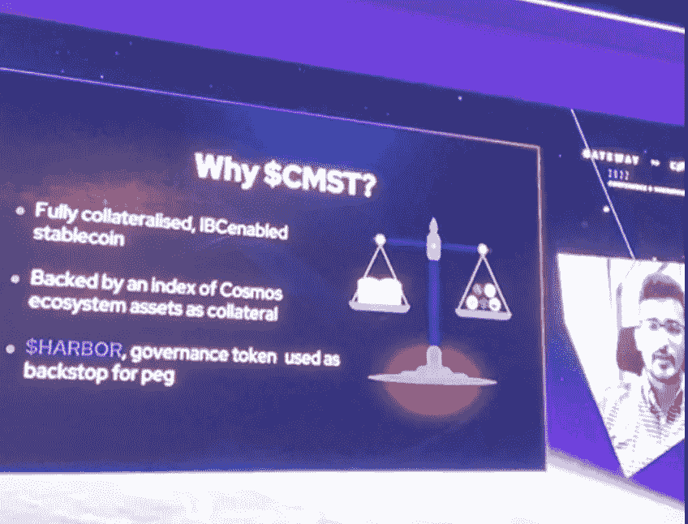

[Siddarth Patil](https://medium.com/u/702b336d5c81?source=post_page-----d5bdbbb9a8c1--------------------------------), co-founder of [COMDEX](https://medium.com/u/bb68a41251c8?source=post_page-----d5bdbbb9a8c1--------------------------------)

# Defi 成为主流

IBC 已经是活的，社区已经被用来跨链交易各种资产。Cosmos DeFi 受益于共享功能，如共享帐户。甚至可以组合。金融——建立在波尔卡多特的基础上——融入了宇宙的原始形态。

当宇宙创造出更多在其他地方无法存在的产品时，它就会有产品市场契合度。同时，我们还不知道这种跨链 DeFi 应用程序将如何运行。重要的是要记住，并不是所有东西都需要放在区块链，聪明的契约往往就足够了。

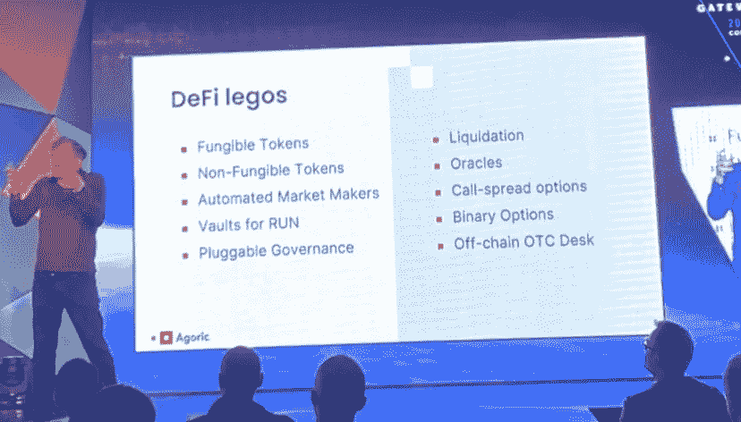

**隐私在 DeFi 中的作用是什么？**控制披露哪些信息的能力。区块链[秘密网络](https://scrt.network/)和[半影](https://penumbra.zone/)是来帮忙的。

# 液体打桩

赌注是一个巨大的市场，已经锁定了超过 1000 亿美元的资产。

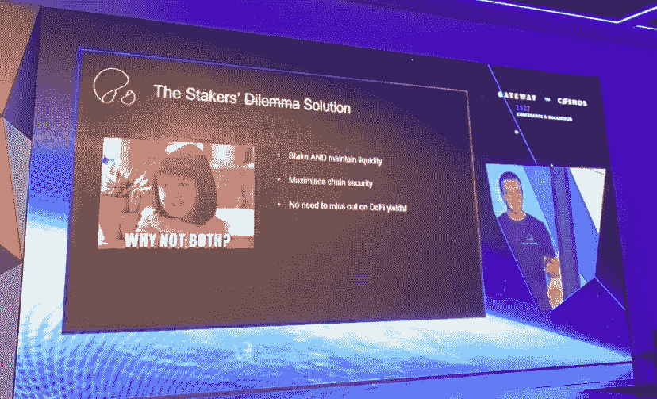

通常情况下，赌注的代价是将代币冻结一段时间。现在有了液态打桩，你可以吃蛋糕，也可以拥有蛋糕:

*   桩
*   获得一个确认您下注的液体代币，
*   累积奖励
*   …并进行更多的定义或标桩。

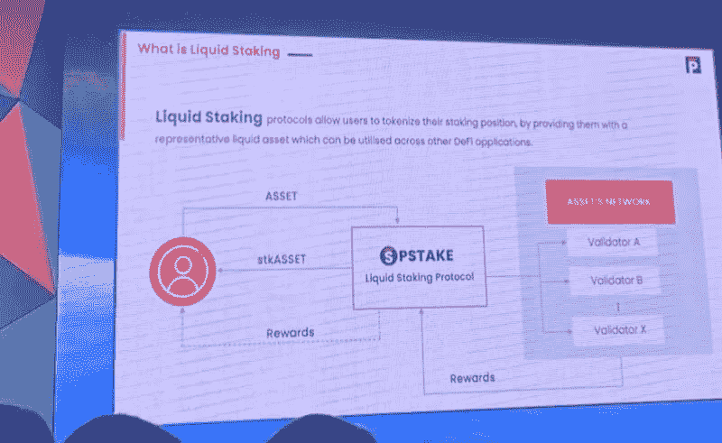

[坚持](https://persistence.one/)和[水银](https://quicksilver.zone/)让液体打桩成为可能

# NFTs 和元宇宙

[StarGaze](https://www.stargaze.zone/) 是一个零汽油费的分散市场。它最大的竞争对手——以太坊上的 OpenSea 是一家中央集权的公司，没有任何治理令牌。重力桥将很快使 NFT 从以太坊转移到宇宙，这将引发 NFT 革命！

StarGaze 呼吁加入 Terra NFT 项目，并强调 NFT 在熊市中的作用。

> Shane [@shan3v](https://twitter.com/shan3v) 联合创始人 [Stargaze Protocol](https://medium.com/u/37ba65786d68?source=post_page-----d5bdbbb9a8c1--------------------------------) 说，即使在熊市，你仍然可以从你的 NFT 中获得价值

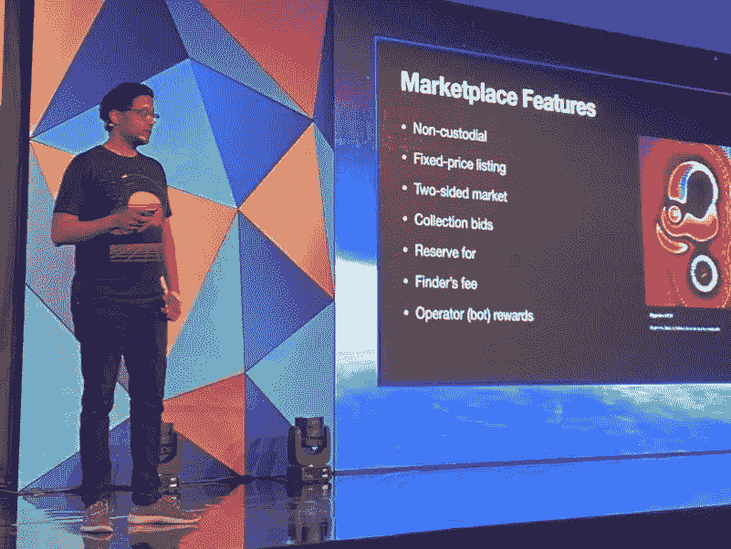

# 社区的作用

正如 [@jurimaibaum](https://twitter.com/jurimaibaum) 所说，建立一个密码社区是一项具有挑战性的任务。你不能以朝九晚五的心态去做，也不能强迫任何人加入你的道。相反，你需要认真对待你的社区，因为它是你最伟大的大使。使命和愿景很重要，例如，Frens 是一个想成为你朋友的验证者。在困难时期，使命和愿景更加重要。

> 无论市场状况如何，你的“如何”都会继续。 [@jurimaibaum](https://twitter.com/jurimaibaum) ，DEFI Time 联合创始人

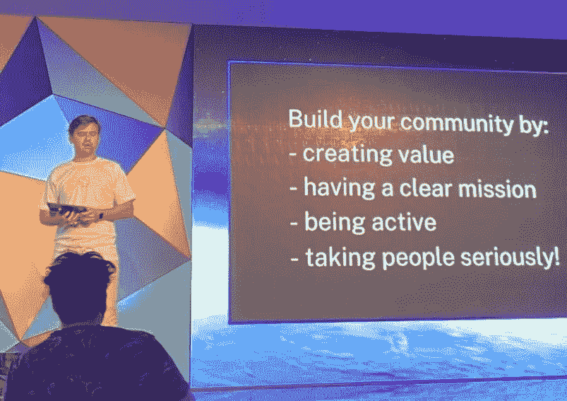

如何从零开始引导你的社区？

*   一步一步来——制造不和，用握手或者和 90 年代的朋友一起发布 meme
*   Twitter、telegram 相当强大。当你有现有的社区时，现实生活中的事件会起作用
*   监管“情况”来了。合规让创始人免于坐牢。
*   社区是第一位的。在你的项目中投入大量资金。您只能进行一次令牌分发。好好做。不要奖励投机者。让赌注更有吸引力。空投可以被利用。解决方案—有针对性的分发
*   网络使用是王道

道斯用人力资本创造了新的市场。你希望有好的社区来为你做广告

# 结束语

对所有加密初创企业来说，好的想法是风投对区块链的投资正在蓬勃发展。加密投资者似乎专注于 DLT 的长期影响，并不担心市场的大起大落。

> 洛克威的管理合伙人维克托·费舍尔说:“我们希望成为欧洲最大的区块链投资者。”

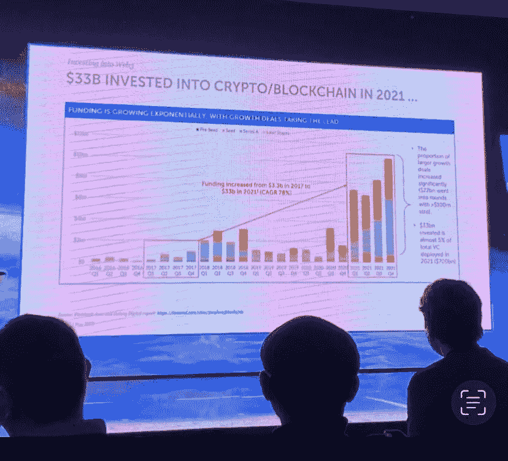

这是一个普遍的误解，认为区块链是环境不友好的，因为能源消耗。对于比特币或以太坊这样的 PoW 链来说可能是一个问题，但肯定不适用于宇宙生态系统中的 PoS 链。更重要的是，通过 DAO 治理和社区方法，加密项目比传统项目更有弹性，可以对环境产生真正的影响。再生金融(reFi)就是一个很好的例子。

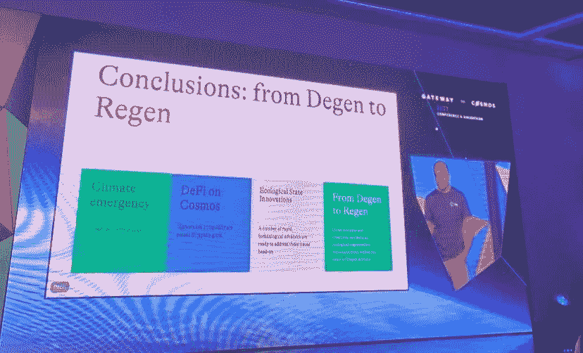

> 简而言之，再生金融**使用货币作为工具来解决系统性问题，并再生社区和自然环境**。它的目标是治愈和创造共享价值。利润不是目的，而是进一步发展的手段。来源:[影响力企业家](https://impactentrepreneur.com/regenerative-finance-is-no-longer-the-future-it-has-arrived/)

非常感谢天蓝创投的 [@againstutopi](https://twitter.com/againstutopia) a 提出了这些不太技术性，但积极而重要的方面！

**类似故事:**[2022 年 5 月—克罗地亚封锁的关键要点](/@cyanustech/key-takeaways-from-blockdown22-f6daa1939423)

📌在 Twitter 上关注我的实时更新，或者加入 Discord！

📌Web: [www.yanus.tech](http://www.yanus.tech)

> 加入 Coinmonks [电报频道](https://t.me/coincodecap)和 [Youtube 频道](https://www.youtube.com/c/coinmonks/videos)了解加密交易和投资

# 另外，阅读

*   [3 商业评论](/coinmonks/3commas-review-an-excellent-crypto-trading-bot-2020-1313a58bec92) | [Pionex 评论](https://coincodecap.com/pionex-review-exchange-with-crypto-trading-bot) | [Coinrule 评论](/coinmonks/coinrule-review-2021-a-beginner-friendly-crypto-trading-bot-daf0504848ba)
*   [莱杰 vs n rave](/coinmonks/ledger-vs-ngrave-zero-7e40f0c1d694)|[莱杰 nano s vs x](/coinmonks/ledger-nano-s-vs-x-battery-hardware-price-storage-59a6663fe3b0) | [币安评论](/coinmonks/binance-review-ee10d3bf3b6e)
*   [Bybit 交易所评论](/coinmonks/bybit-exchange-review-dbd570019b71) | [Bityard 评论](https://coincodecap.com/bityard-reivew) | [Jet-Bot 评论](https://coincodecap.com/jet-bot-review)
*   [3 commas vs crypto hopper](/coinmonks/3commas-vs-pionex-vs-cryptohopper-best-crypto-bot-6a98d2baa203)|[赚取加密利息](/coinmonks/earn-crypto-interest-b10b810fdda3)
*   最好的比特币[硬件钱包](/coinmonks/hardware-wallets-dfa1211730c6) | [BitBox02 回顾](/coinmonks/bitbox02-review-your-swiss-bitcoin-hardware-wallet-c36c88fff29)
*   [block fi vs Celsius](/coinmonks/blockfi-vs-celsius-vs-hodlnaut-8a1cc8c26630)|[Hodlnaut 审核](/coinmonks/hodlnaut-review-best-way-to-hodl-is-to-earn-interest-on-your-bitcoin-6658a8c19edf) | [KuCoin 审核](https://coincodecap.com/kucoin-review)