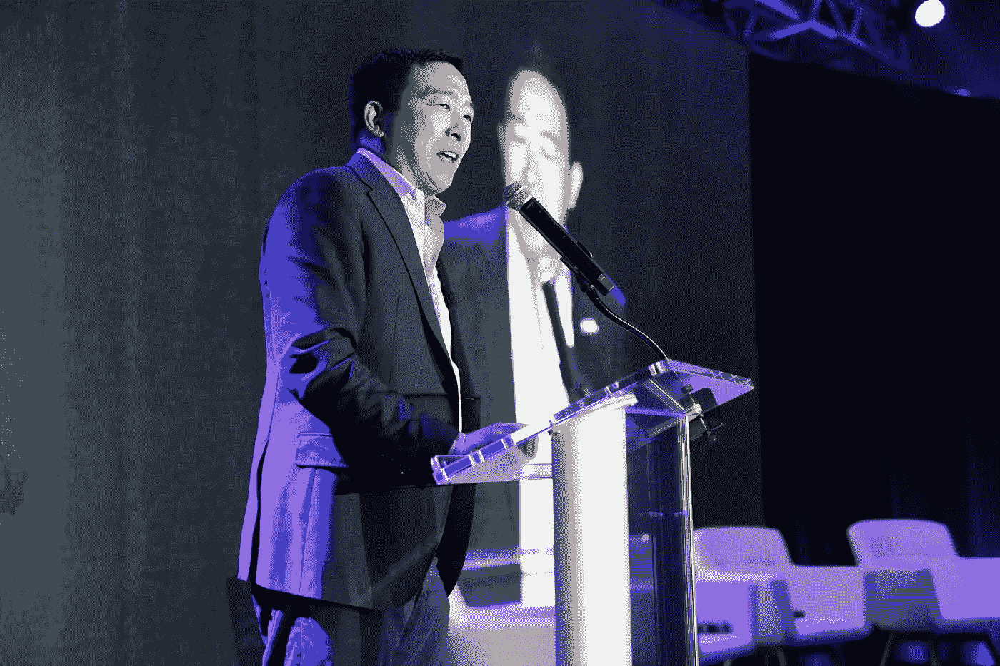
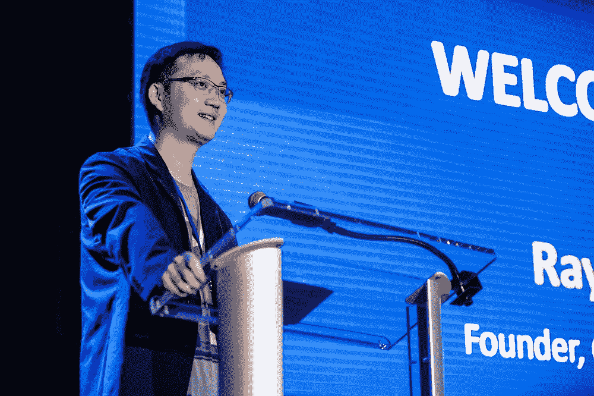
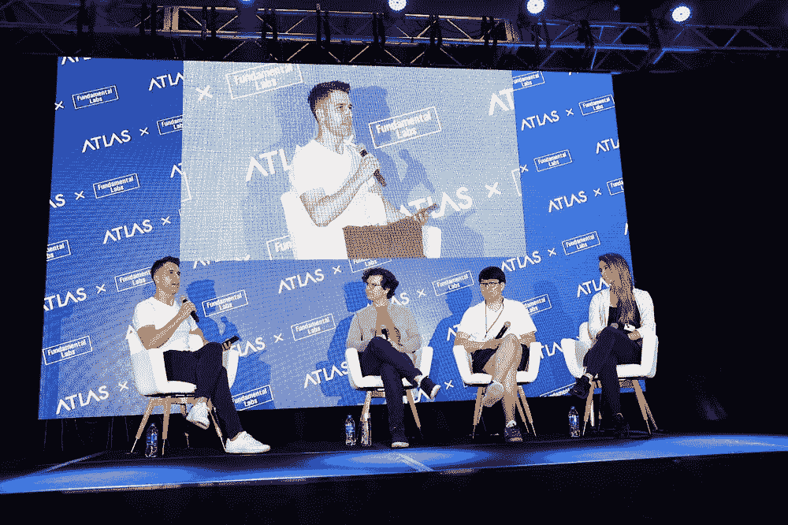
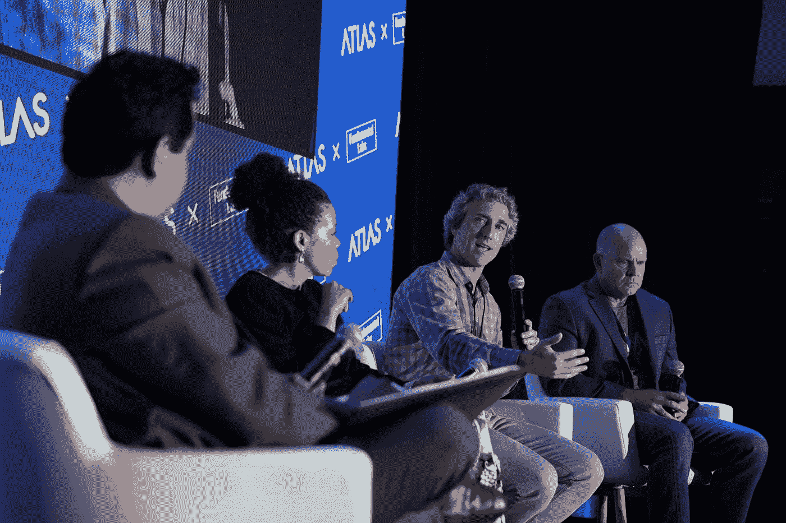

# 与 Atlas & Fundamental Labs 的 Web3 论坛达成共识

> 原文：<https://medium.com/coinmonks/kicking-off-consensus-with-atlas-fundamental-labss-web3-forum-3dd70eaae624?source=collection_archive---------12----------------------->

Closing Keynote, Andrew Yang, GoldenDAO, Former US Presidential and NYC Mayoral Candidate

【2022 年 6 月

本周在奥斯汀的一次旅行开始于对 web 3.0 行业在过去五年中为我们提供了什么的反思，特别是夏季增长热潮——每次都以“DeFi/2020”、“NFTs/2021”、“DAOs/2022ish”等为主题。展望今年夏天，感觉有些不同，对整个行业来说，比以往更具定义性。这可能是本周晚些时候共识会议之前的对话漩涡，也可能是由领先的 Web 3.0 基础设施服务提供商 Atlas 及其姐妹公司 Fundamental Labs(专注于区块链的风险投资公司 T11)主办的 [**Web 3.0 论坛**](https://www.atlasbuildingweb3.com/agenda) 上的背靠背小组讨论。

Atlas 和 Fundamental Labs 的支持集团集团的董事长 Raymond Yuan 在活动开始时指出，“Web 3.0 是互联网的下一个前沿，使用户能够拥有自己的数字资产，保护他们的数据隐私，并获得对区块链网络和下一代金融的无许可访问。”

> “技术很少是直线运动——它通常是爆炸。目前，加密货币和 Web 3.0 是唯一能让民主党和共和党走到一起的领域。”乔治·P·布什。

昨天，人们很少谈论波动的市场价格，而只是谈论以“ **Building Web 3.0”为主题的话题。**“讨论从演讲嘉宾开始，包括得克萨斯州土地专员乔治·布什(George P. Bush)和行业领袖以及**应用** *(Mask、Azarus、trusted node&tru flation)*、**协议** *(BNB 链、多边形、索拉纳、雪崩、克莱顿基金会)*、以及**基础设施**公司 *(Atlas、Stratos、Chainlink、air 豁免、Ready Games)*

> “虽然在熊市期间，你在 Twitter 上看不到对空间的兴奋，但当你与开发者交谈时，他们仍然很有信心。很多人进入以太坊这样的平台不是为了赚很多钱，因为他们在以太坊还没有价值的时候就开始在它上面构建了。他们投身其中，因为他们相信可以在此基础上发展。”——奥斯汀·费德拉，索拉纳。

Atlas & Fundamental Labs’s Web3 Forum — Austin, Texas

> “未来是多链的，每个链都将是自己东西的专家。可能有一个区块链非常擅长游戏，一个擅长非功能游戏，等等。最终，不会有一个区块链成功；相反，可能会有一个更大的生态系统，我们都必须在其中共同努力。”—幸·卡米亚，多边形。

活动的后半部分围绕持续的行业辩论的核心主题展开，即 Web 3.0 对现在和未来几年的环境、社会和公司治理(ESG)的影响。每位演讲者都超越了任何界限，强调 Web 3.0 不仅鼓励了对话，还要求围绕绿色能源的快速采用采取行动。

> “总能耗是个问题。从长远来看，必须有某种方法来更好地控制这种东西。当你制造更复杂的基础设施时，你可以从根本上减少使用。”——奥斯汀·费德拉，索拉纳。

Web 3.0 Sustainability and ESG Panel

围绕促进改善全球人口的金融、医疗和教育成果的主题，以及为治理社区和社会等提供增强工具的需要，如分散自治组织(Dao ),讨论仍在继续。

> "只有 46 个美国家庭的能源用于运行雪崩网络."—刘瀚骏，雪崩。
> 
> “Polygon 计划今年实现碳中和，并聘请了一位可持续发展负责人来领导这项工作。”—幸·卡米亚，多边形。

主讲人、前美国总统和纽约市长候选人、Web3 倡导者杨安泽宣布会议闭幕。杨先生发表了一个非常开放的演讲，讲述了他对美国 Web 3.0 行业现状的看法，包括今天[报道的两党密码法案](https://www.coindesk.com/policy/2022/06/07/key-us-senators-introduce-bill-outlining-sweeping-plan-for-future-crypto-rules/)，DAOs ( *GoldenDAO* )的潜力，以及该行业未来仍未锁定的机会。

> “我相信对空间的监管，但致力于倡导监管仍然允许你在不离开美国的情况下建造你想建造的东西”——杨安泽。

活动结束时，包括我在内的与会者都受到了鼓舞，并为我们在未来几天的“**建筑之夏**”中看到的重新定义的创新注入了新的活力，“对明天的 web3 未来充满希望”。

***关于 Atlas—****Atlas 总部位于新加坡，是一家全球性的区块链基础设施即服务集团，致力于推动互联网下一阶段 Web 3 的发展。该公司提供广泛的增值服务，包括特定应用计算、节点基础设施、网络、硬件、API 支持和 Web 3 生态系统存储。*

*Atlas 致力于成为全球领先的下一代 Web 3 基础设施提供商，倡导可持续发展、绿色能源采用、能源使用效率和稳定性，以推动 Web 3 的发展。*

*Atlas 在北美、亚洲和欧洲开展业务，并计划在其他地区扩张。它是全球最大的专用集成电路(ASIC)公司之一。*

*作为可持续发展的坚定信仰者，Atlas 的目标是到 2024 年采用 100%清洁能源为我们的计算运营提供动力。*

***关于基础实验室—*** *我们相信区块链和密码创新将重新定义人类社会的未来。* [*基础实验室*](https://cth.group/what_we_do/fundamental_labs/) *致力于支持最有前途的企业家加速基础创新，大规模采用区块链技术，为更美好的数字社会创造价值。*

*从亚洲、欧洲到北美，Fundamental Labs 拥有广泛的业务覆盖面，包括地区总部和有能力的当地团队，帮助我们在全球范围内与许多有前途的项目建立联系。*

基础实验室支持多级加密公司，少则 50 万美元，多则 5000 万美元以上。除了资本之外，我们还采取一种深度授权的方法来帮助我们的投资组合充分发挥潜力。

*基础实验室投资涵盖许多领域，如第 1/2 层协议、Web 3.0、加密金融基础设施、DeFi、NFTs 等。我们承诺始终与我们的投资组合团队合作，以实现他们的巨大成功。我们的投资组合包括 60 多个项目，如比特币基地，坎南，波尔卡多特，维查因，币安硬币，积木堆，雪崩，附近，柏拉图，面具等。*

*媒体查询，请联系:*

*劳伦·索伦森，爱德曼美国图集(Lauren.Sorensen@edelman.com)*

*阿德里安娜·刘、爱德曼·港供图册(Adrianna.Lau@edelman.com)*

> 加入 Coinmonks [电报频道](https://t.me/coincodecap)和 [Youtube 频道](https://www.youtube.com/c/coinmonks/videos)了解加密交易和投资