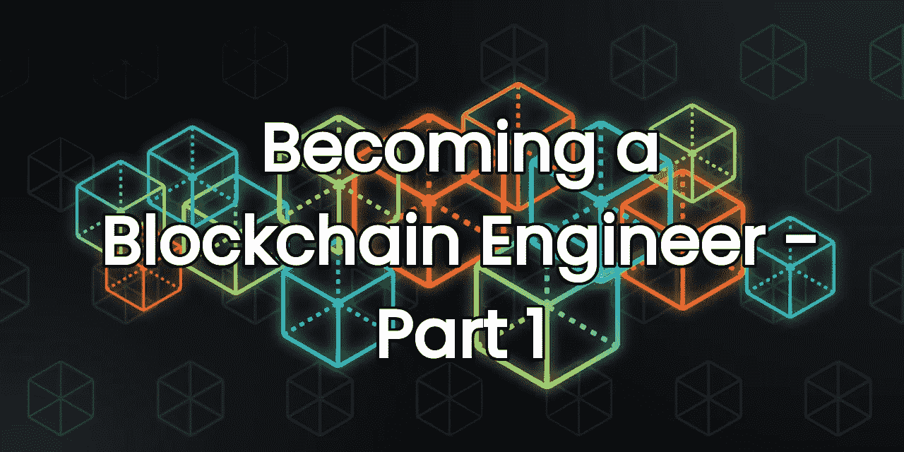

# 踢块:成为区块链工程师—第 1 部分

> 原文：<https://medium.com/coinmonks/kicking-the-block-becoming-a-blockchain-engineer-part-1-8ec2012ac3a0?source=collection_archive---------18----------------------->

Kicking the Block: Becoming a Blockchain Engineer — Part 1

# **新手介绍**

如今，区块链和 Web3 生态系统正在不断发展。几年前，人们很容易理解比特币的概念，并由此开始发展。今天有数百种不同的区块链(第一层，第二层，乐观主义者总结，ZK-斯纳克，副链)，很难理解所有这些。

然而，它仍然是可能做到的！在这一系列文章中，我将解释我如何在一年内成为一名区块链工程师，并能够从中赚取收入。

这第一部分，**新手介绍**，集中在你需要获得的初始知识和工具，以启动你的道路。接下来的几期文章将详细讨论这个主题，为您提供更多的信息、工具和建议供您尝试。

# 以太坊

从无数的区块链中，如果你想开始你的职业生涯，以太坊是事实上的区块链。他们发明了以太坊虚拟机，这是一个运行以太坊内部所有逻辑的软件。大多数其他区块链都是 EVM 兼容的，这告诉你以太坊有多重要。了解它是什么以及它是如何工作的，你将从一个很好的基础开始。

你可以在他们的网站上阅读以太坊的介绍:【https://ethereum.org/en/developers/docs/intro-to-ethereum/

# **智能合同**

**这些是以太坊的建筑材料。它们基本上是存在于区块链中的代码片段，可以用来执行几方之间的协议。这些合同的特殊性在于，它们是使用以太坊的共识机制执行的，这意味着它们的代码是由参与区块链的每个人强制执行的。使用智能合约的区块链中许多最重要的协议都公布了它们的源代码，这意味着它们不仅由链强制执行，而且由用户审计。这使得智能合约成为管理关键资产(例如金钱)的理想选择。**

**这里有更多关于智能合约的信息:[**https://ethereum.org/en/developers/docs/smart-contracts/**](https://ethereum.org/en/developers/docs/smart-contracts/)**

# **固态**

**一旦你了解了什么是智能合同，你就应该选择用哪种语言来写它们。有几个选项可供选择:生锈，Vyper，YUL，坚实。根据我的经验，稳健是最容易接近的，也是目前越来越受欢迎的。我建议学习它，然后如果你想的话，你可以跳到其他的。现在从零开始学习 Solidity 的资源不多，但是很好的也不多。**

****吃积木****

**这个 YouTube 频道有丰富的信息。有很多 Solidity 教程可以帮助你学习这门语言。这个播放列表应该让你开始:【https://www.youtube.com/playlist?】T3[list = plbbtodcoyioe 0 D6 fschnu 4 rqtgfrpk3ea](https://www.youtube.com/playlist?list=PLbbtODcOYIoE0D6fschNU4rqtGFRpk3ea)**

**朱利安还开办了他自己的区块链工程师学院，你可以在[**https://eattheblocks.com**找到。这份工作是有报酬的，但也能让你起步。](https://eattheblocks.com.)**

****智能合约程序员****

**另一个值得一看的地方是这个 YouTube 频道，它也有一个很棒的播放列表向你介绍智能合约的世界:[**https://www.youtube.com/playlist?list = plo 5 vpq h 6 owduldcret 0 s0eyq 7 yckzrigz**](https://www.youtube.com/playlist?list=PLO5VPQH6OWdULDcret0S0EYQ7YcKzrigz)**

**当你开始对基本概念感到厌倦时，它还有高级视频！**

## **官方文件**

**最后，看看 Solidity 语言的官方文档，在那里你会找到对该语言的全面描述。它不是学习语言的理想资源，但当你对技术细节有疑问时，它是最好的参考。**

**可以在这里找到:[**https://docs.soliditylang.org/en/latest/**](https://docs.soliditylang.org/en/latest/)**

# **程序设计环境**

**最后但同样重要的是，编程环境非常重要。基本上，代码编辑器加上编译器可以让你编写、验证、编译和部署你的合同。对于新手来说，最容易使用的是基于浏览器的以太坊合同开发环境 **RemixIDE** 。它拥有您开始 Blokchain 工程生涯所需的一切。**

**他们自己的文档很好理解怎么用:[**【https://remix-ide.readthedocs.io/en/latest/】**](https://remix-ide.readthedocs.io/en/latest/)**还有上面提到的两个 YouTube 频道大量使用了它，大家可以看看它是怎么用的。****

# ****暂时够了！****

****现在你可以开始你的区块链工程师职业生涯，成为下一个 Uniswap、OpenSea 或谁知道什么的创造者！****

****在下一部分中，我们将更深入地了解智能合同的开发:****

*   ****建立一个带有软件栈的本地编程环境，这将帮助我们提高我们的水平****
*   ****了解一些有用的库，它们将提高我们的工作效率和智能合同的安全性****
*   ****玩一些编程游戏来深入挖掘我们的固体知识****

****请尽快查看第二部分，如果你喜欢这一部分，请尽你所能通过**鼓掌**来表达你的爱，或者留下评论告诉我你过得怎么样！****

****并且记住:保持它的聪明和安全！****

> ****加入 Coinmonks [电报频道](https://t.me/coincodecap)和 [Youtube 频道](https://www.youtube.com/c/coinmonks/videos)了解加密交易和投资****

# ****另外，阅读****

*   ****[OKEx vs KuCoin](https://coincodecap.com/okex-kucoin) | [摄氏替代品](https://coincodecap.com/celsius-alternatives) | [如何购买 VeChain](https://coincodecap.com/buy-vechain)****
*   ****[币安期货交易](https://coincodecap.com/binance-futures-trading)|[3 comas vs Mudrex vs eToro](https://coincodecap.com/mudrex-3commas-etoro)****
*   ****[如何购买 Monero](https://coincodecap.com/buy-monero) | [IDEX 评论](https://coincodecap.com/idex-review) | [BitKan 交易机器人](https://coincodecap.com/bitkan-trading-bot)****
*   ****[CoinDCX 评论](/coinmonks/coindcx-review-8444db3621a2) | [加密保证金交易交易所](https://coincodecap.com/crypto-margin-trading-exchanges)****
*   ****[红狗赌场评论](https://coincodecap.com/red-dog-casino-review) | [Swyftx 评论](https://coincodecap.com/swyftx-review) | [造币厂评论](https://coincodecap.com/coingate-review)****
*   ****[Bookmap 评论](https://coincodecap.com/bookmap-review-2021-best-trading-software) | [美国 5 大最佳加密交易所](https://coincodecap.com/crypto-exchange-usa)****
*   ****[如何在 FTX 交易所交易期货](https://coincodecap.com/ftx-futures-trading) | [OKEx vs 币安](https://coincodecap.com/okex-vs-binance)****
*   ****[CoinLoan 审查](https://coincodecap.com/coinloan-review) | [YouHodler 审查](/coinmonks/youhodler-4-easy-ways-to-make-money-98969b9689f2) | [BlockFi 审查](https://coincodecap.com/blockfi-review)****
*   ****[XT.COM 评论](https://coincodecap.com/profittradingapp-for-binance)币安评论 |****
*   ****[SmithBot 评论](https://coincodecap.com/smithbot-review) | [4 款最佳免费开源交易机器人](https://coincodecap.com/free-open-source-trading-bots)****
*   ****[比特币基地僵尸程序](/coinmonks/coinbase-bots-ac6359e897f3) | [AscendEX 审查](/coinmonks/ascendex-review-53e829cf75fa) | [OKEx 交易僵尸程序](/coinmonks/okex-trading-bots-234920f61e60)****