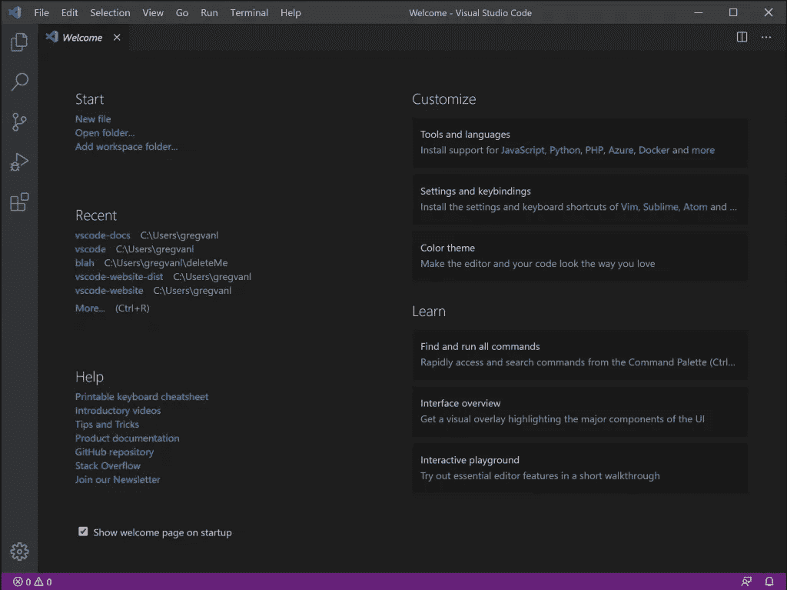

# 踢块:成为区块链工程师——第二部分

> 原文：<https://medium.com/coinmonks/kicking-the-block-becoming-a-blockchain-engineer-part-2-233852578cd8?source=collection_archive---------27----------------------->

Kicking the Block: Becoming a Blockchain Engineer — Part 2

# 狂热的开端

欢迎回来！在这一系列文章中，我试图为那些想开始区块链开发但不知道从哪里开始的新手提供信息。在本系列的第一部分，我们重点介绍了以太坊、智能合约和智能合约语言之一:可靠性。

在第二部分中，我们将关注于开始设置一个本地开发环境，它可以在我们的开发过程中帮助我们。我们将把集成开发环境(IDE)，扩展和命令行插件放在一起，这将提高我们的生产力，并帮助我们保持我们的项目整洁和安全。我们走吧！

# IDE: VS 代码

现在有很多 IDE，但是到目前为止我更喜欢 Visual Studio 代码环境。已经移植到 Windows、Mac、Linux，是一个可扩展性很强的环境，可以满足所有人的需求。也就是说，如果您有一个 IDE 可供选择，请大胆尝试！我将把我的解释建立在 VS 代码的基础上，但是如果你对它很了解的话，它应该很容易适应你自己的环境。

首先你需要在这里下载 VS 代码:[https://code.visualstudio.com/download](https://code.visualstudio.com/download)

安装并打开它。您将看到欢迎页面:

安装完成后，如果你想深入了解它的可能性，请查阅相关文档:【https://code.visualstudio.com/docs

# 扩展

VS Code 是一个很棒的 IDE，但它只预装了基本的东西，虽然它对于大多数用途来说已经足够了，但我们需要安装特定的扩展来使它适用于区块链开发环境。

通过单击左侧导航栏上的扩展图标来安装扩展。有关如何做的信息，请查看这里:[https://code . visual studio . com/docs/editor/extension-market place](https://code.visualstudio.com/docs/editor/extension-marketplace)

一旦你适应了，让我们为你安装几个不错的扩展。

## 胡安·布兰科的稳健

这一惊人的扩展将为 VS 代码增加坚固性支持，包括语法高亮、代码编译和格式化。它真的很棒，而且定期更新。

 [## 可靠性- Visual Studio 市场

### Solidity 是以太坊中用来创建智能契约的语言，这个扩展提供了:语法高亮…

marketplace.visualstudio.com](https://marketplace.visualstudio.com/items?itemName=JuanBlanco.solidity) 

## 较美丽

这是一个支持多种编程语言的代码格式化工具。代码格式化是一个非常必要的工具，可以让你的代码保持有组织和可维护性。它也是 Juan Blanco 的 Solidity 扩展的一个依赖项，因为它使用了 Prettier 来格式化代码。

 [## 更漂亮的代码格式化程序- Visual Studio 市场

### Visual Studio 代码的扩展-使用更漂亮的代码格式化程序

marketplace.visualstudio.com](https://marketplace.visualstudio.com/items?itemName=esbenp.prettier-vscode) 

## 滑行

一个静态分析工具，可以帮助我们识别智能合约中的问题。它将分析代码，并搜索可能导致合同安全漏洞的不良行为。这在开发智能合约时非常重要，因为它们通常会以这样或那样的方式管理资金，所以您应该始终努力获得无错误的代码。这在开发时总是正确的，但当你因为一个 bug 而损失数十亿时，或者当你不能对你的代码应用一个热的 f [i](https://marketplace.visualstudio.com/items?itemName=tintinweb.solidity-metrics) x 时，更是如此。

 [## Slither - Visual Studio 市场

### Slither 的 Visual Studio 代码集成，Solidity 静态分析框架。这个扩展提供了 Visual Studio…

marketplace.visualstudio.com](https://marketplace.visualstudio.com/items?itemName=trailofbits.slither-vscode) 

## 坚实度度量

它将为您提供不同的代码度量、代码复杂性和代码风险概况。同样，这是一个安全增强工具，可以帮助您了解您的代码有多成熟，以及它是否可以部署在真实的区块链上。

 [## 可靠性指标- Visual Studio 市场

### 🌐 📩 🔥]为用 solidity (Smart…)编写的项目生成源代码指标、复杂性和风险概况报告

marketplace.visualstudio.com](https://marketplace.visualstudio.com/items?itemName=tintinweb.solidity-metrics) 

## Solidity 可视化开发人员

它是一个被动的安全工具，是 Slither 工具的补充。它向您实时显示大量关于您的契约外部调用、变量使用、函数修饰符等信息，让您了解在编写智能契约时所做的所有选择。由 Consensys 撰写，该领域最受尊敬的智能合同审计师之一。你不能错过它！

 [## solidity Visual Developer-Visual Studio 市场

### 🌐 📩 🔥] Advanced Solidity 语言支持代码增强源代码探索可视化安全林挺扩展…

marketplace.visualstudio.com](https://marketplace.visualstudio.com/items?itemName=tintinweb.solidity-visual-auditor) 

# 总结

一旦你安装了所有的扩展，阅读它们并了解它们的特性。当我们在区块链系列的第 3 部分设置我们的本地项目时，我们将充分利用它们。

请尽快查看下一部分，如果你喜欢这一部分，请尽可能多地通过**鼓掌**来表达你的爱，或者留下评论告诉我你过得怎么样！

并且记住:保持它的聪明和安全！

> 加入 Coinmonks [电报频道](https://t.me/coincodecap)和 [Youtube 频道](https://www.youtube.com/c/coinmonks/videos)了解加密交易和投资

# 另外，阅读

*   [加密复制交易平台](/coinmonks/top-10-crypto-copy-trading-platforms-for-beginners-d0c37c7d698c) | [如何在 WazirX 上购买比特币](/coinmonks/buy-bitcoin-on-wazirx-2d12b7989af1)
*   【Crypto.com 评论】|[【T4 评论】](/coinmonks/crypto-com-review-f143dca1f74c)
*   [如何在加拿大购买加密货币？](https://coincodecap.com/how-to-buy-cryptocurrency-in-canada)
*   [无聊猿游艇俱乐部(BAYC)评论](https://coincodecap.com/bored-ape-yacht-club-bayc-review)
*   [5 款最佳加密交易终端](https://coincodecap.com/crypto-trading-terminals) | [最佳 DeFi 应用](https://coincodecap.com/best-defi-apps)