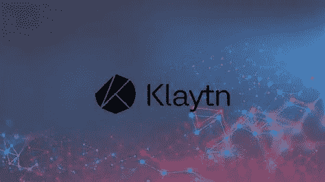

# 克莱滕 2022-2025 年价格预测

> 原文：<https://medium.com/coinmonks/klaytn-price-prediction-2022-2025-2ba4bfb626d9?source=collection_archive---------33----------------------->

Source photo [klaytn — Bing images](https://www.bing.com/images/search?view=detailV2&ccid=0MWNVCqj&id=0563B9F9EE279C0A0A9742FABC0EBA1F0E1A9939&thid=OIP.0MWNVCqjkyvPD61e6M9GPQHaEK&mediaurl=https%3a%2f%2fwww.cryptonewsz.com%2fwp-content%2fuploads%2f2019%2f11%2fKlaytn-Adds-8-New-KLAY-based-Blockchain-Applications-.jpg&cdnurl=https%3a%2f%2fth.bing.com%2fth%2fid%2fR.d0c58d542aa3932bcf0fad5ee8cf463d%3frik%3dOZkaDh%252b6Drz6Qg%26pid%3dImgRaw%26r%3d0&exph=1080&expw=1920&q=klaytn&simid=608017475049300216&FORM=IRPRST&ck=C6CA65793EDF3384B3807B93F7239F39&selectedIndex=0&ajaxhist=0&ajaxserp=0)

Klaytn 是 Kakao 的全球公共区块链计划，展示了一个以服务为中心的企业级平台，为数百万用户提供无摩擦的区块链体验。混合架构融合了公共和私有区块链的最大优势(分散数据和控制、分布式治理)(低延迟、高可扩展性)。