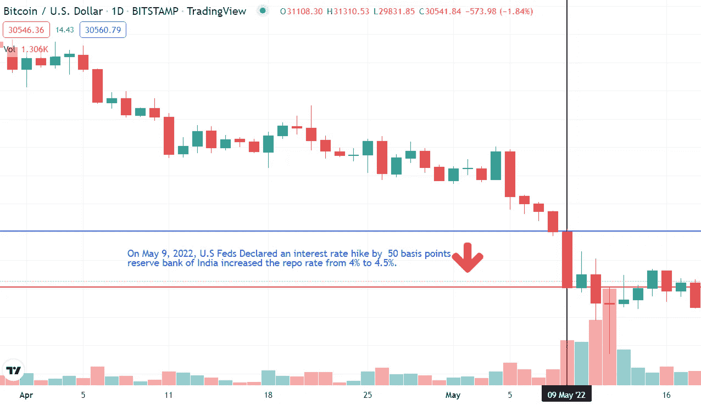

# 了解加密货币和经济是如何结合的

> 原文：<https://medium.com/coinmonks/know-how-cryptocurrency-and-economics-go-together-833a1e7bd3a5?source=collection_archive---------45----------------------->

Image Source: Liberty Street Economics

想知道比特币或任何加密货币的价格为什么以及如何在市场上受到影响吗？你们中的一些人可能认为[加密货币](/coinmonks/simple-way-to-understand-cryptocurrency-by-day-to-day-examples-9f3bb62f7c9c)的价格独立于市场因素，并像赌博或博彩计划一样自行波动。

十年来，加密货币越来越受欢迎。这种流行和重新定义的金融生态系统使得拦截政府和中央当局对影响其价格和波动指数的加密货币进行监管或实施禁令。

好吧，如果这就是原因，那么加密货币就永远不会在全球众多人口中流行起来，成为法定货币，或者受到萨尔瓦多、阿联酋、新加坡、澳大利亚、加拿大、英国、泰国和其他许多支持加密货币的国家的监管。

> 加密货币的交易与股票市场的交易非常相似，区别在于没有结算期，并且是 24x7 开放的市场。

事实上，经济政策在人们的投资情绪中扮演着重要角色。

> 以下是将比特币和其他加密币价格与经济指标联系起来的少数几个概念。这是我过去一个月的观察和解读(不是什么理财建议)。

## **经济学中投资需求的概念:**

Image Source: Economicshelp; Interest rates decided by Central Banks show inverse relation with the quantity of money in circulation. Fewer interest rates avail more money in the economy for investment. Lowering interest rates after a certain level creates a liquidity trap where demand for money remains constant and does not change with further lowering of the interest rates.

> 在宏观经济学中，存在三种需求目的，即投资需求、预防性需求和交易性需求。

**交易需求**是日常购买商品和服务所需的资金。我们日常购买食物、电力和水所需的资金就是交易性需求的一个例子。

**预防性货币需求**被定义为紧急情况下需要或抵消的货币。这笔钱的作用是在人们面临意外负债时解决紧急问题。

当货币供应充足时，投机性需求就会出现，因为低利率使得消费者能够增加支出。消费者将资金投资于高风险、高回报的资产，以获取资本收益。

## **资产需求投资与利率的关系:**

Image Source: Economicshelp.org; This is the graph showing a relation between interest rates and the amount of money invested in capital assets such as the Stock market, Cryptocurrency, and other high return instruments. With rising interest rates, the quantity of money invested reduces and people keep more money in their savings accounts. The arrows in red indicate the proportionate change in the interest rate and investment demand.

一个国家的宏观经济稳定由政府和中央银行控制。政府通过为国家制定法律来控制经济因素。

根据市场情况，政府倾向于以发行债券的形式增加或减少其支出或借款。

## 政府的财政政策:

政府通过支出他们的资金或以增加税收、出售他们的资产和通过发行债券从私人或双边交易中贷款的形式增加借款来控制经济。

> 政府的经济行为被归类为财政政策。

增加支出激励人们有更多的钱来消费，购买商品和服务，从而增加总消费，提高整体 GDP。

然而，增加私人部门和家庭的借贷会减少货币供应，降低家庭的消费需求，从而使经济放缓。

## 中央银行的货币政策:

货币政策由决定市场利率的中央银行操纵，影响资产、商品和服务的价格。

从技术上讲，利率和资产投资是反向相关的。当利率较高时，投资者就会气馁，因为他们需要更多的机会成本来以贷款的形式借钱。

> 在这种时候，把钱存在储蓄账户里可以获得更高的回报。

反之，如果利率降低，贷款的借贷成本就会降低，投资者就会被鼓励从银行贷款，从而增加经济中的货币流通，促进对货币的资产需求。

## 加密货币**和宏观经济在价格变化中的作用:**

On May 9, 2022, the price of Bitcoin fell from $ 36,000 to $30,000 down by 11.59% that day.

2022 年 5 月 9 日，[美联储加息 0.9%](https://www.wealthbriefing.com/html/article.php?id=194489#.YqDOeHZBy3A) ，为 1992 年后最高。同样在印度，印度央行(RBI)将回购利率上调 50 个基点或 0.5%，将回购利率从 4%上调至 4.5%。

> 回购利率是印度储备银行对私人银行贷款收取的利率金额。

这一举措旨在吸收系统中流通的大量货币，防止更多的通货膨胀以及商品和服务价格上涨。

这一举措影响了股票市场、加密货币和世界各地的其他金融投资工具，使股票市场和加密市场分别下跌了 2%至 15%。

随着资产需求的增加，通货膨胀率也增加了，目前，整个世界都陷入了通过提高利率和增加借款来控制加密货币和其他资产的监管压力来控制通货膨胀的情景中。

## **结论:**

无论是加密货币还是任何其他资产，投资或投机需求都受到监管政策的控制。政府和中央银行的经济行为是预测密码市场价格的一个工具。

从更广泛的意义上来说，还有其他新闻矫揉造作和技术变量也会对加密货币的价格产生影响。

> *“感谢您阅读我的文章。鼓掌，分享并关注我的* [*简介(点击此处)*](/@barateprajwal25) *了解更多更新和内容。”*
> 
> 加入 Coinmonks [电报频道](https://t.me/coincodecap)和 [Youtube 频道](https://www.youtube.com/c/coinmonks/videos)了解加密交易和投资

# 另外，阅读

*   [AscendEx 保证金交易](https://coincodecap.com/ascendex-margin-trading) | [Bitfinex 赌注](https://coincodecap.com/bitfinex-staking)
*   [最好的卡达诺钱包](https://coincodecap.com/best-cardano-wallets) | [Bingbon 副本交易](https://coincodecap.com/bingbon-copy-trading)
*   [印度最佳 P2P 加密交易所](https://coincodecap.com/p2p-crypto-exchanges-in-india) | [柴犬钱包](https://coincodecap.com/baby-shiba-inu-wallets)
*   [8 大加密附属计划](https://coincodecap.com/crypto-affiliate-programs) | [eToro vs 比特币基地](https://coincodecap.com/etoro-vs-coinbase)
*   [最佳以太坊钱包](https://coincodecap.com/best-ethereum-wallets) | [电报上的加密货币机器人](https://coincodecap.com/telegram-crypto-bots)
*   [交易杠杆代币的最佳交易所](https://coincodecap.com/leveraged-token-exchanges)