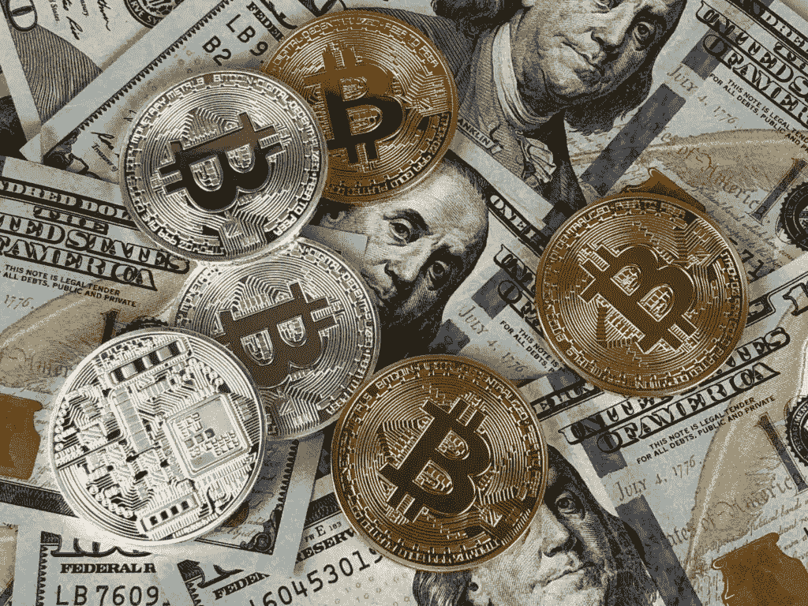
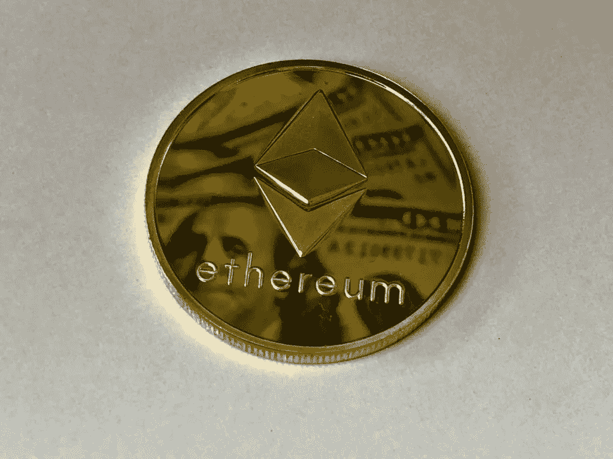

# 了解你的加密货币。

> 原文：<https://medium.com/coinmonks/know-your-cryptocurrencies-a895e2ae2857?source=collection_archive---------70----------------------->

**从根源上理解加密货币**

A closer look at coins: Picture by Pexels

金钱创造了社会阶层。这就是你困在你讨厌的工作中的原因。它决定了谁得到了最高质量的教育，谁根本没有受到教育。

至于你穿的鞋子，你的口袋证实了你能买到。但是我们真的需要这些吗？金钱对我们的幸福是必要的吗？

让我们看看。

最初，我们的祖先用物物交换来交换货物。但是你能想象用 3 吨小麦换铁意味着什么吗？

交通绝对是个大问题。此外，交易从来都不公平。人们总是会为了自己的利益而抬高或压低商品的价格。我为什么这样说呢？没有特定的价值标准。

**我们为什么需要钱**

所有这些问题都需要一个改变游戏规则的人。那就是钱。

从公元前 640 年的贝壳到金币。它的主要目标是有一个交换媒介、计量单位和价值仓库。

我们的祖先需要一些耐用的、便携的、可能有内在价值的东西来达到这个目的。因此，他们采用了金币。

但是，我可以想象在一个遥远的地方买一大笔东西意味着什么。这将意味着带着成吨成吨的硬币旅行。你带着那些贵重的行李很容易吸引小偷。可移植性问题已经解决了一半。

意识到这一点迎来了借据(我欠你的)。这份证书是对某处储藏的黄金储备的要求权。这些证书比黄金本身更受欢迎，尤其是在欧洲殖民地。

用今天的术语来说，借据在某种程度上相当于黄金支持的货币。但近几年来，除了一个国家的经济之外，没有任何东西能支撑货币。

这些货币被称为法定货币；这个想法首先在 11 世纪的中国被发现；然而，直到 1971 年理查德·尼克松宣布世界上最大的储备货币美元为法定货币，它才开始出名。

当你拿着一张一美元的钞票时，你暗示美国经济欠你的，并将支付给你这样价值的商品。

**这里是加密货币获得一席之地的地方**

再次回到货币的基本面。货币的全部意义在于拥有一个交换媒介，一个衡量价值的标准尺度，以及一个财富储存库。

你不能和我争论比特币不符合侧写。它在便携性方面提供了极大的优势；没有什么比挂在空中的一串代码更便携的了。说到整除，比特币的最小单位是 0.00000001 BTC，也就是大约 0.0004426 美元。多棒啊。

没有中央政府控制货币来给冰淇淋添加糖屑。我不讨厌政府，但让我们面对现实吧，有些政府纯粹是垃圾。顺便说一句，缺乏中央治理会带来更大的波动，但这与合法逃避荒谬的税收相比不算什么。

在以太坊这样的加密货币中，你不会信任任何人，也不会信任政府。而是一个完整的生态系统，其中的成员更有可能对他们社区的成功感兴趣。

这就像，人们第一次选择了价值对自己意味着什么。亚里士多德可能会担保这种类型的民主。加密货币允许大多数人决定他们持有的东西的价值，而当前的银行系统更像是一个贵族系统。一群精英在那里发号施令。

加密货币用户觉得脱离政府的想法很有趣。这是有道理的。因为政府多次辜负了他们的人民，有些还在继续，黎巴嫩，津巴布韦，阿根廷，不胜枚举。

**加密货币**

从我的[前作](https://derbymatoma.com/2022/03/14/derbymatoma-com-how-blockchain-works/)中，你对区块链的工作方式有了深入的了解。我想我们可以继续了。

让我先澄清几件事，加密货币不是区块链的唯一用途。

区块链有几个含义，大部分超出我的想象。还有你的。

我们仍处于整个技术的尖端，未来还会有更多。这就像尼古拉·奥托发现燃油发动机一样；他从未想到涡轮螺旋桨发动机和喷气式发动机后来会基于同样的原理制造。

这同样适用于区块链。我们有更多要看的。

任何以数字形式存在的货币，如果没有中央机构发行和使用加密技术来保护其交易，都是加密货币。

**密码术**是一种使用安全通信技术的技术，只有目标接收者才能看到信息的内容。

当你为你的加密货币钱包提供资金时，你支付的是允许你使用虚拟货币的代码。

从另一个维度来看，加密货币是一种不使用中央银行等中央权威机构处理交易的方式。他们利用区块链来促进对等交易并确保交易安全。

一种加密货币区块链记录代码的转移，允许在其核心的硬币中花费价值。

一枚硬币的价值完全由供求力量决定。需求代表了愿意和有能力购买加密货币的人的数量。而供给意味着有意愿和有能力的卖家的数量。

当对一枚硬币的需求很大时，它的价值就会上升，当供大于求时，它就会暴跌。。这也支持去中心化的概念，因为硬币的价值仅由所有加密货币生态系统成员决定，他们决定是否应该购买、持有或出售。

在典型的法定货币中，像中央银行这样的中央权力机构决定货币的价值。他们通过调节利率、财政政策或漫无目的地印钞票来实现这一点，就像他们在津巴布韦所做的那样。

拥有一种其价值受市场参与者控制和影响的货币的想法使得加密货币的观点从单纯的交换模式转变为工具性投资。

大多数加密货币是通货紧缩的；这在保护财富方面做得很好。例如，总共只有 2100 万个比特币可以被挖掘。2140 年，最后一枚比特币将被开采。反过来，这造成了稀缺，从而对冲通胀。

另一方面，政府控制着法定货币，只要他们觉得有必要摆脱困境，就可以印刷法定货币。在 2020-2021 年间，美国为他们的 covid 救济计划印刷了超过 5 万亿美元。加上基础设施支出，美国可以在近一年的时间内印刷约 60%的 GDP。这意味着流通的纸张过多。

我不能就此作出结论，因为中央政府可以操纵政治为自己谋利。但并非所有国家都能安然度过这一难关。

因此，管理不善的法定货币可能会贬值。

加密货币作为投资资产和交易方式的双重性质使其在与传统货币竞争的同时，与股票和期货等其他投资工具密切相关。因此，描述加密货币的角色可能会很复杂。

但这里有一个想法，大多数法定货币也是投资资产。至少那些来自可信经济体的人是这样。让我们来谈谈瑞士法郎、日元和强势美元。所有这些货币都可以被视为投资资产和交易媒介。

意识到加密货币具有同样的特征并不令人震惊。并且可以扮演两种角色。然而，它们的投资特性已变得比仅仅作为交易媒介更受欢迎。

底线是钱的概念正在从贝壳硬币演变成一串代码。所有这些都应该被欣赏，因为它反映了时代。

这里有一些你需要知道的硬币。

**比特币(BTC)**

Different currencies: picture from Pexels by David Mcbee

比特币符号是美元符号最接近的对手。这种硬币是 2008 年为应对全球金融危机而发明的。

不管原因是什么，是谁发明了它，这个密码之王正在使它在市场上变得巨大。尽管才十几岁，但它的市值超过 8000 亿美元，拥有世界上 3%的资金。

不要忘记，有些货币已经存在了几个世纪，但却一文不值。

比特币所做的是消除了重复支出和处理交易的中央机构。在复式记账系统中，我们需要一个中央机构来验证交易的有效性。

多年来，如果不使用中央系统来检查交易，很难阻止重复支出。

satoshi 所做的是将交易验证的负担从一个中央机构转移到网络中的每个人。繁重的工作由称为矿工的专门节点完成。

结果是一个纯粹的 P2P 系统(点对点)。没有人站在你和你想交易的人之间。正如在之前的文章中所讨论的，伪造或更改交易是不可能的，或者至少在比特币网络中从未发生过。

这枚硬币受到了相当多的批评。在一些国家，这是被禁止的。原因从政府的自然厌恶到它留下的碳足迹。所有这些都是可以理解的。

例如，工作证明需要消耗大量的能量。能源需求的增加直接导致更多的二氧化碳排放。考虑到拥有最多矿工的中国使用煤炭作为能源，你可以看出这枚硬币对环境的影响。

比特币还因其匿名特性而受到批评。这保护了无辜的吸毒者和贩毒骗子，以及其他罪犯。尽管交易是透明的，但追踪到个人却很困难。

其中一些问题至今无解。但至于碳足迹，比特币可能会从 PoW(工作证明)系统转移到 PoS(股权证明)。如果可能的话。

或者，我们可以支持绿色能源用于比特币开采。这也没有解决电子垃圾的问题。

也许我们还没有完全拥有它，但是很快，我们就会拥有它。

**以太坊**

Ethereum coin: Pexels picture from David Mcbee

通过他在自己创办的比特币杂志中的工作，Vitalik Buterin 认为加密货币可以有更多用途。

看着比特币，他认为这个系统可以变得更加强大。此外，区块链可以被设计成携带应用程序或程序。

这一创新带来了以太坊。维塔利克是对的。以太坊有一个复杂的系统，允许资产和程序在它的区块链中移动和存储。

大多数代币，如 TenX(支付)、Status(SNT)和其余的 shitcoins 都没有自己的区块链。相反，他们使用现有的以太坊区块链。

似乎这还不够，NFT(不可替代代币)的交易和存储是以以太坊为前提的。这要归功于以太坊的一个额外功能，它允许程序在其区块链中运行。

以太坊 2.0 有许多有前途的特性。2020 年进行的升级旨在通过使用 PoS 来降低 PoW 产生的有害气体排放的风险。

股权证明通过允许矿工用硬币下注来验证交易，促进了环境的可持续性。

为了采矿，节点必须提供硬币作为抵押品。如果幸运的话，他们会被选中。随机性消除了复杂计算的概念，复杂计算在 PoW 中占主导地位。

所有这些创新以及以太坊 2.0 第一阶段和第二阶段的创新可以证明其 3000 亿美元的市值是合理的。

**卡尔达诺(阿达)**

卡尔达诺的愿景是服用类固醇的以太坊。事实上，其创始人之一查尔斯·霍斯金(Charles Hoskin)曾与以太坊人气颇高的维塔利克·布特林(Vitalik Buterin)共事。霍斯金在创建卡尔达诺之前担任以太坊基金会的首席执行官。

这应该可以解释 ADA 和 ETH 在方法上的相似之处。

卡尔达诺是大多数加密货币的全部；然而，它充分利用了股份证明(PoS)，将自己定位为最环保的硬币。

使用前面讨论的利益证明(PoS)可以大大减少利益证明加密货币开采方法带来的环境危害。

除了它所使用的革命性 PoS 之外，Cardano 据说正在开发应用程序构建功能。这意味着感兴趣的开发者可以在其区块链上构建分散式应用程序。

因此，在许多技术发展中，这些带来了智能合同。

幸运的是，测试已经推出。现在，它的手指交叉；让我们看看 Cardano 的 web 3.0 为我们准备了什么。

关于应用程序，更有趣的是它们需要构建的高级编程语言。对于我那些讨厌学习 Java 和 Python 的朋友来说，这可能是活着的最好时机。

总的来说，卡尔达诺是有前途的，仍然是我的最爱。尽管没有完全开发其技术，它已经积累了超过 700 亿美元的市值，使其在市值方面排名第三。

**涟漪币(RXP)**

Ripple coin (RXP)的创始人声称，在处理全球交易时，大约损失了 1.6 万亿美元。因此，他们呼吁通过采用区块链的更有效的支付系统来解决这些问题。

与寻求消除银行和金融机构的比特币不同，Ripple 的目标是将银行纳入他们的系统，或者更好地说，将银行纳入他们的设计。不管你怎么想。

在某种程度上，Ripple 销售交易促进软件。好主意，对。

Ripple 带来的是一种更廉价的交易处理方式，不仅适用于银行和机构，也适用于希望无缝结算全球交易的消费者。使用区块链可以通过一个分类帐间协议降低成本，该协议可以在降低结算风险的同时确保交易的可靠性。当然，所有这些都是在没有第三方过多干预的情况下完成的。

不用说，Ripple 可能是唯一一种不寻求完全扰乱当前金融体系的著名加密货币。相反，它旨在加强它，使它更有效率。

**DogeCoin**

在社交媒体和迷因的世界里，在加密货币中看不到同样的表现是不寻常的。尽管是第三大最受欢迎的硬币，市值排名第五，Dogecoin 仍然是一个迷因。

这枚硬币因其坚实的粉丝基础而广为人知，包括特斯拉老板埃隆·马斯克。

我对革命性的 Dogecoin 没什么可说的；它的区块链建筑在很多方面都有些过时。这主要是由于它采用的功率；如上所述，这存在环境危害。

和比特币一样，Dogecoin 可以用于全球交易。它可以作为金融工具进行交易。但也仅此而已。

我们喜欢 Dogecoin，但是在技术升级方面可能没有希望。这是因为几乎不可能重建一个已经存在的功能齐全的区块链的核心。

这篇文章的目的是让你了解你的加密货币。至少知道前 5 名和区别他们的特征。

# **来源**

[这是我以前的一篇文章，我在文章中提到过几次](/coinmonks/how-blockchain-works-bb243142375c)

[https://www . Nasdaq . com/articles/money-printing-and-inflation % 3A-covid-cryptocurrences-and-more](https://www.nasdaq.com/articles/money-printing-and-inflation%3A-covid-cryptocurrencies-and-more)

file:///C:/Users/Admin/Downloads/doge coin % 20 cash % 20 white paper . pdf

file:///C:/Users/Admin/Downloads/CARDANO _ Building-block . pdf

file:///C:/Users/Admin/Downloads/ripple _ solutions _ guide . pdf

[https://www . dogecoincash . org/Dogecoin % 20 cash % 20 white paper . pdf](https://www.dogecoincash.org/Dogecoin%20Cash%20Whitepaper.pdf)

[https://en.wikipedia.org/wiki/Ethereum](https://en.wikipedia.org/wiki/Ethereum)

[bitcoin.org](http://bitcoin.org/)

derbymatoma.com

> 加入 Coinmonks [电报频道](https://t.me/coincodecap)和 [Youtube 频道](https://www.youtube.com/c/coinmonks/videos)了解加密交易和投资

# 另外，阅读

*   [有哪些交易信号？](https://coincodecap.com/trading-signal) | [Bitstamp vs 比特币基地](https://coincodecap.com/bitstamp-coinbase) | [买索拉纳](https://coincodecap.com/buy-solana)
*   [ProfitFarmers 回顾](https://coincodecap.com/profitfarmers-review) | [如何使用 Cornix 交易机器人](https://coincodecap.com/cornix-trading-bot)
*   [十大最佳加密货币博客](https://coincodecap.com/best-cryptocurrency-blogs) | [YouHodler 评论](https://coincodecap.com/youhodler-review)
*   [MyConstant Review](https://coincodecap.com/myconstant-review) | [8 款最佳摇摆交易机器人](https://coincodecap.com/best-swing-trading-bots)
*   [MXC 交易所评论](/coinmonks/mxc-exchange-review-3af0ec1cba8c) | [Pionex vs 币安](https://coincodecap.com/pionex-vs-binance) | [Pionex 套利机器人](https://coincodecap.com/pionex-arbitrage-bot)