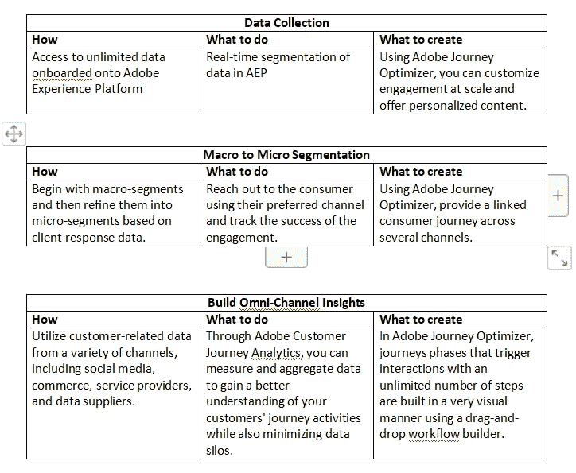
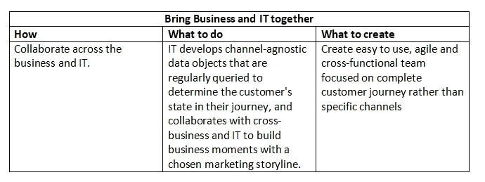
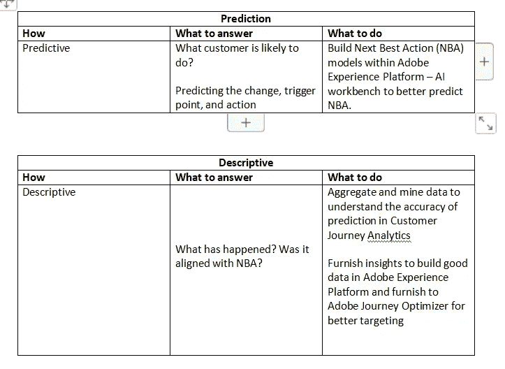
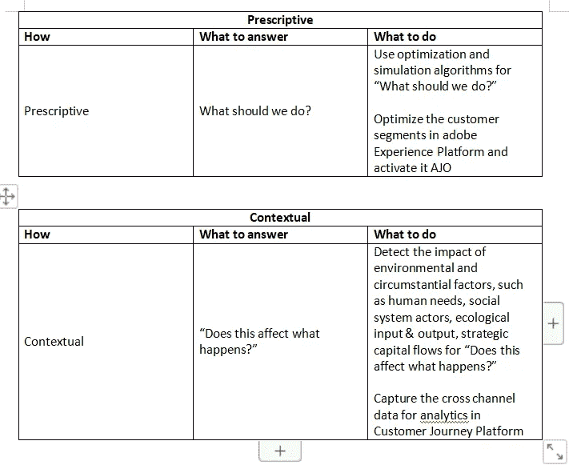

# 使用 Adobe Experience Platform、Adobe Journey Optimizer 和 Customer Journey Analytics，在面向客户的过程中更好地了解客户

> 原文：<https://medium.com/coinmonks/know-your-customer-better-in-their-customer-facing-process-using-adobe-experience-platform-adobe-e007ec6cfff0?source=collection_archive---------21----------------------->

我们一直在通过数字和非数字渠道与客户交流。在 2000 年初，我们开始谈论多渠道，我记得市场上充斥着多渠道平台，尤其是营销自动化平台，如 Aprimo、Unica、Neolane、ExactTarget 等。到了 2011-2012 年，我们开始谈论全渠道及其对客户体验的影响。

我清楚地记得 2011 年对全渠道的定义是“在多渠道世界中优化客户服务”。据报道，客户通常会通过三个甚至四个渠道来完成与最终消费者的单笔交易。

那么现在呢，在 2022 年？之前的十年有什么变化吗？

今天的消费者不限于全渠道互动；客户期望超越全渠道互动；客户要求“始终得到认可和服务”。对于全渠道合作，使用客户洞察。

业务转型始于意识到企业如何通过广泛的客户分析来“了解客户”，以满足消费者不断变化的需求。

**让我们详细了解一下 Adobe Experience Platform 以及 Adobe Journey Optimizer 和 Adobe Journey Analytics 将如何帮助我们更好地了解客户的面向客户流程(CAF)**

在当前和未来，对于任何面向客户的过程，客户知识都变得至关重要。从捕获和管理数字流量到监控和优化性能，客户洞察是全渠道客户之旅端到端成功的关键。这包括:

1.在旅途中了解顾客；就“如何”、“做什么”和“创造什么”而言

2.了解旅程中的顾客行为及其相关行动。

**使用 Adobe Experience Platform、Adobe Journey Optimizer 和 Customer Journey Analytics 在面向客户的流程中了解客户(CFP)**

**使用 Adobe Experience Platform、Adobe Journey Optimizer 和 Customer Journey Analytics 了解客户在面向客户流程(CFP)中的行为和行动**

第二点，“了解客户的行为”对于企业来说很重要，它可以用当前的上下文来扩充现有客户的详细信息，以便在面向客户的过程中提供日常支持。借助客户数据分析，企业可以获得切实可行的见解，从而发现与客户和潜在客户建立联系的新机会。

我试图描述 Adobe Experience Platform 以及 Adobe Journey Optimizer 和 Customer Journey Analytics 将如何帮助更好地增强有意义对话的洞察力。

业务转型始于认识到企业如何通过广泛的客户分析来“更好地了解客户”，以满足终端消费者不断变化的需求。我希望这已经很好地说明了 Adobe Experience Platform、Adobe Journey Optimizer 和 Customer Journey Analytics 如何帮助企业更好地了解他们的客户。

请随时分享您的意见和建议。

参考资料来自 Adobe 网站。

> 交易新手？试试[加密交易机器人](/coinmonks/crypto-trading-bot-c2ffce8acb2a)或者[复制交易](/coinmonks/top-10-crypto-copy-trading-platforms-for-beginners-d0c37c7d698c)