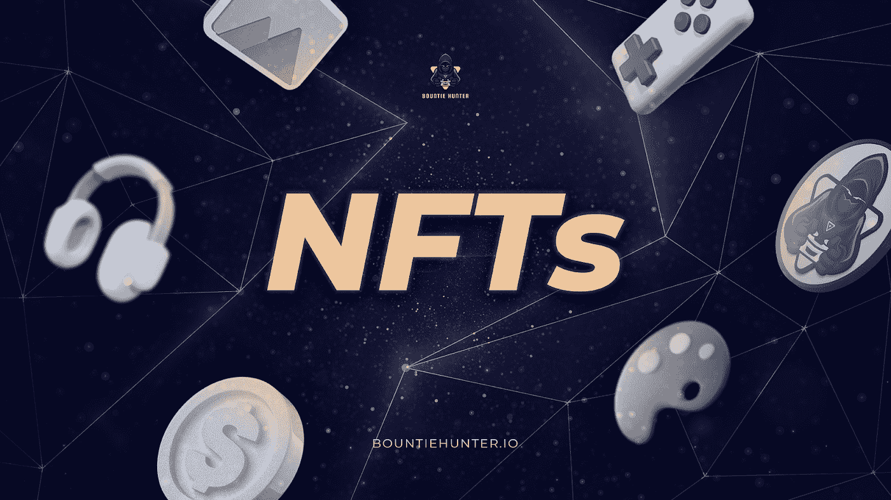

# 了解你的 NFT

> 原文：<https://medium.com/coinmonks/know-your-nfts-did-you-know-there-are-many-types-of-nfts-ce5d53ebdd6c?source=collection_archive---------47----------------------->

你知道有很多种非食物疗法吗？阅读这篇文章，找出你有什么类型的 NFT！

亲爱的猎人们！

NFT 最近成为互联网上的热门话题，并认为这是未来的技术，利用其实用性在数字时代发挥重要作用，甚至像阿迪达斯和古驰这样的大品牌也采用了这种技术。但是你知道 NFT 有不同的类型和不同的好处吗？

在这篇文章中，我们将告诉你世界各地经常交易的 NFT 的类型。如果你是 Cryptoverse 新手，不知道 NFT 是什么或者它是如何工作的，你可以在这里找到！我们还送出了 NFT 最热门的游戏来赢取游戏，你可以在这里参加！

不可替代令牌(NFT)是一种不可替代的令牌，充当不可复制的资产。NFT 的理念是为创作者或艺术家提供一个机会，让他们在 NFT 市场上出售和交易他们交易的艺术品，就好像艺术品是实物形式并拥有有效的所有权一样。

1.  **艺术品**

首先，我们有 NFT 艺术，NFT 形式的艺术在这个时候是最流行的。NFT 艺术的概念是为艺术家提供一个在网上销售他们作品的机会，就像它是实物一样。

目前，NFT 卖给单个所有者的最昂贵的艺术品是由 Beeple 创作的名为“每天的:前 5000 天”的作品，卖出了 6900 万美元。

**2。收藏品**

收藏品是目前最热门的 NFT 类别，也是这一切的开端。你见过你的朋友或名人使用头像的新个人资料照片吗？这可能是我们经常遇到的一种 NFT 收藏品。

被视为收藏品的 NFT 收藏的一个例子是 Cryptokitties——一只独特的数字小猫，在 2017 年受到收藏家的欢迎，Cryptopunk，Bored Ape Yacht Club 被视为该领域的蓝筹 NFT 之一。

**3。虚拟土地**

NFT 虚拟土地的类型在 2021 年被频繁讨论，用户可以在虚拟世界或元宇宙中交易或拥有土地资产。这听起来可能很傻，但它在未来有巨大的潜力。有人刚刚花了 450，000 美元在元宇宙买了一处房产，做了史努比·道格在元宇宙的邻居。

**4。虚拟时装/皮肤**

你听说过皮肤吗？现在想象在你的虚拟角色上使用皮肤，虚拟时尚 NFT 包括衣服、鞋子和配件都是专门为你的虚拟角色制作的。甚至像路易威登这样的大品牌也推出了几种服装，你可以用它们来提升你的形象。

**5。域名**

域名是网站的位置，只有所有者有权管理，例如“Hello.com”。有了 NFT，你可以拥有域名的专属所有权，而不必支付第三方公司来管理你的域名，所有权记录在区块链系统中，带有所有者的钱包地址。

**6。NFT 奥运会**

接下来是视频游戏 NFT，它被认为是游戏体验的未来。该游戏允许玩家对他们购买的物品拥有合法所有权。购买的物品可以用来玩游戏和获得奖励，物品的所有者可以在 NFT 市场借出或交易物品。

**7。NFT 会员资格**

基于 NFT 的成员资格要求用户或参与者拥有由项目创建的特定 NFT。通过验证他们对所需 NFT 项目的所有权，用户可以访问某些利益、工具、奖励、服务等。因此，这意味着这个成员有许多不同的选择。例如，它可以让用户访问特定的在线俱乐部、DAO、Discord Holder 聊天或特殊活动。

**结论**

这是我们在社交媒体冲浪时经常遇到的最受欢迎的 NFT 类型的列表。此时，我们仍处于技术发展的早期阶段。随着时间的推移，将会产生新的 NFT 想法。我们相信，NFT 在未来将继续存在，在我们的数字经济发展中发挥重要作用。

那么，你了解市面上流通的 NFT 的种类吗？希望这篇文章能帮助你了解 NFT 市场上有哪些类型的产品！

======

**关于赏金猎人**

Bountie Hunter 是玩家发现加密游戏和赚取加密货币的地方。我们努力为我们的游戏玩家社区建立一个平台，让他们参与、玩游戏并通过任务(锦标赛或活动)获得奖励！

我们的使命是成为游戏玩家发现和投资加密游戏和元宇宙项目的实际平台。

在此发现赏金猎人👇

[网站](https://bountiehunter.io/) | [推特](https://twitter.com/bountie_hunter) | [脸书](https://www.facebook.com/bountiehunter.io) | [Instagram](https://www.instagram.com/bountiehunter.io/)

[电报](https://t.me/bountiehunterofficial) | [不和](https://discord.com/invite/xYrxGjDFW5) | [TG 公告](https://t.me/BountieHunter)

> 加入 Coinmonks [Telegram group](https://t.me/joinchat/Trz8jaxd6xEsBI4p) 并了解加密交易和投资