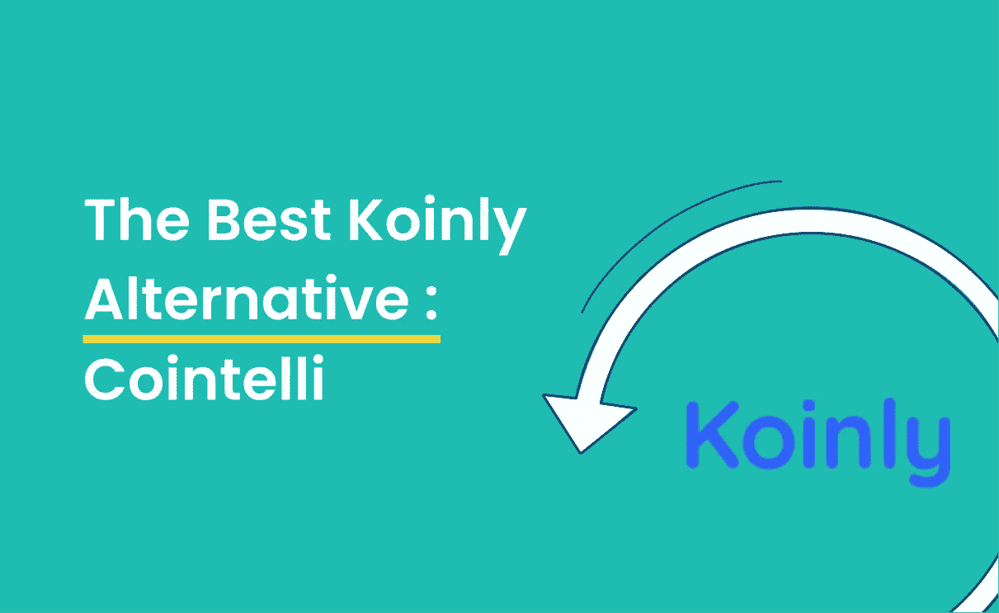

# Koinly vs. Cointelli:一个比较评论

> 原文：<https://medium.com/coinmonks/koinly-vs-cointelli-a-comparison-review-49e3807b4a04?source=collection_archive---------10----------------------->

就像狂野的西部最终变得温和一样，密码世界正受到比以前更多的审视。由于[拜登最近的行政命令](https://cointelli.com/blog/biden-executive-order-crypto)，主流采用率的增长，以及美国监管机构的新兴趣，任何在 2021 年购买或出售加密的人都将被建议在报告其加密税时做好准备。

加密税务工具是专门为此目的设计的平台。它们帮助密码交易员跟踪他们在多个数字钱包中的投资组合，并计算资本损益，从而遵守美国国税局(IRS)的规定。

[Koinly](https://coincodecap.com/koinly-review) 以其作为[可靠的加密税务平台而闻名。](/coinmonks/best-crypto-tax-tool-for-my-money-72d4b430816b)然而，Koinly 并没有存在很长时间(它在 2018 年才推出)，此后许多新的替代品进入了市场。

下面，我们将 Koinly 和 Cointelli 进行比较，以便您在 2022 年做出使用哪种加密税务工具的最佳选择。

# 柯因利和科因特利:丛林奇兵

Koinly 和 Cointelli 都使得在为税收目的计算资本利得时，更容易通过数百甚至数千个加密和 DeFi 交易。让我们比较一下这两者是如何相似的，以及为什么 Cointelli 是最好的 Koinly 替代方案。

# 特征

## 柯伊莉

当你的余额变成负数时，Koinly 会发出警告，并为你提供一个免费的 CSV 电子表格，其中包含今年所有的加密交易。也就是说，你至少需要 49 美元的计划才能获得 Koinly 的大部分优秀功能，包括自动 8949 表格、附表 D 完成、全面的税务报告和 TurboTax 集成。Koinly 还提供过去 6 年多的历史定价数据，帮助您准确评估您的头寸。

## 科因特利

Cointelli 的功能涵盖所有交易类型，从基本交易到 DeFi、staking、NFTs 等等。基本版为您提供了一份免费的加密钱包导入报告，仅供查看。升级到 49 美元级别会带来更强大的功能，如主要税务平台集成(TurboTax、TaxAct 等。)，能够通过聊天、电话或电子邮件导出到您的 CPA、为您服务的真实人类，以及 50 多个视频教程。

> **获胜者:**
> 
> Koinly 和 Cointelli 都需要支付 49 美元的费用才能访问基本功能以外的内容。这两个应用程序都涵盖了所有 DeFi 交易类型，从交易到 NFTs。Koinly 拥有历史价格数据的额外优势，但 Cointelli 在客户服务领域胜过 Koinly(更多信息见下文)。

# 易用性和准确性

## 柯伊莉

Koinly 的网站声称设置过程大约需要 15 分钟。k 仅进行余额比较，并在一些余额不匹配的钱包旁边显示黄色图标，从而易于修复错误。然而，Koinly 的创始人是加密投资者，而不是税务专家——虽然它满足了投资者的愿望，但它的可信度不如那些非常了解美国国税局在寻找什么的人设计的产品。

## 科因特利

Cointelli 由经验丰富的税务专业人士构建，使用复杂的 API 技术，可以自动修复自动上传中的错误。用户只需四个简单的步骤就可以将他们的钱包、交易所和服务与 Cointelli [整合在一起——这使其成为](https://cointelli.com/blog/crypto-tax-made-easy)[最容易使用的加密税务软件](https://youtu.be/zcZ7ChRcmT8)之一。Cointelli 还提供广泛的交换兼容性，支持多达 41 个交换。

> **冠军**
> 
> 2022 年，任何想学习如何进行加密货币税收的人都可以使用 Cointelli。

# 费用

## 柯伊莉

最多 10，000 笔交易为 0 美元(但是，有限的税务报告)

100 笔交易 49 美元

1000 笔交易 99 美元

3000 笔交易 179 美元

超过 10，000 笔交易需要 279 美元

## 科因特利

高达 100，000 笔交易的费用为 49 美元(并且可以根据请求处理更多交易)

> **获胜者:**
> 
> 科因特利。统一费率 [$49 的定价结构](https://cointelli.com/pricing)允许用户输入更多的交易并访问高级客户服务功能，而无需额外的隐藏费用。

# 集成和兼容性

## 柯伊莉

Koinly 与比特币基地、币安和北海巨妖等交易所兼容。它还可以使用像 assadopt、Ledger 和 Trezor 这样的钱包，以及像 Nexo、BlockFi 和 Paxful 这样的服务。

## 科因特利

Cointelli 支持 [110 个集成](https://cointelli.com/exchanges)，包括 16 个区块链、41 个交易所(如比特币基地、双子、北海巨妖、Bittrex)、49 个钱包，以及包括 Nexo、BlockFi、Celsius 和凯西在内的 4 种服务。

> **获胜者:**
> 
> 领带。两者都与最受欢迎的合作伙伴和生态系统相集成。

# 客户服务

## 柯伊莉

用户可以在 Koinly 帮助中心寻找问题的答案，通过电子邮件提出问题，或者使用聊天小工具发送查询。然而，即使有聊天选项，回答可能也需要 1 个工作日。

## 科因特利

Cointelli 通过电子邮件和聊天工具提供[客户支持](https://cointelli.com/blog/cointelli-customer-service)，同时还提供 24/7 全天候实时客户服务，并配备专门的税务专家。

> **获胜者:**
> 
> 科因特利。没有一个竞争对手能像 Cointelli 那样提供天价的客户服务。

# 我们的方法

以上编辑意见仅属于 Cointelli，未经我们的合作伙伴事先审核、批准或认可。虽然我们的目标是审查尽可能多的加密税务软件，但我们会根据我们认为最受读者和加密投资者欢迎的产品对某些产品进行优先排序。我们根据竞争对手的内容和 Cointelli 团队对密码行业的了解来选择产品。我们不会涵盖市场上的所有产品。

我们使用以下框架对[最佳加密税务软件程序](https://cointelli.com/blog/best-crypto-tax-software)进行了评估和排名:

*   [加密交易捕获](https://cointelli.com/blog/how-to-choose-the-right-crypto-tax-software):该功能确保可靠的数据捕获，与各种加密交易记录一致，并可能与 IRS 共享。
*   [支持的区块链数量](https://cointelli.com/exchanges):区块链是数据的“来源”，是所有加密交易最初结算和记录的地方。
*   客户服务承诺和可用性:这是任何面向客户的在线体验的重要元素。它允许客户的顾虑和问题在任何时间得到解决，无论是白天还是晚上。
*   [计算准确性](https://cointelli.com/blog/how-to-choose-the-right-crypto-tax-software-2):对于任何税务准备服务来说，计算的准确性都至关重要。你不想支付超过你需要的国税局，也不想支付不足，并面临罚款，利息费用，或审计。
*   [总体价值](https://cointelli.com/blog/how-to-choose-the-right-crypto-tax-software-3):这是需要考虑的最终因素，因为它包含了所有其他要素，并为您提供了一种方法来评估哪家提供商以最实惠的价格提供最优质的服务、支持和准确性。

> 加入 Coinmonks [电报频道](https://t.me/coincodecap)和 [Youtube 频道](https://www.youtube.com/c/coinmonks/videos)了解加密交易和投资

# 另外，阅读

*   [Bitsgap 评审](/coinmonks/bitsgap-review-a-crypto-trading-bot-that-makes-easy-money-a5d88a336df2) | [Quadency 评审](/coinmonks/quadency-review-a-crypto-trading-automation-platform-3068eaa374e1) | [Bitbns 评审](/coinmonks/bitbns-review-38256a07e161)
*   [加密复制交易平台](/coinmonks/top-10-crypto-copy-trading-platforms-for-beginners-d0c37c7d698c) | [Coinmama 审核](/coinmonks/coinmama-review-ace5641bde6e)
*   [印度的加密交易所](/coinmonks/bitcoin-exchange-in-india-7f1fe79715c9) | [比特币储蓄账户](/coinmonks/bitcoin-savings-account-e65b13f92451)
*   [OKEx vs KuCoin](https://coincodecap.com/okex-kucoin) | [摄氏替代品](https://coincodecap.com/celsius-alternatives) | [如何购买 VeChain](https://coincodecap.com/buy-vechain)
*   [币安期货交易](https://coincodecap.com/binance-futures-trading)|[3 comas vs Mudrex vs eToro](https://coincodecap.com/mudrex-3commas-etoro)
*   [如何购买 Monero](https://coincodecap.com/buy-monero) | [IDEX 评论](https://coincodecap.com/idex-review) | [BitKan 交易机器人](https://coincodecap.com/bitkan-trading-bot)