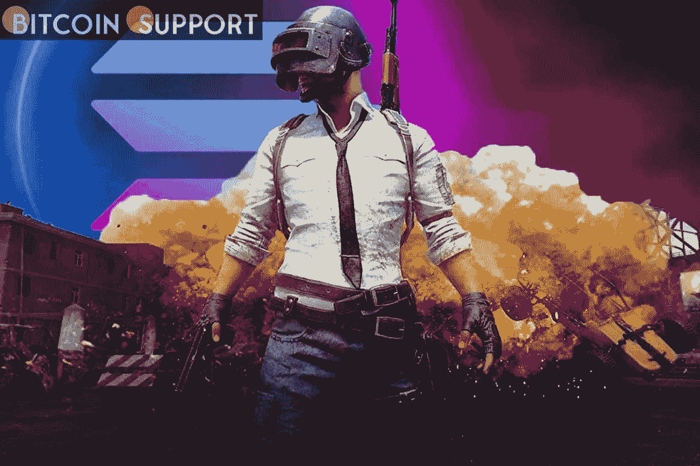

# PUBG 开发商克拉夫顿(Krafton)已经与索拉纳(SOL)合作

> 原文：<https://medium.com/coinmonks/krafton-a-pubg-developer-has-teamed-up-with-solana-sol-7d3140a22b77?source=collection_archive---------44----------------------->

**Visit our website:-** [**https://bitcoinsupports.com/**](https://bitcoinsupports.com/)

流行视频游戏 PUBG 背后的公司 Krafton 宣布与 Solana Labs 合作开发基于区块链和 NFT 的游戏和服务。该公司表示，它计划在 web3 领域使用其游戏开发技能。这一举动反映了区块链和 P2E 游戏的日益流行，这激起了知名加密和视频游戏制作人的兴趣。

索拉纳市值约 300 亿美元，是世界第九大区块链。据 Krafton 称，今天购买的一个动机是区块链允许开发者创建极其可扩展的应用。

**基于韩国克拉夫顿非常著名的 PUBG 游戏，该游戏被认为是“皇家战役”类型的流行，在 2017 年一举成名。该游戏目前是免费的，包括可收集的化妆品，这是对 NFTs 的一个很好的补充。**

**克拉夫顿对 web3 的世界并不陌生**

克拉夫顿和索拉纳的合作是开发者进入 web3 技术的一部分。今年早些时候，该开发商暗示将进入 web3，从那时起，它已经投资了该领域的多家公司并与之合作。Krafton 在 2 月份表示，它已经向韩国 NFT 的两个市场 Seoul Auction Blue 和 XBYBLUE 投资了 660 万美元，这两个市场已经承诺在 NFT 的项目上进行合作。该公司表示，它打算在未来的大型多人在线角色扮演游戏中使用 NFT 领养和元宇宙。它正在与 ZEPETO 元宇宙号的运营商 NAVER 合作建造这个元宇宙。

**投资者被吸引到 P2E 和区块链游戏**

今年，本质上是用代币奖励玩家的 P2E 游戏变得越来越受欢迎，吸引了大量投资者。世界第三大加密交易所 FTX 本周早些时候收购了 P2E 开发商好运游戏公司，以增强其游戏产品。好运游戏是一个专业游戏开发者团队，目前正在开发 Storybook Brawl，一款基于卡片的自动战斗游戏。知名视频游戏开发商 Zynga 和育碧(Ubisoft)都表示有兴趣进入这个市场。

**访问我们的网站:-**[**https://bitcoinsupports.com/**](https://bitcoinsupports.com/)

**免责声明:以上为作者观点，不应视为投资建议。读者应该自己做研究。**

> 加入 Coinmonks [电报频道](https://t.me/coincodecap)和 [Youtube 频道](https://www.youtube.com/c/coinmonks/videos)了解加密交易和投资

# 另外，阅读

*   [CBET 点评](https://coincodecap.com/cbet-casino-review) | [库币 vs 比特币基地](https://coincodecap.com/kucoin-vs-coinbase) | [拜比特 vs 比特币基地](https://coincodecap.com/bybit-vs-coinbase)
*   [如何在加拿大购买加密货币？](https://coincodecap.com/how-to-buy-cryptocurrency-in-canada)
*   [百无聊赖的猿游艇俱乐部(BAYC)审查](https://coincodecap.com/bored-ape-yacht-club-bayc-review)
*   [5 款最佳加密交易终端](https://coincodecap.com/crypto-trading-terminals) | [最佳 DeFi 应用](https://coincodecap.com/best-defi-apps)
*   [在美国如何使用 BitMEX？](https://coincodecap.com/use-bitmex-in-usa) | [BitMEX 评论](https://coincodecap.com/bitmex-review)