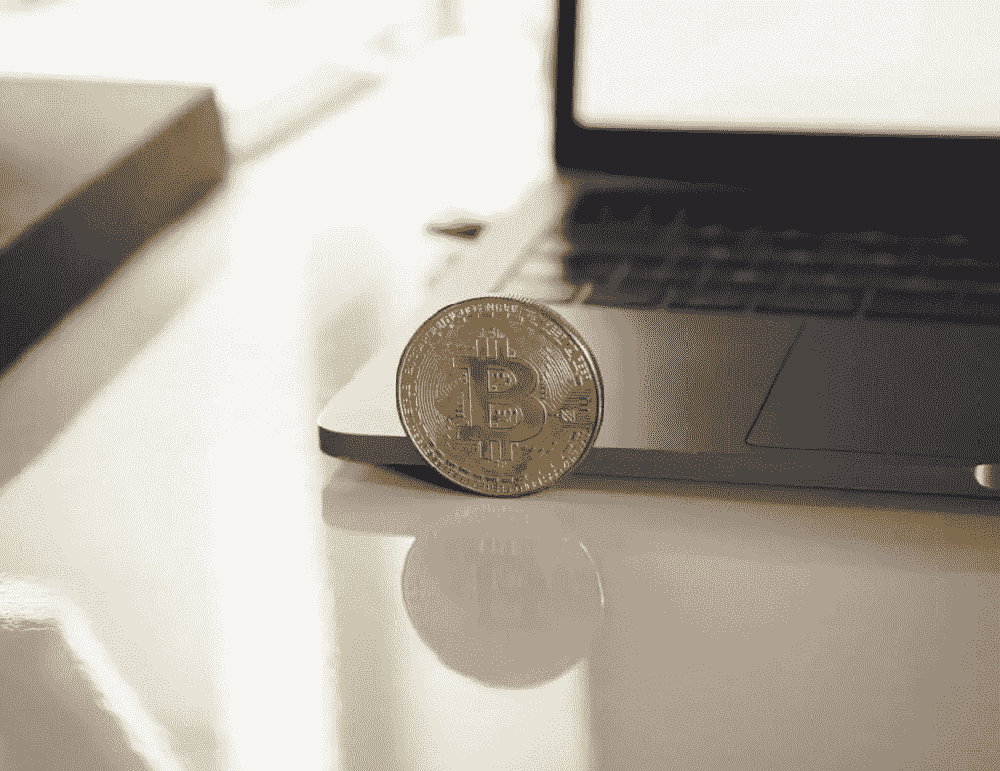

# 北海巨妖给所有乌克兰用户 1000 美元的比特币

> 原文：<https://medium.com/coinmonks/kraken-gives-1-000-in-bitcoin-to-all-ukrainian-users-26838b12d7bb?source=collection_archive---------49----------------------->

北海巨妖加密交易所宣布，任何在 3 月 9 日之前开户的乌克兰用户都将获得 1000 美元的比特币。了解到这一点后，我开始思考俄罗斯入侵乌克兰期间如何使用加密技术，以及它如何改变我们所知的货币兑换。

# 关于北海巨妖对乌克兰的捐赠

北海巨妖这样做是为了帮助因俄罗斯入侵而流离失所的乌克兰难民。用户能够立即提取货币。该公司还提供另外 1000 美元的北海巨妖费用积分。这些可以用来支付任何货币兑换费用。

要获得北海巨妖提供的 1000 美元比特币的资格，你需要成为中级或专业级别的验证者。你需要通过几个了解你的客户背景调查来核实你的信息。

那些未能在 3 月 9 日前核实信息和开设账户的人将有其他机会获得帮助。该公司计划在 2022 年第二季度向用户发放更多资金。总体而言，北海巨妖计划向受入侵影响的乌克兰人提供 1000 多万美元。

# Visa、PayPal 和其他公司从俄罗斯用户那里获取服务

Visa、Mastercard 和 PayPal 都从俄罗斯撤出了服务。这使得公民几乎不可能获得他们的法定货币。

其他密码交易所已经采取行动来阻止俄罗斯人。例如，CoinZoom 已经禁止新客户在俄罗斯开户。它们是首批采取此类举措的交易所之一。不过，CoinZoom 仍然没有屏蔽俄罗斯的现有用户。所有平台都决定冻结某些受制裁个人的账户。

比特币基地冻结了大约 25000 个俄罗斯账户，这些账户都与某种非法活动有关。

# 北海巨妖因没有切断俄罗斯用户而受到批评

虽然北海巨妖帮助流离失所的乌克兰人的努力是巨大的，但许多人并不高兴。该交易所拒绝屏蔽俄罗斯用户，许多金融机构正在这么做。

[北海巨妖首席执行官 Jesse Powell 表示](https://coinmarketcap.com/alexandria/article/kraken-gives-1-000-in-bitcoin-to-every-ukrainian-user)“我们希望能够在乌克兰和俄罗斯的客户需要的时候继续提供关键的金融服务。”他接着说，当世界不能依赖传统银行或政府处理他们的资金时，加密应该被视为一种人道主义工具。

鲍威尔表示，该公司捐赠给乌克兰的金额将抵消该交易所从俄罗斯用户那里获得的任何收入。所以，即使他们没有切断他们的俄罗斯用户，他们也没有从他们那里得到任何东西。

他说，从长远来看，这是为了避免仅仅因为领导人的行为而剥夺人们的权利。

# 结论:我们希望保持权力下放

当该说的都说了，该做的都做了，加密交易所却说这不关他们的事。如果他们打算禁止整个国家使用该平台，他们只会这样做，因为美国政府命令他们这样做。这种情况发生的可能性越来越大。

不管你是否同意，有一件事是肯定的。人们看待金钱的方式发生了巨大的转变。更重要的是，人们用钱的方式变了。领导人正利用金钱和数字服务将俄罗斯公民扣为人质，以换取服从。

我们越接近数字世界，他们就越有控制力。我知道从长远来看这是不可避免的，但在这种情况下看到这一点令人吃惊。希望继续有像北海巨妖这样的公司为个人和人民挺身而出。

*最初发表于*[*【https://www.morethanfinances.com】*](https://www.morethanfinances.com/kraken-gives-1000-in-bitcoin-to-all-ukrainian-users/)*。*

> 加入 Coinmonks [电报频道](https://t.me/coincodecap)和 [Youtube 频道](https://www.youtube.com/c/coinmonks/videos)了解加密交易和投资

# 另外，阅读

*   [Bookmap 评论](https://coincodecap.com/bookmap-review-2021-best-trading-software) | [美国 5 大最佳加密交易所](https://coincodecap.com/crypto-exchange-usa)
*   最佳加密[硬件钱包](/coinmonks/hardware-wallets-dfa1211730c6) | [Bitbns 评论](/coinmonks/bitbns-review-38256a07e161)
*   [新加坡十大最佳加密交易所](https://coincodecap.com/crypto-exchange-in-singapore) | [购买 AXS](https://coincodecap.com/buy-axs-token)
*   [红狗赌场评论](https://coincodecap.com/red-dog-casino-review) | [Swyftx 评论](https://coincodecap.com/swyftx-review) | [CoinGate 评论](https://coincodecap.com/coingate-review)
*   [投资印度的最佳密码](https://coincodecap.com/best-crypto-to-invest-in-india-in-2021)|[WazirX P2P](https://coincodecap.com/wazirx-p2p)|[Hi Dollar Review](https://coincodecap.com/hi-dollar-review)
*   [加拿大最佳加密交易机器人](https://coincodecap.com/5-best-crypto-trading-bots-in-canada) | [KuCoin 评论](https://coincodecap.com/kucoin-review)