# Kucoin 云采矿:未来两周

> 原文：<https://medium.com/coinmonks/kucoin-cloud-mining-2-weeks-down-the-road-5a70ea1ae1ff?source=collection_archive---------6----------------------->

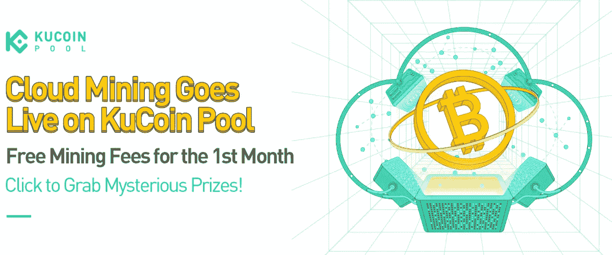

著名的加密货币交易所 ucoin 于 2022 年 3 月 9 日推出了他们的云采矿服务，我很快就利用了这一点。我订阅了最轻的套餐，BTC-蚂蚁矿工 S19j Pro -180 天计划，价格为 114.7 美元，包含第五个哈希值，如下所示

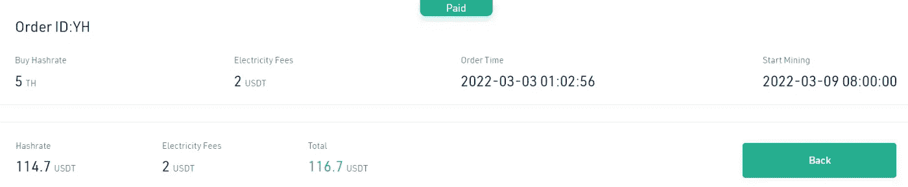

自从云挖掘服务开始以来已经过去了 2 周，我很高兴分享到目前为止的挖掘结果。

*要了解更多关于 Kucoin 云采矿的信息，请查看我之前的文章* [*这里*](https://cybery.medium.com/kucoin-cloud-mining-an-introduction-d41d1c0f4c68) *。*

# 我目前的结果

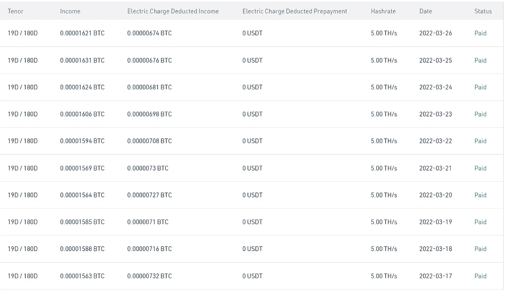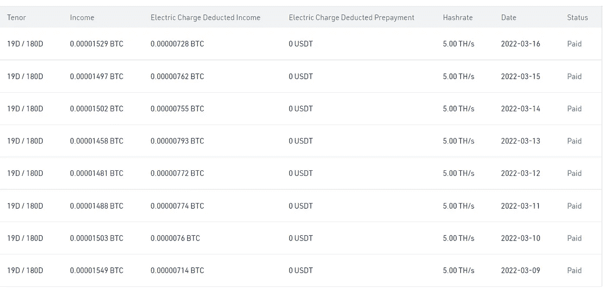

# 符合预期？

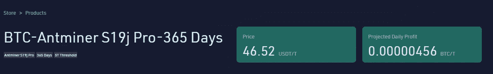

Projected earnings when the service was launched.

我的第五个计划的预计日收入最初为 0.00000456 BTC/日，这给出了第五个计划的预期收入为 0.0000228 BTC/日。然而，这还不包括可能相当可观的电费。

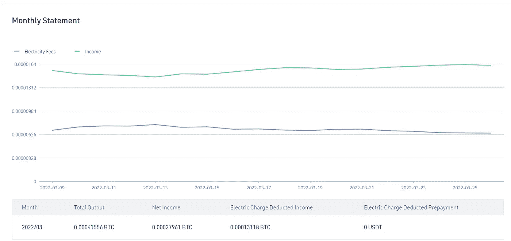

Monthly statement

在从 2022 年 9 月 3 日到 2022 年 3 月 26 日的过去 18 天里，按照我的计划开采的 BTC 总量为 0.00041556 BTC

每天开采的 BTC = 0.00041556/18 = 0.000023086 BTC

然而这是在扣除电费之前。

扣除电费(0.00013118 BTC)后，我在过去 18 天的净收入为 0.00027961 BTC。

为了便于理解，用饼状图说明电费的比例如下。

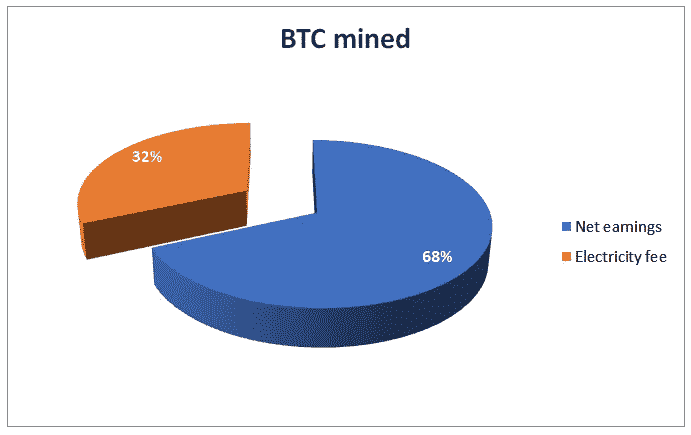

因此，实现了计划中的预计每日 BTC 开采量(0.000023086 BTC/日，而预计收入为 0.0000228 BTC/日)；然而，电力成本似乎相当可观。

# 那么，有利可图吗？

假设根据目前的比率，每天的平均净收入为 0.00001553388 BTC(通过将我目前的总净收入 0.00027961 除以 18 天得出)，那么在采矿计划结束时，我将有 0.0027961 BTC。以 BTC 的价格 44000 美元为例，这相当于 123.02 美元。

我最初的投资是 114.7 美元，所以这给了我们 8.3 美元的净收入，这在 180 天的投资后并不太令人印象深刻。

# 提高盈利能力的技巧

Electricity deductions in BTC are relatively higher when BTC price is low.

鉴于电费占了很大比例，Kucoin 提供了在 USDT 预付电费的选项。你可以从我的每日收入中看到，当 BTC 价格高时，扣除的 BTC 金额相对较低，反之亦然。电费可以在 USDT 预先支付，并在需要的时候打开/关闭以进行扣除——因为这样一个可行的策略将是当 BTC 价格趋势低迷时在 USDT 支付电费，反之当 BTC 抽水时支付电费。

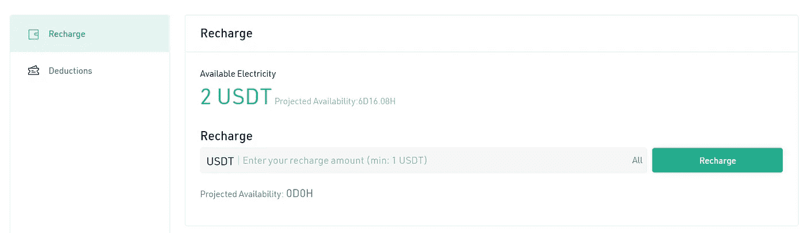

Kucoin offers the option to pre-pay for electricity fees in USDT

# 采矿 2.0

之前的云开采计划在推出几天后就销售一空；经过近三周的中断，Kucoin 带着新的采矿计划回来了，这些计划几乎与上一个计划相似。

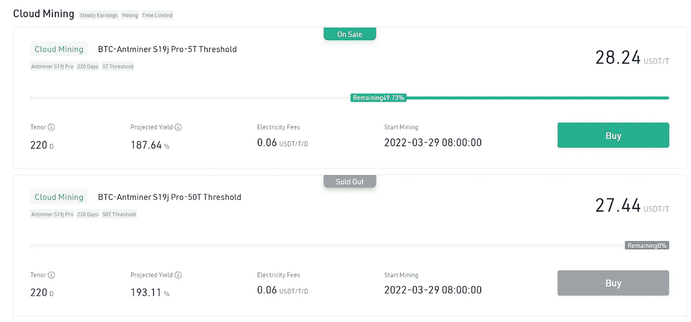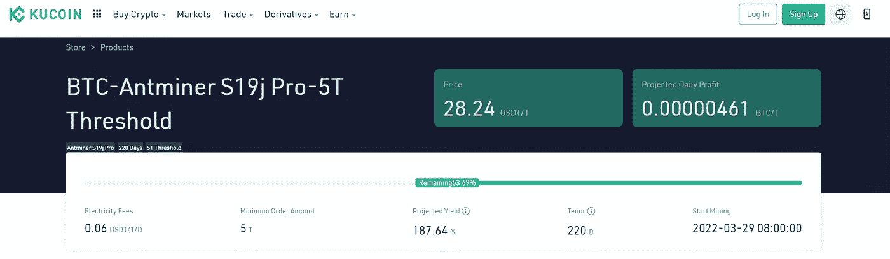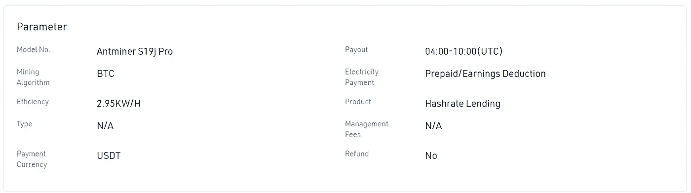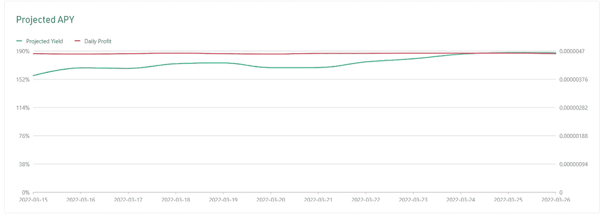

然而，由于高需求，这些计划很快就用完了——如果你决定去做，一定要尽快利用它！点击[此处](https://www.kucoin.com/cloud-mining/)访问库币云官方采矿网站，[注册](https://www.kucoin.com/land/register/r/rJH29LZ)一个库币账户，如果你还没有的话！

# 最后

*   Kucoin 云采矿计划对云采矿的概念进行了有趣的介绍。
*   采矿计划的盈利能力很大程度上取决于 BTC 的价格；如果 BTC 抽水，回报会大大增加，因为每天开采的 BTC 数量相对稳定。因此，如果 BTC 转储，情况正好相反。
*   迄今为止，收益一直保持稳定，符合预期水平。
*   然而，电费是一项重要的成本因素；从 USDT 而不是 BTC 的预付金额中扣除电费可能是个好主意(特别是当 BTC 的价格较低时)。

*要了解更多关于 Kucoin 云采矿的信息，请查看我之前的文章* [*这里*](https://cybery.medium.com/kucoin-cloud-mining-an-introduction-d41d1c0f4c68) *。*

*你有什么想法？欢迎在下面留下评论！*

*本文使用的部分资料摘自 Kucoin 云矿官方网站。*

*一如既往，这不是财务建议！而只是我投资过的，觉得值得分享的投资平台。在投资前做好自己的研究，不要存你输不起的钱。下面有什么问题可以随时问我。*

*如果您喜欢这篇文章，* [*关注&订阅*](/@cybery) *！*

查看以下值得信赖的平台！

*🎁*[*honey gain*](https://r.honeygain.me/CYBER577DD)*一款被动收入 app，从你未使用的互联网带宽中赚钱。* [*免费获得 5 美元*](https://r.honeygain.me/CYBER577DD) *，无需投资。*

*🎁* [*蛋糕 Defi*](https://cakedefi.com/?ref=677920) *一站式投资平台，以高达 200%的年利率烘焙被动现金流！* [*拿 30 美元*](https://cakedefi.com/?ref=677920) *在 DFI 存 50 美元。*

*🎁* [*Nexo*](https://nexo.io/ref/hce5cfdt5o?src=web-link) *世界上最先进、受监管的数字资产机构，在 200 多个司法管辖区提供 40 多种法定货币的即时加密贷款、每日资产收益、兑换和服务。* [*用 100 美元存款获得 25 美元*](https://nexo.io/ref/hce5cfdt5o?src=web-link) *。*

*🎁* [*摄氏度*](https://celsiusnetwork.app.link/174094633e) *一个金融科技平台，提供带息储蓄账户、借贷，以及用数字和法定资产进行支付。* [*在 BTC 获得 50 美元*](https://celsiusnetwork.app.link/174094633e) *与 400 美元存款。*

*🎁*[*Hodlnaut*](https://www.hodlnaut.com/join/RTbHxuJMX)*一个稳健的新加坡加密借贷平台，成立于 2019 年，从你闲置的加密货币中产生被动现金流。* [*获得 30 美元*](https://www.hodlnaut.com/join/RTbHxuJMX) *在 USDC 拥有 1000 美元存款。*

*🎁*[*BlockFi*](https://blockfi.com/?ref=a16e37fd)*一种加密货币兑换和钱包。* [*用 100 美元存款获得 10 美元*](https://blockfi.com/?ref=a16e37fd) *。*

*🎁* [*库币*](https://www.kucoin.com/land/register/r/rJH29LZ) *最大的加密货币交易所之一。*

*🎁* [*火币*](https://www.huobi.com/en-us/topic/double-invite/register/?invite_code=5t5jb) *最大的加密货币交易所之一。*

*🎁*[*MEXC*](https://m.mexc.com/auth/signup?inviteCode=1NAJC)*最大的加密货币交易所之一。*

*🎁*[*Crypto.com*](https://read.cash/@TraderFX/10-tips-to-maximize-earnings-on-honeygain-an-effortless-free-passive-income-app-68535728#bad-link)*一款基于新加坡的加密货币兑换 app。* [*获得 25 美元*](https://crypto.com/app/fcbsjmf5pb) *在 CRO 赌一张红宝石牌。*

*针对马来西亚投资者*

*🎁***获得 6 个月免费投资！**

**🎁Wahed code 'KENLIE1' RM10 注册奖金**

**🎁Capbay P2P 代码' 8879c6' RM100 注册奖金**

**接我* [*中*](https://cybery.medium.com/)*|*[*read . cash*](https://read.cash/r/TraderFX)*|*[*Youtube*](https://www.youtube.com/c/SmartInvestingChannel)*|*[*电报*](https://t.me/kkkk289)|[推特](https://twitter.com/cybertraderfx)*|*T60*

> **加入 Coinmonks* [*电报频道*](https://t.me/coincodecap) *和* [*Youtube 频道*](https://www.youtube.com/c/coinmonks/videos) *了解加密交易和投资**

# *另外，阅读*

*   *[Bookmap 评论](https://coincodecap.com/bookmap-review-2021-best-trading-software) | [美国 5 大最佳加密交易所](https://coincodecap.com/crypto-exchange-usa)*
*   *最佳加密[硬件钱包](/coinmonks/hardware-wallets-dfa1211730c6) | [Bitbns 评论](/coinmonks/bitbns-review-38256a07e161)*
*   *[新加坡十大最佳加密交易所](https://coincodecap.com/crypto-exchange-in-singapore) | [收购 AXS](https://coincodecap.com/buy-axs-token)*
*   *[红狗赌场评论](https://coincodecap.com/red-dog-casino-review) | [Swyftx 评论](https://coincodecap.com/swyftx-review) | [CoinGate 评论](https://coincodecap.com/coingate-review)*
*   *[投资印度的最佳加密软件](https://coincodecap.com/best-crypto-to-invest-in-india-in-2021)|[WazirX P2P](https://coincodecap.com/wazirx-p2p)|[Hi Dollar Review](https://coincodecap.com/hi-dollar-review)*