# Kucoin 云挖掘:简介

> 原文：<https://medium.com/coinmonks/kucoin-cloud-mining-an-introduction-d41d1c0f4c68?source=collection_archive---------5----------------------->

加密货币挖掘是一个竞争过程，它使用工作证明(PoW)方法验证加密货币的区块链并向其中添加新的交易；换句话说，可以把它比作‘数字黄金’的开采。矿工在验证此类交易中的辛勤工作将获得加密硬币形式的奖励。我从一开始就一直是加密货币挖掘的粉丝——我投资了许多结果良好的项目(例如 Scryptcube，尽管很遗憾服务因技术问题而暂停，但管理员很快就全额退款)，以及许多其他承诺丰厚回报但最终证明是骗局的好得令人难以置信的项目，如 mineify、darkmine 和 mygbit。(查看我的[前一篇文章](https://read.cash/@TraderFX/the-dark-side-of-the-web-cryptocurrency-scams-to-watch-out-for-dc0e3589)以了解我过去在这些平台上涉猎时犯下的痛苦错误)。因此，当著名的加密货币交易所 Kucoin 最终宣布他们的云挖掘服务时，我很快就加入了这一行列。

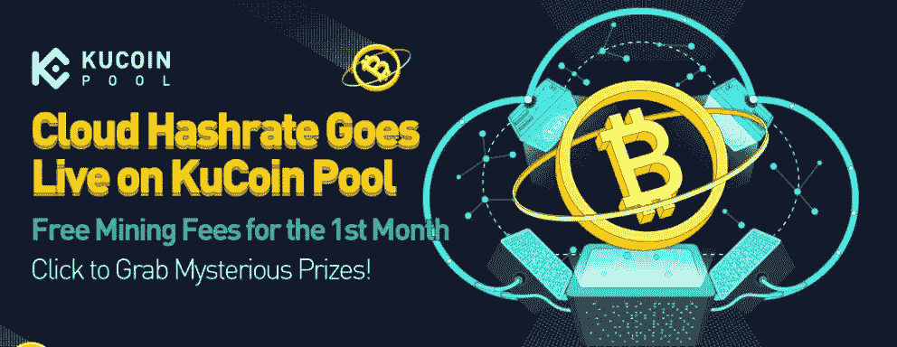

Kucoin 目前提供两种套餐，180 天和 365 天的采矿套餐，价格分别为 22.94 美元/吨和 46.52 美元/吨。Kucoin 云挖掘服务的推出获得了相当热烈的反响；180 天套餐在昨天首发的几个小时内已经全部售罄；截至目前，365 天套餐仍然存在，但也很快售罄。

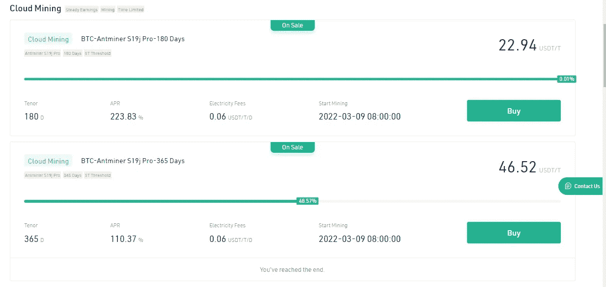

# 技术细节

云挖掘服务运行在 Antminer S19j Pro 上

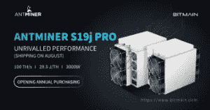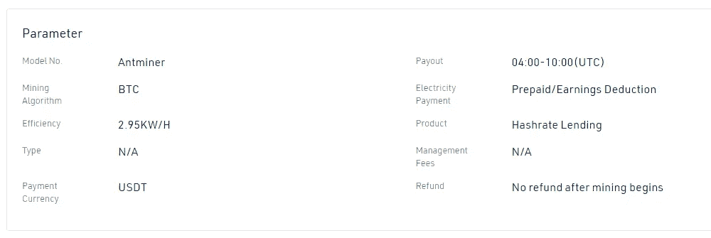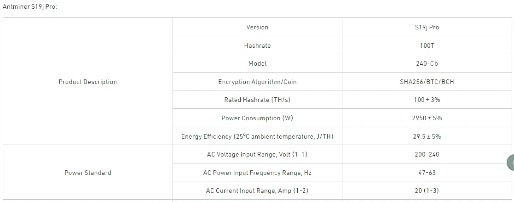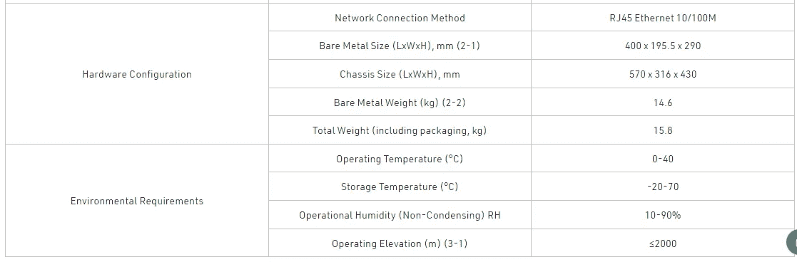

采矿于 2022 年 3 月 9 日 0800 开始。

# 值得吗？

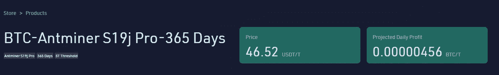

预计每日比特币收益为 0.00000456 btc。这不包括 0.06 美元/吨/天的电费。预计的 APR 据说是 223%，听起来不错。让我们开始计算吧。

1 USDT 的电费涵盖了大约 3 天 8 小时的开采。换句话说，180 天的开采需要大约 54 USDT 的电费，可以 USDT 的形式预付，也可以从每天的比特币收益中扣除。

假设我们选择预付选项，5T 哈希拉特采矿计划的最低初始投资为 168.7 美元。

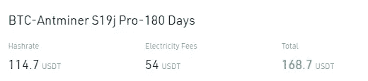

以比特币目前 44000 美元的价格计算，这相当于购买 0.003834 比特币。预计收入为每天 0.00000456 比特币/吨，因此在开采计划结束时，估计为 0.00000456 x 5 x 180 = 0.004104 比特币。这给了我们 0.00027 比特币的理论利润，相当于初始投资 168.7 USDT 的收益为 11.88 USDT。老实说，这并不是一笔非常可观的收入，但鉴于该平台的声誉，我会毫不担心地投资它。

# 一些常见问题(摘自 Kucoin 云挖掘网站)

*   什么是云哈希拉特？Cloud Hashrate 是一种远程挖掘模型，成本低，操作简单，可以稳定获取优质资产，允许大多数用户参与挖掘，共同维护主网的安全。
*   我如何在 KuCoin Pool 上购买 Cloud Hashrate？[注册](https://www.kucoin.com/mining-cloud/mall)你的 KuCoin 账户>进入云 Hashrate 商店>选择你的云 Hashrate 产品>点击立即购买按钮并输入你想购买的 hash rate>选择是否要预付电费>提交订单>点击支付按钮并完成安全验证>完成支付。及时确认付款，确保购买成功。
*   如何查看我的云哈希收入？购买期结束后，收入将在采矿开始后的第二天 04:00(UTC)-10:00(UTC)分配到您的 KuCoin 主账户。在特殊情况下，付款可能会延迟，并相应地发布公告。
*   云 Hashrate 产品的预计收益是实际收益吗？KuCoin Pool 对未来收入不做任何承诺。投影收入只是根据目前的挖矿难度、加密价格、网络难度、方块奖励等作为参考。

# 赞成者

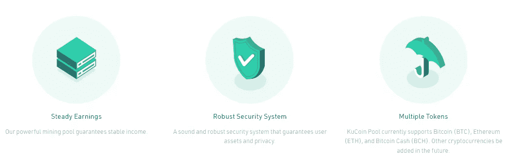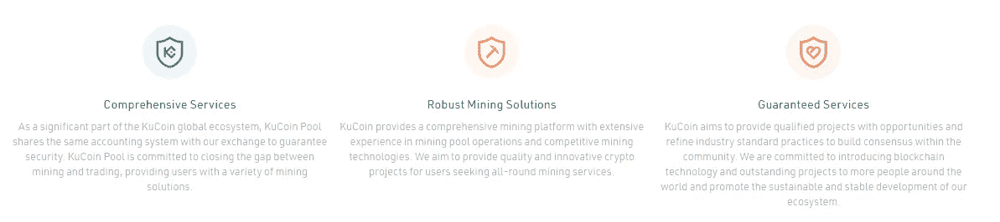

*   投资于像 Kucoin 这样信誉良好且安全的平台
*   如果比特币价格飙升，鉴于每天开采的比特币数量(而非价值)相对固定，潜在收益将进一步增加。
*   云挖掘服务消除了手动维护和维修昂贵的挖掘硬件的需要。

# 坏处

*   与其他高收益的赌博产品相比，比特币目前的价格收益平平，而其他高收益的赌博产品可以提供高达 200%的年利率
*   收益没有保证——取决于开采难度和开采资产的价格波动(如果比特币价格下跌，你的收益也会下跌)。其他起作用的因素包括网络难度和格挡奖励。
*   Kucoin 的先锋项目——这是 Kucoin 首次推出云挖掘服务；虽然目前前景看好，但我们还不知道结果会如何。

# 最后的想法

鉴于该平台的可信度及其在加密货币领域的长期地位，最近推出的 Kucoin 云采矿池提供了一个诱人的投资机会，在我看来值得利用。

如果你想尝试一下，在这里注册 kucoin [，然后点击](https://www.kucoin.com/land/register/r/rJH29LZ)[云采矿链接](https://www.kucoin.com/mining-cloud/mall)购买你的 hashrates，今天就开始吧！

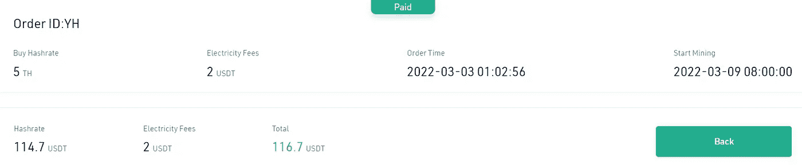

My Purchase

这会是一项好的投资吗？只有时间会证明一切！请在以后的文章中关注我对 Kucoin 云挖掘服务的进一步更新！

和往常一样，这不是财务建议！但只是我目前正在使用的一些加密货币投资平台，发现值得分享。在投资前做好自己的研究，不要存你输不起的钱。
*下面有什么问题尽管问我。*

*如果你喜欢这篇文章，* [*关注&订阅*](/@cybery) *！*

*如果你想看到更多这样的内容，你可以使用下面的一个或多个我的会员链接来支持我:*

*🎁*[*Cakedefi*](https://cakedefi.com/?ref=677920)*用 50 美元存款得到 50 美元*

*🎁*[*Nexo*](https://nexo.io/ref/hce5cfdt5o?src=web-link)*用 100 美元存款得到 25 美元*

*🎁*[*BlockFi*](https://blockfi.com/?ref=a16e37fd)*用 100 美元存款获得 10 美元*

*🎁***在 BTC 用 400 美元存款得到 50 美元**

**🎁**

***🎁* [*火币*](https://www.huobi.com/en-us/topic/double-invite/register/?invite_code=5t5jb)**

***针对马来西亚投资者***

***🎁* [*斯塔沙威*](https://www.stashaway.my/referrals/kenleel9jx) *获得 6 个月免费投资！***

***🎁Wahed code 'KENLIE1' RM10 奖金***

***🎁Capbay P2P 代码' 8879c6' RM100 奖金***

**在上与我联系**

***💡* [*中等*](https://cybery.medium.com/)**

***💡*read . cash**

***💡* [*Youtube*](https://www.youtube.com/c/SmartInvestingChannel)**

***💡* [*电报*](https://t.me/kkkk289)**

***💡* [*碎碎念*](https://twitter.com/cybertraderfx)**

> ***加入 Coinmonks* [*电报频道*](https://t.me/coincodecap) *和* [*Youtube 频道*](https://www.youtube.com/c/coinmonks/videos) *了解加密交易和投资***

# **另外，阅读**

*   **[3 商业评论](/coinmonks/3commas-review-an-excellent-crypto-trading-bot-2020-1313a58bec92) | [Pionex 评论](https://coincodecap.com/pionex-review-exchange-with-crypto-trading-bot) | [Coinrule 评论](/coinmonks/coinrule-review-2021-a-beginner-friendly-crypto-trading-bot-daf0504848ba)**
*   **[莱杰 vs n rave](/coinmonks/ledger-vs-ngrave-zero-7e40f0c1d694)|[莱杰 nano s vs x](/coinmonks/ledger-nano-s-vs-x-battery-hardware-price-storage-59a6663fe3b0) | [币安评论](/coinmonks/binance-review-ee10d3bf3b6e)**
*   **[Bybit Exchange 审查](/coinmonks/bybit-exchange-review-dbd570019b71) | [Bityard 审查](https://coincodecap.com/bityard-reivew) | [Jet-Bot 审查](https://coincodecap.com/jet-bot-review)**
*   **[3 commas vs crypto hopper](/coinmonks/3commas-vs-pionex-vs-cryptohopper-best-crypto-bot-6a98d2baa203)|[赚取加密利息](/coinmonks/earn-crypto-interest-b10b810fdda3)**
*   **最好的比特币[硬件钱包](/coinmonks/hardware-wallets-dfa1211730c6) | [BitBox02 回顾](/coinmonks/bitbox02-review-your-swiss-bitcoin-hardware-wallet-c36c88fff29)**
*   **[block fi vs Celsius](/coinmonks/blockfi-vs-celsius-vs-hodlnaut-8a1cc8c26630)|[Hodlnaut 审核](/coinmonks/hodlnaut-review-best-way-to-hodl-is-to-earn-interest-on-your-bitcoin-6658a8c19edf) | [KuCoin 审核](https://coincodecap.com/kucoin-review)**