# Kucoin 云矿池回来了！还值得吗？

> 原文：<https://medium.com/coinmonks/kucoin-cloud-mining-is-back-is-it-still-worth-it-ab7c6a994f7?source=collection_archive---------1----------------------->

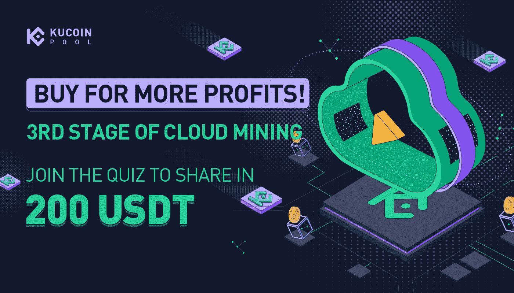

作为一个狂热的加密爱好者和 HODL 爱好者，我一直在寻找扩大被动收入的方法，云采矿的想法一直吸引着我。当库币云矿[一期推出](/coinmonks/kucoin-cloud-mining-an-introduction-d41d1c0f4c68)时，我非常激动；我马上订阅了它。两个星期后，我写了一篇文章回顾了我的收入，并计算了采矿计划的盈利能力，你可以在我的文章[这里](/coinmonks/kucoin-cloud-mining-2-weeks-down-the-road-5a70ea1ae1ff)查看。Kucoin 的比特币云开采计划第三阶段[今天已经启动，这让我非常兴奋！因此，我将提供一份到目前为止我从 Kucoin 的云采矿服务第一阶段获得的收益的后续评估，以便您可以就这个采矿计划的价值做出明智的决定。](https://www.kucoin.com/land/register/r/rJH29LZ)

# 概述

我从 Kucoin 购买了一份为期 180 天的开采计划，5T hashrate，于 2022 年 3 月 9 日开始开采，成本为 116.7 美元。

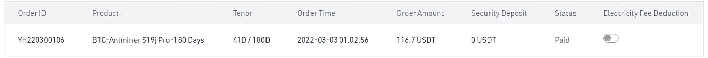

到目前为止，我 41 天的收入总结如下。

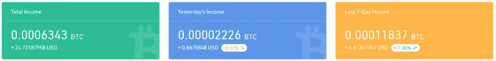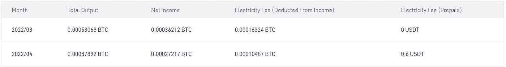

Summary by month

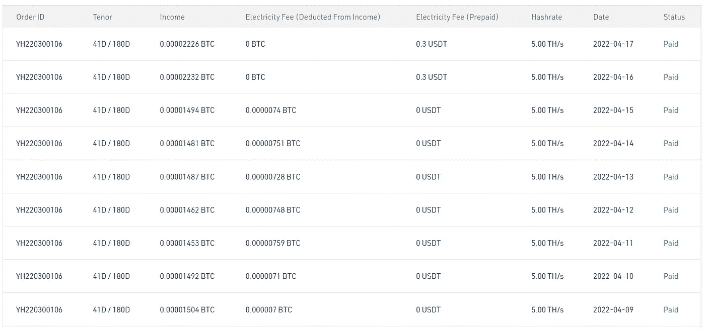

Daily breakdown of earnings for the past week.

以图形格式显示它会得到下图。

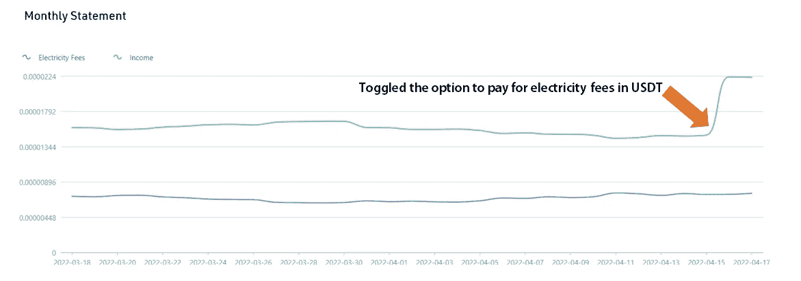

2022 年 4 月 16 日，我的采矿收入明显增加，这是因为我选择利用我的预付 USDT 支付电费，而不是从我开采的 BTC 中扣除。说到电费，这是一个需要考虑的非常重要的因素，在我之前的文章[这里](/coinmonks/kucoin-cloud-mining-2-weeks-down-the-road-5a70ea1ae1ff)中有详细介绍。

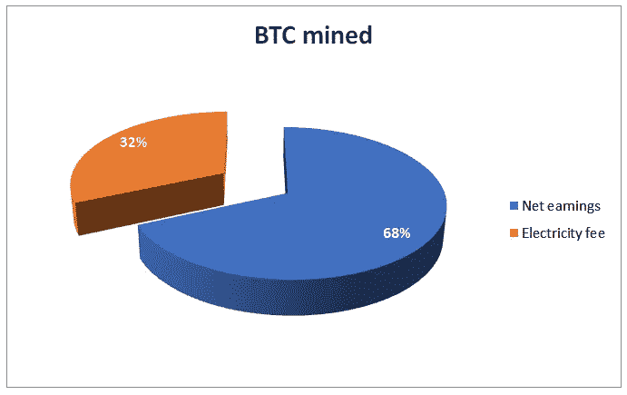

# 一些计算

我总共开采了 41 天。出于以下计算的目的，我将排除最后 2 天的开采，在此期间我的电费由 USDT 预付。

因此，BTC 在 39 天内开采的总量= 0.00058972 BTC

我 39 天采矿计划的成本= (39/180) x 116.7 = 25.285 USDT

鉴于当前 BTC 价格为 39000 美元，0.00058972 BTC 的收入相当于 22.99 USDT。考虑到电费，与我同期采矿计划的成本(25.28 USDT)相比，这似乎无利可图。

因此，我们可以得出结论，该采矿计划的盈利能力在很大程度上取决于 BTC 的价格，因为无论其市场价格如何，每天都能获得相对固定的 BTC。

将我的计划成本除以 BTC 的开采数量，得出 25.285/0.00058972 = 42，876。

**换句话说，为了让我的采矿计划变得有利可图，BTC 需要突破 42，876 美元。**

# 新的采矿计划

Kucoin 今天推出了第三阶段的云采矿计划，显然是在一个新的矿工，Whatsminer M30S++上运行。

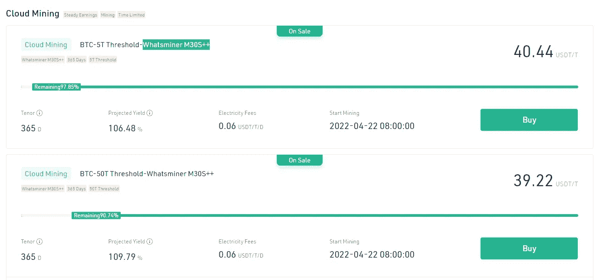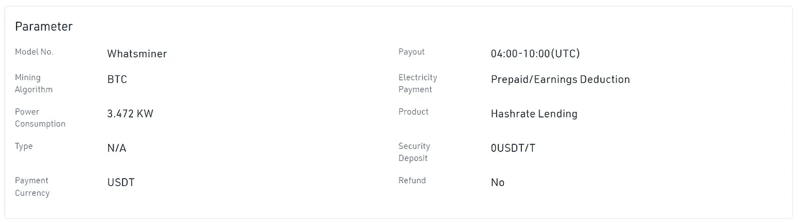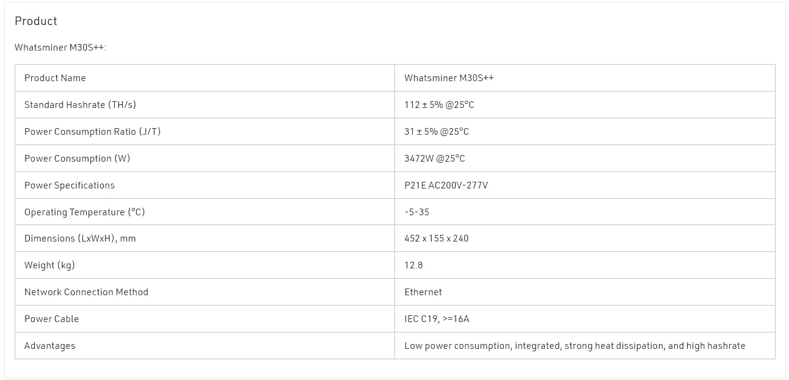

预计收益率略低于第一轮计划启动时的水平，可能是由于自那以来 BTC 价格的下跌。

The first phase of cloud mining services offered by Kucoin

# 如何提高收益？

电费占收入的很大一部分。当 BTC 价格下降时，BTC 用于支付电费的金额增加。

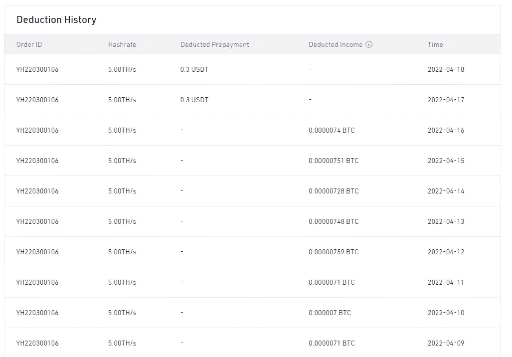

Note that the amount of BTC used to pay for electricity fees increases when the price of BTC dumps.

**因此，一种策略是在 USDT 预付电费**，这可以在整个采矿计划过程中进行，或者仅在 BTC 电价较低时进行。要选择在 USDT 扣除电费，首先确保您在 USDT 有足够的信用余额，您可以在仪表板的“电力管理”部分充值，如下所示。电费平均每天为 0.3 USDT。

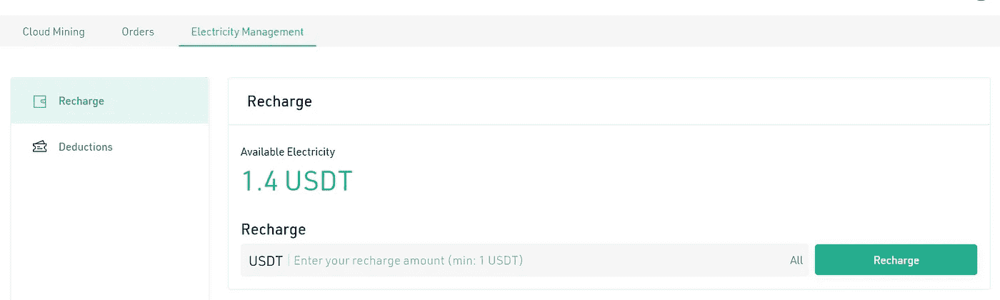

一旦你充值了你的预付资金，在你的仪表盘上点击“订单”,注意右下角的电费扣款按钮。

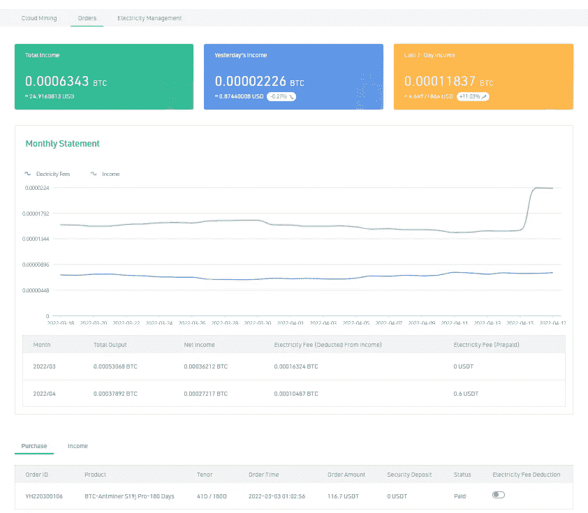

关闭此开关将从预付费 USDT 中扣除电费；反之亦然。

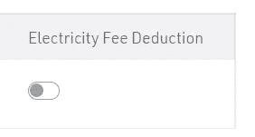

# 如何购买采矿计划？

如果你还没有账户，在这里注册 Kucoin [。](https://www.kucoin.com/land/register/r/rJH29LZ)

进入[云矿](https://www.kucoin.com/cloud-mining) >选择相应的产品>点击立即购买>输入要购买的金额>选择是否要预付电费>提交订单>点击支付>完成验证>完成支付。

# 赢取 200 英镑的 USDT 奖金池！

在发布新的采矿计划的同时， [KuCoin](https://www.kucoin.com/land/register/r/rJH29LZ) 还组织了一次云采矿测验，时间为 2022 年 4 月 13 日 09:00:00-2022 年 4 月 21 日 15:59:59(UTC)。10 个合格的用户将被随机选中，赢得 200 USDT 的份额。这个测验结果相当棘手；有几个问题需要一些关于 Kucoin 云采矿计划的经验，您可以在下面找到正确答案。

点击[此处](https://forms.gle/7ULeb8JupSc14QpNA)参加测验。

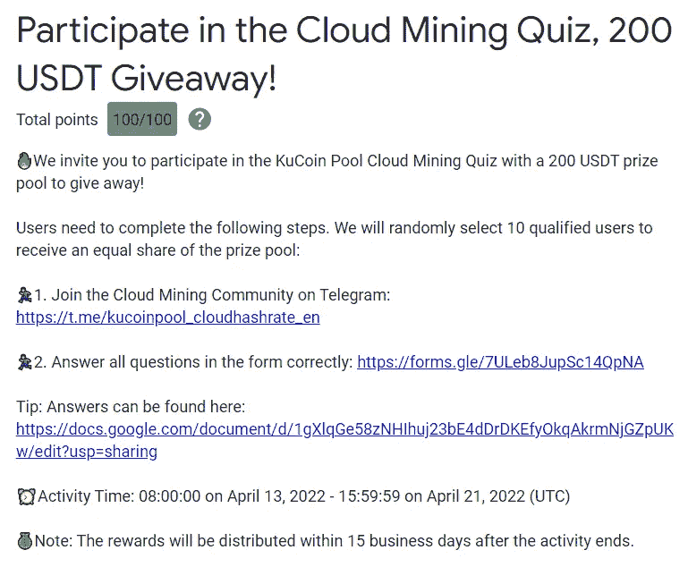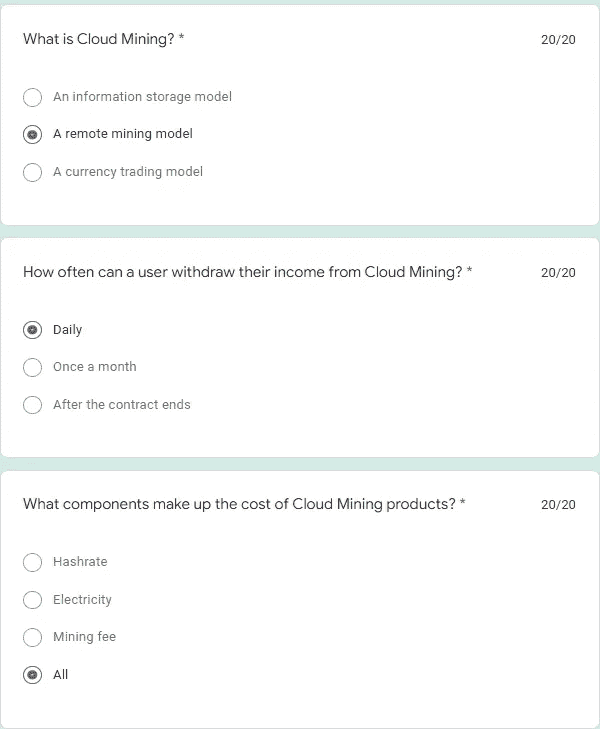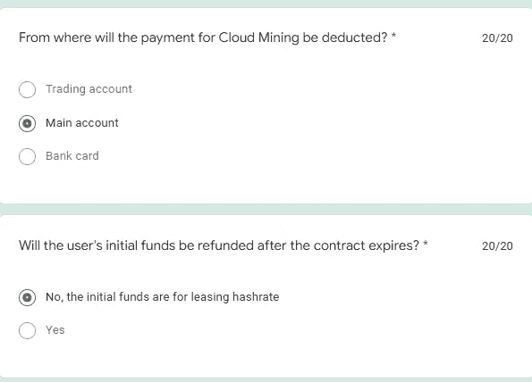

# 带回家的信息

*   云开采是收购 BTC 的一种有趣方式；著名的加密货币交易所 Kucoin 提供的云开采计划确实值得一试。
*   然而，开采计划的盈利能力在很大程度上取决于 BTC 的表现，因为无论市场价格如何，每天开采的 BTC 数量相对稳定。
*   当 BTC 价格下跌时，更大一部分被用来支付电费；因此，向 USDT 预付电费可能是个好主意，尤其是在市场低迷的时候。
*   在我使用 Kucoin 进行云采矿的经验中，使用第一阶段提供的 Antminer S19j Pro，BTC 的价格需要保持在 42，876 美元以上，采矿计划才能盈利。然而，使用不同矿工的采矿计划的性能可能不同；因此，对于当前使用 Whatsminer M30S++的第三阶段，情况可能并非如此。

在这里报名参加 Kucoin [。要了解更多信息，请查看下面我以前的文章！](https://www.kucoin.com/r/af/rJH29LZ)

 [## Kucoin 云挖掘:简介

### 加密货币挖掘是一个竞争性的过程，它验证新交易并将其添加到区块链中，以用于…

medium.com](/coinmonks/kucoin-cloud-mining-an-introduction-d41d1c0f4c68)  [## Kucoin 云采矿:未来两周

### 著名的加密货币交易所 Kucoin 于 2022 年 3 月 9 日推出了他们的云采矿服务，当时我…

medium.com](/coinmonks/kucoin-cloud-mining-2-weeks-down-the-road-5a70ea1ae1ff) 

另一方面，如果你正在寻找安全的方式来产生可靠的被动收入， [**Cake DeFi**](https://cakedefi.com/?ref=677920) 是一个可靠的选择，提供最好的赌注，流动性挖掘和贷款服务！Cake DeFi 现在提供 40 美元的升级注册奖金，直到 2022 年 4 月 25 日，新用户通过 KYC 验证，并至少投资 50 美元到贷款/赌注/流动性采矿冰柜至少 1 个月。查看我的文章[这里](/coinmonks/how-to-get-a-free-40-signup-bonus-from-cake-defi-this-easter-7523230c9af)了解更多！

*本文使用的部分图片和资料摘自 Kucoin 云矿网站。*

*一如既往，这不是财务建议！而只是我投资过的，觉得值得分享的投资平台。在投资前做好自己的研究，不要存你输不起的钱。下面有什么问题可以随时问我。*

*如果你喜欢这篇文章，* [*关注&订阅*](/@cybery) *！*

查看以下值得信赖的平台！

*🎁*[*honey gain*](https://r.honeygain.me/CYBER577DD)*一款被动收入 app，从你未使用的互联网带宽中赚钱。* [*免费获得 5 美元*](https://r.honeygain.me/CYBER577DD) *，无需投资。*

*🎁* [*蛋糕 Defi*](https://cakedefi.com/?ref=677920) *一站式投资平台，以高达 200%的 APYs 烘焙被动现金流！* [*在 DFI 用 50 美元存款获得 30 美元*](https://cakedefi.com/?ref=677920) *。*

*🎁*[*Nexo*](https://nexo.io/ref/hce5cfdt5o?src=web-link)*全球最先进、受监管的数字资产机构，在 200 多个司法管辖区提供 40 多种法定货币的即时加密贷款、每日资产收益、交换和服务。* [*用 100 美元存款得到 25 美元*](https://nexo.io/ref/hce5cfdt5o?src=web-link) *。*

*🎁* [*摄氏度*](https://celsiusnetwork.app.link/174094633e) *一个金融科技平台，提供带息储蓄账户、借贷，以及用数字和法定资产进行支付。* [*在 BTC 拿 50 美元*](https://celsiusnetwork.app.link/174094633e) *拿 400 美元存款。*

*🎁*[*Hodlnaut*](https://www.hodlnaut.com/join/RTbHxuJMX)*一个稳健的新加坡加密借贷平台，成立于 2019 年，从你闲置的加密货币中产生被动现金流。* [*拿 30 美元*](https://www.hodlnaut.com/join/RTbHxuJMX) *在 USDC 存 1000 美元。*

*🎁*[*cabial*](https://invite.cabital.com/7P3UFW)*赚取高达 12%的加密利率，无需疯狂。*

*🎁*[*BlockFi*](https://blockfi.com/?ref=a16e37fd)*一种加密货币交易所和钱包。* [*用 100 美元存款得到 10 美元*](https://blockfi.com/?ref=a16e37fd) *。*

*🎁* [*库币*](https://www.kucoin.com/r/af/rJH29LZ) *最大的加密货币交易所之一。*

*🎁***最大的加密货币交易所。**

**🎁*[*MEXC*](https://m.mexc.com/auth/signup?inviteCode=1NAJC)*最大的加密货币交易所之一。**

**🎁*[*Crypto.com*](https://read.cash/@TraderFX/10-tips-to-maximize-earnings-on-honeygain-an-effortless-free-passive-income-app-68535728#bad-link)*一款基于新加坡的加密货币兑换 app。* [*得到 25 美元*](https://crypto.com/app/fcbsjmf5pb) *在 CRO 赌赢一张红宝石牌。**

**针对马来西亚投资者**

**🎁* [*斯塔沙威*](https://www.stashaway.my/referrals/kenleel9jx) *获得 6 个月免费投资！**

**🎁Wahed code 'KENLIE1' RM10 注册奖金**

**🎁Capbay P2P 代码' 8879c6' RM100 注册奖金**

**连接我* [*中*](https://cybery.medium.com/)*|*[*read . cash*](https://read.cash/r/TraderFX)*|*[*Youtube*](https://www.youtube.com/c/SmartInvestingChannel)*|*[*Twitter*](https://twitter.com/cybertraderfx)*|*[*Linktree*](https://linktr.ee/trader.fx)*

> **加入 Coinmonks* [*电报频道*](https://t.me/coincodecap) *和* [*Youtube 频道*](https://www.youtube.com/c/coinmonks/videos) *了解加密交易和投资**

# *另外，阅读*

*   *[Bookmap 评论](https://coincodecap.com/bookmap-review-2021-best-trading-software) | [美国 5 大最佳加密交易所](https://coincodecap.com/crypto-exchange-usa)*
*   *最佳加密[硬件钱包](/coinmonks/hardware-wallets-dfa1211730c6) | [Bitbns 评论](/coinmonks/bitbns-review-38256a07e161)*
*   *[新加坡十大最佳密码交易所](https://coincodecap.com/crypto-exchange-in-singapore) | [收购 AXS](https://coincodecap.com/buy-axs-token)*
*   *[红狗赌场评论](https://coincodecap.com/red-dog-casino-review) | [Swyftx 评论](https://coincodecap.com/swyftx-review) | [CoinGate 评论](https://coincodecap.com/coingate-review)*
*   *[投资印度的最佳加密软件](https://coincodecap.com/best-crypto-to-invest-in-india-in-2021)|[WazirX P2P](https://coincodecap.com/wazirx-p2p)|[Hi Dollar Review](https://coincodecap.com/hi-dollar-review)*
*   *[加拿大最好的加密交易机器人](https://coincodecap.com/5-best-crypto-trading-bots-in-canada) | [库币评论](https://coincodecap.com/kucoin-review)*